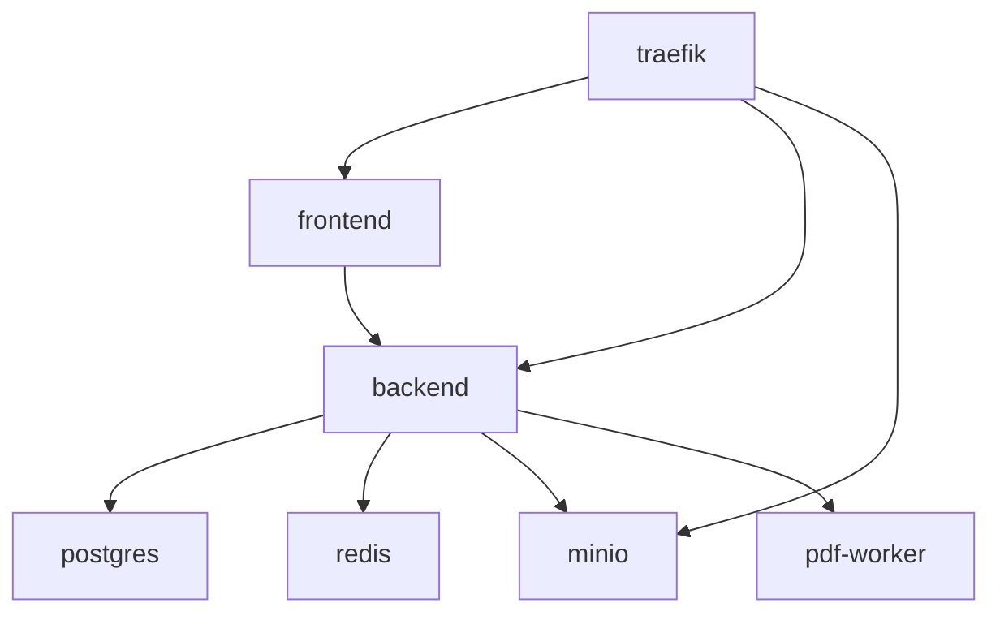

# Design Document - DevOps Implementation

## Overview

This design document describes the Docker-based infrastructure for the UP Schedule Generator V3 web application. The architecture uses Docker Compose to orchestrate seven services: frontend (Next.js), backend (NestJS), pdf-worker (Python/FastAPI), PostgreSQL, Redis, MinIO, and Traefik reverse proxy.

The infrastructure supports two deployment modes:
- **Development**: Hot-reload, localhost access, no SSL
- **Production**: Multi-stage builds, SSL via Let's Encrypt, security hardening

## Architecture

```
┌─────────────────────────────────────────────────────────────────────────────┐
│                              Docker Network: schedgen                        │
│                                                                              │
│  ┌──────────────┐                                                           │
│  │   TRAEFIK    │◄──── :80 (HTTP) ──► Redirect to HTTPS                    │
│  │   (Proxy)    │◄──── :443 (HTTPS) ──► Route to services                  │
│  │              │◄──── :8080 (Dashboard)                                    │
│  └──────┬───────┘                                                           │
│         │                                                                    │
│         ├─────────────────┬─────────────────┐                               │
│         ▼                 ▼                 ▼                               │
│  ┌──────────────┐  ┌──────────────┐  ┌──────────────┐                      │
│  │   FRONTEND   │  │   BACKEND    │  │  PDF-WORKER  │                      │
│  │   Next.js    │  │   NestJS     │  │   FastAPI    │                      │
│  │   :3000      │  │   :3001      │  │   :5000      │                      │
│  └──────────────┘  └──────┬───────┘  └──────────────┘                      │
│                           │                                                 │
│         ┌─────────────────┼─────────────────┐                               │
│         ▼                 ▼                 ▼                               │
│  ┌──────────────┐  ┌──────────────┐  ┌──────────────┐                      │
│  │  POSTGRESQL  │  │    REDIS     │  │    MINIO     │                      │
│  │   :5432      │  │   :6379      │  │   :9000/9001 │                      │
│  └──────────────┘  └──────────────┘  └──────────────┘                      │
│                                                                              │
│  Volumes: postgres_data, redis_data, minio_data, traefik_certs              │
└─────────────────────────────────────────────────────────────────────────────┘
```

## Components and Interfaces

### 1. Traefik Reverse Proxy

**Purpose**: Single entry point for all HTTP traffic, SSL termination, routing

**Configuration**:
- Static config: `traefik/traefik.yml`
- Dynamic config: `traefik/dynamic/middlewares.yml`
- Certificate storage: `traefik_certs` volume

**Routing Rules**:
| Host Pattern | Target Service | Port |
|--------------|----------------|------|
| `${DOMAIN}` | frontend | 3000 |
| `api.${DOMAIN}` | backend | 3001 |
| `minio.${DOMAIN}` | minio-console | 9001 |
| `traefik.${DOMAIN}` | dashboard | 8080 |

**Middlewares**:
- `secure-headers`: HSTS, XSS protection, content-type sniffing prevention
- `rate-limit`: 100 requests/second average, 50 burst
- `auth`: Basic authentication for dashboard

### 2. Frontend Service (Next.js)

**Image**: Custom multi-stage build from `frontend/Dockerfile`

**Build Stages**:
1. `deps`: Install dependencies with `npm ci`
2. `builder`: Build Next.js with standalone output
3. `runner`: Minimal production image with only necessary files

**Environment Variables**:
- `NEXT_PUBLIC_API_URL`: Backend API URL for client-side requests
- `NEXT_PUBLIC_GOOGLE_CLIENT_ID`: Google OAuth client ID

**Development Mode**:
- Volume mount: `./frontend:/app`
- Command: `npm run dev`
- Hot module replacement enabled

### 3. Backend Service (NestJS)

**Image**: Custom multi-stage build from `backend/Dockerfile`

**Build Stages**:
1. `deps`: Install production dependencies
2. `builder`: Build TypeScript to JavaScript
3. `runner`: Production image with compiled code

**Environment Variables**:
- Database: `POSTGRES_HOST`, `POSTGRES_PORT`, `POSTGRES_USER`, `POSTGRES_PASSWORD`, `POSTGRES_DB`
- Redis: `REDIS_HOST`, `REDIS_PORT`
- MinIO: `MINIO_ENDPOINT`, `MINIO_PORT`, `MINIO_ACCESS_KEY`, `MINIO_SECRET_KEY`, `MINIO_BUCKET`
- OAuth: `GOOGLE_CLIENT_ID`, `GOOGLE_CLIENT_SECRET`, `GOOGLE_CALLBACK_URL`
- Services: `PDF_WORKER_URL`, `FRONTEND_URL`

**Health Check**:
- Endpoint: `GET /health`
- Interval: 30s
- Timeout: 10s
- Retries: 3

### 4. PDF Worker Service (FastAPI)

**Purpose**: Wrap V2 Python PDF parser as HTTP microservice

**Image**: Custom build from `pdf-worker/Dockerfile`

**Base Image**: `python:3.11-slim`

**System Dependencies**:
- `libpoppler-cpp-dev`: Required for pdfplumber PDF parsing

**API Endpoints**:
| Method | Path | Description |
|--------|------|-------------|
| GET | `/health` | Health check |
| POST | `/parse` | Parse PDF and return schedule data |

**Request/Response**:
```
POST /parse
Content-Type: multipart/form-data
Body: file=<pdf_binary>

Response 200:
{
  "events": [
    {
      "module": "COS 214",
      "activity": "Lecture",
      "day": "Monday",
      "time": "08:30 - 10:20",
      "venue": "IT 4-1"
    }
  ],
  "type": "weekly" | "test"
}

Response 400:
{
  "error": "Invalid PDF format",
  "details": "..."
}
```

**Production Server**: Gunicorn with 4 workers

### 5. PostgreSQL Database

**Image**: `postgres:16-alpine`

**Volume**: `postgres_data:/var/lib/postgresql/data`

**Configuration**:
- User: `${POSTGRES_USER}`
- Password: `${POSTGRES_PASSWORD}`
- Database: `${POSTGRES_DB}`

### 6. Redis Queue

**Image**: `redis:7-alpine`

**Volume**: `redis_data:/data`

**Configuration**:
- Persistence: AOF (Append Only File) enabled
- Command: `redis-server --appendonly yes`

### 7. MinIO Object Storage

**Image**: `minio/minio`

**Volume**: `minio_data:/data`

**Ports**:
- 9000: S3 API
- 9001: Web Console

**Configuration**:
- Root User: `${MINIO_ACCESS_KEY}`
- Root Password: `${MINIO_SECRET_KEY}`
- Bucket: `${MINIO_BUCKET}` (created by init script)

## Data Models

### Environment Configuration (.env)

```
# Domain
DOMAIN=localhost
FRONTEND_URL=http://localhost:3000
BACKEND_URL=http://localhost:3001

# Database
POSTGRES_USER=schedgen
POSTGRES_PASSWORD=<secure_password>
POSTGRES_DB=schedgen

# Redis
REDIS_HOST=redis
REDIS_PORT=6379

# MinIO
MINIO_ACCESS_KEY=minioadmin
MINIO_SECRET_KEY=<secure_password>
MINIO_BUCKET=pdf-uploads

# Google OAuth
GOOGLE_CLIENT_ID=<client_id>
GOOGLE_CLIENT_SECRET=<client_secret>

# Traefik
TRAEFIK_DASHBOARD_USER=admin
TRAEFIK_DASHBOARD_PASSWORD=<htpasswd_hash>
ACME_EMAIL=<email_for_letsencrypt>

# Misc
NODE_ENV=development|production
```

### Docker Compose Service Dependencies



## Correctness Properties

*A property is a characteristic or behavior that should hold true across all valid executions of a system-essentially, a formal statement about what the system should do. Properties serve as the bridge between human-readable specifications and machine-verifiable correctness guarantees.*

Based on the prework analysis, the following properties can be verified:

### Property 1: PDF Parsing Returns Valid JSON Structure

*For any* valid UP schedule PDF file sent to the pdf-worker `/parse` endpoint, the response SHALL contain a valid JSON object with an `events` array and a `type` field.

**Validates: Requirements 5.2**

### Property 2: Invalid PDF Returns Error Response

*For any* invalid or malformed file sent to the pdf-worker `/parse` endpoint, the response SHALL have HTTP status code 400 and contain an `error` field in the JSON body.

**Validates: Requirements 5.3**

## Error Handling

### Service Startup Failures

| Service | Failure Mode | Recovery |
|---------|--------------|----------|
| postgres | Connection refused | Backend waits via depends_on, retries |
| redis | Connection refused | Backend waits via depends_on, retries |
| minio | Connection refused | Backend waits via depends_on, retries |
| pdf-worker | Unhealthy | Docker restarts container |
| backend | Unhealthy | Docker restarts container |
| frontend | Unhealthy | Docker restarts container |

### Traefik Routing Errors

| Error | Response |
|-------|----------|
| Service unavailable | 503 Service Unavailable |
| No matching route | 404 Not Found |
| Rate limit exceeded | 429 Too Many Requests |

### PDF Worker Errors

| Error | HTTP Status | Response |
|-------|-------------|----------|
| Invalid PDF | 400 | `{"error": "Invalid PDF format"}` |
| Parsing failed | 500 | `{"error": "Parsing failed", "details": "..."}` |
| File too large | 413 | `{"error": "File too large"}` |

## Testing Strategy

### Dual Testing Approach

This infrastructure uses both example-based tests and property-based tests:

1. **Example-based tests**: Verify specific deployment scenarios work correctly
2. **Property-based tests**: Verify the PDF worker handles arbitrary valid/invalid inputs correctly

### Property-Based Testing

**Library**: pytest with hypothesis (Python) for pdf-worker

**Configuration**: Minimum 100 iterations per property test

**Test Annotation Format**: `**Feature: devops-implementation, Property {number}: {property_text}**`

### Test Categories

#### Infrastructure Tests (Example-based)
- Docker Compose starts all services
- Services are accessible on expected ports
- Health endpoints respond correctly
- Traefik routes requests correctly

#### PDF Worker Tests (Property-based)
- Valid PDFs return valid JSON structure
- Invalid inputs return 400 errors

### Test Execution

```bash
# Infrastructure tests (manual verification)
docker compose up -d
curl http://localhost:3001/health
curl http://localhost:5000/health

# PDF Worker property tests
docker compose exec pdf-worker pytest tests/ -v
```

## File Structure

```
/
├── docker-compose.yml           # Main compose file
├── docker-compose.dev.yml       # Development overrides
├── docker-compose.prod.yml      # Production overrides
├── .env.example                 # Environment template
├── .env                         # Local environment (gitignored)
│
├── frontend/
│   ├── Dockerfile              # Production multi-stage
│   ├── Dockerfile.dev          # Development with hot-reload
│   └── ...
│
├── backend/
│   ├── Dockerfile              # Production multi-stage (exists)
│   ├── Dockerfile.dev          # Development with watch mode
│   └── ...
│
├── pdf-worker/
│   ├── Dockerfile              # Production with Gunicorn
│   ├── requirements.txt        # Python dependencies
│   ├── app.py                  # FastAPI application
│   ├── parser/                 # Copied from V2
│   │   ├── __init__.py
│   │   ├── pdf_parser.py
│   │   ├── data_processor.py
│   │   └── utils.py
│   └── tests/
│       └── test_parser.py      # Property-based tests
│
├── traefik/
│   ├── traefik.yml             # Static configuration
│   └── dynamic/
│       └── middlewares.yml     # Dynamic middlewares
│
└── scripts/
    ├── init-minio.sh           # Create bucket on startup
    ├── backup-db.sh            # Database backup
    └── deploy.sh               # Deployment helper
```
