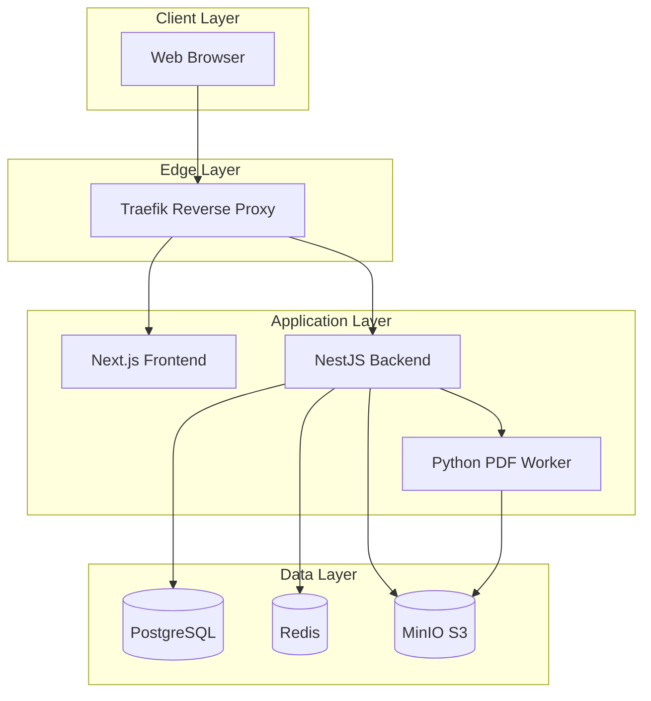
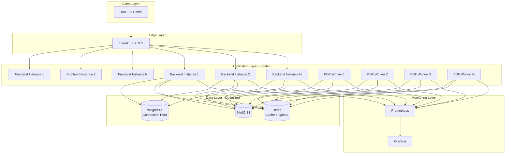

# Production Readiness Design Document

## Overview

This design document outlines the architecture and implementation strategy for making the UP Schedule Generator production-ready for high-scale deployment (100-10,000 concurrent users). The design focuses on horizontal scalability, reliability, observability, and security while maintaining the existing three-tier architecture (Frontend, Backend, PDF Worker).

## Architecture

### Current Architecture



### Production Architecture (Scaled)



## Components and Interfaces

### 1. PDF Worker Scaling

**Purpose**: Enable horizontal scaling of PDF processing to handle concurrent uploads

**Key Changes**:
- Multi-instance deployment with Docker Compose replicas
- Gunicorn with multiple workers per container
- Resource limits (CPU, memory)
- Timeout protection for parsing operations
- Health checks for automatic recovery

**Interface**:
```python
# Health check endpoint
GET /health
Response: 200 OK { "status": "healthy" }

# Parse endpoint (unchanged)
POST /parse
Request: multipart/form-data with PDF file
Response: { "events": [...], "metadata": {...} }
```

**Configuration**:
```yaml
deploy:
  replicas: 3  # Start with 3, scale to 50
  resources:
    limits:
      cpus: '2.0'
      memory: 2G
```

### 2. Job Queue Management

**Purpose**: Reliable asynchronous job processing with retry logic and monitoring

**Key Changes**:
- BullMQ configuration with retry and backoff
- Job priority support
- Rate limiting on queue
- Stalled job detection
- Automatic cleanup of old jobs

**Interface**:
```typescript
// Job creation with priority
interface CreateJobOptions {
  s3Key: string;
  pdfType: PdfType;
  priority?: JobPriority; // LOW=10, NORMAL=5, HIGH=1
}

// Queue metrics endpoint
GET /api/jobs/metrics
Response: {
  waiting: number;
  active: number;
  completed: number;
  failed: number;
  delayed: number;
  total: number;
}
```

**Configuration**:
```typescript
{
  attempts: 3,
  backoff: { type: 'exponential', delay: 5000 },
  timeout: 300000, // 5 minutes
  removeOnComplete: { age: 3600, count: 1000 },
  removeOnFail: { age: 86400, count: 5000 },
  limiter: { max: 10, duration: 1000 },
  settings: { concurrency: 5, stalledInterval: 30000 }
}
```

### 3. Database Connection Pool

**Purpose**: Optimize database connections for high concurrency

**Key Changes**:
- TypeORM connection pool configuration
- Query timeout protection
- Connection timeout handling
- Health checks with pool metrics

**Configuration**:
```typescript
{
  extra: {
    max: 50,              // Maximum connections
    min: 10,              // Minimum connections
    connectionTimeoutMillis: 30000,
    idleTimeoutMillis: 30000,
    statement_timeout: 10000
  }
}
```

**Monitoring**:
```sql
-- Connection pool query
SELECT count(*) as total_connections,
       count(*) FILTER (WHERE state = 'active') as active,
       count(*) FILTER (WHERE state = 'idle') as idle
FROM pg_stat_activity
WHERE datname = 'schedgen';
```

### 4. Redis Caching Layer

**Purpose**: Reduce database load through intelligent caching

**Key Changes**:
- Cache-manager integration with Redis
- TTL-based caching strategy
- Cache invalidation on updates
- LRU eviction policy
- AOF persistence for queue data

**Interface**:
```typescript
// Caching service
interface CacheStrategy {
  // Completed/failed jobs: 1 hour TTL
  // Pending/processing jobs: 1 minute TTL
  getTTL(jobStatus: JobStatus): number;
  
  // Cache key format
  getCacheKey(jobId: string): string; // "job:{id}"
  
  // Invalidation
  invalidate(jobId: string): Promise<void>;
}
```

**Configuration**:
```yaml
redis:
  maxmemory: 2gb
  maxmemory-policy: allkeys-lru
  appendonly: yes
  appendfsync: everysec
```

### 5. Rate Limiting

**Purpose**: Prevent abuse and ensure fair resource allocation

**Key Changes**:
- @nestjs/throttler integration
- Per-endpoint rate limits
- Per-user tracking
- Rate limit headers in responses

**Configuration**:
```typescript
{
  default: { ttl: 60000, limit: 100 },  // 100 req/min
  upload: { ttl: 3600000, limit: 10 }   // 10 uploads/hour
}
```

**Response Headers**:
```
X-RateLimit-Limit: 100
X-RateLimit-Remaining: 95
X-RateLimit-Reset: 1701360000000
```

### 6. Monitoring and Metrics

**Purpose**: Observability for production operations

**Key Changes**:
- Prometheus metrics integration
- Custom business metrics
- Health check endpoints
- Structured logging

**Metrics**:
```typescript
// Counter metrics
pdf_jobs_total{type="WEEKLY|TEST|EXAM"}

// Histogram metrics
pdf_processing_duration_seconds{type="WEEKLY|TEST|EXAM"}
http_request_duration_seconds{method,route,status}

// Gauge metrics
database_connections_active
database_connections_idle
redis_memory_used_bytes
queue_jobs_waiting
queue_jobs_active
```

**Endpoints**:
```
GET /health          - Basic health check
GET /health/db       - Database health with pool info
GET /metrics         - Prometheus metrics
```

## Data Models

### Job Entity (Enhanced)

```typescript
@Entity('jobs')
export class Job {
  @PrimaryGeneratedColumn('uuid')
  id: string;

  @Column({ type: 'enum', enum: JobStatus })
  status: JobStatus;

  @Column({ type: 'enum', enum: PdfType })
  pdfType: PdfType;

  @Column()
  s3Key: string;

  @Column({ type: 'jsonb', nullable: true })
  result: ParsedEvent[] | null;

  @Column({ type: 'text', nullable: true })
  error: string | null;

  @CreateDateColumn()
  createdAt: Date;

  @Column({ type: 'timestamp', nullable: true })
  completedAt: Date | null;

  // New fields for monitoring
  @Column({ type: 'int', default: 0 })
  attempts: number;

  @Column({ type: 'timestamp', nullable: true })
  lastAttemptAt: Date | null;

  @Index()
  @Column({ type: 'timestamp', nullable: true })
  expiresAt: Date | null; // For automatic cleanup
}
```

### Queue Job Data

```typescript
interface QueueJobData {
  jobId: string;
  s3Key: string;
  pdfType: PdfType;
  userId?: string;  // For rate limiting
  priority: JobPriority;
}
```

## Correctness Properties

*A property is a characteristic or behavior that should hold true across all valid executions of a system-essentially, a formal statement about what the system should do. Properties serve as the bridge between human-readable specifications and machine-verifiable correctness guarantees.*

### Property 1: Horizontal Scaling Consistency
*For any* number of PDF Worker instances (1 to 50), when processing N concurrent uploads, all jobs should complete successfully without data loss or corruption
**Validates: Requirements 1.1, 1.2, 1.3**

### Property 2: Job Retry Idempotency
*For any* failed job that is retried, the retry should produce the same result as the original attempt (idempotent processing)
**Validates: Requirements 2.1**

### Property 3: Connection Pool Bounds
*For any* load level, the database connection count should never exceed the configured maximum (50 connections) and should maintain at least the minimum (10 connections)
**Validates: Requirements 3.1, 3.5**

### Property 4: Cache Consistency
*For any* job status update, the cached value should be invalidated immediately, ensuring subsequent reads return the updated status
**Validates: Requirements 4.5**

### Property 5: Rate Limit Enforcement
*For any* user making requests, when the rate limit is exceeded, all subsequent requests within the time window should receive HTTP 429 responses
**Validates: Requirements 5.1, 5.2, 5.3**

### Property 6: Timeout Protection
*For any* PDF processing job, if execution time exceeds 5 minutes, the job should be terminated and marked as failed
**Validates: Requirements 1.5**

### Property 7: Health Check Responsiveness
*For any* service instance, health check endpoints should respond within 5 seconds with accurate status
**Validates: Requirements 6.1**

### Property 8: Metrics Accuracy
*For any* completed job, the metrics should accurately reflect the job count and processing duration
**Validates: Requirements 6.2**

### Property 9: Resource Limit Enforcement
*For any* PDF Worker instance, resource usage should never exceed configured limits (2 CPU cores, 2GB memory)
**Validates: Requirements 11.1**

### Property 10: Load Balancing Fairness
*For any* set of healthy backend instances, incoming requests should be distributed approximately evenly across all instances
**Validates: Requirements 10.4**

## Error Handling

### PDF Worker Errors

```python
class PDFProcessingError(Exception):
    """Base exception for PDF processing"""
    pass

class PDFTimeoutError(PDFProcessingError):
    """Raised when PDF processing exceeds timeout"""
    pass

class PDFSizeError(PDFProcessingError):
    """Raised when PDF exceeds size limits"""
    pass

class PDFParseError(PDFProcessingError):
    """Raised when PDF cannot be parsed"""
    pass
```

**Error Handling Strategy**:
1. Timeout errors → Fail job immediately (no retry)
2. Size errors → Fail job immediately (no retry)
3. Parse errors → Retry up to 3 times
4. Network errors → Retry with exponential backoff

### Backend Errors

```typescript
// Custom exceptions
class JobNotFoundException extends NotFoundException {
  constructor(jobId: string) {
    super({
      statusCode: 404,
      message: 'JOB_NOT_FOUND',
      error: `Job with ID ${jobId} not found`,
    });
  }
}

class RateLimitExceededException extends HttpException {
  constructor(retryAfter: number) {
    super(
      {
        statusCode: 429,
        message: 'RATE_LIMIT_EXCEEDED',
        error: 'Too many requests',
        retryAfter,
      },
      429,
    );
  }
}

class DatabaseTimeoutException extends RequestTimeoutException {
  constructor() {
    super({
      statusCode: 408,
      message: 'DATABASE_TIMEOUT',
      error: 'Database operation timed out',
    });
  }
}
```

### Error Response Format

```typescript
interface ErrorResponse {
  statusCode: number;
  message: string;
  error: string;
  timestamp: string;
  path: string;
  requestId?: string;
}
```

## Testing Strategy

### Unit Testing

**Backend Services**:
- JobsService: Job creation, status updates, queue metrics
- CacheService: Cache operations, TTL handling, invalidation
- RateLimitService: Rate limit enforcement, header generation

**PDF Worker**:
- Timeout protection logic
- Resource limit enforcement
- Error handling and classification

**Test Framework**: Jest (Backend), pytest (PDF Worker)

### Integration Testing

**Queue Integration**:
- Job creation → Queue → Processing → Completion flow
- Retry logic with exponential backoff
- Stalled job detection and recovery

**Cache Integration**:
- Cache hit/miss scenarios
- Cache invalidation on updates
- TTL expiration behavior

**Database Integration**:
- Connection pool behavior under load
- Query timeout enforcement
- Transaction handling

**Test Framework**: Jest with test containers

### Load Testing

**Tools**: K6 for load generation

**Test Scenarios**:

1. **Baseline Test**: 10 concurrent users
   - Target: p95 < 2s, error rate < 1%

2. **Stress Test**: Gradually increase to 1000 users
   - Target: Identify breaking point

3. **Spike Test**: Sudden jump to 500 users
   - Target: Recovery within 2 minutes

4. **Soak Test**: 100 users for 2 hours
   - Target: No memory leaks, stable performance

**Metrics to Track**:
- Response times (p50, p95, p99)
- Error rates
- Throughput (requests/second)
- Resource utilization (CPU, memory)
- Queue depth
- Database connection pool usage

### Property-Based Testing

**Framework**: fast-check (TypeScript), Hypothesis (Python)

**Properties to Test**:

1. **Horizontal Scaling Consistency** (Property 1)
   - Generate: Random number of workers (1-10), random job count (1-100)
   - Test: All jobs complete successfully
   - Verify: No data loss, correct results

2. **Job Retry Idempotency** (Property 2)
   - Generate: Random job data
   - Test: Process job, simulate failure, retry
   - Verify: Same result on retry

3. **Connection Pool Bounds** (Property 3)
   - Generate: Random concurrent request count (1-200)
   - Test: Execute requests
   - Verify: Connection count within bounds

4. **Cache Consistency** (Property 5)
   - Generate: Random job updates
   - Test: Update job, check cache
   - Verify: Cache reflects latest state

5. **Rate Limit Enforcement** (Property 5)
   - Generate: Random request patterns
   - Test: Execute requests
   - Verify: Rate limits enforced correctly

### Monitoring and Alerting Tests

**Health Check Tests**:
- All services respond to /health within 5s
- Health checks accurately reflect service state

**Metrics Tests**:
- Metrics endpoint returns valid Prometheus format
- Custom metrics increment correctly
- Histogram buckets configured appropriately

**Alert Tests**:
- Alerts trigger at correct thresholds
- Alert notifications delivered successfully

## Deployment Strategy

### Phase 1: Critical Fixes (Week 1)

**Priority**: High
**Risk**: Medium

1. PDF Worker horizontal scaling
2. Job queue configuration
3. Database connection pool
4. Redis configuration
5. Rate limiting

**Deployment**:
- Deploy to staging environment
- Run load tests
- Monitor for 48 hours
- Deploy to production with gradual rollout

### Phase 2: Monitoring & Optimization (Week 2)

**Priority**: High
**Risk**: Low

1. Prometheus metrics integration
2. Grafana dashboards
3. Alert configuration
4. Log aggregation

**Deployment**:
- Deploy monitoring stack
- Configure alerts
- Train team on dashboards

### Phase 3: Load Testing & Validation (Week 3)

**Priority**: Medium
**Risk**: Low

1. K6 load test suite
2. Performance baseline establishment
3. Capacity planning
4. Documentation

**Deployment**:
- Run comprehensive load tests
- Document performance characteristics
- Create runbooks

### Rollback Plan

**Triggers**:
- Error rate > 10%
- Response time p95 > 10s
- Service unavailability > 5 minutes

**Procedure**:
1. Stop deployment
2. Revert to previous Docker images
3. Restore database from backup if needed
4. Verify health checks pass
5. Monitor for 30 minutes

## Security Considerations

### Service Hardening

- All services run as non-root users
- Resource limits enforced via Docker
- Network isolation via Docker networks
- Secrets via environment variables only

### TLS/HTTPS

- Traefik handles TLS termination
- Let's Encrypt automatic certificate renewal
- HTTP → HTTPS redirect enforced
- HSTS headers enabled

### Rate Limiting

- Per-user upload limits
- Per-endpoint request limits
- IP-based blocking for abuse
- Logging of rate limit violations

### Input Validation

- File size limits (10MB)
- File type validation (PDF only)
- Page count limits (100 pages)
- Timeout protection (5 minutes)

## Performance Targets

### Response Times

- Homepage: < 500ms (p95)
- Upload endpoint: < 2s (p95)
- Status check: < 200ms (p95)
- PDF processing: < 60s (p95)

### Throughput

- Concurrent users: 100-10,000
- Uploads per hour: 1,000-10,000
- Status checks per second: 100-1,000

### Availability

- Uptime: 99.9% (8.76 hours downtime/year)
- Error rate: < 1%
- Recovery time: < 5 minutes

### Resource Utilization

- CPU: < 80% average
- Memory: < 80% average
- Disk: < 70% average
- Network: < 70% bandwidth

## Related Documents

- [Requirements Document](./requirements.md)
- [Implementation Guide](../../docs/production/IMPLEMENTATION_GUIDE.md)
- [Scalability Assessment](../../docs/production/SCALABILITY_ASSESSMENT.md)
- [Load Testing Guide](../../docs/production/LOAD_TESTING.md)
