# Browser Compatibility Testing Workflow

## Visual Testing Flow

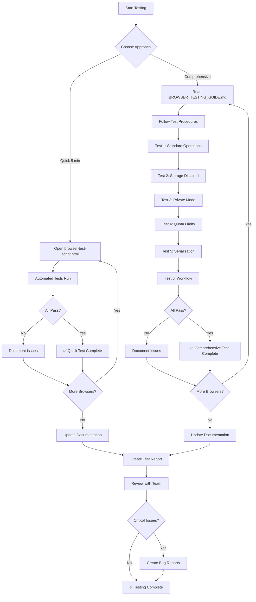

## Testing Decision Tree

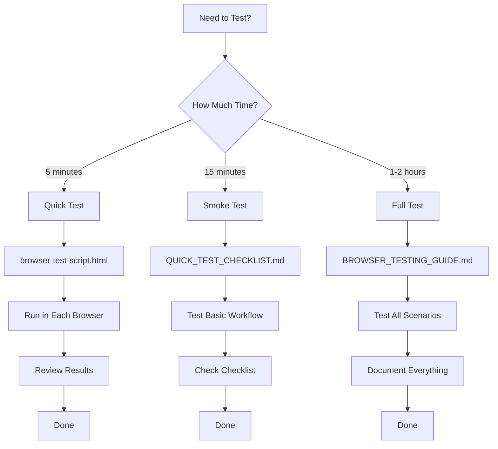

## Documentation Navigation Flow

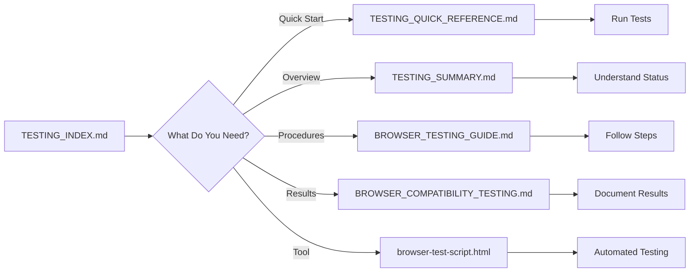

## Test Scenario Coverage

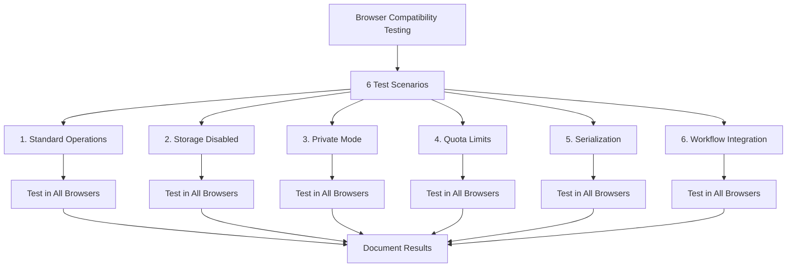

## Browser Testing Matrix

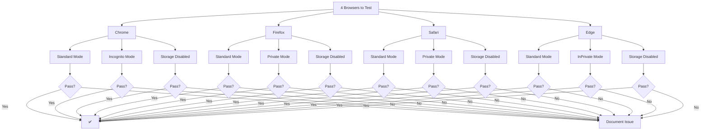

## Issue Resolution Flow

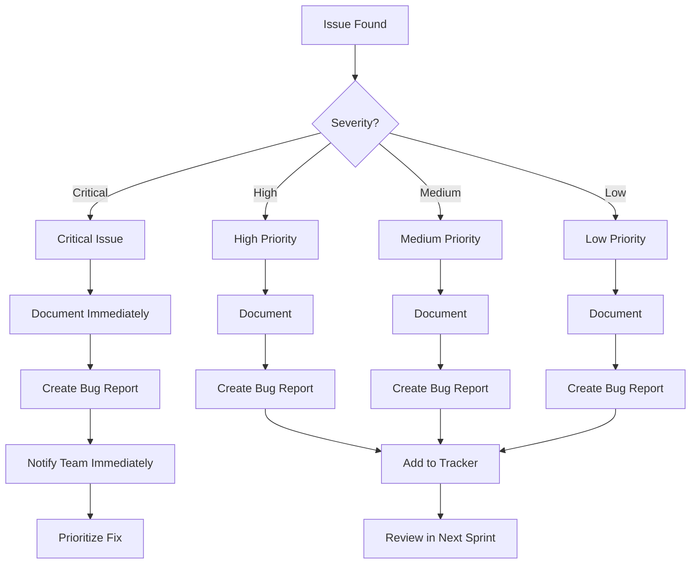

## Testing Timeline

```mermaid
gantt
    title Browser Compatibility Testing Timeline
    dateFormat  HH:mm
    axisFormat %H:%M
    
    section Quick Test
    Open test script           :00:00, 1m
    Run automated tests        :00:01, 3m
    Review results            :00:04, 1m
    
    section Smoke Test
    Read checklist            :00:00, 2m
    Test basic workflow       :00:02, 8m
    Document findings         :00:10, 5m
    
    section Full Test
    Read guide                :00:00, 10m
    Test scenario 1           :00:10, 10m
    Test scenario 2           :00:20, 10m
    Test scenario 3           :00:30, 10m
    Test scenario 4           :00:40, 10m
    Test scenario 5           :00:50, 10m
    Test scenario 6           :01:00, 10m
    Document results          :01:10, 20m
```

## Test Data Flow

```mermaid
graph LR
    Upload[Upload PDF] --> Store1[Store in sessionStorage]
    Store1 --> Refresh1[Page Refresh]
    Refresh1 --> Restore1[Restore from sessionStorage]
    
    Restore1 --> Select[Select Events]
    Select --> Store2[Update sessionStorage]
    Store2 --> Refresh2[Page Refresh]
    Refresh2 --> Restore2[Restore Selections]
    
    Restore2 --> Config[Set Config]
    Config --> Store3[Store in localStorage]
    Store3 --> Close[Close Browser]
    Close --> Reopen[Reopen Browser]
    Reopen --> Restore3[Restore Config]
    
    Restore3 --> Generate[Generate Calendar]
    Generate --> Clear[Clear Workflow State]
    Clear --> Keep[Keep Config]
```

## Error Handling Flow

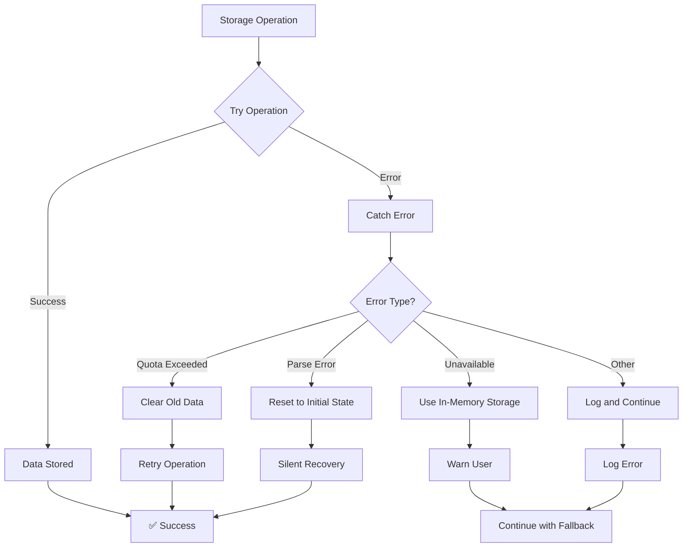

## Quick Reference Flowchart

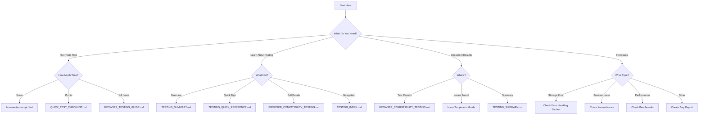

## Success Criteria Checklist

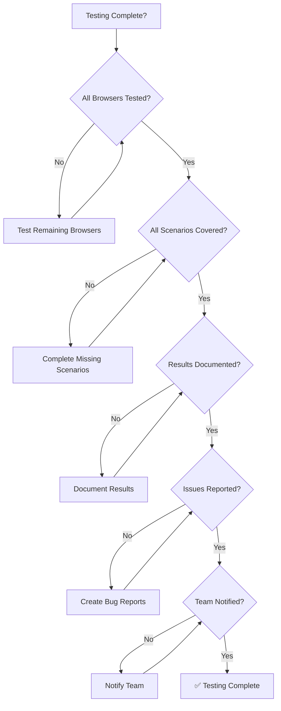

---

**Document Type**: Visual Workflow Guide  
**Last Updated**: November 30, 2025  
**Purpose**: Visual representation of testing processes  
**Related**: All testing documentation
