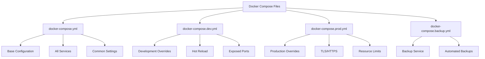

# Docker Compose Configuration Guide

Overview of Docker Compose files and their usage.



## File Structure

### docker-compose.yml
**Purpose**: Base configuration for all environments

**Contains**:
- Service definitions (frontend, backend, pdf-worker, postgres, redis, minio)
- Network configuration
- Volume definitions
- Common environment variables
- Health checks

**Usage**: Always included as base
```bash
docker compose -f docker-compose.yml up
```

### docker-compose.dev.yml
**Purpose**: Development environment overrides

**Contains**:
- Volume mounts for hot reload
- Exposed ports for debugging
- Development-specific environment variables
- Relaxed security settings

**Usage**: Development only
```bash
docker compose -f docker-compose.yml -f docker-compose.dev.yml up
```

### docker-compose.prod.yml
**Purpose**: Production environment overrides

**Contains**:
- Traefik TLS configuration
- Resource limits (CPU, memory)
- Production environment variables
- Security hardening
- Monitoring services (Prometheus, Grafana)

**Usage**: Production only
```bash
docker compose -f docker-compose.yml -f docker-compose.prod.yml up -d
```

### docker-compose.backup.yml
**Purpose**: Automated backup service

**Contains**:
- Backup service definition
- Cron schedule configuration
- Volume mounts for backups

**Usage**: Optional, for automated backups
```bash
docker compose -f docker-compose.yml -f docker-compose.backup.yml up -d
```

## Service Architecture


## Usage Patterns

### Development
```bash
# Start all services with hot reload
docker compose -f docker-compose.yml -f docker-compose.dev.yml up

# Start specific service
docker compose -f docker-compose.yml -f docker-compose.dev.yml up backend

# Rebuild and start
docker compose -f docker-compose.yml -f docker-compose.dev.yml up --build

# Stop all services
docker compose -f docker-compose.yml -f docker-compose.dev.yml down
```

### Production
```bash
# Initial deployment
docker compose -f docker-compose.yml -f docker-compose.prod.yml up -d

# With monitoring
docker compose -f docker-compose.yml -f docker-compose.prod.yml up -d

# With backup service
docker compose -f docker-compose.yml -f docker-compose.prod.yml -f docker-compose.backup.yml up -d

# View logs
docker compose -f docker-compose.yml -f docker-compose.prod.yml logs -f

# Stop services
docker compose -f docker-compose.yml -f docker-compose.prod.yml down
```

### Backup Service
```bash
# Start backup service only
docker compose -f docker-compose.yml -f docker-compose.backup.yml up -d backup

# View backup logs
docker compose -f docker-compose.yml -f docker-compose.backup.yml logs -f backup

# Stop backup service
docker compose -f docker-compose.yml -f docker-compose.backup.yml down backup
```

## Port Mapping

### Development Ports
| Service | Internal | External | Purpose |
|---------|----------|----------|---------|
| Frontend | 3000 | 3000 | Next.js dev server |
| Backend | 3001 | 3001 | NestJS API |
| PDF Worker | 5001 | 5001 | FastAPI service |
| PostgreSQL | 5432 | 5433 | Database |
| Redis | 6379 | 6379 | Cache/Queue |
| MinIO API | 9000 | 9000 | Object storage |
| MinIO Console | 9001 | 9001 | Web UI |
| Traefik Dashboard | 8080 | 8081 | Monitoring |

### Production Ports
| Service | Port | Access |
|---------|------|--------|
| Traefik HTTP | 80 | Public (redirects to HTTPS) |
| Traefik HTTPS | 443 | Public |
| All others | - | Internal network only |

## Environment-Specific Configuration

### Development Features
- ✅ Hot reload enabled
- ✅ All ports exposed
- ✅ Debug logging
- ✅ Source code mounted
- ✅ Relaxed security

### Production Features
- ✅ TLS/HTTPS via Traefik
- ✅ Resource limits
- ✅ Health checks
- ✅ Security headers
- ✅ Monitoring enabled
- ✅ No exposed ports (except 80/443)

## Volume Management

### Named Volumes
```bash
# List volumes
docker volume ls

# Inspect volume
docker volume inspect schedgen_postgres_data

# Backup volume
docker run --rm -v schedgen_postgres_data:/data -v $(pwd)/backups:/backup \
  alpine tar czf /backup/postgres_data.tar.gz -C /data .

# Restore volume
docker run --rm -v schedgen_postgres_data:/data -v $(pwd)/backups:/backup \
  alpine tar xzf /backup/postgres_data.tar.gz -C /data
```

### Volume Locations
- `postgres_data` - PostgreSQL database files
- `redis_data` - Redis persistence
- `minio_data` - Uploaded PDF files
- `traefik_certs` - TLS certificates

## Network Configuration

### Internal Network
All services communicate via `schedgen` Docker network:
- Automatic DNS resolution
- Service discovery by name
- Isolated from host network

### External Access
- Development: Direct port mapping
- Production: Traefik reverse proxy only

## Health Checks

All services have health checks configured:

```yaml
healthcheck:
  test: ["CMD", "curl", "-f", "http://localhost:3001/health"]
  interval: 30s
  timeout: 10s
  retries: 3
  start_period: 40s
```

Check health status:
```bash
docker compose ps
docker inspect --format='{{json .State.Health}}' schedgen-backend | jq
```

## Resource Limits (Production)

### Backend
- CPU: 1.0 cores (limit), 0.5 cores (reservation)
- Memory: 1GB (limit), 512MB (reservation)

### Frontend
- CPU: 0.5 cores (limit), 0.25 cores (reservation)
- Memory: 512MB (limit), 256MB (reservation)

### PDF Worker
- CPU: 2.0 cores (limit), 1.0 cores (reservation)
- Memory: 2GB (limit), 1GB (reservation)

### Database
- CPU: 2.0 cores (limit), 1.0 cores (reservation)
- Memory: 2GB (limit), 1GB (reservation)

## Troubleshooting

### Services Not Starting
```bash
# Check logs
docker compose logs <service-name>

# Check configuration
docker compose config

# Validate compose files
docker compose -f docker-compose.yml -f docker-compose.prod.yml config
```

### Port Conflicts
```bash
# Check what's using a port
lsof -i :3000

# Change port in docker-compose.dev.yml
ports:
  - "3002:3000"  # Map to different host port
```

### Volume Issues
```bash
# Remove all volumes (WARNING: deletes data)
docker compose down -v

# Remove specific volume
docker volume rm schedgen_postgres_data
```

### Network Issues
```bash
# Recreate network
docker compose down
docker network prune
docker compose up -d

# Check network
docker network inspect schedgen
```

## Best Practices

1. **Use override files** - Keep base config clean, use overrides for environment-specific settings

2. **Named volumes** - Use named volumes for data persistence

3. **Health checks** - Always define health checks for services

4. **Resource limits** - Set limits in production to prevent resource exhaustion

5. **Secrets management** - Use .env files, never commit secrets

6. **Version pinning** - Pin Docker image versions in production

7. **Logging** - Configure log drivers for production

## Related Documentation

- [Deployment Guide](docs/production/deployment/README.md)
- [Environment Configuration](.env.example)
- [Scripts Documentation](scripts/README.md)
- [Production Checklist](docs/production/PRODUCTION_CHECKLIST.md)

## Quick Reference

```bash
# Development
docker compose -f docker-compose.yml -f docker-compose.dev.yml up

# Production
docker compose -f docker-compose.yml -f docker-compose.prod.yml up -d

# Production with monitoring
docker compose -f docker-compose.yml -f docker-compose.prod.yml up -d

# Production with backups
docker compose -f docker-compose.yml -f docker-compose.prod.yml -f docker-compose.backup.yml up -d

# View logs
docker compose logs -f [service-name]

# Stop services
docker compose down

# Remove volumes (WARNING: deletes data)
docker compose down -v
```
