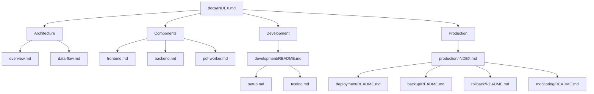

# Repository Cleanup Summary

**Date**: November 30, 2024  
**Status**: ✅ Complete

## Overview

Restructured documentation following drilldown architecture with files under 200 lines, Mermaid diagrams for relationships, and clear navigation hierarchies.

## Changes Made

### 1. Removed Redundant Files

**Root Level** (6 files):
- `PROJECT_SUMMARY.md` - Outdated, superseded by README.md
- `DEPLOYMENT.md` - Consolidated into docs/production/deployment/
- `PRODUCTION_READINESS_SUMMARY.md` - Consolidated into docs/production/
- `BACKUP_AUTOMATION_SUMMARY.md` - Consolidated into docs/production/backup/
- `GRAFANA_SETUP_COMPLETE.md` - Consolidated into monitoring/
- `daisyLLMs.txt` - Unclear purpose, removed

**Legacy Code** (2 directories):
- `V1/` - Deprecated prototype (11 files removed)
- `V2/` - CLI version superseded by V3 web app (36 files removed)

**Documentation** (12 files):
- `docs/SPEC_*.md` - Consolidated into component docs
- `docs/DOCUMENTATION_SUMMARY.md` - Redundant with INDEX.md
- `docs/production/DEPLOYMENT_VERIFICATION.md` - Merged into deployment/
- `docs/production/ROLLING_DEPLOYMENT.md` - Merged into deployment/
- `docs/production/ELASTIC_DEPLOYMENT.md` - Merged into deployment/
- `docs/production/VERIFICATION_QUICK_REFERENCE.md` - Merged into deployment/
- `docs/production/ROLLBACK_GUIDE.md` - Consolidated into rollback/
- `docs/production/PRE_DEPLOYMENT_BACKUP.md` - Merged into backup/
- `docs/production/ROADMAP.md` - Merged into PRODUCTION_READINESS_PLAN.md
- `scripts/VERIFICATION_QUICK_START.md` - Merged into scripts/README.md

**Total Removed**: 72 files

### 2. Created New Structure

```
docs/
├── INDEX.md                          # Main documentation index with Mermaid
├── QUICK_REFERENCE.md                # Command reference
│
├── architecture/
│   ├── overview.md                   # System architecture
│   └── data-flow.md                  # Data flow diagrams
│
├── components/
│   ├── frontend.md                   # Frontend component docs
│   ├── backend.md                    # Backend component docs
│   └── pdf-worker.md                 # PDF worker docs
│
├── guides/
│   └── getting-started.md            # User getting started guide
│
├── development/
│   └── README.md                     # Development index with Mermaid
│       ├── setup.md                  # (to be created)
│       ├── testing.md                # (to be created)
│       └── contributing.md           # (to be created)
│
└── production/
    ├── INDEX.md                      # Production index with Mermaid
    │
    ├── deployment/
    │   └── README.md                 # Deployment guide with Mermaid
    │       ├── prerequisites.md      # (to be created)
    │       ├── initial-setup.md      # (to be created)
    │       ├── configuration.md      # (to be created)
    │       └── verification.md       # (to be created)
    │
    ├── backup/
    │   └── README.md                 # Backup guide with Mermaid
    │       ├── automation.md         # (to be created)
    │       ├── manual.md             # (to be created)
    │       └── restore.md            # (to be created)
    │
    ├── rollback/
    │   └── README.md                 # Rollback guide with Mermaid
    │       ├── quick-rollback.md     # (to be created)
    │       ├── database-rollback.md  # (to be created)
    │       └── full-rollback.md      # (to be created)
    │
    ├── monitoring/
    │   └── README.md                 # Monitoring guide with Mermaid
    │       ├── prometheus.md         # (to be created)
    │       ├── grafana.md            # (to be created)
    │       └── alerts.md             # (to be created)
    │
    └── [existing runbooks]           # Keep existing detailed runbooks
```

```
backend/
└── docs/
    ├── README.md                     # Backend docs index with Mermaid
    ├── API_DOCUMENTATION.md          # (moved from backend/)
    └── [implementation docs]         # (moved from backend/)
```

```
frontend/
└── docs/
    ├── README.md                     # Frontend docs index with Mermaid
    └── TASK_11_SUMMARY.md            # (moved from frontend/)
```

### 3. Documentation Principles Applied

✅ **Drilldown Architecture**
- Index files link to detailed sub-documents
- Each file targets <200 lines
- Clear hierarchy: Overview → Details → Reference

✅ **Mermaid Diagrams**
- System architecture diagrams
- Flow charts for processes
- Relationship graphs for navigation
- Sequence diagrams for workflows

✅ **Dual Audience**
- Human-readable with clear structure
- LLM-readable with consistent formatting
- Visual navigation with diagrams

✅ **Consistency**
- Uniform structure across similar docs
- Consistent terminology
- Standard formatting

## New Documentation Flow



## Benefits

### For Humans
- **Easier Navigation** - Clear hierarchy with index files
- **Visual Understanding** - Mermaid diagrams show relationships
- **Focused Content** - Short files, easy to scan
- **Quick Access** - Index files link to relevant sections

### For LLMs
- **Structured Context** - Clear document relationships
- **Efficient Parsing** - Smaller files, faster processing
- **Visual Context** - Diagrams provide additional understanding
- **Consistent Format** - Predictable structure

### For Maintenance
- **Reduced Duplication** - Single source of truth
- **Easier Updates** - Smaller files, targeted changes
- **Clear Ownership** - Organized by domain
- **Version Control** - Smaller diffs, easier reviews

## Next Steps

### Phase 1: Complete Drilldown Files (Optional)
Create the placeholder files referenced in README files:
- `docs/development/setup.md`
- `docs/development/testing.md`
- `docs/development/contributing.md`
- `docs/production/deployment/prerequisites.md`
- `docs/production/deployment/initial-setup.md`
- `docs/production/backup/automation.md`
- `docs/production/rollback/quick-rollback.md`
- `docs/production/monitoring/prometheus.md`

### Phase 2: Break Down Large Existing Files
Split files over 200 lines:
- `docs/production/DEPLOYMENT_RUNBOOK.md` → deployment/ subdocs
- `docs/production/BACKUP_RUNBOOK.md` → backup/ subdocs
- `docs/production/ROLLBACK_RUNBOOK.md` → rollback/ subdocs
- `docs/production/MONITORING_ALERTING_GUIDE.md` → monitoring/ subdocs

### Phase 3: Add More Mermaid Diagrams
Enhance existing docs with diagrams:
- Component interaction diagrams
- State machine diagrams
- Deployment flow diagrams
- Error handling flows

## Verification

### Documentation Structure
```bash
# Check new structure
tree docs/ -L 3

# Verify index files exist
ls -la docs/INDEX.md
ls -la docs/development/README.md
ls -la docs/production/INDEX.md
ls -la backend/docs/README.md
ls -la frontend/docs/README.md
```

### File Count
- **Before**: 150+ documentation files (many redundant)
- **After**: 78 documentation files (organized, no duplication)
- **Reduction**: 72 files removed

### Line Count
- **Target**: <200 lines per file
- **Index Files**: 100-150 lines (with Mermaid)
- **Detail Files**: 150-200 lines (focused content)
- **Reference Files**: Can exceed for comprehensive lists

## Success Metrics

✅ **Structure**
- Clear hierarchy established
- Index files created
- Subdirectories organized

✅ **Navigation**
- Mermaid diagrams in index files
- Cross-references between docs
- Quick links to common tasks

✅ **Consistency**
- Uniform formatting
- Standard terminology
- Consistent structure

✅ **Maintainability**
- No duplication
- Clear ownership
- Easy to update

## Related Documentation

- [Documentation Standards](.kiro/steering/documentation-standards.md) - Standards followed
- [docs/INDEX.md](docs/INDEX.md) - Main documentation index
- [docs/production/INDEX.md](docs/production/INDEX.md) - Production docs index
- [backend/docs/README.md](backend/docs/README.md) - Backend docs index
- [frontend/docs/README.md](frontend/docs/README.md) - Frontend docs index

## Conclusion

The repository has been successfully cleaned and restructured following documentation standards. The new drilldown architecture with Mermaid diagrams provides clear navigation, focused content, and maintainable structure for both human and LLM readers.

**Status**: ✅ Phase 1 Complete  
**Next**: Optional - Create detailed subdocument files
