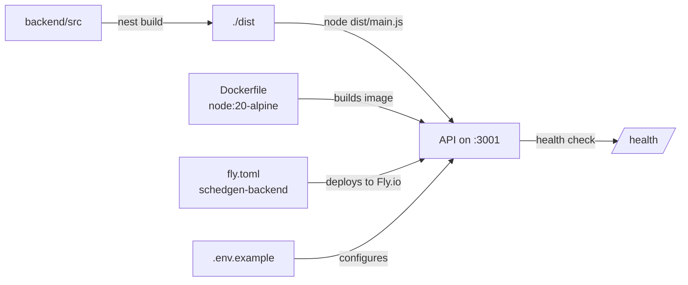

<!-- tyto-docs
tyto_docs: 1
kind: component
unit: backend
title: Backend
status: current
written_at_commit: c0611434ff8f1cf9e08ead13da854e4a6b9c8c43
written_at: "2026-09-14T19:47:12.956Z"
research: backend/DOCS/Research.md
sources: []
accepted:
  at: "2026-09-14T19:51:07.684Z"
  commit: c0611434ff8f1cf9e08ead13da854e4a6b9c8c43
  research_fingerprint: "sha256:1c18648f7739802909a6cbb1c8bfd2deb8d96df4e6f42a9cf6225ff53f594646"
  research_findings:
    - research.backend.150705f1
    - research.backend.1d11f4c3
    - research.backend.2dd75891
    - research.backend.45c28ca5
    - research.backend.5857555d
    - research.backend.6b9bdeb3
    - research.backend.72bc6afb
    - research.backend.737a298d
    - research.backend.a9b5c807
    - research.backend.ac621e01
    - research.backend.b213f18f
    - research.backend.bd9c3a1e
    - research.backend.e264cc65
    - research.backend.e5c8e0f5
    - research.backend.e7a20a37
    - research.backend.e90724d2
  critic_pass: critic.backend.1
  sources:
    - path: backend/eslint.config.mjs
      blob_sha: df284040167d4d2b049039af4d8f188d6d3a414a
evidence: Backend.evidence.md
critic:
  attempts: 1
  findings: []
  review_complete: true
  sections_reviewed: 8
  sections_total: 8
  last_reviewed_document: "sha256:c20b8381533c14b14c302ab2b1d2eeb299bbe25e84bc322e2a0f66bc13febc1a"
  retired: []
-->

# Backend

<!-- tyto-docs:generated:status -->
> **Status: Current**
<!-- /tyto-docs:generated:status -->

## [Summary](Backend.evidence.md#summary)

The backend unit is the ScheduleGenerator's server application: a private NestJS application named 'backend' that compiles strict TypeScript to ./dist and ships as a containerized service on port 3001. <!-- ev:research.backend.e5c8e0f5 -->[1](Backend.evidence.md#research.backend.e5c8e0f5) <!-- ev:research.backend.a9b5c807 -->[2](Backend.evidence.md#research.backend.a9b5c807) A dependant can rely on the standard npm lifecycle — build, start, lint, test — and on a Fly.io deployment that serves the API over HTTPS. <!-- ev:research.backend.150705f1 -->[3](Backend.evidence.md#research.backend.150705f1) <!-- ev:research.backend.ac621e01 -->[4](Backend.evidence.md#research.backend.ac621e01)

## [Purpose and boundaries](Backend.evidence.md#purpose-and-boundaries)

| | |
|---|---|
| Owns | The backend's build, test, and deployment configuration: package metadata and npm scripts, NestJS CLI and TypeScript compiler settings, linting and formatting rules, container images and their build contexts, and the Fly.io deployment definition. <!-- ev:research.backend.e5c8e0f5 -->[1](Backend.evidence.md#research.backend.e5c8e0f5) <!-- ev:research.backend.45c28ca5 -->[5](Backend.evidence.md#research.backend.45c28ca5) <!-- ev:research.backend.a9b5c807 -->[2](Backend.evidence.md#research.backend.a9b5c807) <!-- ev:research.backend.150705f1 -->[3](Backend.evidence.md#research.backend.150705f1) <!-- ev:research.backend.b213f18f -->[6](Backend.evidence.md#research.backend.b213f18f) <!-- ev:research.backend.e264cc65 -->[7](Backend.evidence.md#research.backend.e264cc65) <!-- ev:research.backend.6b9bdeb3 -->[8](Backend.evidence.md#research.backend.6b9bdeb3) <!-- ev:research.backend.5857555d -->[9](Backend.evidence.md#research.backend.5857555d) <!-- ev:research.backend.2dd75891 -->[10](Backend.evidence.md#research.backend.2dd75891) <!-- ev:research.backend.ac621e01 -->[4](Backend.evidence.md#research.backend.ac621e01) |
| Uses | Node.js 20 as the runtime and build base for both container images, and npm for dependency resolution. <!-- ev:research.backend.6b9bdeb3 -->[8](Backend.evidence.md#research.backend.6b9bdeb3) <!-- ev:research.backend.5857555d -->[9](Backend.evidence.md#research.backend.5857555d) <!-- ev:research.backend.72bc6afb -->[11](Backend.evidence.md#research.backend.72bc6afb) |
| Does not own | The application source under backend/src — the NestJS modules, controllers, and services — which is owned by its own units (inference: the research records none for this unit). |

## [How it works](Backend.evidence.md#how-it-works)

The backend is a NestJS application whose source lives in backend/src and is compiled to ./dist by the NestJS CLI, configured in nest-cli.json with sourceRoot 'src' and a clean of the output directory before each build. <!-- ev:research.backend.45c28ca5 -->[5](Backend.evidence.md#research.backend.45c28ca5) <!-- ev:research.backend.a9b5c807 -->[2](Backend.evidence.md#research.backend.a9b5c807) TypeScript compiles with strict checks, experimental decorator metadata, and an ES2023 target; production builds exclude node_modules, test, dist, and spec files. <!-- ev:research.backend.a9b5c807 -->[2](Backend.evidence.md#research.backend.a9b5c807) <!-- ev:research.backend.e90724d2 -->[12](Backend.evidence.md#research.backend.e90724d2) Tests run through jest with the ts-jest transform from the src rootDir, matching *.spec.ts files, with coverage written to ../coverage. <!-- ev:research.backend.bd9c3a1e -->[13](Backend.evidence.md#research.backend.bd9c3a1e)

The production Dockerfile builds the image in two stages on node:20-alpine, installs only production dependencies, runs as a non-root 'nestjs' user, exposes port 3001, health-checks http://localhost:3001/health, and starts the app with node dist/main.js. <!-- ev:research.backend.6b9bdeb3 -->[8](Backend.evidence.md#research.backend.6b9bdeb3) The development Dockerfile installs all dependencies and starts the app with npm run start:dev in watch mode. <!-- ev:research.backend.5857555d -->[9](Backend.evidence.md#research.backend.5857555d)

fly.toml deploys the app to Fly.io as 'schedgen-backend' in region 'jnb' with PORT=3001, NODE_ENV=production, and force_https on a shared-cpu-1x 512mb VM. <!-- ev:research.backend.ac621e01 -->[4](Backend.evidence.md#research.backend.ac621e01) Runtime configuration is supplied through environment variables documented in .env.example: server settings, PostgreSQL, MinIO, Google OAuth, the frontend URL, the parser service URL, and 2026 semester dates. <!-- ev:research.backend.e7a20a37 -->[14](Backend.evidence.md#research.backend.e7a20a37)

## [Interfaces](Backend.evidence.md#interfaces)

| Name | Input | Output | Guarantee |
|---|---|---|---|
| npm run build | TypeScript source in backend/src | Compiled JavaScript in ./dist | Compiles with strict checks and an ES2023 target, deleting the previous output directory <!-- ev:research.backend.150705f1 -->[3](Backend.evidence.md#research.backend.150705f1) <!-- ev:research.backend.a9b5c807 -->[2](Backend.evidence.md#research.backend.a9b5c807) <!-- ev:research.backend.45c28ca5 -->[5](Backend.evidence.md#research.backend.45c28ca5) |
| npm run start:dev | — | Development server in watch mode | Runs the app with live reload on port 3001 <!-- ev:research.backend.5857555d -->[9](Backend.evidence.md#research.backend.5857555d) |
| node dist/main.js | Compiled output in ./dist | Production server | Serves the API on port 3001 with a /health endpoint <!-- ev:research.backend.6b9bdeb3 -->[8](Backend.evidence.md#research.backend.6b9bdeb3) |
| npm test | *.spec.ts test files | Test report and coverage | Runs jest with ts-jest from src, writing coverage to ../coverage <!-- ev:research.backend.bd9c3a1e -->[13](Backend.evidence.md#research.backend.bd9c3a1e) |
| npm run lint | TypeScript source | Lint report | Applies the ESLint flat config with typescript-eslint recommendedTypeChecked and Prettier <!-- ev:research.backend.b213f18f -->[6](Backend.evidence.md#research.backend.b213f18f) <!-- ev:research.backend.e264cc65 -->[7](Backend.evidence.md#research.backend.e264cc65) |
| Dockerfile | Build context | Container image | Two-stage node:20-alpine image, non-root user, port 3001, /health check <!-- ev:research.backend.6b9bdeb3 -->[8](Backend.evidence.md#research.backend.6b9bdeb3) |
| fly.toml | Container image | Deployed service | Deploys to Fly.io as schedgen-backend with force_https <!-- ev:research.backend.ac621e01 -->[4](Backend.evidence.md#research.backend.ac621e01) |

<!-- tyto-docs:generated:endpoints -->
<!-- No framework adapter is active, so no endpoints were extracted for this unit. -->
<!-- /tyto-docs:generated:endpoints -->

## Source files

<!-- tyto-docs:generated:file-table -->
<!-- This unit owns no source files. -->
<!-- /tyto-docs:generated:file-table -->

## [Dependencies](Backend.evidence.md#dependencies)

| Dependency | Capability used | Why |
|---|---|---|
| Node.js 20 (node:20-alpine) | Runtime and build base for both container images | Both Dockerfiles build and run the app on node:20-alpine <!-- ev:research.backend.6b9bdeb3 -->[8](Backend.evidence.md#research.backend.6b9bdeb3) <!-- ev:research.backend.5857555d -->[9](Backend.evidence.md#research.backend.5857555d) |
| NestJS framework packages | Application framework: HTTP server, config, validation, auth, caching, throttling, health checks, OpenAPI | The backend is a NestJS application built on these packages <!-- ev:research.backend.737a298d -->[15](Backend.evidence.md#research.backend.737a298d) |
| Supporting libraries (axios, cache-manager, class-transformer, class-validator, express-session, form-data, helmet, passport, passport-google-oauth20, pdf-parse, reflect-metadata, rxjs, ts-node, tsconfig-paths, uuid) | Runtime capabilities: HTTP client, caching, validation, sessions, security headers, OAuth, PDF parsing | Declared as runtime dependencies in package.json <!-- ev:research.backend.737a298d -->[15](Backend.evidence.md#research.backend.737a298d) |
| NestJS CLI and schematics | Project scaffolding and build orchestration | nest build and nest start are driven by the CLI configured in nest-cli.json <!-- ev:research.backend.45c28ca5 -->[5](Backend.evidence.md#research.backend.45c28ca5) <!-- ev:research.backend.150705f1 -->[3](Backend.evidence.md#research.backend.150705f1) |
| jest, ts-jest, @nestjs/testing, supertest, fast-check | Unit and integration testing | npm test runs jest with ts-jest from the src rootDir <!-- ev:research.backend.bd9c3a1e -->[13](Backend.evidence.md#research.backend.bd9c3a1e) <!-- ev:research.backend.1d11f4c3 -->[16](Backend.evidence.md#research.backend.1d11f4c3) |
| eslint, typescript-eslint, prettier | Linting and formatting | The flat config applies recommendedTypeChecked rules and Prettier <!-- ev:research.backend.b213f18f -->[6](Backend.evidence.md#research.backend.b213f18f) <!-- ev:research.backend.e264cc65 -->[7](Backend.evidence.md#research.backend.e264cc65) |
| npm | Dependency resolution and lockfile | package-lock.json (lockfileVersion 3) records the resolved dependency tree <!-- ev:research.backend.72bc6afb -->[11](Backend.evidence.md#research.backend.72bc6afb) |
| Fly.io | Deployment platform | fly.toml deploys the app as schedgen-backend with force_https <!-- ev:research.backend.ac621e01 -->[4](Backend.evidence.md#research.backend.ac621e01) |
| PostgreSQL, MinIO, Google OAuth | External services the app connects to | Documented as required environment configuration in .env.example <!-- ev:research.backend.e7a20a37 -->[14](Backend.evidence.md#research.backend.e7a20a37) |

<!-- tyto-docs:generated:module-graph -->
<!-- No module dependency graph is available for this unit. -->
<!-- /tyto-docs:generated:module-graph -->

## [Data model](Backend.evidence.md#data-model)

This unit declares and references no entities (inference: the research records none for this unit). It owns build, test, and deployment configuration only. <!-- ev:research.backend.e5c8e0f5 -->[1](Backend.evidence.md#research.backend.e5c8e0f5)

<!-- tyto-docs:generated:erd -->
<!-- This leaf unit has no descendant scope for a focused ERD. -->
<!-- /tyto-docs:generated:erd -->

## [Decisions and limitations](Backend.evidence.md#decisions-and-limitations)

Production builds exclude tests and spec files, and the production image runs as a non-root 'nestjs' user, so the shipped artifact is a minimal, least-privilege container. <!-- ev:research.backend.e90724d2 -->[12](Backend.evidence.md#research.backend.e90724d2) <!-- ev:research.backend.6b9bdeb3 -->[8](Backend.evidence.md#research.backend.6b9bdeb3) The deployment targets Fly.io region 'jnb' with force_https, and ESLint leaves @typescript-eslint/no-explicit-any disabled. <!-- ev:research.backend.ac621e01 -->[4](Backend.evidence.md#research.backend.ac621e01) <!-- ev:research.backend.b213f18f -->[6](Backend.evidence.md#research.backend.b213f18f)

<!-- tyto-docs:generated:navigation -->
- **Schedule:** 1 of 30, wave 1
<!-- /tyto-docs:generated:navigation -->