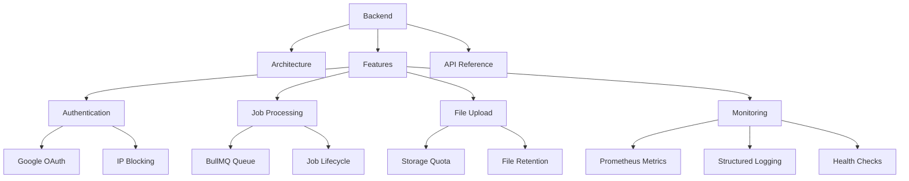
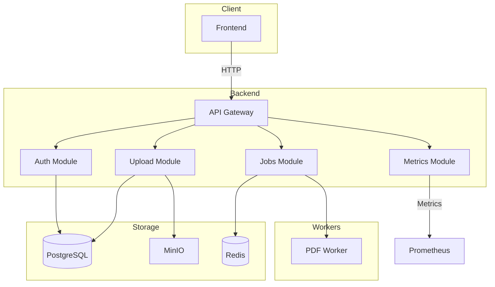

# Backend Documentation

NestJS API server implementation details and guides.



## Implementation Guides

### Core Features
- [Database Connection Pool](./database-connection-pool.md) - Connection pooling configuration
- [Rate Limiting](./rate-limiting.md) - API rate limiting implementation
- [Structured Logging](./structured-logging.md) - Logging strategy and format

### Authentication & Security
- [IP Blocking](./ip-blocking.md) - IP-based access control
- [Google OAuth](./google-oauth.md) - OAuth integration details

### Storage & Files
- [Storage Quota](./storage-quota.md) - User storage limits
- [File Retention](./file-retention.md) - Automatic file cleanup

### Monitoring & Observability
- [Prometheus Metrics](./prometheus-metrics.md) - Metrics collection
- [Health Checks](./health-checks.md) - Service health monitoring

## Architecture



## Quick Reference

### API Endpoints
See [API Documentation](../API_DOCUMENTATION.md)

### Database Migrations
```bash
# Generate migration
npm run migration:generate src/migrations/MigrationName

# Run migrations
npm run migration:run

# Revert migration
npm run migration:revert
```

### Testing
```bash
# Run all tests
npm test

# Run specific test
npm test -- upload.service.spec.ts

# Coverage
npm run test:cov
```

## Configuration

Key environment variables:
- `DATABASE_URL` - PostgreSQL connection
- `REDIS_URL` - Redis connection
- `MINIO_ENDPOINT` - Object storage
- `GOOGLE_CLIENT_ID` - OAuth credentials
- `SESSION_SECRET` - Session encryption

See [Environment Configuration](../../docs/development/environment.md)
