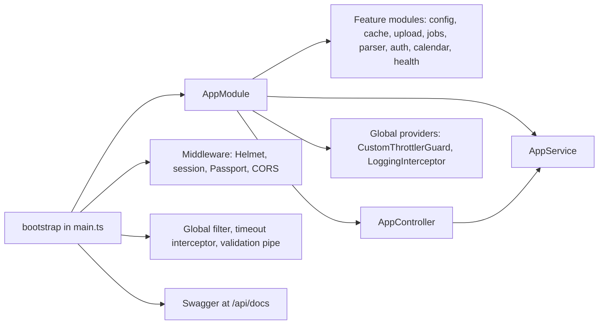

<!-- tyto-docs
tyto_docs: 1
kind: component
unit: backend/src
title: Src
status: draft
written_at_commit: 5f4e5d4023e1cc11b6cbf56aa823c63508513784
written_at: "2026-09-15T10:30:24.846Z"
research: backend/src/DOCS/Research.md
sources: []
accepted: null
evidence: Src.evidence.md
critic:
  attempts: 0
  findings: []
-->

# Src

<!-- tyto-docs:generated:status -->
<!-- /tyto-docs:generated:status -->

## [Summary](Src.evidence.md#summary)

The backend/src unit is the root of the NestJS backend application. It owns the application bootstrap and the root module that wires the config, cache, upload, jobs, parser, auth, calendar, and health feature modules together, along with the root controller and service. <!-- ev:research.backend-src.b2d8b5d8 -->[1](Src.evidence.md#research.backend-src.b2d8b5d8) Dependants can rely on a single entry point that applies global rate limiting, request logging, security middleware, validation, and Swagger documentation to every request. <!-- ev:research.backend-src.46f509a2 -->[2](Src.evidence.md#research.backend-src.46f509a2) <!-- ev:research.backend-src.cf249a5a -->[3](Src.evidence.md#research.backend-src.cf249a5a) <!-- ev:research.backend-src.c2aad9fb -->[4](Src.evidence.md#research.backend-src.c2aad9fb) <!-- ev:research.backend-src.a6d50bb5 -->[5](Src.evidence.md#research.backend-src.a6d50bb5) <!-- ev:research.backend-src.5f8caa7a -->[6](Src.evidence.md#research.backend-src.5f8caa7a)

## [Purpose and boundaries](Src.evidence.md#purpose-and-boundaries)

| | |
|---|---|
| Owns | The application root: AppModule in app.module.ts, AppController in app.controller.ts, AppService in app.service.ts, and the bootstrap entry point in main.ts. <!-- ev:research.backend-src.b2d8b5d8 -->[1](Src.evidence.md#research.backend-src.b2d8b5d8) <!-- ev:research.backend-src.dcf1a38e -->[7](Src.evidence.md#research.backend-src.dcf1a38e) <!-- ev:research.backend-src.83908882 -->[8](Src.evidence.md#research.backend-src.83908882) <!-- ev:research.backend-src.c2aad9fb -->[4](Src.evidence.md#research.backend-src.c2aad9fb) |
| Uses | The config, cache, upload, jobs, parser, auth, calendar, and health feature modules it imports, plus the shared CustomThrottlerGuard and LoggingInterceptor it registers as global providers. <!-- ev:research.backend-src.b2d8b5d8 -->[1](Src.evidence.md#research.backend-src.b2d8b5d8) <!-- ev:research.backend-src.46f509a2 -->[2](Src.evidence.md#research.backend-src.46f509a2) <!-- ev:research.backend-src.cf249a5a -->[3](Src.evidence.md#research.backend-src.cf249a5a) |
| Does not own | The feature modules it imports and the shared guards, interceptors, and filters it applies globally. <!-- ev:research.backend-src.b2d8b5d8 -->[1](Src.evidence.md#research.backend-src.b2d8b5d8) <!-- ev:research.backend-src.46f509a2 -->[2](Src.evidence.md#research.backend-src.46f509a2) <!-- ev:research.backend-src.cf249a5a -->[3](Src.evidence.md#research.backend-src.cf249a5a) <!-- ev:research.backend-src.a6d50bb5 -->[5](Src.evidence.md#research.backend-src.a6d50bb5) |

## [How it works](Src.evidence.md#how-it-works)

main.ts's bootstrap function is the entry point: it creates the Nest application from AppModule, sets the Express 'trust proxy' flag, enables Helmet security middleware, configures an express-session with a 24-hour cookie that is secure in production, and initializes Passport. <!-- ev:research.backend-src.c2aad9fb -->[4](Src.evidence.md#research.backend-src.c2aad9fb) It then enables CORS for the configured frontend URL and the deployed frontend origins, allowing requests without an origin and localhost origins outside production, with credentials enabled. <!-- ev:research.backend-src.d9944d03 -->[9](Src.evidence.md#research.backend-src.d9944d03)

Finally it installs a global HttpExceptionFilter, a global QueryTimeoutInterceptor with a 60-second timeout, and a global ValidationPipe with whitelist, forbidNonWhitelisted, and transform enabled, then builds Swagger documentation titled 'Tuks Schedule Generator API' with Google OAuth2 and bearer authentication, serves it at /api/docs, and listens on the configured port (default 3001) on 0.0.0.0. <!-- ev:research.backend-src.a6d50bb5 -->[5](Src.evidence.md#research.backend-src.a6d50bb5) <!-- ev:research.backend-src.5f8caa7a -->[6](Src.evidence.md#research.backend-src.5f8caa7a)

AppModule is the root module: it imports the config, cache, upload, jobs, parser, auth, calendar, and health feature modules, declares AppController as its only controller, and provides AppService. <!-- ev:research.backend-src.b2d8b5d8 -->[1](Src.evidence.md#research.backend-src.b2d8b5d8) It also configures global rate limiting through ThrottlerModule.forRoot with a 60,000 ms TTL and a limit of 100 requests, registering CustomThrottlerGuard as the global APP_GUARD provider, and registers LoggingInterceptor as the global APP_INTERCEPTOR so that every request is logged with request and user IDs. <!-- ev:research.backend-src.46f509a2 -->[2](Src.evidence.md#research.backend-src.46f509a2) <!-- ev:research.backend-src.cf249a5a -->[3](Src.evidence.md#research.backend-src.cf249a5a)

At the root, AppController exposes a GET endpoint whose getHello method returns the greeting produced by AppService, which returns the string 'Hello World!'. <!-- ev:research.backend-src.dcf1a38e -->[7](Src.evidence.md#research.backend-src.dcf1a38e) <!-- ev:research.backend-src.83908882 -->[8](Src.evidence.md#research.backend-src.83908882)

## [Interfaces](Src.evidence.md#interfaces)

| Name | Input | Output | Guarantee |
|---|---|---|---|
| GET / | — | The greeting string 'Hello World!' | Root-level endpoint served by AppController, delegating to AppService <!-- ev:research.backend-src.dcf1a38e -->[7](Src.evidence.md#research.backend-src.dcf1a38e) <!-- ev:research.backend-src.83908882 -->[8](Src.evidence.md#research.backend-src.83908882) |
| bootstrap | — | A running HTTP server | Applies security, session, CORS, global filters, timeout, and validation, then serves Swagger at /api/docs and listens on the configured port (default 3001) on 0.0.0.0 <!-- ev:research.backend-src.c2aad9fb -->[4](Src.evidence.md#research.backend-src.c2aad9fb) <!-- ev:research.backend-src.d9944d03 -->[9](Src.evidence.md#research.backend-src.d9944d03) <!-- ev:research.backend-src.a6d50bb5 -->[5](Src.evidence.md#research.backend-src.a6d50bb5) <!-- ev:research.backend-src.5f8caa7a -->[6](Src.evidence.md#research.backend-src.5f8caa7a) |

<!-- tyto-docs:generated:endpoints -->
<!-- /tyto-docs:generated:endpoints -->

## Source files

<!-- tyto-docs:generated:file-table -->
<!-- /tyto-docs:generated:file-table -->

## [Dependencies](Src.evidence.md#dependencies)

| Dependency | Capability used | Why |
|---|---|---|
| @nestjs/throttler | ThrottlerModule.forRoot with a 60,000 ms TTL and a 100-request limit | Global rate limiting, enforced by CustomThrottlerGuard as the APP_GUARD provider <!-- ev:research.backend-src.46f509a2 -->[2](Src.evidence.md#research.backend-src.46f509a2) |
| helmet | Security middleware | Applies security headers to every request <!-- ev:research.backend-src.c2aad9fb -->[4](Src.evidence.md#research.backend-src.c2aad9fb) |
| express-session | A 24-hour session cookie, secure in production | Session storage for Passport <!-- ev:research.backend-src.c2aad9fb -->[4](Src.evidence.md#research.backend-src.c2aad9fb) |
| passport | Session initialization | Authentication support <!-- ev:research.backend-src.c2aad9fb -->[4](Src.evidence.md#research.backend-src.c2aad9fb) |
| @nestjs/swagger | DocumentBuilder and SwaggerModule | Serves 'Tuks Schedule Generator API' documentation with Google OAuth2 and bearer authentication at /api/docs <!-- ev:research.backend-src.5f8caa7a -->[6](Src.evidence.md#research.backend-src.5f8caa7a) |
| @nestjs/common | ValidationPipe and HttpExceptionFilter | Global validation with whitelist, forbidNonWhitelisted, and transform, and global exception handling <!-- ev:research.backend-src.a6d50bb5 -->[5](Src.evidence.md#research.backend-src.a6d50bb5) |

<!-- tyto-docs:generated:module-graph -->
<!-- /tyto-docs:generated:module-graph -->

## Data model

This unit declares no entities: it is the application root, wiring modules and global providers rather than defining data shapes, so the generated ERD region is empty.

<!-- tyto-docs:generated:erd -->
<!-- /tyto-docs:generated:erd -->

## [Decisions and limitations](Src.evidence.md#decisions-and-limitations)

Global rate limiting allows 100 requests per 60,000 ms window, enforced by CustomThrottlerGuard. <!-- ev:research.backend-src.46f509a2 -->[2](Src.evidence.md#research.backend-src.46f509a2) The session cookie is secure only in production, and CORS permits requests without an origin and localhost origins outside production, so the API is reachable from non-browser clients and local development. <!-- ev:research.backend-src.c2aad9fb -->[4](Src.evidence.md#research.backend-src.c2aad9fb) <!-- ev:research.backend-src.d9944d03 -->[9](Src.evidence.md#research.backend-src.d9944d03) A global 60-second query timeout bounds every request. <!-- ev:research.backend-src.a6d50bb5 -->[5](Src.evidence.md#research.backend-src.a6d50bb5)

<!-- tyto-docs:generated:navigation -->
<!-- /tyto-docs:generated:navigation -->