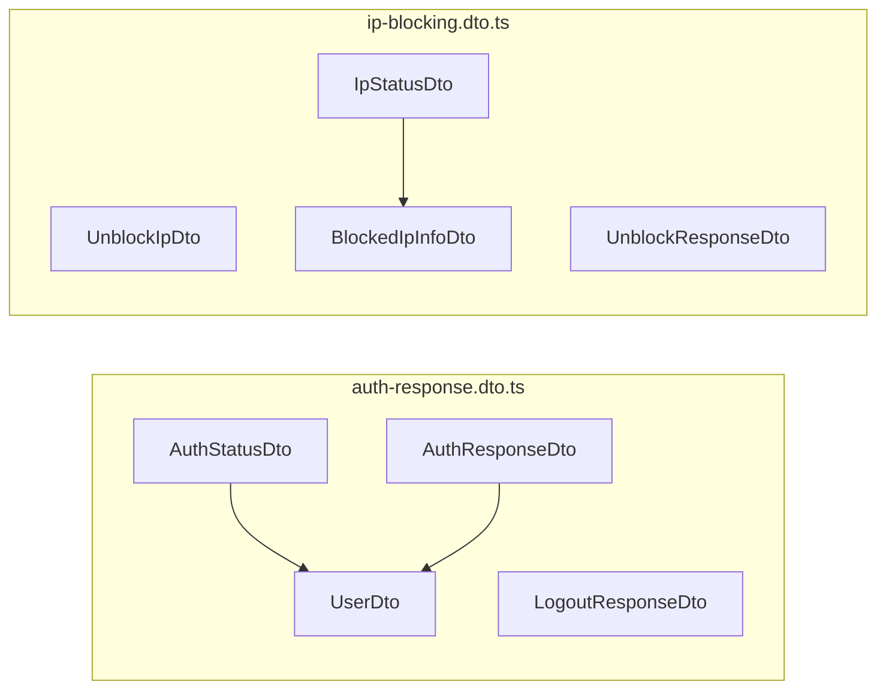
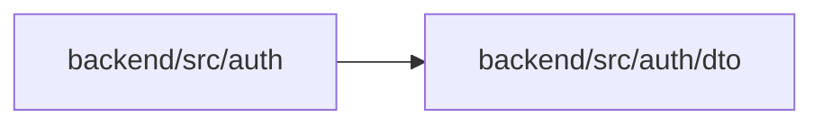

<!-- tyto-docs
tyto_docs: 1
kind: component
unit: backend/src/auth/dto
title: Dto
status: current
written_at_commit: 6a17336e21ed64732b697beeebcb654fb33df91f
written_at: "2026-09-14T21:58:06.352Z"
research: backend/src/auth/dto/DOCS/Research.md
sources: []
accepted:
  at: "2026-09-14T22:01:35.504Z"
  commit: 6a17336e21ed64732b697beeebcb654fb33df91f
  research_fingerprint: "sha256:9a8619f69a2db6e1ef337381b1d2b7fe7506628a7b46967e8e361d83cefa5be9"
  research_findings:
    - research.backend-src-auth-dto.06c54672
    - research.backend-src-auth-dto.3360858c
    - research.backend-src-auth-dto.3e8353c6
    - research.backend-src-auth-dto.5c028e22
    - research.backend-src-auth-dto.72901a78
    - research.backend-src-auth-dto.8678031f
    - research.backend-src-auth-dto.9f057329
    - research.backend-src-auth-dto.b892d58a
    - research.backend-src-auth-dto.bdfad290
    - research.backend-src-auth-dto.be3a6715
  critic_pass: critic.backend-src-auth-dto.1
  sources:
    - path: backend/src/auth/dto/auth-response.dto.ts
      blob_sha: f993d984f352c14c94b8a89a29d85ec463a7e22f
    - path: backend/src/auth/dto/ip-blocking.dto.ts
      blob_sha: 303188269c8faf35436b96929b97c43a08f838ab
evidence: Dto.evidence.md
critic:
  attempts: 1
  findings: []
  review_complete: true
  sections_reviewed: 7
  sections_total: 7
  last_reviewed_document: "sha256:d2ac7dade24624799a38c73ed957e6a60c540bbb8c8b138e1269fa51935848c6"
  retired: []
-->

# Dto

<!-- tyto-docs:generated:status -->
> **Status: Current**
<!-- /tyto-docs:generated:status -->

## [Summary](Dto.evidence.md#summary)

The dto unit owns the request and response shapes the auth module exchanges with its callers. It defines eight exported DTO classes across two files: the user, authentication status, and response shapes of the auth flow, and the request and response shapes of the IP-blocking flow. <!-- ev:research.backend-src-auth-dto.06c54672 -->[1](Dto.evidence.md#research.backend-src-auth-dto.06c54672) Dependants can rely on these classes to carry Swagger-documented payloads between the auth controller and its clients. <!-- ev:research.backend-src-auth-dto.72901a78 -->[2](Dto.evidence.md#research.backend-src-auth-dto.72901a78)

## [Purpose and boundaries](Dto.evidence.md#purpose-and-boundaries)

| | |
|---|---|
| Owns | The eight exported DTO classes of the auth module: UserDto, AuthStatusDto, AuthResponseDto, and LogoutResponseDto in auth-response.dto.ts, and UnblockIpDto, BlockedIpInfoDto, UnblockResponseDto, and IpStatusDto in ip-blocking.dto.ts. <!-- ev:research.backend-src-auth-dto.06c54672 -->[1](Dto.evidence.md#research.backend-src-auth-dto.06c54672) |
| Uses | @nestjs/swagger's @ApiProperty and @ApiPropertyOptional decorators to document DTO properties, and class-validator's @IsIP to validate the ip property of UnblockIpDto. <!-- ev:research.backend-src-auth-dto.9f057329 -->[3](Dto.evidence.md#research.backend-src-auth-dto.9f057329) <!-- ev:research.backend-src-auth-dto.3360858c -->[4](Dto.evidence.md#research.backend-src-auth-dto.3360858c) <!-- ev:research.backend-src-auth-dto.8678031f -->[5](Dto.evidence.md#research.backend-src-auth-dto.8678031f) |
| Does not own | The auth controller, which imports AuthStatusDto, LogoutResponseDto, UnblockIpDto, UnblockResponseDto, and IpStatusDto to type its endpoints. <!-- ev:research.backend-src-auth-dto.72901a78 -->[2](Dto.evidence.md#research.backend-src-auth-dto.72901a78) |

## [How it works](Dto.evidence.md#how-it-works)

auth-response.dto.ts declares the four response shapes of the auth flow. UserDto carries the four required user fields — email, firstName, lastName, and picture — each documented with @ApiProperty. <!-- ev:research.backend-src-auth-dto.9f057329 -->[3](Dto.evidence.md#research.backend-src-auth-dto.9f057329) AuthStatusDto reports whether the caller is authenticated and, when it is, the user; AuthResponseDto pairs a success message with the user; LogoutResponseDto carries only a success message. <!-- ev:research.backend-src-auth-dto.3360858c -->[4](Dto.evidence.md#research.backend-src-auth-dto.3360858c) <!-- ev:research.backend-src-auth-dto.be3a6715 -->[6](Dto.evidence.md#research.backend-src-auth-dto.be3a6715) <!-- ev:research.backend-src-auth-dto.5c028e22 -->[7](Dto.evidence.md#research.backend-src-auth-dto.5c028e22)

ip-blocking.dto.ts declares the four shapes of the IP-blocking flow. UnblockIpDto is the request body, its ip property validated by @IsIP. <!-- ev:research.backend-src-auth-dto.8678031f -->[5](Dto.evidence.md#research.backend-src-auth-dto.8678031f) BlockedIpInfoDto describes a blocked address with ip, attempts, blockedAt, reason, and timeRemaining; UnblockResponseDto confirms an unblock with message and ip; IpStatusDto reports whether an address is blocked, with optional failedAttempts and blockInfo. <!-- ev:research.backend-src-auth-dto.bdfad290 -->[8](Dto.evidence.md#research.backend-src-auth-dto.bdfad290) <!-- ev:research.backend-src-auth-dto.3e8353c6 -->[9](Dto.evidence.md#research.backend-src-auth-dto.3e8353c6) <!-- ev:research.backend-src-auth-dto.b892d58a -->[10](Dto.evidence.md#research.backend-src-auth-dto.b892d58a)

## [Interfaces](Dto.evidence.md#interfaces)

| Name | Input | Output | Guarantee |
|---|---|---|---|
| UserDto | — | A user shape with email, firstName, lastName, and picture | Describes the four required string fields of a user, each documented with @ApiProperty <!-- ev:research.backend-src-auth-dto.9f057329 -->[3](Dto.evidence.md#research.backend-src-auth-dto.9f057329) |
| AuthStatusDto | — | An authentication status shape | Reports whether the caller is authenticated and, optionally, the user <!-- ev:research.backend-src-auth-dto.3360858c -->[4](Dto.evidence.md#research.backend-src-auth-dto.3360858c) |
| AuthResponseDto | — | An auth response shape | Pairs a success message with the user <!-- ev:research.backend-src-auth-dto.be3a6715 -->[6](Dto.evidence.md#research.backend-src-auth-dto.be3a6715) |
| LogoutResponseDto | — | A logout response shape | Carries a single success message <!-- ev:research.backend-src-auth-dto.5c028e22 -->[7](Dto.evidence.md#research.backend-src-auth-dto.5c028e22) |
| UnblockIpDto | — | An unblock request shape | Carries an ip property validated by @IsIP <!-- ev:research.backend-src-auth-dto.8678031f -->[5](Dto.evidence.md#research.backend-src-auth-dto.8678031f) |
| BlockedIpInfoDto | — | A blocked-IP info shape | Describes a blocked address with ip, attempts, blockedAt, reason, and timeRemaining <!-- ev:research.backend-src-auth-dto.bdfad290 -->[8](Dto.evidence.md#research.backend-src-auth-dto.bdfad290) |
| UnblockResponseDto | — | An unblock response shape | Confirms an unblock with message and ip <!-- ev:research.backend-src-auth-dto.3e8353c6 -->[9](Dto.evidence.md#research.backend-src-auth-dto.3e8353c6) |
| IpStatusDto | — | An IP status shape | Reports whether an address is blocked, with optional failedAttempts and blockInfo <!-- ev:research.backend-src-auth-dto.b892d58a -->[10](Dto.evidence.md#research.backend-src-auth-dto.b892d58a) |

<!-- tyto-docs:generated:endpoints -->
<!-- No framework adapter is active, so no endpoints were extracted for this unit. -->
<!-- /tyto-docs:generated:endpoints -->

## Source files

<!-- tyto-docs:generated:file-table -->
<!-- This unit owns no source files. -->
<!-- /tyto-docs:generated:file-table -->

## [Dependencies](Dto.evidence.md#dependencies)

| Dependency | Capability used | Why |
|---|---|---|
| @nestjs/swagger | @ApiProperty and @ApiPropertyOptional decorators | Documents every DTO property for OpenAPI output <!-- ev:research.backend-src-auth-dto.9f057329 -->[3](Dto.evidence.md#research.backend-src-auth-dto.9f057329) <!-- ev:research.backend-src-auth-dto.3360858c -->[4](Dto.evidence.md#research.backend-src-auth-dto.3360858c) |
| class-validator | @IsIP decorator | Validates the ip property of UnblockIpDto <!-- ev:research.backend-src-auth-dto.8678031f -->[5](Dto.evidence.md#research.backend-src-auth-dto.8678031f) |

<!-- tyto-docs:generated:module-graph -->

<!-- /tyto-docs:generated:module-graph -->

## [Data model](Dto.evidence.md#data-model)

This unit declares the eight DTO classes that shape the auth module's request and response payloads. UserDto is embedded in AuthStatusDto and AuthResponseDto, and BlockedIpInfoDto is embedded in IpStatusDto. <!-- ev:research.backend-src-auth-dto.06c54672 -->[1](Dto.evidence.md#research.backend-src-auth-dto.06c54672) <!-- ev:research.backend-src-auth-dto.3360858c -->[4](Dto.evidence.md#research.backend-src-auth-dto.3360858c) <!-- ev:research.backend-src-auth-dto.be3a6715 -->[6](Dto.evidence.md#research.backend-src-auth-dto.be3a6715) <!-- ev:research.backend-src-auth-dto.b892d58a -->[10](Dto.evidence.md#research.backend-src-auth-dto.b892d58a)

<!-- tyto-docs:generated:erd -->
<!-- This leaf unit has no descendant scope for a focused ERD. -->
<!-- /tyto-docs:generated:erd -->

<!-- tyto-docs:generated:navigation -->
- **Schedule:** 2 of 30, wave 1
<!-- /tyto-docs:generated:navigation -->