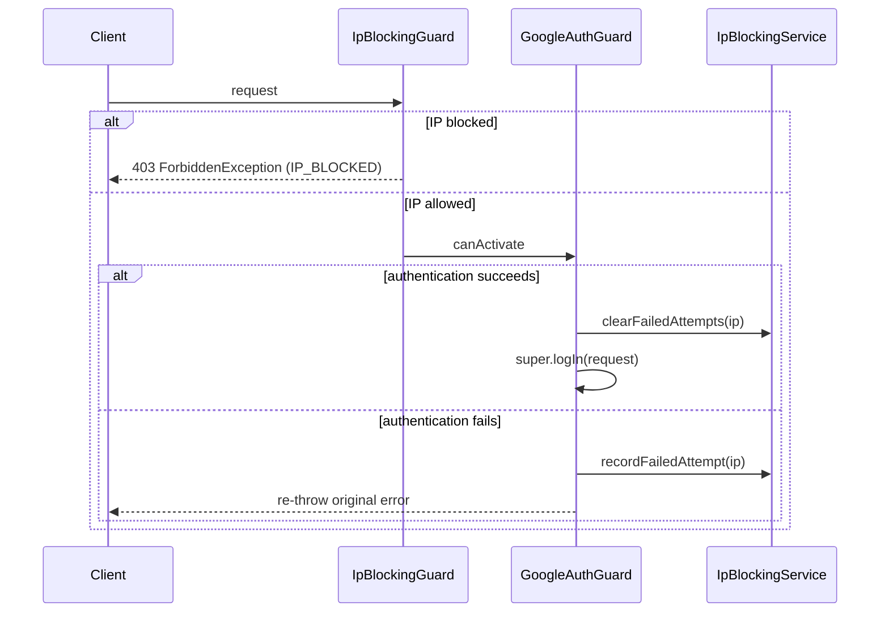

<!-- tyto-docs
tyto_docs: 1
kind: component
unit: backend/src/auth/guards
title: Guards
status: current
written_at_commit: 0a84ed7686d50fd433342f0bf7824685996a1f86
written_at: "2026-09-14T23:21:26.864Z"
research: backend/src/auth/guards/DOCS/Research.md
sources: []
accepted:
  at: "2026-09-14T23:26:09.815Z"
  commit: 0a84ed7686d50fd433342f0bf7824685996a1f86
  research_fingerprint: "sha256:28d9c185cd748f8b79e349c40363e5258e75fad3b71e2120627354efc863dd34"
  research_findings:
    - research.backend-src-auth-guards.0a33100e
    - research.backend-src-auth-guards.2b44575c
    - research.backend-src-auth-guards.43ae735e
    - research.backend-src-auth-guards.4eafa1c9
    - research.backend-src-auth-guards.5f7d220b
    - research.backend-src-auth-guards.7518b4ff
    - research.backend-src-auth-guards.80e32637
    - research.backend-src-auth-guards.8c0afe00
    - research.backend-src-auth-guards.f289afb7
    - research.backend-src-auth-guards.f676ae38
  critic_pass: critic.backend-src-auth-guards.1
  sources:
    - path: backend/src/auth/guards/google-auth.guard.ts
      blob_sha: a2b5ee5a171500a0b5863fe04572d390311e52d0
    - path: backend/src/auth/guards/ip-blocking.guard.ts
      blob_sha: 8e8a148d0ce7d64afcc7e3dd5e59f06df691ccc4
evidence: Guards.evidence.md
critic:
  attempts: 1
  findings: []
  review_complete: true
  sections_reviewed: 8
  sections_total: 8
  last_reviewed_document: "sha256:46073662735e36ec4626426a6519eb0a08b225bfae91fb445d9aebc37231db2e"
  retired: []
-->

# Guards

<!-- tyto-docs:generated:status -->
<!-- /tyto-docs:generated:status -->

## [Summary](Guards.evidence.md#summary)

The guards unit owns the two route guards of the auth module: GoogleAuthGuard, which runs the Google OAuth flow and records failed attempts, and IpBlockingGuard, which rejects requests from blocked IPs. Both depend on IpBlockingService. Dependants can rely on these guards to protect auth routes from unauthenticated and blocked-IP access. <!-- ev:research.backend-src-auth-guards.4eafa1c9 -->[1](Guards.evidence.md#research.backend-src-auth-guards.4eafa1c9) <!-- ev:research.backend-src-auth-guards.0a33100e -->[2](Guards.evidence.md#research.backend-src-auth-guards.0a33100e) <!-- ev:research.backend-src-auth-guards.5f7d220b -->[3](Guards.evidence.md#research.backend-src-auth-guards.5f7d220b)

## [Purpose and boundaries](Guards.evidence.md#purpose-and-boundaries)

| | |
|---|---|
| Owns | The two route guards of the auth module: GoogleAuthGuard in google-auth.guard.ts, an @Injectable() guard extending AuthGuard('google') from @nestjs/passport, and IpBlockingGuard in ip-blocking.guard.ts, an @Injectable() guard implementing CanActivate. <!-- ev:research.backend-src-auth-guards.4eafa1c9 -->[1](Guards.evidence.md#research.backend-src-auth-guards.4eafa1c9) <!-- ev:research.backend-src-auth-guards.0a33100e -->[2](Guards.evidence.md#research.backend-src-auth-guards.0a33100e) |
| Uses | IpBlockingService, injected into both guards, to clear and record failed attempts per client IP and to report whether an IP is blocked. <!-- ev:research.backend-src-auth-guards.4eafa1c9 -->[1](Guards.evidence.md#research.backend-src-auth-guards.4eafa1c9) <!-- ev:research.backend-src-auth-guards.f676ae38 -->[4](Guards.evidence.md#research.backend-src-auth-guards.f676ae38) <!-- ev:research.backend-src-auth-guards.8c0afe00 -->[5](Guards.evidence.md#research.backend-src-auth-guards.8c0afe00) <!-- ev:research.backend-src-auth-guards.0a33100e -->[2](Guards.evidence.md#research.backend-src-auth-guards.0a33100e) <!-- ev:research.backend-src-auth-guards.2b44575c -->[6](Guards.evidence.md#research.backend-src-auth-guards.2b44575c) |
| Does not own | The auth controller, which imports both guards and applies them to its routes, and the AuthModule, which registers IpBlockingGuard as a provider and an export. <!-- ev:research.backend-src-auth-guards.5f7d220b -->[3](Guards.evidence.md#research.backend-src-auth-guards.5f7d220b) <!-- ev:research.backend-src-auth-guards.80e32637 -->[7](Guards.evidence.md#research.backend-src-auth-guards.80e32637) |

## [How it works](Guards.evidence.md#how-it-works)

GoogleAuthGuard extends AuthGuard('google') from @nestjs/passport. Its canActivate delegates to the parent guard; when authentication succeeds it clears any recorded failed attempts for the client IP and triggers a session login, and when it fails it records a failed attempt, logs a warning if the service reports the IP should be blocked, and re-throws the original error. <!-- ev:research.backend-src-auth-guards.f676ae38 -->[4](Guards.evidence.md#research.backend-src-auth-guards.f676ae38) <!-- ev:research.backend-src-auth-guards.8c0afe00 -->[5](Guards.evidence.md#research.backend-src-auth-guards.8c0afe00) getAuthenticateOptions passes returnUrl from the request query as a JSON-stringified state option so it survives the OAuth redirect. <!-- ev:research.backend-src-auth-guards.f289afb7 -->[8](Guards.evidence.md#research.backend-src-auth-guards.f289afb7)

IpBlockingGuard implements CanActivate. Its canActivate asks IpBlockingService whether the client IP is blocked; when it is, the guard computes the time until unblock, logs a warning with the reason and blocked-at timestamp, and throws a ForbiddenException carrying statusCode 403, message 'IP_BLOCKED', a human-readable error stating the minutes remaining, and retryAfter in seconds. <!-- ev:research.backend-src-auth-guards.2b44575c -->[6](Guards.evidence.md#research.backend-src-auth-guards.2b44575c)

Both guards resolve the client IP the same way: the first entry of the X-Forwarded-For header when present, falling back to request.ip, then request.socket.remoteAddress, then the literal 'unknown'. <!-- ev:research.backend-src-auth-guards.43ae735e -->[9](Guards.evidence.md#research.backend-src-auth-guards.43ae735e) <!-- ev:research.backend-src-auth-guards.7518b4ff -->[10](Guards.evidence.md#research.backend-src-auth-guards.7518b4ff)

## [Interfaces](Guards.evidence.md#interfaces)

| Name | Input | Output | Guarantee |
|---|---|---|---|
| GoogleAuthGuard.canActivate | ExecutionContext | Promise<boolean> | Delegates to the parent passport guard; on success clears failed attempts for the client IP and triggers session login, on failure records a failed attempt and re-throws <!-- ev:research.backend-src-auth-guards.f676ae38 -->[4](Guards.evidence.md#research.backend-src-auth-guards.f676ae38) <!-- ev:research.backend-src-auth-guards.8c0afe00 -->[5](Guards.evidence.md#research.backend-src-auth-guards.8c0afe00) |
| GoogleAuthGuard.getAuthenticateOptions | ExecutionContext | { state?: string } | Returns returnUrl from the request query as a JSON-stringified state option so it survives the OAuth redirect <!-- ev:research.backend-src-auth-guards.f289afb7 -->[8](Guards.evidence.md#research.backend-src-auth-guards.f289afb7) |
| IpBlockingGuard.canActivate | ExecutionContext | Promise<boolean> | Returns true when the client IP is not blocked; throws a ForbiddenException with statusCode 403, message 'IP_BLOCKED', minutes remaining, and retryAfter when it is <!-- ev:research.backend-src-auth-guards.2b44575c -->[6](Guards.evidence.md#research.backend-src-auth-guards.2b44575c) |

<!-- tyto-docs:generated:endpoints -->
<!-- /tyto-docs:generated:endpoints -->

## Source files

<!-- tyto-docs:generated:file-table -->
<!-- /tyto-docs:generated:file-table -->

## [Dependencies](Guards.evidence.md#dependencies)

| Dependency | Capability used | Why |
|---|---|---|
| IpBlockingService | clearFailedAttempts, recordFailedAttempt, isBlocked, getTimeUntilUnblock | Tracks failed attempts per client IP and reports whether an IP is blocked <!-- ev:research.backend-src-auth-guards.4eafa1c9 -->[1](Guards.evidence.md#research.backend-src-auth-guards.4eafa1c9) <!-- ev:research.backend-src-auth-guards.f676ae38 -->[4](Guards.evidence.md#research.backend-src-auth-guards.f676ae38) <!-- ev:research.backend-src-auth-guards.8c0afe00 -->[5](Guards.evidence.md#research.backend-src-auth-guards.8c0afe00) <!-- ev:research.backend-src-auth-guards.0a33100e -->[2](Guards.evidence.md#research.backend-src-auth-guards.0a33100e) <!-- ev:research.backend-src-auth-guards.2b44575c -->[6](Guards.evidence.md#research.backend-src-auth-guards.2b44575c) |
| @nestjs/passport | AuthGuard('google') | Provides the Google OAuth authentication flow that GoogleAuthGuard extends <!-- ev:research.backend-src-auth-guards.4eafa1c9 -->[1](Guards.evidence.md#research.backend-src-auth-guards.4eafa1c9) |
| @nestjs/common | @Injectable, CanActivate, ExecutionContext, ForbiddenException, Logger | NestJS guard infrastructure and the 403 response for blocked IPs <!-- ev:research.backend-src-auth-guards.0a33100e -->[2](Guards.evidence.md#research.backend-src-auth-guards.0a33100e) <!-- ev:research.backend-src-auth-guards.2b44575c -->[6](Guards.evidence.md#research.backend-src-auth-guards.2b44575c) |

<!-- tyto-docs:generated:module-graph -->
<!-- /tyto-docs:generated:module-graph -->

## Data model

This unit declares no entities; the guards consume IpBlockingService and the request context and define no data shapes of their own.

<!-- tyto-docs:generated:erd -->
<!-- /tyto-docs:generated:erd -->

## [Decisions and limitations](Guards.evidence.md#decisions-and-limitations)

Both guards trust the first entry of the X-Forwarded-For header as the client IP, falling back to the direct connection address and finally to the literal 'unknown'; a request that reaches the guard without a usable address is treated as the string 'unknown'. <!-- ev:research.backend-src-auth-guards.43ae735e -->[9](Guards.evidence.md#research.backend-src-auth-guards.43ae735e) <!-- ev:research.backend-src-auth-guards.7518b4ff -->[10](Guards.evidence.md#research.backend-src-auth-guards.7518b4ff)

<!-- tyto-docs:generated:navigation -->
<!-- /tyto-docs:generated:navigation -->