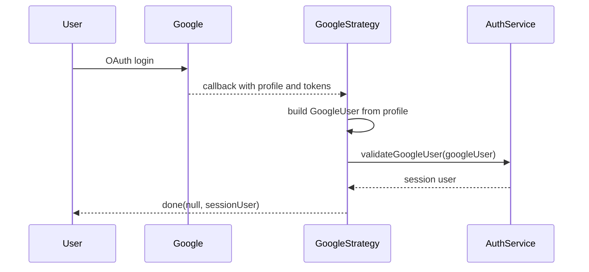

<!-- tyto-docs
tyto_docs: 1
kind: component
unit: backend/src/auth/strategies
title: Strategies
status: draft
written_at_commit: 8283f838bf5461a61796bcaf955a0b402d924ea3
written_at: "2026-09-14T21:06:27.029Z"
research: backend/src/auth/strategies/DOCS/Research.md
sources: []
accepted: null
evidence: Strategies.evidence.md
critic:
  attempts: 0
  findings: []
-->

# Strategies

<!-- tyto-docs:generated:status -->
<!-- /tyto-docs:generated:status -->

## [Summary](Strategies.evidence.md#summary)

The strategies unit owns the backend's Google OAuth authentication strategy. It defines GoogleStrategy, the Passport strategy named 'google', which verifies Google profiles and produces a session user through the auth service. <!-- ev:research.backend-src-auth-strategies.e20cc20a -->[1](Strategies.evidence.md#research.backend-src-auth-strategies.e20cc20a) Dependants can rely on it to turn a verified Google login into a session user with calendar access. <!-- ev:research.backend-src-auth-strategies.c71fd0cb -->[2](Strategies.evidence.md#research.backend-src-auth-strategies.c71fd0cb) <!-- ev:research.backend-src-auth-strategies.74adf96b -->[3](Strategies.evidence.md#research.backend-src-auth-strategies.74adf96b)

## [Purpose and boundaries](Strategies.evidence.md#purpose-and-boundaries)

| | |
|---|---|
| Owns | The Google OAuth strategy: GoogleStrategy, the Passport strategy named 'google', and the GoogleUser shape it produces. <!-- ev:research.backend-src-auth-strategies.e20cc20a -->[1](Strategies.evidence.md#research.backend-src-auth-strategies.e20cc20a) <!-- ev:research.backend-src-auth-strategies.f35d5bfb -->[4](Strategies.evidence.md#research.backend-src-auth-strategies.f35d5bfb) |
| Uses | ConfigService for the OAuth client ID, client secret, and callback URL; AuthService.validateGoogleUser to create or update the user. <!-- ev:research.backend-src-auth-strategies.fe4be2b9 -->[5](Strategies.evidence.md#research.backend-src-auth-strategies.fe4be2b9) <!-- ev:research.backend-src-auth-strategies.c71fd0cb -->[2](Strategies.evidence.md#research.backend-src-auth-strategies.c71fd0cb) |
| Does not own | AuthModule, which imports GoogleStrategy and registers it as a provider for the 'google' flow. <!-- ev:research.backend-src-auth-strategies.f608b6bd -->[6](Strategies.evidence.md#research.backend-src-auth-strategies.f608b6bd) |

## [How it works](Strategies.evidence.md#how-it-works)

GoogleStrategy is constructed with the OAuth client ID, client secret, and callback URL read from ConfigService under google.clientId, google.clientSecret, and google.callbackUrl, each defaulting to an empty string when unset. <!-- ev:research.backend-src-auth-strategies.fe4be2b9 -->[5](Strategies.evidence.md#research.backend-src-auth-strategies.fe4be2b9) It requests the scopes 'email', 'profile', and full calendar access, so a successful login carries the tokens needed to read and write calendar data. <!-- ev:research.backend-src-auth-strategies.74adf96b -->[3](Strategies.evidence.md#research.backend-src-auth-strategies.74adf96b)

On the OAuth callback, validate builds a GoogleUser from the verified profile, defaulting email, firstName, lastName, and picture to empty strings when the profile omits them, and passing the access and refresh tokens through. <!-- ev:research.backend-src-auth-strategies.88d6a03e -->[7](Strategies.evidence.md#research.backend-src-auth-strategies.88d6a03e) It then delegates user creation or update to AuthService.validateGoogleUser and completes the Passport verification callback with the resulting session user. <!-- ev:research.backend-src-auth-strategies.c71fd0cb -->[2](Strategies.evidence.md#research.backend-src-auth-strategies.c71fd0cb)

## [Interfaces](Strategies.evidence.md#interfaces)

| Name | Input | Output | Guarantee |
|---|---|---|---|
| GoogleStrategy | OAuth client ID, client secret, and callback URL from ConfigService; verified Google profile with tokens | Session user via the Passport verification callback | Registers the Passport strategy named 'google' and produces a session user from a verified Google profile through AuthService <!-- ev:research.backend-src-auth-strategies.e20cc20a -->[1](Strategies.evidence.md#research.backend-src-auth-strategies.e20cc20a) <!-- ev:research.backend-src-auth-strategies.c71fd0cb -->[2](Strategies.evidence.md#research.backend-src-auth-strategies.c71fd0cb) |
| GoogleUser | — | A Google-authenticated user shape | Describes a Google user with email, firstName, lastName, picture, accessToken, and optional refreshToken <!-- ev:research.backend-src-auth-strategies.f35d5bfb -->[4](Strategies.evidence.md#research.backend-src-auth-strategies.f35d5bfb) |

<!-- tyto-docs:generated:endpoints -->
<!-- /tyto-docs:generated:endpoints -->

## Source files

<!-- tyto-docs:generated:file-table -->
<!-- /tyto-docs:generated:file-table -->

## [Dependencies](Strategies.evidence.md#dependencies)

| Dependency | Capability used | Why |
|---|---|---|
| passport-google-oauth20 | Google OAuth 2.0 strategy base and verified profile | Provides the Strategy class GoogleStrategy extends and the profile it reads in validate <!-- ev:research.backend-src-auth-strategies.e20cc20a -->[1](Strategies.evidence.md#research.backend-src-auth-strategies.e20cc20a) <!-- ev:research.backend-src-auth-strategies.88d6a03e -->[7](Strategies.evidence.md#research.backend-src-auth-strategies.88d6a03e) |
| @nestjs/passport | PassportStrategy base and strategy registration | Registers GoogleStrategy as the Passport strategy named 'google' <!-- ev:research.backend-src-auth-strategies.e20cc20a -->[1](Strategies.evidence.md#research.backend-src-auth-strategies.e20cc20a) |
| @nestjs/config | ConfigService | Supplies the OAuth client ID, client secret, and callback URL <!-- ev:research.backend-src-auth-strategies.fe4be2b9 -->[5](Strategies.evidence.md#research.backend-src-auth-strategies.fe4be2b9) |
| AuthService (auth unit) | validateGoogleUser | Creates or updates the user and returns the session user <!-- ev:research.backend-src-auth-strategies.c71fd0cb -->[2](Strategies.evidence.md#research.backend-src-auth-strategies.c71fd0cb) |

<!-- tyto-docs:generated:module-graph -->
<!-- /tyto-docs:generated:module-graph -->

## [Data model](Strategies.evidence.md#data-model)

This unit declares the GoogleUser interface, the shape of a Google-authenticated user that the strategy builds and passes to the auth service. <!-- ev:research.backend-src-auth-strategies.f35d5bfb -->[4](Strategies.evidence.md#research.backend-src-auth-strategies.f35d5bfb)

<!-- tyto-docs:generated:erd -->
<!-- /tyto-docs:generated:erd -->

## [Decisions and limitations](Strategies.evidence.md#decisions-and-limitations)

GoogleStrategy requests the scopes 'email', 'profile', 'https://www.googleapis.com/auth/calendar', and 'https://www.googleapis.com/auth/calendar.events', granting full calendar access to every user who logs in through it. <!-- ev:research.backend-src-auth-strategies.74adf96b -->[3](Strategies.evidence.md#research.backend-src-auth-strategies.74adf96b)

The constructor reads the OAuth client ID, client secret, and callback URL from ConfigService, defaulting each to an empty string when the value is unset. <!-- ev:research.backend-src-auth-strategies.fe4be2b9 -->[5](Strategies.evidence.md#research.backend-src-auth-strategies.fe4be2b9)

<!-- tyto-docs:generated:navigation -->
<!-- /tyto-docs:generated:navigation -->