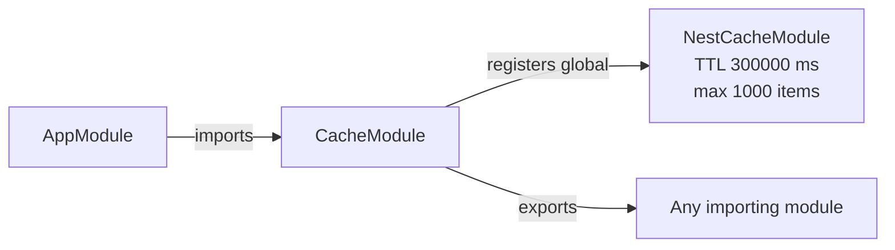

<!-- tyto-docs
tyto_docs: 1
kind: component
unit: backend/src/cache
title: Cache
status: current
written_at_commit: 12c5e7b16be2baac7c5670143d541fb2133d8bb1
written_at: "2026-09-14T11:12:14.558Z"
research: backend/src/cache/DOCS/Research.md
sources: []
accepted:
  at: "2026-09-14T11:15:18.540Z"
  commit: 12c5e7b16be2baac7c5670143d541fb2133d8bb1
  research_fingerprint: "sha256:dd6a40ce76485caaa8b1e9f13eeeffd5b51588662e9a24e1746332e1c38f0019"
  research_findings:
    - research.backend-src-cache.1712b9b5
    - research.backend-src-cache.3854dd3f
    - research.backend-src-cache.7f2e5345
    - research.backend-src-cache.c6629710
  critic_pass: critic.backend-src-cache.1
  sources:
    - path: backend/src/cache/cache.module.ts
      blob_sha: 8d4e50ec4d37305467b50dc1e0b3ebc24f8d7495
    - path: backend/src/cache/index.ts
      blob_sha: bd12fb1bc37d4bb32c48505f5d7abc88d6ff40ec
evidence: Cache.evidence.md
critic:
  attempts: 1
  findings: []
  review_complete: true
  sections_reviewed: 8
  sections_total: 8
  last_reviewed_document: "sha256:bac80ec31f1f0eb490dec324491636777f8fd98d754450eba26ddb36747bf07a"
  retired: []
-->

# Cache

<!-- tyto-docs:generated:status -->
<!-- /tyto-docs:generated:status -->

## [Summary](Cache.evidence.md#summary)

The cache unit owns the application's shared cache. It exposes a single NestJS module, CacheModule, that registers a global cache with a five-minute default TTL and a one-thousand-item limit. <!-- ev:research.backend-src-cache.7f2e5345 -->[1](Cache.evidence.md#research.backend-src-cache.7f2e5345) Any module that imports CacheModule can use the cache, and the root AppModule already does, making the cache available across the application. <!-- ev:research.backend-src-cache.3854dd3f -->[2](Cache.evidence.md#research.backend-src-cache.3854dd3f) <!-- ev:research.backend-src-cache.c6629710 -->[3](Cache.evidence.md#research.backend-src-cache.c6629710)

## [Purpose and boundaries](Cache.evidence.md#purpose-and-boundaries)

| | |
|---|---|
| Owns | The application-wide cache: a global NestJS cache module with a 5-minute default TTL and a 1000-item maximum, exposed through a public entry point that re-exports CacheModule. <!-- ev:research.backend-src-cache.7f2e5345 -->[1](Cache.evidence.md#research.backend-src-cache.7f2e5345) <!-- ev:research.backend-src-cache.1712b9b5 -->[4](Cache.evidence.md#research.backend-src-cache.1712b9b5) |
| Uses | The @nestjs/cache-manager CacheModule, registered and re-exported so any importing module can use the cache. <!-- ev:research.backend-src-cache.3854dd3f -->[2](Cache.evidence.md#research.backend-src-cache.3854dd3f) |
| Does not own | The root AppModule, which imports CacheModule to make the global cache available to the application. <!-- ev:research.backend-src-cache.c6629710 -->[3](Cache.evidence.md#research.backend-src-cache.c6629710) |

## [How it works](Cache.evidence.md#how-it-works)

AppModule imports CacheModule from './cache/cache.module.js' and includes it in its module imports, making the global cache available to the application. <!-- ev:research.backend-src-cache.c6629710 -->[3](Cache.evidence.md#research.backend-src-cache.c6629710) CacheModule registers the @nestjs/cache-manager CacheModule as a global module with a default TTL of 300000 milliseconds (5 minutes) and a maximum of 1000 cached items. <!-- ev:research.backend-src-cache.7f2e5345 -->[1](Cache.evidence.md#research.backend-src-cache.7f2e5345)

CacheModule exports the registered NestCacheModule, so any module that imports CacheModule can use the cache. <!-- ev:research.backend-src-cache.3854dd3f -->[2](Cache.evidence.md#research.backend-src-cache.3854dd3f) The unit's public entry point, index.ts, re-exports CacheModule from './cache.module.js'. <!-- ev:research.backend-src-cache.1712b9b5 -->[4](Cache.evidence.md#research.backend-src-cache.1712b9b5)

## [Interfaces](Cache.evidence.md#interfaces)

| Name | Input | Output | Guarantee |
|---|---|---|---|
| CacheModule | none — a NestJS module class | A global cache module | Registers a global cache with a 5-minute default TTL and a 1000-item maximum; any module that imports it can use the cache <!-- ev:research.backend-src-cache.7f2e5345 -->[1](Cache.evidence.md#research.backend-src-cache.7f2e5345) <!-- ev:research.backend-src-cache.3854dd3f -->[2](Cache.evidence.md#research.backend-src-cache.3854dd3f) |

<!-- tyto-docs:generated:endpoints -->
<!-- /tyto-docs:generated:endpoints -->

## Source files

<!-- tyto-docs:generated:file-table -->
<!-- /tyto-docs:generated:file-table -->

## [Dependencies](Cache.evidence.md#dependencies)

| Dependency | Capability used | Why |
|---|---|---|
| @nestjs/cache-manager | Global cache module with configurable TTL and item limit | Provides the cache infrastructure CacheModule registers and re-exports <!-- ev:research.backend-src-cache.7f2e5345 -->[1](Cache.evidence.md#research.backend-src-cache.7f2e5345) <!-- ev:research.backend-src-cache.3854dd3f -->[2](Cache.evidence.md#research.backend-src-cache.3854dd3f) |

<!-- tyto-docs:generated:module-graph -->
<!-- /tyto-docs:generated:module-graph -->

## [Data model](Cache.evidence.md#data-model)

This module declares and references no entities (inference: the research records none for this unit). It only configures the shared cache infrastructure. <!-- ev:research.backend-src-cache.7f2e5345 -->[1](Cache.evidence.md#research.backend-src-cache.7f2e5345)

<!-- tyto-docs:generated:erd -->
<!-- /tyto-docs:generated:erd -->

## [Decisions and limitations](Cache.evidence.md#decisions-and-limitations)

CacheModule applies a default TTL of 300000 milliseconds (5 minutes) and a maximum of 1000 cached items to every entry that does not override them. <!-- ev:research.backend-src-cache.7f2e5345 -->[1](Cache.evidence.md#research.backend-src-cache.7f2e5345)

<!-- tyto-docs:generated:navigation -->
<!-- /tyto-docs:generated:navigation -->