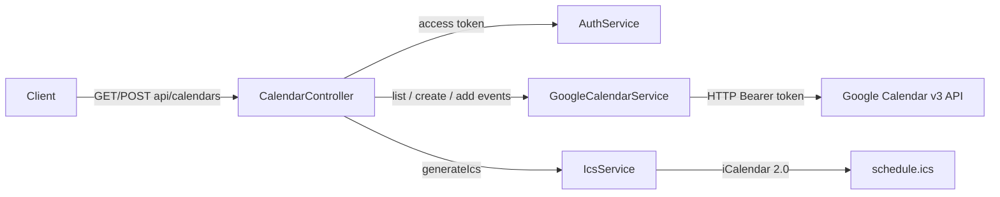
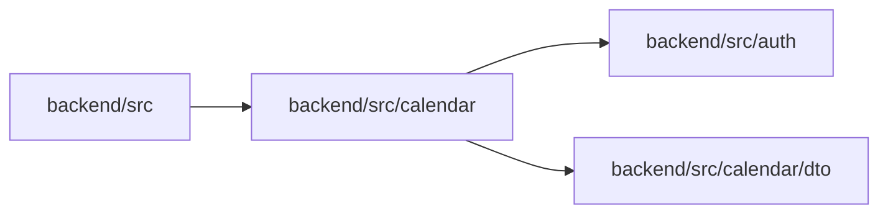

<!-- tyto-docs
tyto_docs: 1
kind: component
unit: backend/src/calendar
title: Calendar
status: draft
written_at_commit: 9072fd689c6aa324b48baef4b5dadf7b85494024
written_at: "2026-09-15T09:19:13.680Z"
research: backend/src/calendar/DOCS/Research.md
sources: []
accepted: null
evidence: Calendar.evidence.md
critic:
  attempts: 1
  findings:
    - key: critic.backend-src-calendar.d281e397
      owner: writer
      claim: "The 'Does not own' row states 'the DTO classes, which live in the sibling dto unit', but no research finding for this unit supports where the DTOs live or a 'dto unit' relationship: the cited findings (research.backend-src-calendar.bf5a6451, research.backend-src-calendar.2dca828d) only establish that GoogleCalendarService is a client of the Google Calendar v3 API and that listCalendars maps items to a CalendarDto. The DTOs actually live in the nested unit backend/src/calendar/dto (inside this unit's own directory), not a sibling unit. Per the contract's inference convention, the claim must be marked as inference or removed, and 'sibling' is inaccurate. The same unsupported 'dto unit' reference recurs in the 'Uses' row and the Data model section."
      locus:
        document_section: "Purpose and boundaries"
      severity: blocking
      raised_at: "2026-09-15T11:19:00Z"
      raised_in_pass: w0
    - key: critic.backend-src-calendar.0db986b0
      owner: writer
      claim: "The Dependencies table lists a 'dto unit' dependency row ('dto unit | CalendarDto, CalendarListDto, CreateCalendarDto, AddEventsDto, GenerateIcsDto, and EventConfigDto | Types the endpoints and the payloads the services exchange with Google'), but the calendar unit's research records no dependency on a dto unit and none of the cited findings (research.backend-src-calendar.ff0005af, research.backend-src-calendar.a993a83c, research.backend-src-calendar.fa2d817c, research.backend-src-calendar.884e28b4, research.backend-src-calendar.2dca828d, research.backend-src-calendar.803ee401, research.backend-src-calendar.441cec18) mention a dto unit. Per the contract's inference convention, the dependency claim must be marked as inference or removed."
      locus:
        document_section: Dependencies
      severity: blocking
      raised_at: "2026-09-15T11:19:00Z"
      raised_in_pass: w0
  review_complete: true
  sections_reviewed: 8
  sections_total: 8
  last_reviewed_document: "sha256:0e5bdea500bacc522ef73eab0f0492ecdabf743a907aac8cf01221ab44070263"
-->

# Calendar

<!-- tyto-docs:generated:status -->
> **Status: Draft**
<!-- /tyto-docs:generated:status -->

## [Summary](Calendar.evidence.md#summary)

The calendar unit owns CalendarModule, CalendarController, GoogleCalendarService, and IcsService — the NestJS module, controller, and services that expose Google Calendar through the backend API. It lists and creates calendars, adds parsed schedule events, and generates ICS files, authenticating every call with the user's OAuth access token. <!-- ev:research.backend-src-calendar.c393c430 -->[1](Calendar.evidence.md#research.backend-src-calendar.c393c430) A dependant can rely on the module's endpoints to manage calendars and produce iCalendar 2.0 documents. <!-- ev:research.backend-src-calendar.28d61066 -->[2](Calendar.evidence.md#research.backend-src-calendar.28d61066)

## [Purpose and boundaries](Calendar.evidence.md#purpose-and-boundaries)

| | |
|---|---|
| Owns | CalendarModule, the NestJS module wiring HttpModule and AuthModule into the unit; CalendarController, the 'api'-prefixed, Swagger-tagged controller; GoogleCalendarService, the Google Calendar v3 REST client; IcsService, the iCalendar 2.0 generator; and the index.ts barrel re-exporting all four. <!-- ev:research.backend-src-calendar.c393c430 -->[1](Calendar.evidence.md#research.backend-src-calendar.c393c430) <!-- ev:research.backend-src-calendar.2b59ee2e -->[3](Calendar.evidence.md#research.backend-src-calendar.2b59ee2e) <!-- ev:research.backend-src-calendar.bf5a6451 -->[4](Calendar.evidence.md#research.backend-src-calendar.bf5a6451) <!-- ev:research.backend-src-calendar.28d61066 -->[2](Calendar.evidence.md#research.backend-src-calendar.28d61066) <!-- ev:research.backend-src-calendar.eb000815 -->[5](Calendar.evidence.md#research.backend-src-calendar.eb000815) |
| Uses | AuthService and AuthModule to read the user's OAuth access token from the session, ConfigService for the semester environment variables, HttpService for calls to the Google Calendar v3 REST API, and the calendar DTOs from the dto unit. <!-- ev:research.backend-src-calendar.f2fecd25 -->[6](Calendar.evidence.md#research.backend-src-calendar.f2fecd25) <!-- ev:research.backend-src-calendar.d59aaf87 -->[7](Calendar.evidence.md#research.backend-src-calendar.d59aaf87) <!-- ev:research.backend-src-calendar.bf5a6451 -->[4](Calendar.evidence.md#research.backend-src-calendar.bf5a6451) <!-- ev:research.backend-src-calendar.2dca828d -->[8](Calendar.evidence.md#research.backend-src-calendar.2dca828d) |
| Does not own | The Google Calendar v3 API itself, of which GoogleCalendarService is a client, and the DTO classes, which live in the sibling dto unit. <!-- ev:research.backend-src-calendar.bf5a6451 -->[4](Calendar.evidence.md#research.backend-src-calendar.bf5a6451) <!-- ev:research.backend-src-calendar.2dca828d -->[8](Calendar.evidence.md#research.backend-src-calendar.2dca828d) |

## [How it works](Calendar.evidence.md#how-it-works)

CalendarModule imports HttpModule and AuthModule, registers CalendarController as its controller, and provides and exports GoogleCalendarService and IcsService. <!-- ev:research.backend-src-calendar.c393c430 -->[1](Calendar.evidence.md#research.backend-src-calendar.c393c430) CalendarController is mapped to the 'api' route prefix, tagged 'Calendar' in Swagger, and depends on GoogleCalendarService, IcsService, AuthService, and ConfigService. <!-- ev:research.backend-src-calendar.2b59ee2e -->[3](Calendar.evidence.md#research.backend-src-calendar.2b59ee2e)

The controller exposes four endpoints. GET api/calendars returns the authenticated user's Google calendars as a CalendarListDto; POST api/calendars creates a calendar from a CreateCalendarDto and returns the created CalendarDto; POST api/calendars/events adds parsed schedule events; and POST api/generate/ics generates an ICS file sent as a text/calendar attachment named schedule.ics. <!-- ev:research.backend-src-calendar.ff0005af -->[9](Calendar.evidence.md#research.backend-src-calendar.ff0005af) <!-- ev:research.backend-src-calendar.a993a83c -->[10](Calendar.evidence.md#research.backend-src-calendar.a993a83c) <!-- ev:research.backend-src-calendar.fa2d817c -->[11](Calendar.evidence.md#research.backend-src-calendar.fa2d817c) <!-- ev:research.backend-src-calendar.884e28b4 -->[12](Calendar.evidence.md#research.backend-src-calendar.884e28b4)

When addEvents or generateIcs receive recurring (lecture) events without semester dates, getCurrentSemesterInfo derives the current semester from the FIRST_SEMESTER_START, FIRST_SEMESTER_END, SECOND_SEMESTER_START, and SECOND_SEMESTER_END environment variables and filters events to the detected semester, throwing a 400 MISSING_SEMESTER_DATES HttpException when the semester cannot be determined automatically. <!-- ev:research.backend-src-calendar.fa2d817c -->[11](Calendar.evidence.md#research.backend-src-calendar.fa2d817c) <!-- ev:research.backend-src-calendar.d59aaf87 -->[7](Calendar.evidence.md#research.backend-src-calendar.d59aaf87) getAccessToken reads the access token from the request's session user via AuthService.getAccessToken and throws a 401 GOOGLE_AUTH_REQUIRED HttpException when it is missing. <!-- ev:research.backend-src-calendar.f2fecd25 -->[6](Calendar.evidence.md#research.backend-src-calendar.f2fecd25)

GoogleCalendarService calls the Google Calendar v3 REST API at https://www.googleapis.com/calendar/v3 through HttpService, authenticating with the user's OAuth access token as a Bearer token. <!-- ev:research.backend-src-calendar.bf5a6451 -->[4](Calendar.evidence.md#research.backend-src-calendar.bf5a6451) listCalendars fetches GET /users/me/calendarList and maps each item to a CalendarDto; createCalendar POSTs to /calendars with the name as summary; addEvents posts each event to POST /calendars/{calendarId}/events sequentially to avoid rate limiting, delegating errors to handleGoogleApiError. <!-- ev:research.backend-src-calendar.2dca828d -->[8](Calendar.evidence.md#research.backend-src-calendar.2dca828d) <!-- ev:research.backend-src-calendar.803ee401 -->[13](Calendar.evidence.md#research.backend-src-calendar.803ee401) <!-- ev:research.backend-src-calendar.441cec18 -->[14](Calendar.evidence.md#research.backend-src-calendar.441cec18)

convertToGoogleEvent routes recurring events to createRecurringGoogleEvent, which builds a weekly event with an RRULE of FREQ=WEEKLY;BYDAY=<day code>;UNTIL=<semester end>, local dateTime values, and the Africa/Johannesburg timezone, starting on the first occurrence of the event's weekday on or after the semester start; non-recurring events go to createSingleGoogleEvent, a one-time event with the notes as description when present. <!-- ev:research.backend-src-calendar.ded478de -->[15](Calendar.evidence.md#research.backend-src-calendar.ded478de) <!-- ev:research.backend-src-calendar.2e7a14c2 -->[16](Calendar.evidence.md#research.backend-src-calendar.2e7a14c2) <!-- ev:research.backend-src-calendar.445c10fa -->[17](Calendar.evidence.md#research.backend-src-calendar.445c10fa)

toLocalISOString formats dates without UTC conversion because the Google Calendar API expects local time when a timeZone is specified, and getFirstOccurrence defaults to Monday when the day name is not recognised. <!-- ev:research.backend-src-calendar.441f9b4d -->[18](Calendar.evidence.md#research.backend-src-calendar.441f9b4d) <!-- ev:research.backend-src-calendar.8674fc85 -->[19](Calendar.evidence.md#research.backend-src-calendar.8674fc85)

handleGoogleApiError converts Google API errors into HttpExceptions carrying the CALENDAR_API_ERROR code, mapping a 401 to 'Google authentication expired. Please re-authenticate.' and falling back to 500 INTERNAL_SERVER_ERROR. <!-- ev:research.backend-src-calendar.195d974f -->[20](Calendar.evidence.md#research.backend-src-calendar.195d974f)

IcsService.generateIcs produces a complete iCalendar 2.0 document — BEGIN:VCALENDAR, VERSION:2.0, PRODID:-//UP Schedule Generator//EN, CALSCALE:GREGORIAN, METHOD:PUBLISH — with one VEVENT per event joined by CRLF, throwing an Error when a recurring event lacks semester dates. <!-- ev:research.backend-src-calendar.28d61066 -->[2](Calendar.evidence.md#research.backend-src-calendar.28d61066) Recurring events emit a VEVENT with a UID of <event id>@upschedulegen, DTSTAMP, DTSTART and DTEND, an RRULE of FREQ=WEEKLY;BYDAY=<day code>;UNTIL=<semester end date>, and escaped SUMMARY and LOCATION lines; single events omit the RRULE and add a DESCRIPTION from the notes when present. <!-- ev:research.backend-src-calendar.1b1f83ae -->[21](Calendar.evidence.md#research.backend-src-calendar.1b1f83ae) <!-- ev:research.backend-src-calendar.0209c422 -->[22](Calendar.evidence.md#research.backend-src-calendar.0209c422)

formatDateTime, formatDateOnly, and formatNow produce the YYYYMMDDTHHMMSS, YYYYMMDD, and YYYYMMDDTHHMMSSZ values, and escapeText escapes backslashes, semicolons, commas, and newlines. <!-- ev:research.backend-src-calendar.a1449049 -->[23](Calendar.evidence.md#research.backend-src-calendar.a1449049) <!-- ev:research.backend-src-calendar.bc3e9708 -->[24](Calendar.evidence.md#research.backend-src-calendar.bc3e9708) <!-- ev:research.backend-src-calendar.cddcfa48 -->[25](Calendar.evidence.md#research.backend-src-calendar.cddcfa48) <!-- ev:research.backend-src-calendar.913fffb6 -->[26](Calendar.evidence.md#research.backend-src-calendar.913fffb6) The index.ts barrel re-exports CalendarModule, GoogleCalendarService, IcsService, and the DTO index. <!-- ev:research.backend-src-calendar.eb000815 -->[5](Calendar.evidence.md#research.backend-src-calendar.eb000815)

## [Interfaces](Calendar.evidence.md#interfaces)

| Name | Input | Output | Guarantee |
|---|---|---|---|
| GET api/calendars (listCalendars) | Authenticated request | CalendarListDto | Returns the user's Google calendars as a calendars array <!-- ev:research.backend-src-calendar.ff0005af -->[9](Calendar.evidence.md#research.backend-src-calendar.ff0005af) |
| POST api/calendars (createCalendar) | CreateCalendarDto | CalendarDto | Creates a Google Calendar from a name and optional description <!-- ev:research.backend-src-calendar.a993a83c -->[10](Calendar.evidence.md#research.backend-src-calendar.a993a83c) |
| POST api/calendars/events (addEvents) | AddEventsDto | — | Adds parsed schedule events, deriving semester dates when missing <!-- ev:research.backend-src-calendar.fa2d817c -->[11](Calendar.evidence.md#research.backend-src-calendar.fa2d817c) |
| POST api/generate/ics (generateIcs) | GenerateIcsDto | text/calendar attachment schedule.ics | Generates an ICS file with the same semester handling as addEvents <!-- ev:research.backend-src-calendar.884e28b4 -->[12](Calendar.evidence.md#research.backend-src-calendar.884e28b4) |
| GoogleCalendarService.listCalendars | access token | CalendarDto[] | Fetches GET /users/me/calendarList and maps each item <!-- ev:research.backend-src-calendar.2dca828d -->[8](Calendar.evidence.md#research.backend-src-calendar.2dca828d) |
| GoogleCalendarService.createCalendar | access token, name, description? | CalendarDto | Creates a calendar via POST /calendars <!-- ev:research.backend-src-calendar.803ee401 -->[13](Calendar.evidence.md#research.backend-src-calendar.803ee401) |
| GoogleCalendarService.addEvents | access token, calendarId, events, semester dates? | void | Posts events sequentially to avoid rate limiting <!-- ev:research.backend-src-calendar.441cec18 -->[14](Calendar.evidence.md#research.backend-src-calendar.441cec18) |
| IcsService.generateIcs | events, semester dates? | iCalendar 2.0 string | Produces a complete ICS document with one VEVENT per event <!-- ev:research.backend-src-calendar.28d61066 -->[2](Calendar.evidence.md#research.backend-src-calendar.28d61066) |

<!-- tyto-docs:generated:endpoints -->
<!-- No framework adapter is active, so no endpoints were extracted for this unit. -->
<!-- /tyto-docs:generated:endpoints -->

## Source files

<!-- tyto-docs:generated:file-table -->
<!-- This unit owns no source files. -->
<!-- /tyto-docs:generated:file-table -->

## [Dependencies](Calendar.evidence.md#dependencies)

| Dependency | Capability used | Why |
|---|---|---|
| HttpModule and HttpService | HTTP calls to the Google Calendar v3 REST API | Sends calendar list, create, and event requests authenticated with the user's Bearer token <!-- ev:research.backend-src-calendar.bf5a6451 -->[4](Calendar.evidence.md#research.backend-src-calendar.bf5a6451) <!-- ev:research.backend-src-calendar.2dca828d -->[8](Calendar.evidence.md#research.backend-src-calendar.2dca828d) <!-- ev:research.backend-src-calendar.803ee401 -->[13](Calendar.evidence.md#research.backend-src-calendar.803ee401) <!-- ev:research.backend-src-calendar.441cec18 -->[14](Calendar.evidence.md#research.backend-src-calendar.441cec18) |
| AuthModule and AuthService | OAuth access token from the session user | Authenticates every calendar operation against Google <!-- ev:research.backend-src-calendar.c393c430 -->[1](Calendar.evidence.md#research.backend-src-calendar.c393c430) <!-- ev:research.backend-src-calendar.f2fecd25 -->[6](Calendar.evidence.md#research.backend-src-calendar.f2fecd25) |
| ConfigService | Semester environment variables | Derives the current semester for recurring events when semester dates are missing <!-- ev:research.backend-src-calendar.d59aaf87 -->[7](Calendar.evidence.md#research.backend-src-calendar.d59aaf87) <!-- ev:research.backend-src-calendar.fa2d817c -->[11](Calendar.evidence.md#research.backend-src-calendar.fa2d817c) |
| dto unit | CalendarDto, CalendarListDto, CreateCalendarDto, AddEventsDto, GenerateIcsDto, and EventConfigDto | Types the endpoints and the payloads the services exchange with Google <!-- ev:research.backend-src-calendar.ff0005af -->[9](Calendar.evidence.md#research.backend-src-calendar.ff0005af) <!-- ev:research.backend-src-calendar.a993a83c -->[10](Calendar.evidence.md#research.backend-src-calendar.a993a83c) <!-- ev:research.backend-src-calendar.fa2d817c -->[11](Calendar.evidence.md#research.backend-src-calendar.fa2d817c) <!-- ev:research.backend-src-calendar.884e28b4 -->[12](Calendar.evidence.md#research.backend-src-calendar.884e28b4) <!-- ev:research.backend-src-calendar.2dca828d -->[8](Calendar.evidence.md#research.backend-src-calendar.2dca828d) <!-- ev:research.backend-src-calendar.803ee401 -->[13](Calendar.evidence.md#research.backend-src-calendar.803ee401) <!-- ev:research.backend-src-calendar.441cec18 -->[14](Calendar.evidence.md#research.backend-src-calendar.441cec18) |

<!-- tyto-docs:generated:module-graph -->

<!-- /tyto-docs:generated:module-graph -->

## [Data model](Calendar.evidence.md#data-model)

The unit declares no entities of its own; it references the DTOs from the dto unit — EventConfigDto for events, CalendarDto and CalendarListDto for calendar responses, CreateCalendarDto for creation, AddEventsDto for adding events, and GenerateIcsDto for ICS generation. <!-- ev:research.backend-src-calendar.2dca828d -->[8](Calendar.evidence.md#research.backend-src-calendar.2dca828d) <!-- ev:research.backend-src-calendar.ff0005af -->[9](Calendar.evidence.md#research.backend-src-calendar.ff0005af) <!-- ev:research.backend-src-calendar.a993a83c -->[10](Calendar.evidence.md#research.backend-src-calendar.a993a83c) <!-- ev:research.backend-src-calendar.fa2d817c -->[11](Calendar.evidence.md#research.backend-src-calendar.fa2d817c) <!-- ev:research.backend-src-calendar.884e28b4 -->[12](Calendar.evidence.md#research.backend-src-calendar.884e28b4) <!-- ev:research.backend-src-calendar.803ee401 -->[13](Calendar.evidence.md#research.backend-src-calendar.803ee401) <!-- ev:research.backend-src-calendar.441cec18 -->[14](Calendar.evidence.md#research.backend-src-calendar.441cec18)

<!-- tyto-docs:generated:erd -->
<!-- This leaf unit has no descendant scope for a focused ERD. -->
<!-- /tyto-docs:generated:erd -->

## [Decisions and limitations](Calendar.evidence.md#decisions-and-limitations)

Events are posted to the Google Calendar API sequentially to avoid rate limiting. <!-- ev:research.backend-src-calendar.441cec18 -->[14](Calendar.evidence.md#research.backend-src-calendar.441cec18) Dates are formatted as local time without UTC conversion because the Google Calendar API expects local time when a timeZone is specified. <!-- ev:research.backend-src-calendar.441f9b4d -->[18](Calendar.evidence.md#research.backend-src-calendar.441f9b4d) When recurring events arrive without semester dates, the controller derives the semester from environment variables and throws a 400 MISSING_SEMESTER_DATES error when it cannot be determined. <!-- ev:research.backend-src-calendar.fa2d817c -->[11](Calendar.evidence.md#research.backend-src-calendar.fa2d817c) A 401 Google API error surfaces as 'Google authentication expired. Please re-authenticate.' <!-- ev:research.backend-src-calendar.195d974f -->[20](Calendar.evidence.md#research.backend-src-calendar.195d974f)

<!-- tyto-docs:generated:navigation -->
- **Direct dependencies:** [Calendar dto](../dto/DOCS/Dto.md)
- **Used by:** [Src](../../DOCS/Src.md)
- **Schedule:** 7 of 43, wave 1
<!-- /tyto-docs:generated:navigation -->