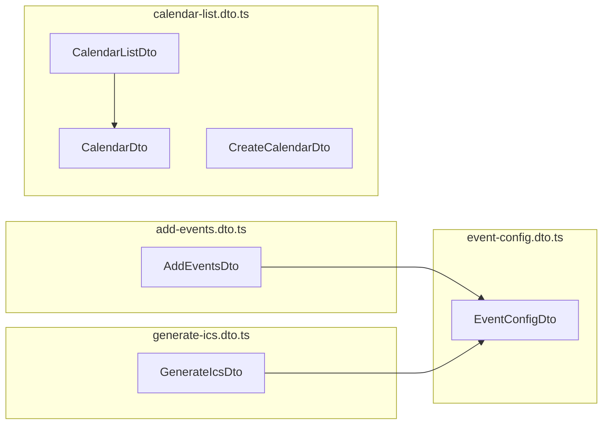

<!-- tyto-docs
tyto_docs: 1
kind: component
unit: backend/src/calendar/dto
title: Dto
status: current
written_at_commit: d4a98ce4d5db0c84aaf2eb4955255bad4ba81104
written_at: "2026-09-15T01:29:11.392Z"
research: backend/src/calendar/dto/DOCS/Research.md
sources: []
accepted:
  at: "2026-09-15T01:36:41.223Z"
  commit: d4a98ce4d5db0c84aaf2eb4955255bad4ba81104
  research_fingerprint: "sha256:2334ab3779071c092342fad22b6da0ff67633c9d71202d1c38f216c058f05235"
  research_findings:
    - research.backend-src-calendar-dto.06060975
    - research.backend-src-calendar-dto.2ad7a509
    - research.backend-src-calendar-dto.36976215
    - research.backend-src-calendar-dto.40e94606
    - research.backend-src-calendar-dto.4410e692
    - research.backend-src-calendar-dto.7e196b5d
    - research.backend-src-calendar-dto.9500b6e7
    - research.backend-src-calendar-dto.9fc660bd
    - research.backend-src-calendar-dto.a1c3c634
    - research.backend-src-calendar-dto.acc9046f
    - research.backend-src-calendar-dto.ba516a14
    - research.backend-src-calendar-dto.d65e12ed
    - research.backend-src-calendar-dto.e0536527
  critic_pass: critic.backend-src-calendar-dto.1
  sources:
    - path: backend/src/calendar/dto/add-events.dto.ts
      blob_sha: 0dabb96985db410a557f72bddf13c712832cd098
    - path: backend/src/calendar/dto/calendar-list.dto.ts
      blob_sha: 4b7274d6b757553a92f92b37f5ef94a1674402cc
    - path: backend/src/calendar/dto/event-config.dto.ts
      blob_sha: 2628724c17133af9f8b4da19e5f784445314e5d4
    - path: backend/src/calendar/dto/generate-ics.dto.ts
      blob_sha: 8a6a6039229d4c457c8dcba4eeea894f3671f07d
    - path: backend/src/calendar/dto/index.ts
      blob_sha: 1e0b1f29e2c5f4788119ce4ab91dc03efcf529df
evidence: Dto.evidence.md
critic:
  attempts: 1
  findings: []
  review_complete: true
  sections_reviewed: 7
  sections_total: 7
  last_reviewed_document: "sha256:b11e0854384453a82e48dbcb914b027ea1512b9c722979e060186d0ce0d08ef3"
  retired: []
-->

# Dto

<!-- tyto-docs:generated:status -->
<!-- /tyto-docs:generated:status -->

## [Summary](Dto.evidence.md#summary)

The dto unit owns the request and response shapes the calendar module exchanges with its callers. It defines the calendar module's data-transfer objects across four files: the event configuration, add-events, calendar-list, and ICS-generation shapes of the calendar flow. <!-- ev:research.backend-src-calendar-dto.acc9046f -->[1](Dto.evidence.md#research.backend-src-calendar-dto.acc9046f) Dependants can rely on these classes to carry Swagger-documented, validated payloads between the calendar controller and its clients. <!-- ev:research.backend-src-calendar-dto.d65e12ed -->[2](Dto.evidence.md#research.backend-src-calendar-dto.d65e12ed)

## [Purpose and boundaries](Dto.evidence.md#purpose-and-boundaries)

| | |
|---|---|
| Owns | The exported DTO classes of the calendar module: AddEventsDto in add-events.dto.ts; CalendarDto, CalendarListDto, and CreateCalendarDto in calendar-list.dto.ts; EventConfigDto in event-config.dto.ts; and GenerateIcsDto in generate-ics.dto.ts, re-exported from index.ts. <!-- ev:research.backend-src-calendar-dto.acc9046f -->[1](Dto.evidence.md#research.backend-src-calendar-dto.acc9046f) <!-- ev:research.backend-src-calendar-dto.ba516a14 -->[3](Dto.evidence.md#research.backend-src-calendar-dto.ba516a14) <!-- ev:research.backend-src-calendar-dto.06060975 -->[4](Dto.evidence.md#research.backend-src-calendar-dto.06060975) <!-- ev:research.backend-src-calendar-dto.2ad7a509 -->[5](Dto.evidence.md#research.backend-src-calendar-dto.2ad7a509) <!-- ev:research.backend-src-calendar-dto.40e94606 -->[6](Dto.evidence.md#research.backend-src-calendar-dto.40e94606) <!-- ev:research.backend-src-calendar-dto.9500b6e7 -->[7](Dto.evidence.md#research.backend-src-calendar-dto.9500b6e7) <!-- ev:research.backend-src-calendar-dto.7e196b5d -->[8](Dto.evidence.md#research.backend-src-calendar-dto.7e196b5d) <!-- ev:research.backend-src-calendar-dto.4410e692 -->[9](Dto.evidence.md#research.backend-src-calendar-dto.4410e692) |
| Uses | @nestjs/swagger's @ApiProperty and @ApiPropertyOptional, class-validator's @IsString, @IsArray, @IsBoolean, @IsDateString, @IsEnum, @IsOptional, @IsUUID, @Matches, and @ValidateNested, class-transformer's @Type, and PdfType from ../../common/types.js. <!-- ev:research.backend-src-calendar-dto.a1c3c634 -->[10](Dto.evidence.md#research.backend-src-calendar-dto.a1c3c634) <!-- ev:research.backend-src-calendar-dto.36976215 -->[11](Dto.evidence.md#research.backend-src-calendar-dto.36976215) |
| Does not own | The calendar controller and services, which import the unit's DTOs to type their endpoints and logic. <!-- ev:research.backend-src-calendar-dto.d65e12ed -->[2](Dto.evidence.md#research.backend-src-calendar-dto.d65e12ed) |

## [How it works](Dto.evidence.md#how-it-works)

event-config.dto.ts declares EventConfigDto, the shape of a single calendar event, with required id (UUID), summary, location, startTime, endTime, isRecurring (boolean), and colorId fields, and optional day, date, notes, and semester fields. <!-- ev:research.backend-src-calendar-dto.9500b6e7 -->[7](Dto.evidence.md#research.backend-src-calendar-dto.9500b6e7) Its id is validated with @IsUUID, and its startTime and endTime with @Matches(/^\d{2}:\d{2}$/) to enforce the HH:MM 24-hour format, with custom validation messages for the time fields. <!-- ev:research.backend-src-calendar-dto.9fc660bd -->[12](Dto.evidence.md#research.backend-src-calendar-dto.9fc660bd)

add-events.dto.ts declares AddEventsDto, the request body for adding events to a Google Calendar: it requires a calendarId string and an events array of EventConfigDto, and optionally accepts semesterStart and semesterEnd ISO date strings and a pdfType from the PdfType enum. <!-- ev:research.backend-src-calendar-dto.ba516a14 -->[3](Dto.evidence.md#research.backend-src-calendar-dto.ba516a14) Its fields are validated with class-validator decorators — @IsString on calendarId, @IsArray with @ValidateNested({ each: true }) and @Type(() => EventConfigDto) on events, @IsOptional @IsDateString on the semester dates, and @IsOptional @IsEnum(PdfType) on pdfType — and every field is documented with @ApiProperty or @ApiPropertyOptional. <!-- ev:research.backend-src-calendar-dto.e0536527 -->[13](Dto.evidence.md#research.backend-src-calendar-dto.e0536527)

generate-ics.dto.ts declares GenerateIcsDto, the request body for generating an ICS file: it requires an events array of EventConfigDto and optionally accepts semesterStart and semesterEnd ISO date strings and a pdfType from the PdfType enum. <!-- ev:research.backend-src-calendar-dto.7e196b5d -->[8](Dto.evidence.md#research.backend-src-calendar-dto.7e196b5d) Both AddEventsDto and GenerateIcsDto type their optional pdfType with PdfType, an enum with LECTURE, TEST, and EXAM members imported from ../../common/types.js. <!-- ev:research.backend-src-calendar-dto.36976215 -->[11](Dto.evidence.md#research.backend-src-calendar-dto.36976215)

calendar-list.dto.ts declares the calendar-list shapes. CalendarDto describes a Google Calendar with required id and summary string fields and optional description string, primary boolean, and backgroundColor string fields. <!-- ev:research.backend-src-calendar-dto.06060975 -->[4](Dto.evidence.md#research.backend-src-calendar-dto.06060975) CalendarListDto wraps a list of calendars in a single required calendars field typed as CalendarDto[] and validated with @IsArray, @ValidateNested({ each: true }), and @Type(() => CalendarDto). <!-- ev:research.backend-src-calendar-dto.2ad7a509 -->[5](Dto.evidence.md#research.backend-src-calendar-dto.2ad7a509) CreateCalendarDto is the request body for creating a new calendar: it requires a name string and optionally accepts a description string. <!-- ev:research.backend-src-calendar-dto.40e94606 -->[6](Dto.evidence.md#research.backend-src-calendar-dto.40e94606)

index.ts re-exports all four DTO modules — event-config.dto.js, add-events.dto.js, calendar-list.dto.js, and generate-ics.dto.js — so the unit's DTOs are importable from a single entry point. <!-- ev:research.backend-src-calendar-dto.4410e692 -->[9](Dto.evidence.md#research.backend-src-calendar-dto.4410e692) All DTO classes use decorators from @nestjs/swagger, class-validator, and class-transformer to document, validate, and transform request and response payloads. <!-- ev:research.backend-src-calendar-dto.a1c3c634 -->[10](Dto.evidence.md#research.backend-src-calendar-dto.a1c3c634)

## [Interfaces](Dto.evidence.md#interfaces)

| Name | Input | Output | Guarantee |
|---|---|---|---|
| EventConfigDto | — | A single calendar event shape | Describes a calendar event with required id (UUID), summary, location, startTime, endTime, isRecurring, and colorId, and optional day, date, notes, and semester <!-- ev:research.backend-src-calendar-dto.9500b6e7 -->[7](Dto.evidence.md#research.backend-src-calendar-dto.9500b6e7) |
| AddEventsDto | — | An add-events request shape | Requires calendarId and an events array of EventConfigDto; optionally accepts semesterStart, semesterEnd, and pdfType <!-- ev:research.backend-src-calendar-dto.ba516a14 -->[3](Dto.evidence.md#research.backend-src-calendar-dto.ba516a14) |
| GenerateIcsDto | — | An ICS-generation request shape | Requires an events array of EventConfigDto; optionally accepts semesterStart, semesterEnd, and pdfType <!-- ev:research.backend-src-calendar-dto.7e196b5d -->[8](Dto.evidence.md#research.backend-src-calendar-dto.7e196b5d) |
| CalendarDto | — | A Google Calendar shape | Describes a calendar with required id and summary and optional description, primary, and backgroundColor <!-- ev:research.backend-src-calendar-dto.06060975 -->[4](Dto.evidence.md#research.backend-src-calendar-dto.06060975) |
| CalendarListDto | — | A calendar-list response shape | Wraps a list of calendars in a single required calendars field typed as CalendarDto[] <!-- ev:research.backend-src-calendar-dto.2ad7a509 -->[5](Dto.evidence.md#research.backend-src-calendar-dto.2ad7a509) |
| CreateCalendarDto | — | A create-calendar request shape | Requires a name and optionally accepts a description <!-- ev:research.backend-src-calendar-dto.40e94606 -->[6](Dto.evidence.md#research.backend-src-calendar-dto.40e94606) |

<!-- tyto-docs:generated:endpoints -->
<!-- /tyto-docs:generated:endpoints -->

## Source files

<!-- tyto-docs:generated:file-table -->
<!-- /tyto-docs:generated:file-table -->

## [Dependencies](Dto.evidence.md#dependencies)

| Dependency | Capability used | Why |
|---|---|---|
| @nestjs/swagger | @ApiProperty and @ApiPropertyOptional decorators | Documents every DTO property for OpenAPI output <!-- ev:research.backend-src-calendar-dto.a1c3c634 -->[10](Dto.evidence.md#research.backend-src-calendar-dto.a1c3c634) |
| class-validator | @IsString, @IsArray, @IsBoolean, @IsDateString, @IsEnum, @IsOptional, @IsUUID, @Matches, and @ValidateNested decorators | Validates request and response payload fields <!-- ev:research.backend-src-calendar-dto.a1c3c634 -->[10](Dto.evidence.md#research.backend-src-calendar-dto.a1c3c634) |
| class-transformer | @Type decorator | Transforms nested DTO properties during validation <!-- ev:research.backend-src-calendar-dto.a1c3c634 -->[10](Dto.evidence.md#research.backend-src-calendar-dto.a1c3c634) |
| ../../common/types.js | PdfType enum with LECTURE, TEST, and EXAM members | Types the optional pdfType field of AddEventsDto and GenerateIcsDto <!-- ev:research.backend-src-calendar-dto.36976215 -->[11](Dto.evidence.md#research.backend-src-calendar-dto.36976215) |

<!-- tyto-docs:generated:module-graph -->
<!-- /tyto-docs:generated:module-graph -->

## [Data model](Dto.evidence.md#data-model)

This unit declares the DTO classes that shape the calendar module's request and response payloads. EventConfigDto is embedded in AddEventsDto and GenerateIcsDto as an array of events, and CalendarDto is embedded in CalendarListDto as an array of calendars. <!-- ev:research.backend-src-calendar-dto.ba516a14 -->[3](Dto.evidence.md#research.backend-src-calendar-dto.ba516a14) <!-- ev:research.backend-src-calendar-dto.7e196b5d -->[8](Dto.evidence.md#research.backend-src-calendar-dto.7e196b5d) <!-- ev:research.backend-src-calendar-dto.2ad7a509 -->[5](Dto.evidence.md#research.backend-src-calendar-dto.2ad7a509)

<!-- tyto-docs:generated:erd -->
<!-- /tyto-docs:generated:erd -->

<!-- tyto-docs:generated:navigation -->
<!-- /tyto-docs:generated:navigation -->