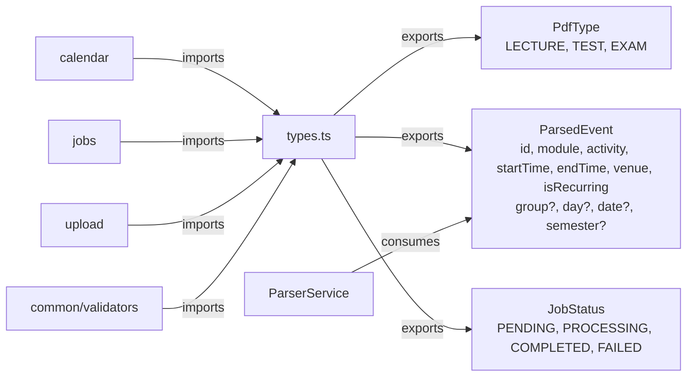
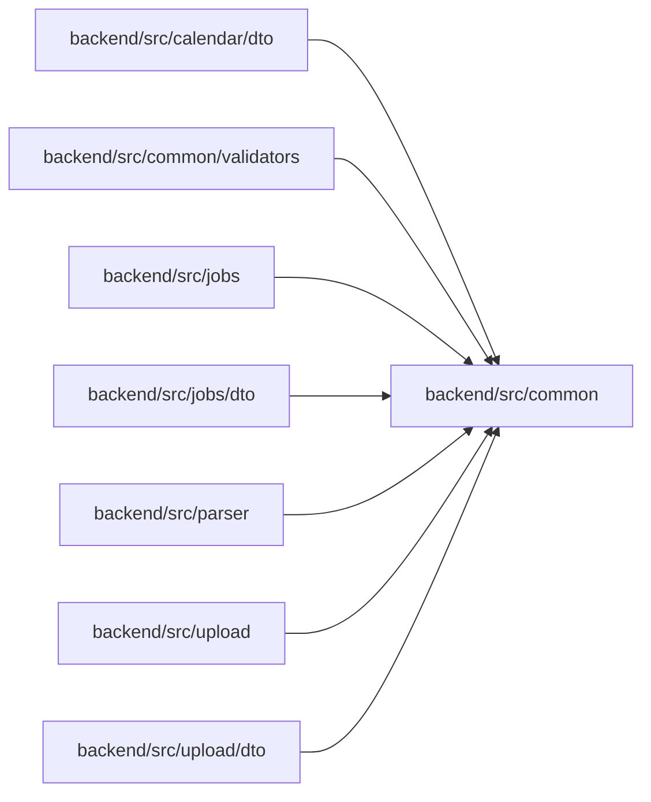

<!-- tyto-docs
tyto_docs: 1
kind: component
unit: backend/src/common
title: Common
status: draft
written_at_commit: 7ac4e88800ee00b386160d620ac8e136f4e91f82
written_at: "2026-09-15T09:54:40.595Z"
research: backend/src/common/DOCS/Research.md
sources: []
accepted: null
evidence: Common.evidence.md
critic:
  attempts: 0
  findings: []
-->

# Common

<!-- tyto-docs:generated:status -->
> **Status: Draft**
<!-- /tyto-docs:generated:status -->

## [Summary](Common.evidence.md#summary)

The common unit owns the shared type declarations the backend's modules depend on: the PdfType enum, the ParsedEvent interface, and the JobStatus enum. <!-- ev:research.backend-src-common.ff5bc729 -->[1](Common.evidence.md#research.backend-src-common.ff5bc729) PdfType classifies the kind of PDF being processed, ParsedEvent is the shape of a parsed calendar event, and JobStatus is the lifecycle state of a processing job. <!-- ev:research.backend-src-common.a5858b7f -->[2](Common.evidence.md#research.backend-src-common.a5858b7f) <!-- ev:research.backend-src-common.f8a0ebc0 -->[3](Common.evidence.md#research.backend-src-common.f8a0ebc0) <!-- ev:research.backend-src-common.b02968d6 -->[4](Common.evidence.md#research.backend-src-common.b02968d6) Nine files across the calendar, jobs, parser, upload, and common/validators units import these declarations. <!-- ev:research.backend-src-common.42ee29f8 -->[5](Common.evidence.md#research.backend-src-common.42ee29f8)

## [Purpose and boundaries](Common.evidence.md#purpose-and-boundaries)

| | |
|---|---|
| Owns | The shared type declarations in types.ts, the unit's only source file: the PdfType enum, the ParsedEvent interface, and the JobStatus enum. <!-- ev:research.backend-src-common.ff5bc729 -->[1](Common.evidence.md#research.backend-src-common.ff5bc729) PdfType's members LECTURE, TEST, and EXAM map to 'lecture', 'test', and 'exam'. <!-- ev:research.backend-src-common.65f47d6a -->[6](Common.evidence.md#research.backend-src-common.65f47d6a) ParsedEvent has required id, module, activity, startTime, endTime, venue, and isRecurring fields and optional group, day, date, and semester fields. <!-- ev:research.backend-src-common.75aee1be -->[7](Common.evidence.md#research.backend-src-common.75aee1be) JobStatus's members PENDING, PROCESSING, COMPLETED, and FAILED map to 'pending', 'processing', 'completed', and 'failed'. <!-- ev:research.backend-src-common.7fb2a50a -->[8](Common.evidence.md#research.backend-src-common.7fb2a50a) |
| Does not own | The parser unit's ParserService and ParserResponse, which consume ParsedEvent as the shape of a parsed event. <!-- ev:research.backend-src-common.f8a0ebc0 -->[3](Common.evidence.md#research.backend-src-common.f8a0ebc0) The calendar, jobs, parser, upload, and common/validators units that import types.ts. <!-- ev:research.backend-src-common.42ee29f8 -->[5](Common.evidence.md#research.backend-src-common.42ee29f8) |

## [How it works](Common.evidence.md#how-it-works)

types.ts is the unit's only source file and exports three declarations: the PdfType enum, the ParsedEvent interface, and the JobStatus enum. <!-- ev:research.backend-src-common.ff5bc729 -->[1](Common.evidence.md#research.backend-src-common.ff5bc729) PdfType classifies the kind of PDF being processed: LECTURE denotes a recurring weekly schedule, TEST a one-time semester test schedule, and EXAM a one-time final exam schedule. <!-- ev:research.backend-src-common.a5858b7f -->[2](Common.evidence.md#research.backend-src-common.a5858b7f) JobStatus represents the lifecycle of a PDF processing job: PENDING means the job is queued and waiting to be processed, PROCESSING means it is being processed by the PDF worker, COMPLETED means it finished successfully, and FAILED means it failed. <!-- ev:research.backend-src-common.b02968d6 -->[4](Common.evidence.md#research.backend-src-common.b02968d6)

The parser unit consumes ParsedEvent as the shape of a parsed event: ParserService.parsePdf returns Promise&lt;ParsedEvent[]&gt; and ParserResponse carries events: ParsedEvent[]. <!-- ev:research.backend-src-common.f8a0ebc0 -->[3](Common.evidence.md#research.backend-src-common.f8a0ebc0) types.ts is imported by nine files across the calendar, jobs, parser, upload, and common/validators units — DTOs, services, a controller, and a validator. <!-- ev:research.backend-src-common.42ee29f8 -->[5](Common.evidence.md#research.backend-src-common.42ee29f8)

## [Interfaces](Common.evidence.md#interfaces)

| Name | Input | Output | Guarantee |
|---|---|---|---|
| PdfType | A PDF kind: LECTURE, TEST, or EXAM | The string values 'lecture', 'test', or 'exam' | Classifies the kind of PDF being processed: LECTURE is a recurring weekly schedule, TEST a one-time semester test schedule, and EXAM a one-time final exam schedule <!-- ev:research.backend-src-common.65f47d6a -->[6](Common.evidence.md#research.backend-src-common.65f47d6a) <!-- ev:research.backend-src-common.a5858b7f -->[2](Common.evidence.md#research.backend-src-common.a5858b7f) |
| ParsedEvent | none — a plain interface with required and optional fields | A parsed calendar event shape | Describes a parsed event with required id, module, activity, startTime, endTime, venue, and isRecurring and optional group, day, date, and semester; usable as the return shape of ParserService.parsePdf and the events field of ParserResponse <!-- ev:research.backend-src-common.75aee1be -->[7](Common.evidence.md#research.backend-src-common.75aee1be) <!-- ev:research.backend-src-common.f8a0ebc0 -->[3](Common.evidence.md#research.backend-src-common.f8a0ebc0) |
| JobStatus | A job lifecycle state: PENDING, PROCESSING, COMPLETED, or FAILED | The string values 'pending', 'processing', 'completed', or 'failed' | Represents the lifecycle of a PDF processing job: queued and waiting, being processed by the PDF worker, finished successfully, or failed <!-- ev:research.backend-src-common.7fb2a50a -->[8](Common.evidence.md#research.backend-src-common.7fb2a50a) <!-- ev:research.backend-src-common.b02968d6 -->[4](Common.evidence.md#research.backend-src-common.b02968d6) |

<!-- tyto-docs:generated:endpoints -->
<!-- No framework adapter is active, so no endpoints were extracted for this unit. -->
<!-- /tyto-docs:generated:endpoints -->

## Source files

<!-- tyto-docs:generated:file-table -->
<!-- This unit owns no source files. -->
<!-- /tyto-docs:generated:file-table -->

## [Dependencies](Common.evidence.md#dependencies)

The research records no external dependencies for this unit: the declarations in types.ts are plain TypeScript enums and an interface. <!-- ev:research.backend-src-common.ff5bc729 -->[1](Common.evidence.md#research.backend-src-common.ff5bc729)

<!-- tyto-docs:generated:module-graph -->

<!-- /tyto-docs:generated:module-graph -->

## [Data model](Common.evidence.md#data-model)

This unit declares three data shapes: the PdfType enum, the ParsedEvent interface, and the JobStatus enum. <!-- ev:research.backend-src-common.ff5bc729 -->[1](Common.evidence.md#research.backend-src-common.ff5bc729) They are shared type declarations imported by nine files across the calendar, jobs, parser, upload, and common/validators units. <!-- ev:research.backend-src-common.42ee29f8 -->[5](Common.evidence.md#research.backend-src-common.42ee29f8)

<!-- tyto-docs:generated:erd -->
<!-- This leaf unit has no descendant scope for a focused ERD. -->
<!-- /tyto-docs:generated:erd -->

<!-- tyto-docs:generated:navigation -->
- **Used by:** [Calendar dto](../../calendar/dto/DOCS/Dto.md), [Validators](../validators/DOCS/Validators.md), [Jobs](../../jobs/DOCS/Jobs.md), [Jobs dto](../../jobs/dto/DOCS/Dto.md), [Parser](../../parser/DOCS/Parser.md), [Src upload](../../upload/DOCS/Upload.md), [Upload dto](../../upload/dto/DOCS/Dto.md)
- **Schedule:** 9 of 43, wave 1
<!-- /tyto-docs:generated:navigation -->