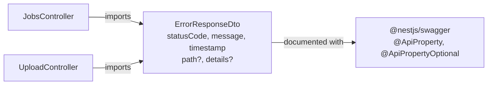
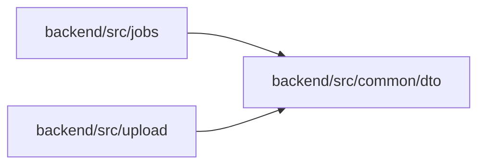

<!-- tyto-docs
tyto_docs: 1
kind: component
unit: backend/src/common/dto
title: Dto
status: draft
written_at_commit: 99b4d2789888aba8808bfab36ccf58919b09bd08
written_at: "2026-09-14T19:18:58.701Z"
research: backend/src/common/dto/DOCS/Research.md
sources: []
accepted: null
evidence: Dto.evidence.md
critic:
  attempts: 0
  findings: []
-->

# Dto

<!-- tyto-docs:generated:status -->
> **Status: Draft**
<!-- /tyto-docs:generated:status -->

## [Summary](Dto.evidence.md#summary)

The dto unit owns the application's shared error-response shape. <!-- ev:research.backend-src-common-dto.d70f62b4 -->[1](Dto.evidence.md#research.backend-src-common-dto.d70f62b4) It defines a single class, ErrorResponseDto, that describes the JSON body of an HTTP error response with three required fields — statusCode, message, and timestamp — and two optional fields — path and details. <!-- ev:research.backend-src-common-dto.3dc17d40 -->[2](Dto.evidence.md#research.backend-src-common-dto.3dc17d40) <!-- ev:research.backend-src-common-dto.de431570 -->[3](Dto.evidence.md#research.backend-src-common-dto.de431570) The jobs and upload controllers use ErrorResponseDto as the type of their @ApiResponse error responses, so API documentation and clients see one consistent error shape. <!-- ev:research.backend-src-common-dto.8be4350b -->[4](Dto.evidence.md#research.backend-src-common-dto.8be4350b)

## [Purpose and boundaries](Dto.evidence.md#purpose-and-boundaries)

| | |
|---|---|
| Owns | The shared HTTP error-response DTO: ErrorResponseDto, a single exported class with required statusCode, message, and timestamp fields and optional path and details fields. <!-- ev:research.backend-src-common-dto.d70f62b4 -->[1](Dto.evidence.md#research.backend-src-common-dto.d70f62b4) <!-- ev:research.backend-src-common-dto.3dc17d40 -->[2](Dto.evidence.md#research.backend-src-common-dto.3dc17d40) <!-- ev:research.backend-src-common-dto.de431570 -->[3](Dto.evidence.md#research.backend-src-common-dto.de431570) |
| Uses | The @nestjs/swagger decorators @ApiProperty and @ApiPropertyOptional, which document each field with a description and example for the OpenAPI schema. <!-- ev:research.backend-src-common-dto.3dc17d40 -->[2](Dto.evidence.md#research.backend-src-common-dto.3dc17d40) <!-- ev:research.backend-src-common-dto.de431570 -->[3](Dto.evidence.md#research.backend-src-common-dto.de431570) |
| Does not own | The jobs and upload controllers, which import ErrorResponseDto and use it as the type of their @ApiResponse error responses. <!-- ev:research.backend-src-common-dto.8be4350b -->[4](Dto.evidence.md#research.backend-src-common-dto.8be4350b) |

## [How it works](Dto.evidence.md#how-it-works)

ErrorResponseDto is a plain TypeScript class exported from error-response.dto.ts, the unit's only source file. <!-- ev:research.backend-src-common-dto.d70f62b4 -->[1](Dto.evidence.md#research.backend-src-common-dto.d70f62b4) It declares five properties: statusCode, message, and timestamp are required and documented with @ApiProperty, while path and details are optional and documented with @ApiPropertyOptional. <!-- ev:research.backend-src-common-dto.3dc17d40 -->[2](Dto.evidence.md#research.backend-src-common-dto.3dc17d40) <!-- ev:research.backend-src-common-dto.de431570 -->[3](Dto.evidence.md#research.backend-src-common-dto.de431570) The decorators come from @nestjs/swagger, so NestJS's OpenAPI generation includes the DTO's shape and examples in the API schema. <!-- ev:research.backend-src-common-dto.3dc17d40 -->[2](Dto.evidence.md#research.backend-src-common-dto.3dc17d40)

The jobs and upload controllers import ErrorResponseDto and reference it as the type of their @ApiResponse error responses, so Swagger documents the error bodies those endpoints return. <!-- ev:research.backend-src-common-dto.8be4350b -->[4](Dto.evidence.md#research.backend-src-common-dto.8be4350b)

## [Interfaces](Dto.evidence.md#interfaces)

| Name | Input | Output | Guarantee |
|---|---|---|---|
| ErrorResponseDto | none — a plain class with five declared properties | An HTTP error-response body shape | Describes error responses with required statusCode, message, and timestamp and optional path and details; usable as the type of @ApiResponse error responses in Swagger <!-- ev:research.backend-src-common-dto.3dc17d40 -->[2](Dto.evidence.md#research.backend-src-common-dto.3dc17d40) <!-- ev:research.backend-src-common-dto.de431570 -->[3](Dto.evidence.md#research.backend-src-common-dto.de431570) <!-- ev:research.backend-src-common-dto.8be4350b -->[4](Dto.evidence.md#research.backend-src-common-dto.8be4350b) |

<!-- tyto-docs:generated:endpoints -->
<!-- No framework adapter is active, so no endpoints were extracted for this unit. -->
<!-- /tyto-docs:generated:endpoints -->

## Source files

<!-- tyto-docs:generated:file-table -->
<!-- This unit owns no source files. -->
<!-- /tyto-docs:generated:file-table -->

## [Dependencies](Dto.evidence.md#dependencies)

| Dependency | Capability used | Why |
|---|---|---|
| @nestjs/swagger | @ApiProperty and @ApiPropertyOptional decorators | Documents each ErrorResponseDto field with a description and example for the OpenAPI schema <!-- ev:research.backend-src-common-dto.3dc17d40 -->[2](Dto.evidence.md#research.backend-src-common-dto.3dc17d40) <!-- ev:research.backend-src-common-dto.de431570 -->[3](Dto.evidence.md#research.backend-src-common-dto.de431570) |

<!-- tyto-docs:generated:module-graph -->

<!-- /tyto-docs:generated:module-graph -->

## [Data model](Dto.evidence.md#data-model)

This unit declares one data shape: ErrorResponseDto, the shared HTTP error-response DTO with required statusCode, message, and timestamp fields and optional path and details fields. <!-- ev:research.backend-src-common-dto.3dc17d40 -->[2](Dto.evidence.md#research.backend-src-common-dto.3dc17d40) <!-- ev:research.backend-src-common-dto.de431570 -->[3](Dto.evidence.md#research.backend-src-common-dto.de431570) It is a transfer object, not a persisted entity.

<!-- tyto-docs:generated:erd -->
<!-- This leaf unit has no descendant scope for a focused ERD. -->
<!-- /tyto-docs:generated:erd -->

<!-- tyto-docs:generated:navigation -->
- **Used by:** [Jobs](../../../jobs/DOCS/Jobs.md)
- **Schedule:** 7 of 30, wave 1
<!-- /tyto-docs:generated:navigation -->