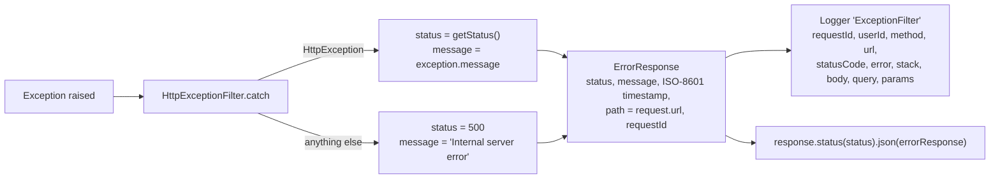
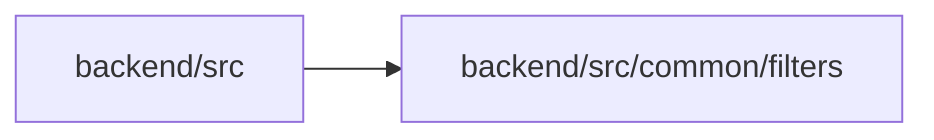

<!-- tyto-docs
tyto_docs: 1
kind: component
unit: backend/src/common/filters
title: Filters
status: draft
written_at_commit: 6ef68f8b90fcc6c4e1481cfad214d2538151a7aa
written_at: "2026-09-14T20:53:34.427Z"
research: backend/src/common/filters/DOCS/Research.md
sources: []
accepted: null
evidence: Filters.evidence.md
critic:
  attempts: 1
  findings:
    - key: critic.backend-src-common-filters.85c531ae
      owner: writer
      claim: "The Data model sentence 'Neither is a persisted entity.' is a claim no research finding supports (no finding addresses persistence) and is not marked as inference, violating the contract's inference convention ('A claim no finding supports is written as inference and says so in the sentence, or it is left out')."
      locus:
        document_section: "Data model"
      severity: blocking
      raised_at: "2026-09-14T20:57:36.000Z"
      raised_in_pass: critic-001
  review_complete: true
  sections_reviewed: 7
  sections_total: 7
  last_reviewed_document: "sha256:16406a3f32f2b4b378d7d2867f419637831245651d5570394ab2739a60b248f3"
-->

# Filters

<!-- tyto-docs:generated:status -->
> **Status: Draft**
<!-- /tyto-docs:generated:status -->

## [Summary](Filters.evidence.md#summary)

The filters unit owns the application's global exception handling. <!-- ev:research.backend-src-common-filters.1f111551 -->[1](Filters.evidence.md#research.backend-src-common-filters.1f111551) It provides a single class, HttpExceptionFilter, that catches every exception raised in the application, turns it into a consistent HTTP error response, and logs it with request context. <!-- ev:research.backend-src-common-filters.1f111551 -->[1](Filters.evidence.md#research.backend-src-common-filters.1f111551) <!-- ev:research.backend-src-common-filters.4bfeab06 -->[2](Filters.evidence.md#research.backend-src-common-filters.4bfeab06) <!-- ev:research.backend-src-common-filters.bda5b518 -->[3](Filters.evidence.md#research.backend-src-common-filters.bda5b518) Registered as a global filter, it applies to every request in the application. <!-- ev:research.backend-src-common-filters.2b8aaaa3 -->[4](Filters.evidence.md#research.backend-src-common-filters.2b8aaaa3)

## [Purpose and boundaries](Filters.evidence.md#purpose-and-boundaries)

| | |
|---|---|
| Owns | The application's global exception filter: HttpExceptionFilter, a single exported class that implements ExceptionFilter and is decorated with @Catch() so it handles every exception raised in the application. <!-- ev:research.backend-src-common-filters.1f111551 -->[1](Filters.evidence.md#research.backend-src-common-filters.1f111551) |
| Uses | NestJS's @Catch() and ExceptionFilter to intercept exceptions, HttpException and HttpStatus to derive the response status and message, and a Logger to record each caught exception with request context. <!-- ev:research.backend-src-common-filters.1f111551 -->[1](Filters.evidence.md#research.backend-src-common-filters.1f111551) <!-- ev:research.backend-src-common-filters.8ad937c6 -->[5](Filters.evidence.md#research.backend-src-common-filters.8ad937c6) <!-- ev:research.backend-src-common-filters.fcc49163 -->[6](Filters.evidence.md#research.backend-src-common-filters.fcc49163) <!-- ev:research.backend-src-common-filters.bda5b518 -->[3](Filters.evidence.md#research.backend-src-common-filters.bda5b518) |
| Does not own | The application bootstrap in backend/src/main.ts, which imports HttpExceptionFilter and registers it as a global filter via app.useGlobalFilters(new HttpExceptionFilter()). <!-- ev:research.backend-src-common-filters.2b8aaaa3 -->[4](Filters.evidence.md#research.backend-src-common-filters.2b8aaaa3) |

## [How it works](Filters.evidence.md#how-it-works)

HttpExceptionFilter is a plain class exported from http-exception.filter.ts, the unit's only source file. <!-- ev:research.backend-src-common-filters.1f111551 -->[1](Filters.evidence.md#research.backend-src-common-filters.1f111551) It is registered as a global filter in backend/src/main.ts, so NestJS routes every exception raised anywhere in the application through its catch method. <!-- ev:research.backend-src-common-filters.2b8aaaa3 -->[4](Filters.evidence.md#research.backend-src-common-filters.2b8aaaa3)

The catch method normalizes any exception into one response shape. An HttpException contributes its own status via getStatus() and its message, while any other exception maps to HttpStatus.INTERNAL_SERVER_ERROR and the literal 'Internal server error', so unexpected failures still produce a well-formed response. <!-- ev:research.backend-src-common-filters.8ad937c6 -->[5](Filters.evidence.md#research.backend-src-common-filters.8ad937c6) <!-- ev:research.backend-src-common-filters.fcc49163 -->[6](Filters.evidence.md#research.backend-src-common-filters.fcc49163) It then builds an ErrorResponse carrying the status code, message, an ISO-8601 timestamp, the request URL as path, and the request's requestId when present. <!-- ev:research.backend-src-common-filters.4bfeab06 -->[2](Filters.evidence.md#research.backend-src-common-filters.4bfeab06)

Before responding, the filter logs every caught exception through a NestJS Logger named 'ExceptionFilter', recording requestId, userId (defaulting to 'anonymous'), method, url, statusCode, error message, stack trace, and the request body, query, and params — so a failure can be traced back to the request that caused it. <!-- ev:research.backend-src-common-filters.bda5b518 -->[3](Filters.evidence.md#research.backend-src-common-filters.bda5b518) Finally it sends the error response to the client with response.status(status).json(errorResponse). <!-- ev:research.backend-src-common-filters.af259114 -->[7](Filters.evidence.md#research.backend-src-common-filters.af259114)

## [Interfaces](Filters.evidence.md#interfaces)

| Name | Input | Output | Guarantee |
|---|---|---|---|
| HttpExceptionFilter | An exception and the ArgumentsHost for the current request | An HTTP error response sent to the client | Catches every exception raised in the application and answers with a consistent ErrorResponse body; registered as a global filter in main.ts <!-- ev:research.backend-src-common-filters.1f111551 -->[1](Filters.evidence.md#research.backend-src-common-filters.1f111551) <!-- ev:research.backend-src-common-filters.2b8aaaa3 -->[4](Filters.evidence.md#research.backend-src-common-filters.2b8aaaa3) <!-- ev:research.backend-src-common-filters.af259114 -->[7](Filters.evidence.md#research.backend-src-common-filters.af259114) |
| ErrorResponse | none — an exported interface with five declared fields | The JSON error-response body shape | Describes error responses with required statusCode, message, and timestamp and optional path and requestId <!-- ev:research.backend-src-common-filters.afca5efd -->[8](Filters.evidence.md#research.backend-src-common-filters.afca5efd) |

<!-- tyto-docs:generated:endpoints -->
<!-- No framework adapter is active, so no endpoints were extracted for this unit. -->
<!-- /tyto-docs:generated:endpoints -->

## Source files

<!-- tyto-docs:generated:file-table -->
<!-- This unit owns no source files. -->
<!-- /tyto-docs:generated:file-table -->

## [Dependencies](Filters.evidence.md#dependencies)

| Dependency | Capability used | Why |
|---|---|---|
| @nestjs/common | ExceptionFilter, @Catch, ArgumentsHost, HttpException, HttpStatus, and Logger | Intercepts every exception, derives the response status and message, and logs each caught exception with request context <!-- ev:research.backend-src-common-filters.1f111551 -->[1](Filters.evidence.md#research.backend-src-common-filters.1f111551) <!-- ev:research.backend-src-common-filters.8ad937c6 -->[5](Filters.evidence.md#research.backend-src-common-filters.8ad937c6) <!-- ev:research.backend-src-common-filters.fcc49163 -->[6](Filters.evidence.md#research.backend-src-common-filters.fcc49163) <!-- ev:research.backend-src-common-filters.bda5b518 -->[3](Filters.evidence.md#research.backend-src-common-filters.bda5b518) |
| express | The Request type, which RequestWithContext extends | Types the request object the filter reads for requestId, userId, method, url, body, query, and params when building the response and log entry <!-- ev:research.backend-src-common-filters.4e746b8d -->[9](Filters.evidence.md#research.backend-src-common-filters.4e746b8d) <!-- ev:research.backend-src-common-filters.bda5b518 -->[3](Filters.evidence.md#research.backend-src-common-filters.bda5b518) |

<!-- tyto-docs:generated:module-graph -->

<!-- /tyto-docs:generated:module-graph -->

## [Data model](Filters.evidence.md#data-model)

This unit declares two data shapes: the exported ErrorResponse interface, the JSON error body the filter sends to clients, and the internal RequestWithContext interface, which extends Express's Request with optional requestId and userId fields. <!-- ev:research.backend-src-common-filters.afca5efd -->[8](Filters.evidence.md#research.backend-src-common-filters.afca5efd) <!-- ev:research.backend-src-common-filters.4e746b8d -->[9](Filters.evidence.md#research.backend-src-common-filters.4e746b8d) Neither is a persisted entity.

<!-- tyto-docs:generated:erd -->
<!-- This leaf unit has no descendant scope for a focused ERD. -->
<!-- /tyto-docs:generated:erd -->

<!-- tyto-docs:generated:navigation -->
- **Schedule:** 8 of 30, wave 1
<!-- /tyto-docs:generated:navigation -->