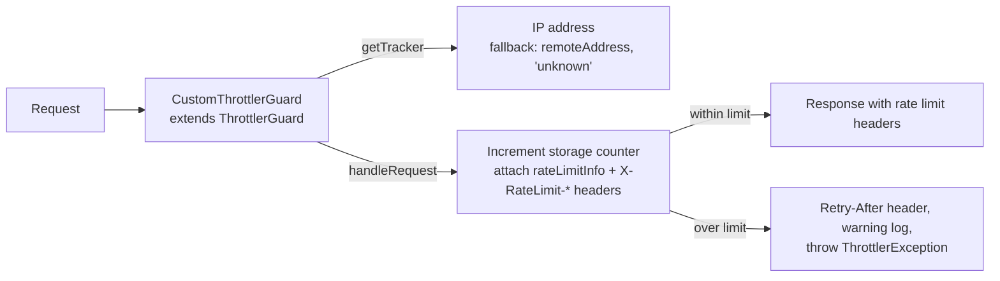

<!-- tyto-docs
tyto_docs: 1
kind: component
unit: backend/src/common/guards
title: Guards
status: draft
written_at_commit: c0a8185dc0972c3d569e33a15e59c0762999d157
written_at: "2026-09-14T22:08:09.827Z"
research: backend/src/common/guards/DOCS/Research.md
sources: []
accepted: null
evidence: Guards.evidence.md
critic:
  attempts: 1
  findings:
    - key: critic.backend-src-common-guards.6b3b6539
      owner: writer
      claim: "The Summary sentence 'AppModule registers it as a global guard, so every request in the application is throttled' contains the clause 'so every request in the application is throttled', a claim no research finding supports (research.backend-src-common-guards.03354d0c establishes only that AppModule registers the guard globally through the APP_GUARD provider and configures ThrottlerModule.forRoot with a 60-second TTL and a limit of 100 requests) and is not marked as inference, violating the contract's inference convention ('A claim no finding supports is written as inference and says so in the sentence, or it is left out')."
      locus:
        document_section: Summary
      severity: blocking
      raised_at: "2026-09-15T00:08:00+02:00"
      raised_in_pass: critic-042
    - key: critic.backend-src-common-guards.b720a3b1
      owner: writer
      claim: "The How it works sentence 'CustomThrottlerGuard is exported from custom-throttler.guard.ts, the unit's only source file, and re-exported from index.ts' claims custom-throttler.guard.ts is the unit's only source file, but the unit contains two source files (custom-throttler.guard.ts and index.ts) and the cited findings (research.backend-src-common-guards.331a91ed, research.backend-src-common-guards.65b3f8cd) establish the export and the re-export, not that custom-throttler.guard.ts is the only source file; the claim is not marked as inference."
      locus:
        document_section: "How it works"
      severity: blocking
      raised_at: "2026-09-15T00:08:00+02:00"
      raised_in_pass: critic-042
    - key: critic.backend-src-common-guards.62149ea5
      owner: writer
      claim: "The How it works sentence 'AppModule registers CustomThrottlerGuard as a global guard through the APP_GUARD provider and configures ThrottlerModule.forRoot with a 60-second TTL and a limit of 100 requests, so the guard applies to every request in the application' contains the clause 'so the guard applies to every request in the application', a claim no research finding supports (research.backend-src-common-guards.03354d0c establishes only the global registration and the ThrottlerModule configuration) and is not marked as inference, violating the contract's inference convention ('A claim no finding supports is written as inference and says so in the sentence, or it is left out')."
      locus:
        document_section: "How it works"
      severity: blocking
      raised_at: "2026-09-15T00:08:00+02:00"
      raised_in_pass: critic-042
    - key: critic.backend-src-common-guards.dceeab60
      owner: writer
      claim: "The Data model sentence 'It is a request-time shape, not a persisted entity' makes a claim no research finding supports (no finding addresses persistence) and is not marked as inference, violating the contract's inference convention ('A claim no finding supports is written as inference and says so in the sentence, or it is left out')."
      locus:
        document_section: "Data model"
      severity: blocking
      raised_at: "2026-09-15T00:08:00+02:00"
      raised_in_pass: critic-042
  review_complete: true
  sections_reviewed: 7
  sections_total: 7
  last_reviewed_document: "sha256:1b85579fcf0db72bb9d4cdcffd0af876daaccc348d95205733dbc0d6d220c8b0"
-->

# Guards

<!-- tyto-docs:generated:status -->
> **Status: Draft**
<!-- /tyto-docs:generated:status -->

## [Summary](Guards.evidence.md#summary)

The guards unit owns the application's HTTP rate limiting. It exports CustomThrottlerGuard, an @Injectable() guard that extends ThrottlerGuard from @nestjs/throttler and attaches rate limit information to every response so the RateLimitHeadersInterceptor can add the appropriate headers. <!-- ev:research.backend-src-common-guards.331a91ed -->[1](Guards.evidence.md#research.backend-src-common-guards.331a91ed) AppModule registers it as a global guard, so every request in the application is throttled. <!-- ev:research.backend-src-common-guards.03354d0c -->[2](Guards.evidence.md#research.backend-src-common-guards.03354d0c)

## [Purpose and boundaries](Guards.evidence.md#purpose-and-boundaries)

| | |
|---|---|
| Owns | The rate-limiting guard: CustomThrottlerGuard, an @Injectable() class extending ThrottlerGuard from @nestjs/throttler, together with the RequestWithContext request interface and the index.ts barrel that re-exports the guard's public members. <!-- ev:research.backend-src-common-guards.331a91ed -->[1](Guards.evidence.md#research.backend-src-common-guards.331a91ed) <!-- ev:research.backend-src-common-guards.f1aa9f05 -->[3](Guards.evidence.md#research.backend-src-common-guards.f1aa9f05) <!-- ev:research.backend-src-common-guards.65b3f8cd -->[4](Guards.evidence.md#research.backend-src-common-guards.65b3f8cd) |
| Uses | ThrottlerGuard from @nestjs/throttler as the base class the guard extends, and the express Request type that RequestWithContext extends with optional requestId and userId fields. <!-- ev:research.backend-src-common-guards.331a91ed -->[1](Guards.evidence.md#research.backend-src-common-guards.331a91ed) <!-- ev:research.backend-src-common-guards.f1aa9f05 -->[3](Guards.evidence.md#research.backend-src-common-guards.f1aa9f05) |
| Does not own | AppModule, which registers CustomThrottlerGuard as a global guard through the APP_GUARD provider and configures ThrottlerModule.forRoot with a 60-second TTL and a limit of 100 requests. <!-- ev:research.backend-src-common-guards.03354d0c -->[2](Guards.evidence.md#research.backend-src-common-guards.03354d0c) |

## [How it works](Guards.evidence.md#how-it-works)

CustomThrottlerGuard is exported from custom-throttler.guard.ts, the unit's only source file, and re-exported from index.ts. <!-- ev:research.backend-src-common-guards.331a91ed -->[1](Guards.evidence.md#research.backend-src-common-guards.331a91ed) <!-- ev:research.backend-src-common-guards.65b3f8cd -->[4](Guards.evidence.md#research.backend-src-common-guards.65b3f8cd) Its handleRequest override computes a tracker key from the request, increments the storage counter, and attaches rate limit information to the response as a rateLimitInfo property and X-RateLimit-Limit, X-RateLimit-Remaining, and X-RateLimit-Reset headers. <!-- ev:research.backend-src-common-guards.3df3c657 -->[5](Guards.evidence.md#research.backend-src-common-guards.3df3c657) When the request count exceeds the limit, it sets a Retry-After header, logs a warning with request context, and throws ThrottlerException. <!-- ev:research.backend-src-common-guards.3df3c657 -->[5](Guards.evidence.md#research.backend-src-common-guards.3df3c657)

getTracker returns the request's IP address, falling back to req.connection?.remoteAddress and then to the string 'unknown'. <!-- ev:research.backend-src-common-guards.b98d9ce0 -->[6](Guards.evidence.md#research.backend-src-common-guards.b98d9ce0) The RequestWithContext interface extends the express Request type with optional requestId and userId string fields. <!-- ev:research.backend-src-common-guards.f1aa9f05 -->[3](Guards.evidence.md#research.backend-src-common-guards.f1aa9f05)

AppModule registers CustomThrottlerGuard as a global guard through the APP_GUARD provider and configures ThrottlerModule.forRoot with a 60-second TTL and a limit of 100 requests, so the guard applies to every request in the application. <!-- ev:research.backend-src-common-guards.03354d0c -->[2](Guards.evidence.md#research.backend-src-common-guards.03354d0c)

## [Interfaces](Guards.evidence.md#interfaces)

| Name | Input | Output | Guarantee |
|---|---|---|---|
| CustomThrottlerGuard | An HTTP request, typed as express Request and optionally carrying requestId and userId | A response with rate limit headers, or a ThrottlerException when the limit is exceeded | Throttles requests per IP tracker key, attaching rateLimitInfo and X-RateLimit-Limit, X-RateLimit-Remaining, and X-RateLimit-Reset headers, and a Retry-After header on rejection <!-- ev:research.backend-src-common-guards.3df3c657 -->[5](Guards.evidence.md#research.backend-src-common-guards.3df3c657) <!-- ev:research.backend-src-common-guards.b98d9ce0 -->[6](Guards.evidence.md#research.backend-src-common-guards.b98d9ce0) <!-- ev:research.backend-src-common-guards.f1aa9f05 -->[3](Guards.evidence.md#research.backend-src-common-guards.f1aa9f05) |

<!-- tyto-docs:generated:endpoints -->
<!-- No framework adapter is active, so no endpoints were extracted for this unit. -->
<!-- /tyto-docs:generated:endpoints -->

## Source files

<!-- tyto-docs:generated:file-table -->
<!-- This unit owns no source files. -->
<!-- /tyto-docs:generated:file-table -->

## [Dependencies](Guards.evidence.md#dependencies)

| Dependency | Capability used | Why |
|---|---|---|
| @nestjs/throttler | ThrottlerGuard base class and ThrottlerException | Provides the throttling machinery CustomThrottlerGuard extends and the exception thrown when a request exceeds the limit <!-- ev:research.backend-src-common-guards.331a91ed -->[1](Guards.evidence.md#research.backend-src-common-guards.331a91ed) <!-- ev:research.backend-src-common-guards.3df3c657 -->[5](Guards.evidence.md#research.backend-src-common-guards.3df3c657) |
| express | Request type | RequestWithContext extends the express Request type with optional requestId and userId string fields <!-- ev:research.backend-src-common-guards.f1aa9f05 -->[3](Guards.evidence.md#research.backend-src-common-guards.f1aa9f05) |

<!-- tyto-docs:generated:module-graph -->

<!-- /tyto-docs:generated:module-graph -->

## [Data model](Guards.evidence.md#data-model)

This unit declares one data shape: RequestWithContext, an interface extending the express Request type with optional requestId and userId string fields. <!-- ev:research.backend-src-common-guards.f1aa9f05 -->[3](Guards.evidence.md#research.backend-src-common-guards.f1aa9f05) It is a request-time shape, not a persisted entity.

<!-- tyto-docs:generated:erd -->
<!-- This leaf unit has no descendant scope for a focused ERD. -->
<!-- /tyto-docs:generated:erd -->

<!-- tyto-docs:generated:navigation -->
- **Schedule:** 9 of 30, wave 1
<!-- /tyto-docs:generated:navigation -->