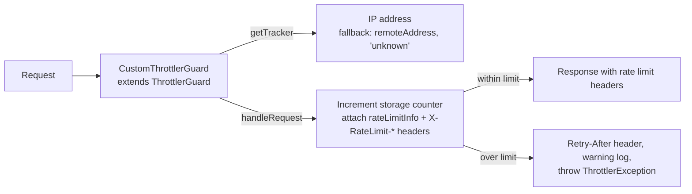

<!-- tyto-docs
tyto_docs: 1
kind: component
unit: backend/src/common/guards
title: Guards
status: current
written_at_commit: 867b70d9dd2e8e663fb811828d4ba173c899819e
written_at: "2026-09-15T05:40:23.853Z"
research: backend/src/common/guards/DOCS/Research.md
sources: []
accepted:
  at: "2026-09-15T05:45:02.593Z"
  commit: 867b70d9dd2e8e663fb811828d4ba173c899819e
  research_fingerprint: "sha256:7e37d7bb8876ff89c8fdd98530d8ba605aa693bed2be96dd49444016c27d1489"
  research_findings:
    - research.backend-src-common-guards.03354d0c
    - research.backend-src-common-guards.331a91ed
    - research.backend-src-common-guards.3df3c657
    - research.backend-src-common-guards.65b3f8cd
    - research.backend-src-common-guards.b98d9ce0
    - research.backend-src-common-guards.f1aa9f05
  critic_pass: critic.backend-src-common-guards.2
  sources:
    - path: backend/src/common/guards/custom-throttler.guard.ts
      blob_sha: b6f3084e8bf49e97eee5f7543fbe0290a1d329cb
    - path: backend/src/common/guards/index.ts
      blob_sha: 1d254df045be9bf22b0da73f82908b53819ac5d3
evidence: Guards.evidence.md
critic:
  attempts: 2
  findings: []
  review_complete: true
  sections_reviewed: 7
  sections_total: 7
  last_reviewed_document: "sha256:81e438ed06453f135af324e854cd8024843a16106dd197607f59bca147c3c092"
  retired: []
-->

# Guards

<!-- tyto-docs:generated:status -->
> **Status: Current**
<!-- /tyto-docs:generated:status -->

## [Summary](Guards.evidence.md#summary)

The guards unit owns the application's HTTP rate limiting. It exports CustomThrottlerGuard, an @Injectable() guard that extends ThrottlerGuard from @nestjs/throttler and attaches rate limit information to every response so the RateLimitHeadersInterceptor can add the appropriate headers. <!-- ev:research.backend-src-common-guards.331a91ed -->[1](Guards.evidence.md#research.backend-src-common-guards.331a91ed) AppModule registers it as a global guard through the APP_GUARD provider. <!-- ev:research.backend-src-common-guards.03354d0c -->[2](Guards.evidence.md#research.backend-src-common-guards.03354d0c)

## [Purpose and boundaries](Guards.evidence.md#purpose-and-boundaries)

| | |
|---|---|
| Owns | The rate-limiting guard: CustomThrottlerGuard, an @Injectable() class extending ThrottlerGuard from @nestjs/throttler, together with the RequestWithContext request interface and the index.ts barrel that re-exports the guard's public members. <!-- ev:research.backend-src-common-guards.331a91ed -->[1](Guards.evidence.md#research.backend-src-common-guards.331a91ed) <!-- ev:research.backend-src-common-guards.f1aa9f05 -->[3](Guards.evidence.md#research.backend-src-common-guards.f1aa9f05) <!-- ev:research.backend-src-common-guards.65b3f8cd -->[4](Guards.evidence.md#research.backend-src-common-guards.65b3f8cd) |
| Uses | ThrottlerGuard from @nestjs/throttler as the base class the guard extends, and the express Request type that RequestWithContext extends with optional requestId and userId fields. <!-- ev:research.backend-src-common-guards.331a91ed -->[1](Guards.evidence.md#research.backend-src-common-guards.331a91ed) <!-- ev:research.backend-src-common-guards.f1aa9f05 -->[3](Guards.evidence.md#research.backend-src-common-guards.f1aa9f05) |
| Does not own | AppModule, which registers CustomThrottlerGuard as a global guard through the APP_GUARD provider and configures ThrottlerModule.forRoot with a 60-second TTL and a limit of 100 requests. <!-- ev:research.backend-src-common-guards.03354d0c -->[2](Guards.evidence.md#research.backend-src-common-guards.03354d0c) |

## [How it works](Guards.evidence.md#how-it-works)

CustomThrottlerGuard is exported from custom-throttler.guard.ts and re-exported from index.ts. <!-- ev:research.backend-src-common-guards.331a91ed -->[1](Guards.evidence.md#research.backend-src-common-guards.331a91ed) <!-- ev:research.backend-src-common-guards.65b3f8cd -->[4](Guards.evidence.md#research.backend-src-common-guards.65b3f8cd) Its handleRequest override computes a tracker key from the request, increments the storage counter, and attaches rate limit information to the response as a rateLimitInfo property and X-RateLimit-Limit, X-RateLimit-Remaining, and X-RateLimit-Reset headers. <!-- ev:research.backend-src-common-guards.3df3c657 -->[5](Guards.evidence.md#research.backend-src-common-guards.3df3c657) When the request count exceeds the limit, it sets a Retry-After header, logs a warning with request context, and throws ThrottlerException. <!-- ev:research.backend-src-common-guards.3df3c657 -->[5](Guards.evidence.md#research.backend-src-common-guards.3df3c657)

getTracker returns the request's IP address, falling back to req.connection?.remoteAddress and then to the string 'unknown'. <!-- ev:research.backend-src-common-guards.b98d9ce0 -->[6](Guards.evidence.md#research.backend-src-common-guards.b98d9ce0) The RequestWithContext interface extends the express Request type with optional requestId and userId string fields. <!-- ev:research.backend-src-common-guards.f1aa9f05 -->[3](Guards.evidence.md#research.backend-src-common-guards.f1aa9f05)

AppModule registers CustomThrottlerGuard as a global guard through the APP_GUARD provider and configures ThrottlerModule.forRoot with a 60-second TTL and a limit of 100 requests. <!-- ev:research.backend-src-common-guards.03354d0c -->[2](Guards.evidence.md#research.backend-src-common-guards.03354d0c)

## [Interfaces](Guards.evidence.md#interfaces)

| Name | Input | Output | Guarantee |
|---|---|---|---|
| CustomThrottlerGuard | An HTTP request, typed as express Request and optionally carrying requestId and userId | A response with rate limit headers, or a ThrottlerException when the limit is exceeded | Throttles requests per IP tracker key, attaching rateLimitInfo and X-RateLimit-Limit, X-RateLimit-Remaining, and X-RateLimit-Reset headers, and a Retry-After header on rejection <!-- ev:research.backend-src-common-guards.3df3c657 -->[5](Guards.evidence.md#research.backend-src-common-guards.3df3c657) <!-- ev:research.backend-src-common-guards.b98d9ce0 -->[6](Guards.evidence.md#research.backend-src-common-guards.b98d9ce0) <!-- ev:research.backend-src-common-guards.f1aa9f05 -->[3](Guards.evidence.md#research.backend-src-common-guards.f1aa9f05) |

<!-- tyto-docs:generated:endpoints -->
<!-- No framework adapter is active, so no endpoints were extracted for this unit. -->
<!-- /tyto-docs:generated:endpoints -->

## Source files

<!-- tyto-docs:generated:file-table -->
<!-- This unit owns no source files. -->
<!-- /tyto-docs:generated:file-table -->

## [Dependencies](Guards.evidence.md#dependencies)

| Dependency | Capability used | Why |
|---|---|---|
| @nestjs/throttler | ThrottlerGuard base class and ThrottlerException | Provides the throttling machinery CustomThrottlerGuard extends and the exception thrown when a request exceeds the limit <!-- ev:research.backend-src-common-guards.331a91ed -->[1](Guards.evidence.md#research.backend-src-common-guards.331a91ed) <!-- ev:research.backend-src-common-guards.3df3c657 -->[5](Guards.evidence.md#research.backend-src-common-guards.3df3c657) |
| express | Request type | RequestWithContext extends the express Request type with optional requestId and userId string fields <!-- ev:research.backend-src-common-guards.f1aa9f05 -->[3](Guards.evidence.md#research.backend-src-common-guards.f1aa9f05) |

<!-- tyto-docs:generated:module-graph -->

<!-- /tyto-docs:generated:module-graph -->

## [Data model](Guards.evidence.md#data-model)

This unit declares one data shape: RequestWithContext, an interface extending the express Request type with optional requestId and userId string fields. <!-- ev:research.backend-src-common-guards.f1aa9f05 -->[3](Guards.evidence.md#research.backend-src-common-guards.f1aa9f05)

<!-- tyto-docs:generated:erd -->
<!-- This leaf unit has no descendant scope for a focused ERD. -->
<!-- /tyto-docs:generated:erd -->

<!-- tyto-docs:generated:navigation -->
- **Used by:** [Src](../../../DOCS/Src.md)
- **Schedule:** 12 of 43, wave 1
<!-- /tyto-docs:generated:navigation -->