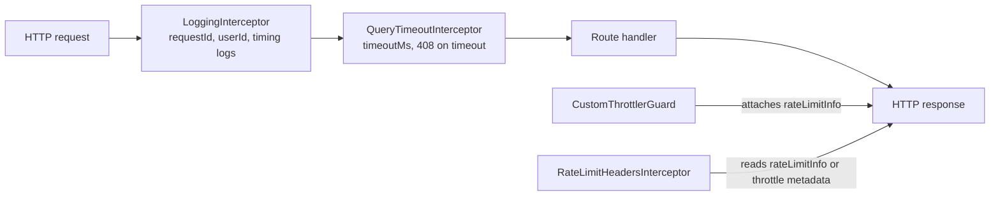

<!-- tyto-docs
tyto_docs: 1
kind: component
unit: backend/src/common/interceptors
title: Interceptors
status: current
written_at_commit: 1081bd47561ed9209ce497ea400328ee20e650f6
written_at: "2026-09-15T00:19:06.756Z"
research: backend/src/common/interceptors/DOCS/Research.md
sources: []
accepted:
  at: "2026-09-15T00:26:03.407Z"
  commit: 1081bd47561ed9209ce497ea400328ee20e650f6
  research_fingerprint: "sha256:92d8702586c861f9a2b168ccdabad23ef2922af2687d0bbd15edd2fac5a5d382"
  research_findings:
    - research.backend-src-common-interceptors.0237d7db
    - research.backend-src-common-interceptors.0ce45ce6
    - research.backend-src-common-interceptors.15edc3b0
    - research.backend-src-common-interceptors.18251310
    - research.backend-src-common-interceptors.30699c65
    - research.backend-src-common-interceptors.56665a46
    - research.backend-src-common-interceptors.5d2a50a2
    - research.backend-src-common-interceptors.61a7a445
    - research.backend-src-common-interceptors.82c2bf04
    - research.backend-src-common-interceptors.987da0ae
    - research.backend-src-common-interceptors.a9c23c83
    - research.backend-src-common-interceptors.b7b8ed8b
    - research.backend-src-common-interceptors.c22ec7bf
    - research.backend-src-common-interceptors.da54c6bb
    - research.backend-src-common-interceptors.da60b4cd
    - research.backend-src-common-interceptors.f6a184f0
  critic_pass: critic.backend-src-common-interceptors.1
  sources:
    - path: backend/src/common/interceptors/index.ts
      blob_sha: 28b59e352648b3d98109bc87b8e6bcd0638a7c7d
    - path: backend/src/common/interceptors/logging.interceptor.ts
      blob_sha: e617fdabb524c4558e1ed51422816794e93603aa
    - path: backend/src/common/interceptors/query-timeout.interceptor.ts
      blob_sha: 0f66cee0ef3cdda2661ee9f3a8ad0032b4899421
    - path: backend/src/common/interceptors/rate-limit-headers.interceptor.ts
      blob_sha: 0760a7438fbef30ddda99ac81ff14c0da34abf71
evidence: Interceptors.evidence.md
critic:
  attempts: 1
  findings: []
  review_complete: true
  sections_reviewed: 8
  sections_total: 8
  last_reviewed_document: "sha256:6fbba0ac91394af2f2aa5b2372329a35555dc14e99c8b944384679509b50722e"
  retired: []
-->

# Interceptors

<!-- tyto-docs:generated:status -->
> **Status: Current**
<!-- /tyto-docs:generated:status -->

## [Summary](Interceptors.evidence.md#summary)

The interceptors unit owns the backend's cross-cutting HTTP request handling: three NestJS interceptors that log every request with timing, bound request duration with a configurable timeout, and attach rate-limit headers to responses. <!-- ev:research.backend-src-common-interceptors.a9c23c83 -->[1](Interceptors.evidence.md#research.backend-src-common-interceptors.a9c23c83) Dependants can rely on consistent request logging, a bounded request duration, and rate-limit information on responses without per-controller wiring. <!-- ev:research.backend-src-common-interceptors.30699c65 -->[2](Interceptors.evidence.md#research.backend-src-common-interceptors.30699c65) <!-- ev:research.backend-src-common-interceptors.18251310 -->[3](Interceptors.evidence.md#research.backend-src-common-interceptors.18251310) <!-- ev:research.backend-src-common-interceptors.61a7a445 -->[4](Interceptors.evidence.md#research.backend-src-common-interceptors.61a7a445)

## [Purpose and boundaries](Interceptors.evidence.md#purpose-and-boundaries)

| | |
|---|---|
| Owns | Three NestJS interceptors — LoggingInterceptor, QueryTimeoutInterceptor, and RateLimitHeadersInterceptor — each an @Injectable() class implementing NestInterceptor. <!-- ev:research.backend-src-common-interceptors.a9c23c83 -->[1](Interceptors.evidence.md#research.backend-src-common-interceptors.a9c23c83) |
| Uses | The rxjs timeout and catchError operators that bound the response stream and translate a TimeoutError into a RequestTimeoutException. <!-- ev:research.backend-src-common-interceptors.0ce45ce6 -->[5](Interceptors.evidence.md#research.backend-src-common-interceptors.0ce45ce6) The rateLimitInfo object that CustomThrottlerGuard in backend/src/common/guards attaches to the response, and the 'throttle' route metadata read via Reflect.getMetadata as a fallback. <!-- ev:research.backend-src-common-interceptors.82c2bf04 -->[6](Interceptors.evidence.md#research.backend-src-common-interceptors.82c2bf04) <!-- ev:research.backend-src-common-interceptors.5d2a50a2 -->[7](Interceptors.evidence.md#research.backend-src-common-interceptors.5d2a50a2) |
| Does not own | The registration sites: AppModule registers LoggingInterceptor globally through the APP_INTERCEPTOR provider, and main.ts registers QueryTimeoutInterceptor globally with a 60000 millisecond timeout. <!-- ev:research.backend-src-common-interceptors.987da0ae -->[8](Interceptors.evidence.md#research.backend-src-common-interceptors.987da0ae) <!-- ev:research.backend-src-common-interceptors.56665a46 -->[9](Interceptors.evidence.md#research.backend-src-common-interceptors.56665a46) The CustomThrottlerGuard that produces rateLimitInfo. <!-- ev:research.backend-src-common-interceptors.82c2bf04 -->[6](Interceptors.evidence.md#research.backend-src-common-interceptors.82c2bf04) |

## [How it works](Interceptors.evidence.md#how-it-works)

The unit's three interceptors are @Injectable() classes implementing NestInterceptor, exported from three source files; the index.ts barrel re-exports the rate-limit-headers and query-timeout interceptors but not the logging interceptor. <!-- ev:research.backend-src-common-interceptors.a9c23c83 -->[1](Interceptors.evidence.md#research.backend-src-common-interceptors.a9c23c83) <!-- ev:research.backend-src-common-interceptors.da60b4cd -->[10](Interceptors.evidence.md#research.backend-src-common-interceptors.da60b4cd)

LoggingInterceptor runs globally through the APP_INTERCEPTOR provider. <!-- ev:research.backend-src-common-interceptors.987da0ae -->[8](Interceptors.evidence.md#research.backend-src-common-interceptors.987da0ae) For each request it generates or reuses a request ID from the x-request-id header (falling back to a uuidv4), stores it on the request as requestId, and echoes it as the X-Request-ID response header. <!-- ev:research.backend-src-common-interceptors.da54c6bb -->[11](Interceptors.evidence.md#research.backend-src-common-interceptors.da54c6bb) It extracts the user ID from request.user?.id, defaulting to 'anonymous', and stores it as userId. <!-- ev:research.backend-src-common-interceptors.b7b8ed8b -->[12](Interceptors.evidence.md#research.backend-src-common-interceptors.b7b8ed8b)

It logs an 'Incoming request' entry with requestId, userId, method, url, ip, and user-agent, then taps the response stream to log 'Request completed' with statusCode and duration in milliseconds, or 'Request failed' with the error's status (defaulting to 500) and message. <!-- ev:research.backend-src-common-interceptors.15edc3b0 -->[13](Interceptors.evidence.md#research.backend-src-common-interceptors.15edc3b0) <!-- ev:research.backend-src-common-interceptors.0237d7db -->[14](Interceptors.evidence.md#research.backend-src-common-interceptors.0237d7db) All entries go through a Logger instance named 'HTTP'. <!-- ev:research.backend-src-common-interceptors.30699c65 -->[2](Interceptors.evidence.md#research.backend-src-common-interceptors.30699c65)

QueryTimeoutInterceptor is registered globally in main.ts with a 60000 millisecond timeout, commented as accommodating PDF parsing. <!-- ev:research.backend-src-common-interceptors.56665a46 -->[9](Interceptors.evidence.md#research.backend-src-common-interceptors.56665a46) Its constructor accepts a timeoutMs value that defaults to 30000 milliseconds. <!-- ev:research.backend-src-common-interceptors.18251310 -->[3](Interceptors.evidence.md#research.backend-src-common-interceptors.18251310) It applies an rxjs timeout of timeoutMs to the response stream and converts a TimeoutError into a RequestTimeoutException with statusCode 408, message 'REQUEST_TIMEOUT', and an error describing the exceeded timeout in seconds; any other error is rethrown unchanged. <!-- ev:research.backend-src-common-interceptors.0ce45ce6 -->[5](Interceptors.evidence.md#research.backend-src-common-interceptors.0ce45ce6)

RateLimitHeadersInterceptor reads a rateLimitInfo object attached to the response by the throttler guard and, when present, sets the X-RateLimit-Limit, X-RateLimit-Remaining, and X-RateLimit-Reset headers from its limit, remaining, and reset fields. <!-- ev:research.backend-src-common-interceptors.f6a184f0 -->[15](Interceptors.evidence.md#research.backend-src-common-interceptors.f6a184f0) <!-- ev:research.backend-src-common-interceptors.82c2bf04 -->[6](Interceptors.evidence.md#research.backend-src-common-interceptors.82c2bf04) When rateLimitInfo is absent, it falls back to reading 'throttle' metadata from the route handler via Reflect.getMetadata, setting X-RateLimit-Limit (default 100) and X-RateLimit-Reset (default now plus 60000 milliseconds) while omitting X-RateLimit-Remaining. <!-- ev:research.backend-src-common-interceptors.5d2a50a2 -->[7](Interceptors.evidence.md#research.backend-src-common-interceptors.5d2a50a2)

## [Interfaces](Interceptors.evidence.md#interfaces)

| Name | Input | Output | Guarantee |
|---|---|---|---|
| LoggingInterceptor | ExecutionContext and CallHandler from NestJS | Observable stream | Logs each request with a requestId and userId, an 'Incoming request' entry, and a 'Request completed' or 'Request failed' entry with status and duration; sets the X-Request-ID response header. <!-- ev:research.backend-src-common-interceptors.30699c65 -->[2](Interceptors.evidence.md#research.backend-src-common-interceptors.30699c65) <!-- ev:research.backend-src-common-interceptors.da54c6bb -->[11](Interceptors.evidence.md#research.backend-src-common-interceptors.da54c6bb) <!-- ev:research.backend-src-common-interceptors.15edc3b0 -->[13](Interceptors.evidence.md#research.backend-src-common-interceptors.15edc3b0) <!-- ev:research.backend-src-common-interceptors.0237d7db -->[14](Interceptors.evidence.md#research.backend-src-common-interceptors.0237d7db) |
| QueryTimeoutInterceptor | timeoutMs constructor value, default 30000 | Observable stream | Times out the response stream after timeoutMs and converts a TimeoutError into a RequestTimeoutException (408, 'REQUEST_TIMEOUT'); other errors pass through unchanged. <!-- ev:research.backend-src-common-interceptors.18251310 -->[3](Interceptors.evidence.md#research.backend-src-common-interceptors.18251310) <!-- ev:research.backend-src-common-interceptors.0ce45ce6 -->[5](Interceptors.evidence.md#research.backend-src-common-interceptors.0ce45ce6) |
| RateLimitHeadersInterceptor | ExecutionContext and CallHandler from NestJS | Observable stream | Sets X-RateLimit-Limit, X-RateLimit-Remaining, and X-RateLimit-Reset from the guard's rateLimitInfo, or falls back to 'throttle' metadata (omitting X-RateLimit-Remaining). <!-- ev:research.backend-src-common-interceptors.61a7a445 -->[4](Interceptors.evidence.md#research.backend-src-common-interceptors.61a7a445) <!-- ev:research.backend-src-common-interceptors.f6a184f0 -->[15](Interceptors.evidence.md#research.backend-src-common-interceptors.f6a184f0) <!-- ev:research.backend-src-common-interceptors.5d2a50a2 -->[7](Interceptors.evidence.md#research.backend-src-common-interceptors.5d2a50a2) |

<!-- tyto-docs:generated:endpoints -->
<!-- No framework adapter is active, so no endpoints were extracted for this unit. -->
<!-- /tyto-docs:generated:endpoints -->

## Source files

<!-- tyto-docs:generated:file-table -->
<!-- This unit owns no source files. -->
<!-- /tyto-docs:generated:file-table -->

## [Dependencies](Interceptors.evidence.md#dependencies)

| Dependency | Capability used | Why |
|---|---|---|
| @nestjs/common | NestInterceptor, @Injectable, ExecutionContext, CallHandler, Logger, RequestTimeoutException | Provides the interceptor contract all three classes implement, the 'HTTP' logger, and the 408 timeout exception. <!-- ev:research.backend-src-common-interceptors.a9c23c83 -->[1](Interceptors.evidence.md#research.backend-src-common-interceptors.a9c23c83) <!-- ev:research.backend-src-common-interceptors.30699c65 -->[2](Interceptors.evidence.md#research.backend-src-common-interceptors.30699c65) <!-- ev:research.backend-src-common-interceptors.0ce45ce6 -->[5](Interceptors.evidence.md#research.backend-src-common-interceptors.0ce45ce6) |
| rxjs | Observable, timeout, catchError, tap, throwError, TimeoutError | Bounds the response stream with a timeout and taps completion or error for logging and rate-limit headers. <!-- ev:research.backend-src-common-interceptors.0ce45ce6 -->[5](Interceptors.evidence.md#research.backend-src-common-interceptors.0ce45ce6) <!-- ev:research.backend-src-common-interceptors.0237d7db -->[14](Interceptors.evidence.md#research.backend-src-common-interceptors.0237d7db) |
| uuid | v4 | Generates a fallback request ID when the x-request-id header is absent. <!-- ev:research.backend-src-common-interceptors.da54c6bb -->[11](Interceptors.evidence.md#research.backend-src-common-interceptors.da54c6bb) |

<!-- tyto-docs:generated:module-graph -->

<!-- /tyto-docs:generated:module-graph -->

## [Data model](Interceptors.evidence.md#data-model)

This unit declares no entities. It reads the rateLimitInfo object — with limit, remaining, and reset fields — that CustomThrottlerGuard attaches to the response, and the 'throttle' route metadata used as a fallback. <!-- ev:research.backend-src-common-interceptors.82c2bf04 -->[6](Interceptors.evidence.md#research.backend-src-common-interceptors.82c2bf04) <!-- ev:research.backend-src-common-interceptors.5d2a50a2 -->[7](Interceptors.evidence.md#research.backend-src-common-interceptors.5d2a50a2)

<!-- tyto-docs:generated:erd -->
<!-- This leaf unit has no descendant scope for a focused ERD. -->
<!-- /tyto-docs:generated:erd -->

## [Decisions and limitations](Interceptors.evidence.md#decisions-and-limitations)

RateLimitHeadersInterceptor is defined and exported but no repository file imports it — the only importers of this unit are app.module.ts and main.ts, which use LoggingInterceptor and QueryTimeoutInterceptor — so it is not registered as a global interceptor (inferred from the import scan). <!-- ev:research.backend-src-common-interceptors.c22ec7bf -->[16](Interceptors.evidence.md#research.backend-src-common-interceptors.c22ec7bf) When the throttler guard has not attached rateLimitInfo, the interceptor cannot determine the remaining count and omits X-RateLimit-Remaining. <!-- ev:research.backend-src-common-interceptors.5d2a50a2 -->[7](Interceptors.evidence.md#research.backend-src-common-interceptors.5d2a50a2)

<!-- tyto-docs:generated:navigation -->
- **Used by:** [Src](../../../DOCS/Src.md)
- **Schedule:** 13 of 43, wave 1
<!-- /tyto-docs:generated:navigation -->