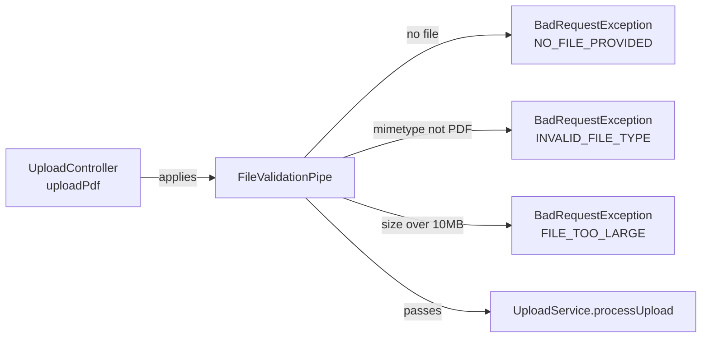

<!-- tyto-docs
tyto_docs: 1
kind: component
unit: backend/src/common/pipes
title: Pipes
status: draft
written_at_commit: d90689c899e61e11159be5667074dda1fbe7ff73
written_at: "2026-09-14T20:34:27.665Z"
research: backend/src/common/pipes/DOCS/Research.md
sources: []
accepted: null
evidence: Pipes.evidence.md
critic:
  attempts: 1
  findings:
    - key: critic.backend-src-common-pipes.883e5d58
      owner: writer
      claim: "The Summary sentence 'Upload dependants can rely on one consistent validation gate for PDF uploads' is a claim no research finding supports and is not marked as inference, violating the contract's inference convention ('A claim no finding supports is written as inference and says so in the sentence, or it is left out')."
      locus:
        document_section: Summary
      severity: blocking
      raised_at: "2026-09-14T20:40:18.299788Z"
      raised_in_pass: critic-001
    - key: critic.backend-src-common-pipes.5a486c39
      owner: writer
      claim: "The How it works sentence 'FileValidationPipe is an @Injectable() class implementing NestJS's PipeTransform<MulterFile, MulterFile>, exported from file-validation.pipe.ts, the unit's only source file' cites finding research.backend-src-common-pipes.583c665f, whose evidence (file-validation.pipe.ts L1-L5, L25-L26) establishes the class declaration and the export but not that file-validation.pipe.ts is the unit's only source file; the 'only source file' claim is unsupported by the cited evidence and is not marked as inference."
      locus:
        document_section: "How it works"
      severity: blocking
      raised_at: "2026-09-14T20:40:18.299788Z"
      raised_in_pass: critic-001
    - key: critic.backend-src-common-pipes.a615ba56
      owner: writer
      claim: "The Data model sentence 'Both are plain TypeScript declarations, not persisted entities' is a claim no research finding supports (no finding addresses persistence) and is not marked as inference, violating the contract's inference convention ('A claim no finding supports is written as inference and says so in the sentence, or it is left out')."
      locus:
        document_section: "Data model"
      severity: blocking
      raised_at: "2026-09-14T20:40:18.299788Z"
      raised_in_pass: critic-001
  review_complete: true
  sections_reviewed: 7
  sections_total: 7
  last_reviewed_document: "sha256:5d006f0dc6eb2a3611688468013a091b33c765e083bdfbf1de8dffb9a047754d"
-->

# Pipes

<!-- tyto-docs:generated:status -->
> **Status: Draft**
<!-- /tyto-docs:generated:status -->

## [Summary](Pipes.evidence.md#summary)

The pipes unit owns the shared file-validation pipe for uploads. <!-- ev:research.backend-src-common-pipes.583c665f -->[1](Pipes.evidence.md#research.backend-src-common-pipes.583c665f) It defines FileValidationPipe, a NestJS pipe that rejects missing files, non-PDF files, and files over 10MB before they reach the upload handler, and returns valid files unchanged. <!-- ev:research.backend-src-common-pipes.1da762c0 -->[2](Pipes.evidence.md#research.backend-src-common-pipes.1da762c0) <!-- ev:research.backend-src-common-pipes.b3934f5d -->[3](Pipes.evidence.md#research.backend-src-common-pipes.b3934f5d) <!-- ev:research.backend-src-common-pipes.5d2f6012 -->[4](Pipes.evidence.md#research.backend-src-common-pipes.5d2f6012) <!-- ev:research.backend-src-common-pipes.43edab1e -->[5](Pipes.evidence.md#research.backend-src-common-pipes.43edab1e) Upload dependants can rely on one consistent validation gate for PDF uploads.

## [Purpose and boundaries](Pipes.evidence.md#purpose-and-boundaries)

| | |
|---|---|
| Owns | FileValidationPipe, the shared NestJS pipe that validates uploaded files before they reach the upload handler, together with the MulterFile interface, the MAX_FILE_SIZE and ALLOWED_MIME_TYPE constants, and the FileValidationError enum. <!-- ev:research.backend-src-common-pipes.583c665f -->[1](Pipes.evidence.md#research.backend-src-common-pipes.583c665f) <!-- ev:research.backend-src-common-pipes.8b544a92 -->[6](Pipes.evidence.md#research.backend-src-common-pipes.8b544a92) <!-- ev:research.backend-src-common-pipes.272f15f3 -->[7](Pipes.evidence.md#research.backend-src-common-pipes.272f15f3) <!-- ev:research.backend-src-common-pipes.3178fd79 -->[8](Pipes.evidence.md#research.backend-src-common-pipes.3178fd79) |
| Uses | NestJS's PipeTransform, Injectable, and BadRequestException from @nestjs/common, which provide the pipe contract and the error responses the pipe throws. <!-- ev:research.backend-src-common-pipes.583c665f -->[1](Pipes.evidence.md#research.backend-src-common-pipes.583c665f) <!-- ev:research.backend-src-common-pipes.1da762c0 -->[2](Pipes.evidence.md#research.backend-src-common-pipes.1da762c0) |
| Does not own | The upload controller and service, which import FileValidationPipe and MulterFile from this unit and apply the pipe to the uploadPdf handler. <!-- ev:research.backend-src-common-pipes.3b37c851 -->[9](Pipes.evidence.md#research.backend-src-common-pipes.3b37c851) <!-- ev:research.backend-src-common-pipes.76a3193e -->[10](Pipes.evidence.md#research.backend-src-common-pipes.76a3193e) |

## [How it works](Pipes.evidence.md#how-it-works)

FileValidationPipe is an @Injectable() class implementing NestJS's PipeTransform<MulterFile, MulterFile>, exported from file-validation.pipe.ts, the unit's only source file. <!-- ev:research.backend-src-common-pipes.583c665f -->[1](Pipes.evidence.md#research.backend-src-common-pipes.583c665f) Its transform method runs three checks in order, each rejection a BadRequestException carrying a FileValidationError code: a missing file is rejected with NO_FILE_PROVIDED and message 'No file provided' <!-- ev:research.backend-src-common-pipes.1da762c0 -->[2](Pipes.evidence.md#research.backend-src-common-pipes.1da762c0); a file whose mimetype is not the allowed 'application/pdf' is rejected with INVALID_FILE_TYPE <!-- ev:research.backend-src-common-pipes.b3934f5d -->[3](Pipes.evidence.md#research.backend-src-common-pipes.b3934f5d); and a file whose size exceeds the 10MB maximum is rejected with FILE_TOO_LARGE <!-- ev:research.backend-src-common-pipes.5d2f6012 -->[4](Pipes.evidence.md#research.backend-src-common-pipes.5d2f6012).

Files that pass all three checks are returned unchanged. <!-- ev:research.backend-src-common-pipes.43edab1e -->[5](Pipes.evidence.md#research.backend-src-common-pipes.43edab1e) The limits come from the unit's MAX_FILE_SIZE constant (10 * 1024 * 1024 bytes, 10MB) and ALLOWED_MIME_TYPE constant ('application/pdf'). <!-- ev:research.backend-src-common-pipes.272f15f3 -->[7](Pipes.evidence.md#research.backend-src-common-pipes.272f15f3)

The upload controller applies the pipe to its uploadPdf handler via @UploadedFile(new FileValidationPipe()), so validation runs before UploadService.processUpload. <!-- ev:research.backend-src-common-pipes.3b37c851 -->[9](Pipes.evidence.md#research.backend-src-common-pipes.3b37c851) The upload service imports the unit's MulterFile type to type its processing input. <!-- ev:research.backend-src-common-pipes.76a3193e -->[10](Pipes.evidence.md#research.backend-src-common-pipes.76a3193e)

## [Interfaces](Pipes.evidence.md#interfaces)

| Name | Input | Output | Guarantee |
|---|---|---|---|
| FileValidationPipe.transform | An uploaded file (MulterFile) | The same file, unchanged | Rejects a missing file, a non-PDF file, or a file over 10MB with a BadRequestException carrying a FileValidationError code; returns the file unchanged when it passes all checks <!-- ev:research.backend-src-common-pipes.583c665f -->[1](Pipes.evidence.md#research.backend-src-common-pipes.583c665f) <!-- ev:research.backend-src-common-pipes.1da762c0 -->[2](Pipes.evidence.md#research.backend-src-common-pipes.1da762c0) <!-- ev:research.backend-src-common-pipes.b3934f5d -->[3](Pipes.evidence.md#research.backend-src-common-pipes.b3934f5d) <!-- ev:research.backend-src-common-pipes.5d2f6012 -->[4](Pipes.evidence.md#research.backend-src-common-pipes.5d2f6012) <!-- ev:research.backend-src-common-pipes.43edab1e -->[5](Pipes.evidence.md#research.backend-src-common-pipes.43edab1e) |

<!-- tyto-docs:generated:endpoints -->
<!-- No framework adapter is active, so no endpoints were extracted for this unit. -->
<!-- /tyto-docs:generated:endpoints -->

## Source files

<!-- tyto-docs:generated:file-table -->
<!-- This unit owns no source files. -->
<!-- /tyto-docs:generated:file-table -->

## [Dependencies](Pipes.evidence.md#dependencies)

| Dependency | Capability used | Why |
|---|---|---|
| @nestjs/common | PipeTransform, Injectable, and BadRequestException | Provides the pipe contract, the injectable decorator, and the error responses the pipe throws <!-- ev:research.backend-src-common-pipes.583c665f -->[1](Pipes.evidence.md#research.backend-src-common-pipes.583c665f) <!-- ev:research.backend-src-common-pipes.1da762c0 -->[2](Pipes.evidence.md#research.backend-src-common-pipes.1da762c0) |

<!-- tyto-docs:generated:module-graph -->

<!-- /tyto-docs:generated:module-graph -->

## [Data model](Pipes.evidence.md#data-model)

This unit declares two data shapes: the MulterFile interface, describing an uploaded file's fieldname, originalname, encoding, mimetype, size, and buffer; and the FileValidationError enum with members INVALID_FILE_TYPE, FILE_TOO_LARGE, and NO_FILE_PROVIDED. <!-- ev:research.backend-src-common-pipes.8b544a92 -->[6](Pipes.evidence.md#research.backend-src-common-pipes.8b544a92) <!-- ev:research.backend-src-common-pipes.3178fd79 -->[8](Pipes.evidence.md#research.backend-src-common-pipes.3178fd79) Both are plain TypeScript declarations, not persisted entities.

<!-- tyto-docs:generated:erd -->
<!-- This leaf unit has no descendant scope for a focused ERD. -->
<!-- /tyto-docs:generated:erd -->

<!-- tyto-docs:generated:navigation -->
- **Schedule:** 11 of 30, wave 1
<!-- /tyto-docs:generated:navigation -->