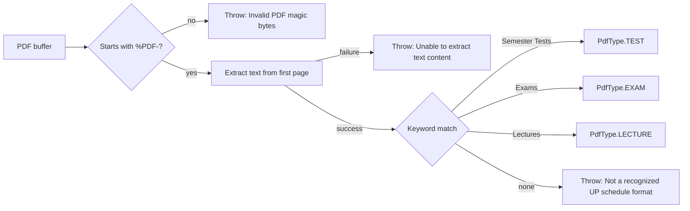

<!-- tyto-docs
tyto_docs: 1
kind: component
unit: backend/src/common/validators
title: Validators
status: current
written_at_commit: b6421855dd2a4b1ab0adc94c8152f517c09bb65a
written_at: "2026-09-14T21:30:51.131Z"
research: backend/src/common/validators/DOCS/Research.md
sources: []
accepted:
  at: "2026-09-14T21:33:22.212Z"
  commit: b6421855dd2a4b1ab0adc94c8152f517c09bb65a
  research_fingerprint: "sha256:a37ba722f225571e4bdb828356b58f64f8f245fe1f245701809746fd3c0d4017"
  research_findings:
    - research.backend-src-common-validators.153ec0f0
    - research.backend-src-common-validators.288dcff4
    - research.backend-src-common-validators.2b0e1f4b
    - research.backend-src-common-validators.2fc0a41c
    - research.backend-src-common-validators.47ffdba6
    - research.backend-src-common-validators.724eb903
    - research.backend-src-common-validators.82ea47d1
    - research.backend-src-common-validators.941928f3
    - research.backend-src-common-validators.9b47ae2b
    - research.backend-src-common-validators.a52803bf
    - research.backend-src-common-validators.b49da522
    - research.backend-src-common-validators.cb5529be
    - research.backend-src-common-validators.ef7d2a73
    - research.backend-src-common-validators.f528bbdf
  critic_pass: critic.backend-src-common-validators.1
  sources:
    - path: backend/src/common/validators/pdf-content.validator.ts
      blob_sha: e575a38a9d1480fc3c6290ebb98ab590bbab5530
evidence: Validators.evidence.md
critic:
  attempts: 1
  findings: []
  review_complete: true
  sections_reviewed: 8
  sections_total: 8
  last_reviewed_document: "sha256:f63188073cb7b9b52bfd7414d4e706fc6907e37b491c15183ad9064a1a3b0f3b"
  retired: []
-->

# Validators

<!-- tyto-docs:generated:status -->
> **Status: Current**
<!-- /tyto-docs:generated:status -->

## [Summary](Validators.evidence.md#summary)

The validators unit owns the application's PDF content validation. <!-- ev:research.backend-src-common-validators.cb5529be -->[1](Validators.evidence.md#research.backend-src-common-validators.cb5529be) It exposes validatePdfContent, which validates a PDF buffer and detects the schedule mode from the first page's keywords, and isPdfValidUpSchedule, a non-throwing wrapper that reports validity and the detected type. <!-- ev:research.backend-src-common-validators.a52803bf -->[2](Validators.evidence.md#research.backend-src-common-validators.a52803bf) <!-- ev:research.backend-src-common-validators.b49da522 -->[3](Validators.evidence.md#research.backend-src-common-validators.b49da522) The upload service relies on validatePdfContent to determine the PDF type of uploaded files. <!-- ev:research.backend-src-common-validators.ef7d2a73 -->[4](Validators.evidence.md#research.backend-src-common-validators.ef7d2a73)

## [Purpose and boundaries](Validators.evidence.md#purpose-and-boundaries)

| | |
|---|---|
| Owns | PDF content validation: validatePdfContent and isPdfValidUpSchedule, both exported from pdf-content.validator.ts, the unit's only source file. <!-- ev:research.backend-src-common-validators.cb5529be -->[1](Validators.evidence.md#research.backend-src-common-validators.cb5529be) <!-- ev:research.backend-src-common-validators.a52803bf -->[2](Validators.evidence.md#research.backend-src-common-validators.a52803bf) <!-- ev:research.backend-src-common-validators.b49da522 -->[3](Validators.evidence.md#research.backend-src-common-validators.b49da522) |
| Uses | PdfType from backend/src/common/types.ts, the schedule-mode type the validation functions return, and PDFParse from the pdf-parse package, used to extract text from the first page. <!-- ev:research.backend-src-common-validators.47ffdba6 -->[5](Validators.evidence.md#research.backend-src-common-validators.47ffdba6) <!-- ev:research.backend-src-common-validators.9b47ae2b -->[6](Validators.evidence.md#research.backend-src-common-validators.9b47ae2b) <!-- ev:research.backend-src-common-validators.941928f3 -->[7](Validators.evidence.md#research.backend-src-common-validators.941928f3) |
| Does not own | The upload service, whose processUpload imports validatePdfContent and calls it with the uploaded file's buffer to determine the PDF type. <!-- ev:research.backend-src-common-validators.ef7d2a73 -->[4](Validators.evidence.md#research.backend-src-common-validators.ef7d2a73) |

## [How it works](Validators.evidence.md#how-it-works)

validatePdfContent is an exported async function that takes a PDF file buffer and returns a Promise<PdfType>. <!-- ev:research.backend-src-common-validators.a52803bf -->[2](Validators.evidence.md#research.backend-src-common-validators.a52803bf) It first checks the PDF magic bytes: it reads the first five bytes of the buffer as ASCII and throws 'Invalid PDF: file does not start with PDF magic bytes' unless they start with '%PDF-'. <!-- ev:research.backend-src-common-validators.2fc0a41c -->[8](Validators.evidence.md#research.backend-src-common-validators.2fc0a41c) It then extracts text from the first page only, using a PDFParse instance constructed with the buffer and parser.getText({ first: 1 }), and throws 'Invalid PDF: Unable to extract text content' if extraction fails. <!-- ev:research.backend-src-common-validators.941928f3 -->[7](Validators.evidence.md#research.backend-src-common-validators.941928f3)

Schedule mode is detected by keyword, in order: text containing 'Semester Tests' returns PdfType.TEST, 'Exams' returns PdfType.EXAM, and 'Lectures' returns PdfType.LECTURE; the source comment notes the order matters so 'Semester Tests' is checked before 'Exams'. <!-- ev:research.backend-src-common-validators.f528bbdf -->[9](Validators.evidence.md#research.backend-src-common-validators.f528bbdf) If none of the mode keywords is found, validatePdfContent throws 'Invalid PDF: Not a recognized UP schedule format'. <!-- ev:research.backend-src-common-validators.288dcff4 -->[10](Validators.evidence.md#research.backend-src-common-validators.288dcff4)

isPdfValidUpSchedule is an exported async function that checks whether a buffer is a valid UP schedule PDF without throwing, returning { isValid: true, pdfType } on success and { isValid: false, error } on failure, where error is the thrown message or 'Unknown error'. <!-- ev:research.backend-src-common-validators.b49da522 -->[3](Validators.evidence.md#research.backend-src-common-validators.b49da522) It calls validatePdfContent inside a try/catch to obtain the PDF type. <!-- ev:research.backend-src-common-validators.2b0e1f4b -->[11](Validators.evidence.md#research.backend-src-common-validators.2b0e1f4b)

Although the file defines and exports an enum PdfContentError with the members INVALID_PDF_CONTENT, UNRECOGNIZED_FORMAT, and TEXT_EXTRACTION_FAILED, it is not referenced anywhere in the repository; the validation functions throw plain Error objects with descriptive message strings rather than PdfContentError values. <!-- ev:research.backend-src-common-validators.82ea47d1 -->[12](Validators.evidence.md#research.backend-src-common-validators.82ea47d1) <!-- ev:research.backend-src-common-validators.724eb903 -->[13](Validators.evidence.md#research.backend-src-common-validators.724eb903)

## [Interfaces](Validators.evidence.md#interfaces)

| Name | Input | Output | Guarantee |
|---|---|---|---|
| validatePdfContent | A PDF file buffer | Promise<PdfType> | Validates the PDF content and detects the schedule mode by checking mode-identifying keywords in the first page; throws descriptive Error messages for invalid PDFs <!-- ev:research.backend-src-common-validators.a52803bf -->[2](Validators.evidence.md#research.backend-src-common-validators.a52803bf) <!-- ev:research.backend-src-common-validators.2fc0a41c -->[8](Validators.evidence.md#research.backend-src-common-validators.2fc0a41c) <!-- ev:research.backend-src-common-validators.941928f3 -->[7](Validators.evidence.md#research.backend-src-common-validators.941928f3) <!-- ev:research.backend-src-common-validators.f528bbdf -->[9](Validators.evidence.md#research.backend-src-common-validators.f528bbdf) <!-- ev:research.backend-src-common-validators.288dcff4 -->[10](Validators.evidence.md#research.backend-src-common-validators.288dcff4) |
| isPdfValidUpSchedule | A buffer | { isValid: true, pdfType } or { isValid: false, error } | Checks whether a buffer is a valid UP schedule PDF without throwing; error is the thrown message or 'Unknown error' <!-- ev:research.backend-src-common-validators.b49da522 -->[3](Validators.evidence.md#research.backend-src-common-validators.b49da522) |

<!-- tyto-docs:generated:endpoints -->
<!-- No framework adapter is active, so no endpoints were extracted for this unit. -->
<!-- /tyto-docs:generated:endpoints -->

## Source files

<!-- tyto-docs:generated:file-table -->
<!-- This unit owns no source files. -->
<!-- /tyto-docs:generated:file-table -->

## [Dependencies](Validators.evidence.md#dependencies)

| Dependency | Capability used | Why |
|---|---|---|
| pdf-parse | PDFParse | Constructs a parser instance to extract text from the first page of the PDF <!-- ev:research.backend-src-common-validators.47ffdba6 -->[5](Validators.evidence.md#research.backend-src-common-validators.47ffdba6) <!-- ev:research.backend-src-common-validators.941928f3 -->[7](Validators.evidence.md#research.backend-src-common-validators.941928f3) |
| backend/src/common/types.ts | PdfType enum | Provides the schedule-mode type that validatePdfContent returns and isPdfValidUpSchedule reports <!-- ev:research.backend-src-common-validators.47ffdba6 -->[5](Validators.evidence.md#research.backend-src-common-validators.47ffdba6) <!-- ev:research.backend-src-common-validators.9b47ae2b -->[6](Validators.evidence.md#research.backend-src-common-validators.9b47ae2b) |

<!-- tyto-docs:generated:module-graph -->

<!-- /tyto-docs:generated:module-graph -->

## [Data model](Validators.evidence.md#data-model)

This unit declares one enum, PdfContentError, with the members INVALID_PDF_CONTENT, UNRECOGNIZED_FORMAT, and TEXT_EXTRACTION_FAILED, though nothing in the repository references it. <!-- ev:research.backend-src-common-validators.82ea47d1 -->[12](Validators.evidence.md#research.backend-src-common-validators.82ea47d1) <!-- ev:research.backend-src-common-validators.724eb903 -->[13](Validators.evidence.md#research.backend-src-common-validators.724eb903) It also references PdfType, defined in backend/src/common/types.ts with the values LECTURE = 'lecture', TEST = 'test', and EXAM = 'exam', as the return type of its validation functions. <!-- ev:research.backend-src-common-validators.9b47ae2b -->[6](Validators.evidence.md#research.backend-src-common-validators.9b47ae2b)

<!-- tyto-docs:generated:erd -->
<!-- This leaf unit has no descendant scope for a focused ERD. -->
<!-- /tyto-docs:generated:erd -->

## [Decisions and limitations](Validators.evidence.md#decisions-and-limitations)

- The PdfContentError enum is dead code: it is defined and exported but never referenced, and the validation functions throw plain Error objects with descriptive message strings instead. <!-- ev:research.backend-src-common-validators.724eb903 -->[13](Validators.evidence.md#research.backend-src-common-validators.724eb903)
- Keyword order matters: 'Semester Tests' is checked before 'Exams' so test schedules are not misclassified as exam schedules. <!-- ev:research.backend-src-common-validators.f528bbdf -->[9](Validators.evidence.md#research.backend-src-common-validators.f528bbdf)
- No test files exist for this unit. <!-- ev:research.backend-src-common-validators.153ec0f0 -->[14](Validators.evidence.md#research.backend-src-common-validators.153ec0f0)

<!-- tyto-docs:generated:navigation -->
- **Direct dependencies:** [Src common](../../DOCS/Common.md)
- **Used by:** [Src upload](../../../upload/DOCS/Upload.md)
- **Schedule:** 15 of 43, wave 1
<!-- /tyto-docs:generated:navigation -->