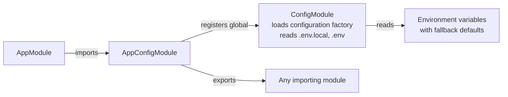
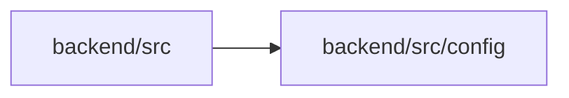

<!-- tyto-docs
tyto_docs: 1
kind: component
unit: backend/src/config
title: Config
status: current
written_at_commit: efc8ec9476e0feed0dc674a979adc2e37a3eb76e
written_at: "2026-09-14T11:23:36.531Z"
research: backend/src/config/DOCS/Research.md
sources: []
accepted:
  at: "2026-09-14T11:28:25.368Z"
  commit: efc8ec9476e0feed0dc674a979adc2e37a3eb76e
  research_fingerprint: "sha256:884f7186b6ba97aeb1233b0da77a925265683f85f9f865b2fe1db90098990df8"
  research_findings:
    - research.backend-src-config.0b0b5327
    - research.backend-src-config.27c1ac53
    - research.backend-src-config.50f21225
    - research.backend-src-config.59c38b0a
    - research.backend-src-config.658a6c1d
    - research.backend-src-config.6c6f7892
    - research.backend-src-config.6db2b38c
    - research.backend-src-config.844288aa
    - research.backend-src-config.8fc2002c
    - research.backend-src-config.98069c0d
    - research.backend-src-config.f3479eba
  critic_pass: critic.backend-src-config.1
  sources:
    - path: backend/src/config/config.module.ts
      blob_sha: 9d98e6c6d2cf329bbc0d1c66a9d38cfb70725c46
    - path: backend/src/config/configuration.ts
      blob_sha: 28dde12e7fe4e42652d5f690803923e7a8300952
evidence: Config.evidence.md
critic:
  attempts: 1
  findings: []
  review_complete: true
  sections_reviewed: 8
  sections_total: 8
  last_reviewed_document: "sha256:1d63d2870541b6df984c2fba5d9275ba5c448a358dd62001b126f81b82ea96f6"
  retired: []
-->

# Config

<!-- tyto-docs:generated:status -->
> **Status: Current**
<!-- /tyto-docs:generated:status -->

## [Summary](Config.evidence.md#summary)

The config unit owns the application's configuration. It exposes a single NestJS module, AppConfigModule, that registers the @nestjs/config ConfigModule as a global module, loading a configuration factory that reads environment variables with fallback defaults and exporting ConfigModule for any importing module. <!-- ev:research.backend-src-config.f3479eba -->[1](Config.evidence.md#research.backend-src-config.f3479eba) The root AppModule imports AppConfigModule, making the configuration available across the application. <!-- ev:research.backend-src-config.0b0b5327 -->[2](Config.evidence.md#research.backend-src-config.0b0b5327)

## [Purpose and boundaries](Config.evidence.md#purpose-and-boundaries)

| | |
|---|---|
| Owns | The application's configuration: a global NestJS config module that loads a configuration factory from environment variables with fallback defaults and reads .env.local and .env files. <!-- ev:research.backend-src-config.f3479eba -->[1](Config.evidence.md#research.backend-src-config.f3479eba) <!-- ev:research.backend-src-config.27c1ac53 -->[3](Config.evidence.md#research.backend-src-config.27c1ac53) |
| Uses | The @nestjs/config ConfigModule, registered globally and re-exported so any importing module can read the configuration. <!-- ev:research.backend-src-config.f3479eba -->[1](Config.evidence.md#research.backend-src-config.f3479eba) <!-- ev:research.backend-src-config.658a6c1d -->[4](Config.evidence.md#research.backend-src-config.658a6c1d) |
| Does not own | The root AppModule, which imports AppConfigModule to make the configuration available to the application. <!-- ev:research.backend-src-config.0b0b5327 -->[2](Config.evidence.md#research.backend-src-config.0b0b5327) |

## [How it works](Config.evidence.md#how-it-works)

AppModule imports AppConfigModule from './config/config.module.js' and includes it in its module imports, making the configuration available to the application. <!-- ev:research.backend-src-config.0b0b5327 -->[2](Config.evidence.md#research.backend-src-config.0b0b5327) AppConfigModule registers the @nestjs/config ConfigModule as a global module with ConfigModule.forRoot, loading the configuration factory and reading .env.local and .env files. <!-- ev:research.backend-src-config.f3479eba -->[1](Config.evidence.md#research.backend-src-config.f3479eba)

The configuration factory returns the application's configuration object with port, database, redis, minio, google, frontend, and parser sections, each populated from environment variables with fallback defaults. <!-- ev:research.backend-src-config.27c1ac53 -->[3](Config.evidence.md#research.backend-src-config.27c1ac53) The port defaults to 3001, the database section defaults to localhost:5432 with postgres/postgres credentials and the up_schedule database, and the redis section defaults to localhost:6379 with no password. <!-- ev:research.backend-src-config.98069c0d -->[5](Config.evidence.md#research.backend-src-config.98069c0d) <!-- ev:research.backend-src-config.8fc2002c -->[6](Config.evidence.md#research.backend-src-config.8fc2002c) <!-- ev:research.backend-src-config.6db2b38c -->[7](Config.evidence.md#research.backend-src-config.6db2b38c)

The minio section falls back to AWS S3/Tigris variables, defaulting the endpoint to localhost, the port to 443, the credentials to minioadmin, the bucket to pdf-uploads, and the region to auto, and auto-enables SSL when an S3 endpoint URL is set. <!-- ev:research.backend-src-config.6c6f7892 -->[8](Config.evidence.md#research.backend-src-config.6c6f7892) The google section defaults the client id and secret to empty strings and the callback URL to http://localhost:3001/api/auth/google/callback, while the frontend and parser sections default to http://localhost:3000 and http://localhost:5000 respectively. <!-- ev:research.backend-src-config.50f21225 -->[9](Config.evidence.md#research.backend-src-config.50f21225) <!-- ev:research.backend-src-config.844288aa -->[10](Config.evidence.md#research.backend-src-config.844288aa) <!-- ev:research.backend-src-config.59c38b0a -->[11](Config.evidence.md#research.backend-src-config.59c38b0a)

AppConfigModule exports the registered ConfigModule, so any module that imports AppConfigModule can read the configuration. <!-- ev:research.backend-src-config.f3479eba -->[1](Config.evidence.md#research.backend-src-config.f3479eba)

## [Interfaces](Config.evidence.md#interfaces)

| Name | Input | Output | Guarantee |
|---|---|---|---|
| AppConfigModule | none — a NestJS module class | A global configuration module | Registers the @nestjs/config ConfigModule globally, loading the configuration factory from environment variables with fallback defaults; any module that imports it can read the configuration <!-- ev:research.backend-src-config.f3479eba -->[1](Config.evidence.md#research.backend-src-config.f3479eba) <!-- ev:research.backend-src-config.27c1ac53 -->[3](Config.evidence.md#research.backend-src-config.27c1ac53) |

<!-- tyto-docs:generated:endpoints -->
<!-- No framework adapter is active, so no endpoints were extracted for this unit. -->
<!-- /tyto-docs:generated:endpoints -->

## Source files

<!-- tyto-docs:generated:file-table -->
<!-- This unit owns no source files. -->
<!-- /tyto-docs:generated:file-table -->

## [Dependencies](Config.evidence.md#dependencies)

| Dependency | Capability used | Why |
|---|---|---|
| @nestjs/config | Global configuration module that loads a factory and reads .env files | Provides the ConfigModule AppConfigModule registers and re-exports <!-- ev:research.backend-src-config.f3479eba -->[1](Config.evidence.md#research.backend-src-config.f3479eba) <!-- ev:research.backend-src-config.658a6c1d -->[4](Config.evidence.md#research.backend-src-config.658a6c1d) |
| @nestjs/common | NestJS module infrastructure, including the @Module() decorator | Provides the decorator that declares AppConfigModule <!-- ev:research.backend-src-config.658a6c1d -->[4](Config.evidence.md#research.backend-src-config.658a6c1d) |

<!-- tyto-docs:generated:module-graph -->

<!-- /tyto-docs:generated:module-graph -->

## [Data model](Config.evidence.md#data-model)

This module declares and references no entities (inference: the research records none for this unit). It only loads the application's configuration from environment variables. <!-- ev:research.backend-src-config.27c1ac53 -->[3](Config.evidence.md#research.backend-src-config.27c1ac53)

<!-- tyto-docs:generated:erd -->
<!-- This leaf unit has no descendant scope for a focused ERD. -->
<!-- /tyto-docs:generated:erd -->

## [Decisions and limitations](Config.evidence.md#decisions-and-limitations)

The minio section prefers MINIO_* variables but falls back to AWS S3/Tigris variables, and auto-enables SSL whenever an S3 endpoint URL is set. <!-- ev:research.backend-src-config.6c6f7892 -->[8](Config.evidence.md#research.backend-src-config.6c6f7892)

<!-- tyto-docs:generated:navigation -->
- **Schedule:** 2 of 3, wave 1
<!-- /tyto-docs:generated:navigation -->