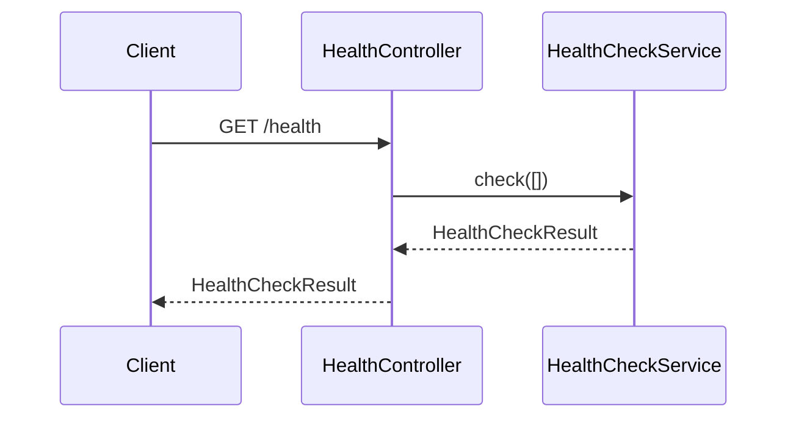

<!-- tyto-docs
tyto_docs: 1
kind: component
unit: backend/src/health
title: Health
status: draft
written_at_commit: 5346c82bbe06394912b219bacc06f2b9ea334e20
written_at: "2026-09-15T10:16:07.349Z"
research: backend/src/health/DOCS/Research.md
sources: []
accepted: null
evidence: Health.evidence.md
critic:
  attempts: 1
  findings:
    - key: critic.backend-src-health.099edd99
      owner: writer
      claim: "The Data model section states 'This unit declares no entities; the endpoint's return type, HealthCheckResult, is the only data shape the unit references', citing research.backend-src-health.477a1b9f, but that finding only establishes that the check() endpoint returns Promise<HealthCheckResult>. No research finding supports the negative claims that the unit 'declares no entities' or that HealthCheckResult is the 'only data shape' the unit references. Per the contract's inference convention ('A claim no finding supports is written as inference and says so in the sentence, or it is left out'), these claims must be marked as inference or removed."
      locus:
        document_section: "Data model"
      severity: blocking
      raised_at: "2026-09-15T12:16:00+02:00"
      raised_in_pass: w0
    - key: critic.backend-src-health.85f89159
      owner: writer
      claim: "The Decisions and limitations section concludes 'so no dependency indicators are registered', but no research finding supports that conclusion: research.backend-src-health.477a1b9f only establishes that the endpoint calls this.health.check([]) with an empty indicators array, and research.backend-src-health.1a874f32 only records the @ApiOperation/@ApiResponse documentation. The consequence that no dependency indicators are registered is an inference and, per the contract's inference convention, must be marked as inference in the sentence or removed."
      locus:
        document_section: "Decisions and limitations"
      severity: blocking
      raised_at: "2026-09-15T12:16:00+02:00"
      raised_in_pass: w0
  review_complete: true
  sections_reviewed: 8
  sections_total: 8
  last_reviewed_document: "sha256:40141b5bdd8be66b50459ef38489dc1023c34d7750282db78435cb6ecb808bae"
-->

# Health

<!-- tyto-docs:generated:status -->
> **Status: Draft**
<!-- /tyto-docs:generated:status -->

## [Summary](Health.evidence.md#summary)

The health unit owns the health-check endpoint of the backend. It defines HealthModule, which imports TerminusModule and declares HealthController as its only controller, and re-exports both from its public entry point. <!-- ev:research.backend-src-health.ac1d1aba -->[1](Health.evidence.md#research.backend-src-health.ac1d1aba) <!-- ev:research.backend-src-health.fff874c5 -->[2](Health.evidence.md#research.backend-src-health.fff874c5) Dependants can rely on the root AppModule importing this module to expose a Swagger-documented GET /health that reports whether the health check passed. <!-- ev:research.backend-src-health.a7552656 -->[3](Health.evidence.md#research.backend-src-health.a7552656)

## [Purpose and boundaries](Health.evidence.md#purpose-and-boundaries)

| | |
|---|---|
| Owns | HealthModule, which imports TerminusModule and declares HealthController as its only controller with no providers, and the public entry point index.ts, which re-exports HealthModule and HealthController. <!-- ev:research.backend-src-health.ac1d1aba -->[1](Health.evidence.md#research.backend-src-health.ac1d1aba) <!-- ev:research.backend-src-health.fff874c5 -->[2](Health.evidence.md#research.backend-src-health.fff874c5) |
| Uses | @nestjs/terminus's TerminusModule, HealthCheckService, and @HealthCheck decorator, and @nestjs/swagger's @ApiTags, @ApiOperation, and @ApiResponse decorators. <!-- ev:research.backend-src-health.ac1d1aba -->[1](Health.evidence.md#research.backend-src-health.ac1d1aba) <!-- ev:research.backend-src-health.d9353d7c -->[4](Health.evidence.md#research.backend-src-health.d9353d7c) <!-- ev:research.backend-src-health.477a1b9f -->[5](Health.evidence.md#research.backend-src-health.477a1b9f) <!-- ev:research.backend-src-health.8c65ecde -->[6](Health.evidence.md#research.backend-src-health.8c65ecde) <!-- ev:research.backend-src-health.1a874f32 -->[7](Health.evidence.md#research.backend-src-health.1a874f32) |
| Does not own | The root AppModule, which imports HealthModule into the application's module graph. <!-- ev:research.backend-src-health.a7552656 -->[3](Health.evidence.md#research.backend-src-health.a7552656) |

## [How it works](Health.evidence.md#how-it-works)

HealthModule wires the health check into the application: it imports TerminusModule and declares HealthController as its only controller, with no providers of its own. <!-- ev:research.backend-src-health.ac1d1aba -->[1](Health.evidence.md#research.backend-src-health.ac1d1aba) HealthController is mapped to the 'health' route and tagged with the Swagger tag 'Health'. <!-- ev:research.backend-src-health.8c65ecde -->[6](Health.evidence.md#research.backend-src-health.8c65ecde) It injects HealthCheckService from @nestjs/terminus through its constructor as a private field named health. <!-- ev:research.backend-src-health.d9353d7c -->[4](Health.evidence.md#research.backend-src-health.d9353d7c)

The controller exposes a single GET endpoint, check(), decorated with @HealthCheck(). <!-- ev:research.backend-src-health.477a1b9f -->[5](Health.evidence.md#research.backend-src-health.477a1b9f) The endpoint delegates to the injected service by calling this.health.check([]) with an empty indicators array and returns Promise<HealthCheckResult>. <!-- ev:research.backend-src-health.477a1b9f -->[5](Health.evidence.md#research.backend-src-health.477a1b9f) The endpoint is documented with @ApiOperation summary 'Check health status of all dependencies' and @ApiResponse declarations for status 200 ('Health check passed') and 503 ('One or more health checks failed'). <!-- ev:research.backend-src-health.1a874f32 -->[7](Health.evidence.md#research.backend-src-health.1a874f32)

## [Interfaces](Health.evidence.md#interfaces)

| Name | Input | Output | Guarantee |
|---|---|---|---|
| HealthModule | — | A NestJS module | Imports TerminusModule and declares HealthController as its only controller, with no providers <!-- ev:research.backend-src-health.ac1d1aba -->[1](Health.evidence.md#research.backend-src-health.ac1d1aba) |
| HealthController | — | A controller mapped to the 'health' route | Tagged with the Swagger tag 'Health' and exposing the check endpoint <!-- ev:research.backend-src-health.8c65ecde -->[6](Health.evidence.md#research.backend-src-health.8c65ecde) |
| GET /health (check) | — | Promise<HealthCheckResult> | Delegates to HealthCheckService with an empty indicators array; documented responses 200 and 503 <!-- ev:research.backend-src-health.477a1b9f -->[5](Health.evidence.md#research.backend-src-health.477a1b9f) <!-- ev:research.backend-src-health.1a874f32 -->[7](Health.evidence.md#research.backend-src-health.1a874f32) |

<!-- tyto-docs:generated:endpoints -->
<!-- No framework adapter is active, so no endpoints were extracted for this unit. -->
<!-- /tyto-docs:generated:endpoints -->

## Source files

<!-- tyto-docs:generated:file-table -->
<!-- This unit owns no source files. -->
<!-- /tyto-docs:generated:file-table -->

## [Dependencies](Health.evidence.md#dependencies)

| Dependency | Capability used | Why |
|---|---|---|
| @nestjs/terminus | TerminusModule, HealthCheckService, @HealthCheck | Provides the health-check machinery the endpoint delegates to <!-- ev:research.backend-src-health.ac1d1aba -->[1](Health.evidence.md#research.backend-src-health.ac1d1aba) <!-- ev:research.backend-src-health.d9353d7c -->[4](Health.evidence.md#research.backend-src-health.d9353d7c) <!-- ev:research.backend-src-health.477a1b9f -->[5](Health.evidence.md#research.backend-src-health.477a1b9f) |
| @nestjs/swagger | @ApiTags, @ApiOperation, @ApiResponse | Documents the endpoint and its responses in OpenAPI output <!-- ev:research.backend-src-health.8c65ecde -->[6](Health.evidence.md#research.backend-src-health.8c65ecde) <!-- ev:research.backend-src-health.1a874f32 -->[7](Health.evidence.md#research.backend-src-health.1a874f32) |

<!-- tyto-docs:generated:module-graph -->

<!-- /tyto-docs:generated:module-graph -->

## [Data model](Health.evidence.md#data-model)

This unit declares no entities; the endpoint's return type, HealthCheckResult, is the only data shape the unit references. <!-- ev:research.backend-src-health.477a1b9f -->[5](Health.evidence.md#research.backend-src-health.477a1b9f)

<!-- tyto-docs:generated:erd -->
<!-- This leaf unit has no descendant scope for a focused ERD. -->
<!-- /tyto-docs:generated:erd -->

## [Decisions and limitations](Health.evidence.md#decisions-and-limitations)

The check endpoint calls HealthCheckService.check with an empty indicators array, so no dependency indicators are registered even though its @ApiOperation summary describes checking the status of all dependencies. <!-- ev:research.backend-src-health.477a1b9f -->[5](Health.evidence.md#research.backend-src-health.477a1b9f) <!-- ev:research.backend-src-health.1a874f32 -->[7](Health.evidence.md#research.backend-src-health.1a874f32)

<!-- tyto-docs:generated:navigation -->
- **Used by:** [Src](../../DOCS/Src.md)
- **Schedule:** 17 of 43, wave 1
<!-- /tyto-docs:generated:navigation -->