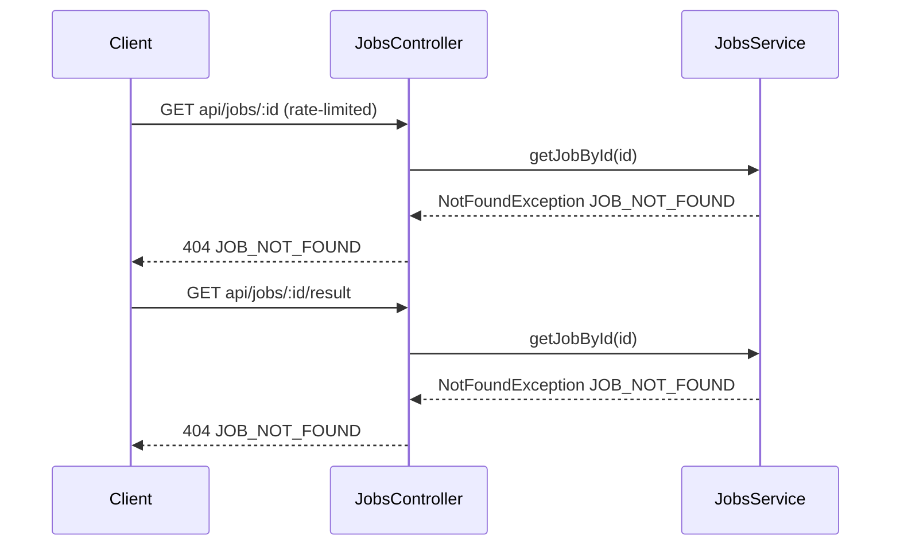
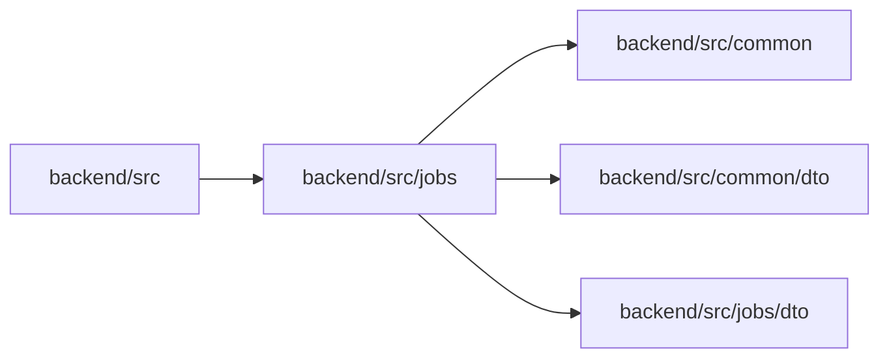

<!-- tyto-docs
tyto_docs: 1
kind: component
unit: backend/src/jobs
title: Jobs
status: current
written_at_commit: a2515f424431f93a5c785619d0db30268d1b298e
written_at: "2026-09-15T02:30:40.995Z"
research: backend/src/jobs/DOCS/Research.md
sources: []
accepted:
  at: "2026-09-15T02:36:58.816Z"
  commit: a2515f424431f93a5c785619d0db30268d1b298e
  research_fingerprint: "sha256:ba3d25b28f716ab83882c94bfaf370fbf9db43db644f60f5934cfae56a2ec0ac"
  research_findings:
    - research.backend-src-jobs.06a68913
    - research.backend-src-jobs.1070c31f
    - research.backend-src-jobs.111c1710
    - research.backend-src-jobs.15c336b3
    - research.backend-src-jobs.289fb29a
    - research.backend-src-jobs.4c4a7440
    - research.backend-src-jobs.681c0b98
    - research.backend-src-jobs.8217c5a9
    - research.backend-src-jobs.8c37981b
    - research.backend-src-jobs.bffe2d79
    - research.backend-src-jobs.d01fa15b
    - research.backend-src-jobs.e390b3e8
  critic_pass: critic.backend-src-jobs.1
  sources:
    - path: backend/src/jobs/index.ts
      blob_sha: 9a35039bd60d36d4c17db26fdd03a4ae90d5896a
    - path: backend/src/jobs/jobs.controller.ts
      blob_sha: e07b7a69267ec703b53a8e830eac82d985234025
    - path: backend/src/jobs/jobs.module.ts
      blob_sha: 3fefe46aabe5169d0a7404798cd03a2e9329be92
    - path: backend/src/jobs/jobs.service.ts
      blob_sha: f56bbebd2a62129e161f9b3e98114a2bbedb98ea
evidence: Jobs.evidence.md
critic:
  attempts: 1
  findings: []
  review_complete: true
  sections_reviewed: 8
  sections_total: 8
  last_reviewed_document: "sha256:f657fdf40fc8bc454e7db85cd6c2f7ed7b89b30543a40451e518aa8d015bfd97"
  retired: []
-->

# Jobs

<!-- tyto-docs:generated:status -->
> **Status: Current**
<!-- /tyto-docs:generated:status -->

## [Summary](Jobs.evidence.md#summary)

The jobs unit owns the HTTP surface for PDF-processing jobs: the controller that serves job status and parsed-event results, the service behind it, and the module wiring that registers both. <!-- ev:research.backend-src-jobs.15c336b3 -->[1](Jobs.evidence.md#research.backend-src-jobs.15c336b3) <!-- ev:research.backend-src-jobs.bffe2d79 -->[2](Jobs.evidence.md#research.backend-src-jobs.bffe2d79) Dependants can rely on the two api/jobs endpoints, the JobsService provider, and the barrel re-exports that expose the feature to the application root. <!-- ev:research.backend-src-jobs.8217c5a9 -->[3](Jobs.evidence.md#research.backend-src-jobs.8217c5a9) <!-- ev:research.backend-src-jobs.e390b3e8 -->[4](Jobs.evidence.md#research.backend-src-jobs.e390b3e8)

## [Purpose and boundaries](Jobs.evidence.md#purpose-and-boundaries)

| | |
|---|---|
| Owns | JobsController, mapped to the api/jobs route and tagged jobs for Swagger; JobsService, an @Injectable() service whose getJobById always throws a 404 JOB_NOT_FOUND NotFoundException; JobsModule, which declares the controller and registers the service as both provider and export; and the index.ts barrel that re-exports them together with the DTO index. <!-- ev:research.backend-src-jobs.15c336b3 -->[1](Jobs.evidence.md#research.backend-src-jobs.15c336b3) <!-- ev:research.backend-src-jobs.d01fa15b -->[5](Jobs.evidence.md#research.backend-src-jobs.d01fa15b) <!-- ev:research.backend-src-jobs.bffe2d79 -->[2](Jobs.evidence.md#research.backend-src-jobs.bffe2d79) <!-- ev:research.backend-src-jobs.8217c5a9 -->[3](Jobs.evidence.md#research.backend-src-jobs.8217c5a9) |
| Uses | JobStatusDto and JobResultDto from the jobs DTO index, JobStatus from the common types, ErrorResponseDto from the common DTOs, and the @Throttle rate limiter on the status endpoint. <!-- ev:research.backend-src-jobs.06a68913 -->[6](Jobs.evidence.md#research.backend-src-jobs.06a68913) <!-- ev:research.backend-src-jobs.8c37981b -->[7](Jobs.evidence.md#research.backend-src-jobs.8c37981b) |
| Does not own | The DTO classes it consumes, the application root AppModule that imports JobsModule, and any job storage — jobs are not stored in stateless mode, so getJobById always throws. <!-- ev:research.backend-src-jobs.e390b3e8 -->[4](Jobs.evidence.md#research.backend-src-jobs.e390b3e8) <!-- ev:research.backend-src-jobs.d01fa15b -->[5](Jobs.evidence.md#research.backend-src-jobs.d01fa15b) |

## [How it works](Jobs.evidence.md#how-it-works)

Both endpoints follow the same request path: the controller validates the id with ParseUUIDPipe, delegates to JobsService.getJobById, and shapes the result into a DTO. getJobStatus (GET api/jobs/:id) returns a JobStatusDto assembled from the job, and is rate-limited to 100 requests per 60 seconds. <!-- ev:research.backend-src-jobs.289fb29a -->[8](Jobs.evidence.md#research.backend-src-jobs.289fb29a) <!-- ev:research.backend-src-jobs.8c37981b -->[7](Jobs.evidence.md#research.backend-src-jobs.8c37981b) getJobResult (GET api/jobs/:id/result) returns a JobResultDto whose events come from job.result, defaulting to an empty array, and throws a 400 JOB_NOT_COMPLETED BadRequestException when the job's status is not COMPLETED. <!-- ev:research.backend-src-jobs.681c0b98 -->[9](Jobs.evidence.md#research.backend-src-jobs.681c0b98) <!-- ev:research.backend-src-jobs.1070c31f -->[10](Jobs.evidence.md#research.backend-src-jobs.1070c31f)

Because getJobById always throws, both endpoints currently fail every request with a 404 JOB_NOT_FOUND response. <!-- ev:research.backend-src-jobs.111c1710 -->[11](Jobs.evidence.md#research.backend-src-jobs.111c1710)

## [Interfaces](Jobs.evidence.md#interfaces)

| Name | Input | Output | Guarantee |
|---|---|---|---|
| GET api/jobs/:id (getJobStatus) | UUID id, validated with ParseUUIDPipe | JobStatusDto | Returns the job's status assembled from JobsService.getJobById; rate-limited to 100 requests per 60 seconds <!-- ev:research.backend-src-jobs.289fb29a -->[8](Jobs.evidence.md#research.backend-src-jobs.289fb29a) <!-- ev:research.backend-src-jobs.8c37981b -->[7](Jobs.evidence.md#research.backend-src-jobs.8c37981b) |
| GET api/jobs/:id/result (getJobResult) | UUID id, validated with ParseUUIDPipe | JobResultDto | Returns parsed events from job.result, defaulting to an empty array; throws 400 JOB_NOT_COMPLETED unless the job status is COMPLETED <!-- ev:research.backend-src-jobs.681c0b98 -->[9](Jobs.evidence.md#research.backend-src-jobs.681c0b98) <!-- ev:research.backend-src-jobs.1070c31f -->[10](Jobs.evidence.md#research.backend-src-jobs.1070c31f) |

<!-- tyto-docs:generated:endpoints -->
<!-- No framework adapter is active, so no endpoints were extracted for this unit. -->
<!-- /tyto-docs:generated:endpoints -->

## Source files

<!-- tyto-docs:generated:file-table -->
<!-- This unit owns no source files. -->
<!-- /tyto-docs:generated:file-table -->

## [Dependencies](Jobs.evidence.md#dependencies)

| Dependency | Capability used | Why |
|---|---|---|
| @nestjs/common | Module, controller, service, and route decorators; ParseUUIDPipe; BadRequestException and NotFoundException | Provides the NestJS primitives the module, controller, and service are built from <!-- ev:research.backend-src-jobs.bffe2d79 -->[2](Jobs.evidence.md#research.backend-src-jobs.bffe2d79) <!-- ev:research.backend-src-jobs.15c336b3 -->[1](Jobs.evidence.md#research.backend-src-jobs.15c336b3) <!-- ev:research.backend-src-jobs.d01fa15b -->[5](Jobs.evidence.md#research.backend-src-jobs.d01fa15b) <!-- ev:research.backend-src-jobs.289fb29a -->[8](Jobs.evidence.md#research.backend-src-jobs.289fb29a) <!-- ev:research.backend-src-jobs.681c0b98 -->[9](Jobs.evidence.md#research.backend-src-jobs.681c0b98) |
| @nestjs/throttler | @Throttle decorator | Rate-limits the status endpoint to 100 requests per 60 seconds <!-- ev:research.backend-src-jobs.8c37981b -->[7](Jobs.evidence.md#research.backend-src-jobs.8c37981b) |
| @nestjs/swagger | ApiTags, ApiOperation, ApiResponse, ApiParam | Tags the controller for Swagger and documents the endpoints <!-- ev:research.backend-src-jobs.15c336b3 -->[1](Jobs.evidence.md#research.backend-src-jobs.15c336b3) |
| jobs DTO index | JobStatusDto and JobResultDto | Response shapes for the status and result endpoints <!-- ev:research.backend-src-jobs.06a68913 -->[6](Jobs.evidence.md#research.backend-src-jobs.06a68913) |
| backend/src/common/types.ts | JobStatus enum | Distinguishes completed jobs in getJobResult <!-- ev:research.backend-src-jobs.06a68913 -->[6](Jobs.evidence.md#research.backend-src-jobs.06a68913) <!-- ev:research.backend-src-jobs.681c0b98 -->[9](Jobs.evidence.md#research.backend-src-jobs.681c0b98) |
| backend/src/common/dto | ErrorResponseDto | Documented error response shape <!-- ev:research.backend-src-jobs.06a68913 -->[6](Jobs.evidence.md#research.backend-src-jobs.06a68913) |

<!-- tyto-docs:generated:module-graph -->

<!-- /tyto-docs:generated:module-graph -->

## [Data model](Jobs.evidence.md#data-model)

This unit declares no entities of its own; its endpoints reference the JobStatusDto and JobResultDto shapes from the jobs DTO index and the JobStatus enum from the common types. <!-- ev:research.backend-src-jobs.06a68913 -->[6](Jobs.evidence.md#research.backend-src-jobs.06a68913)

<!-- tyto-docs:generated:erd -->
<!-- This leaf unit has no descendant scope for a focused ERD. -->
<!-- /tyto-docs:generated:erd -->

## [Decisions and limitations](Jobs.evidence.md#decisions-and-limitations)

The unit runs in stateless mode: jobs are not stored, so JobsService.getJobById always throws a 404 JOB_NOT_FOUND NotFoundException, and both controller endpoints currently fail every request with that response. <!-- ev:research.backend-src-jobs.d01fa15b -->[5](Jobs.evidence.md#research.backend-src-jobs.d01fa15b) <!-- ev:research.backend-src-jobs.111c1710 -->[11](Jobs.evidence.md#research.backend-src-jobs.111c1710)

<!-- tyto-docs:generated:navigation -->
- **Direct dependencies:** [Src common](../../common/DOCS/Common.md), [Common dto](../../common/dto/DOCS/Dto.md), [Jobs dto](../dto/DOCS/Dto.md)
- **Used by:** [Src](../../DOCS/Src.md)
- **Schedule:** 18 of 43, wave 1
<!-- /tyto-docs:generated:navigation -->