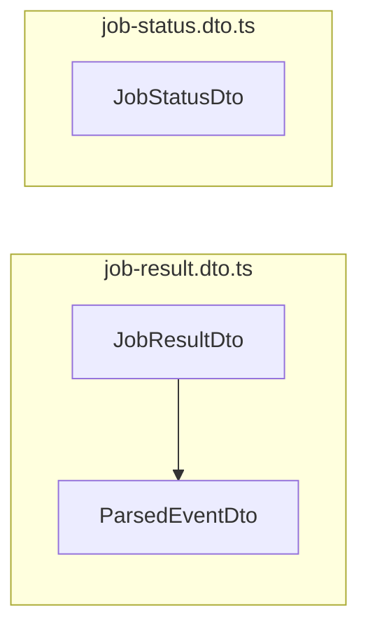

<!-- tyto-docs
tyto_docs: 1
kind: component
unit: backend/src/jobs/dto
title: Dto
status: current
written_at_commit: 3dec9a55a54dbbeb8d5864ed814e3fd9cc95a8ec
written_at: "2026-09-15T12:19:00.909Z"
research: backend/src/jobs/dto/DOCS/Research.md
sources: []
accepted:
  at: "2026-09-15T12:25:42.189Z"
  commit: 3dec9a55a54dbbeb8d5864ed814e3fd9cc95a8ec
  research_fingerprint: "sha256:ab3f60e3395a1730c2a5a7f87055396bf822d59153334c453e2f129abaf3ebce"
  research_findings:
    - research.backend-src-jobs-dto.16481720
    - research.backend-src-jobs-dto.30c730c8
    - research.backend-src-jobs-dto.37121d21
    - research.backend-src-jobs-dto.3ca8491a
    - research.backend-src-jobs-dto.554a1db5
    - research.backend-src-jobs-dto.66e75985
    - research.backend-src-jobs-dto.ced7f633
    - research.backend-src-jobs-dto.e2eefccc
    - research.backend-src-jobs-dto.f0a084ca
    - research.backend-src-jobs-dto.fa86a777
  critic_pass: critic.backend-src-jobs-dto.1
  sources:
    - path: backend/src/jobs/dto/index.ts
      blob_sha: 3273d40bc62f1f09dce2d2f304346599777fc1a2
    - path: backend/src/jobs/dto/job-result.dto.ts
      blob_sha: d8674fd7da58caba03fe07d59a38d3a5e924cc90
    - path: backend/src/jobs/dto/job-status.dto.ts
      blob_sha: c55a81e5f20a4f7a3443288ea7576b2c81117e63
evidence: Dto.evidence.md
critic:
  attempts: 1
  findings: []
  review_complete: true
  sections_reviewed: 7
  sections_total: 7
  last_reviewed_document: "sha256:fc8f8f1c30a9c171424636dc6e50ec41b92809c27efb5c19e3cffcbf7f4331ca"
  retired: []
-->

# Dto

<!-- tyto-docs:generated:status -->
> **Status: Current**
<!-- /tyto-docs:generated:status -->

## [Summary](Dto.evidence.md#summary)

The dto unit owns the request and response shapes the jobs module exchanges with its callers. It defines three exported DTO classes across two files: the parsed-event and job-result shapes of the PDF-parsing flow, and the job-status shape of the job lifecycle. <!-- ev:research.backend-src-jobs-dto.3ca8491a -->[1](Dto.evidence.md#research.backend-src-jobs-dto.3ca8491a) Dependants can rely on these classes to carry Swagger-documented payloads between the jobs controller and its clients. <!-- ev:research.backend-src-jobs-dto.f0a084ca -->[2](Dto.evidence.md#research.backend-src-jobs-dto.f0a084ca)

## [Purpose and boundaries](Dto.evidence.md#purpose-and-boundaries)

| | |
|---|---|
| Owns | The three exported DTO classes of the jobs module: ParsedEventDto and JobResultDto in job-result.dto.ts, and JobStatusDto in job-status.dto.ts, re-exported through the index.ts barrel. <!-- ev:research.backend-src-jobs-dto.3ca8491a -->[1](Dto.evidence.md#research.backend-src-jobs-dto.3ca8491a) <!-- ev:research.backend-src-jobs-dto.e2eefccc -->[3](Dto.evidence.md#research.backend-src-jobs-dto.e2eefccc) |
| Uses | class-validator's validation decorators and class-transformer's @Type to validate and transform DTO properties, and the shared ParsedEvent, JobStatus, and PdfType types from backend/src/common/types.ts. <!-- ev:research.backend-src-jobs-dto.554a1db5 -->[4](Dto.evidence.md#research.backend-src-jobs-dto.554a1db5) <!-- ev:research.backend-src-jobs-dto.16481720 -->[5](Dto.evidence.md#research.backend-src-jobs-dto.16481720) <!-- ev:research.backend-src-jobs-dto.66e75985 -->[6](Dto.evidence.md#research.backend-src-jobs-dto.66e75985) <!-- ev:research.backend-src-jobs-dto.30c730c8 -->[7](Dto.evidence.md#research.backend-src-jobs-dto.30c730c8) |
| Does not own | The jobs controller, which imports JobStatusDto and JobResultDto from './dto/index.js' and uses them as the Swagger response types for the GET /api/jobs/:id and GET /api/jobs/:id/result endpoints. <!-- ev:research.backend-src-jobs-dto.f0a084ca -->[2](Dto.evidence.md#research.backend-src-jobs-dto.f0a084ca) |

## [How it works](Dto.evidence.md#how-it-works)

job-result.dto.ts declares the two shapes of the PDF-parsing flow. ParsedEventDto implements the ParsedEvent interface and represents a single parsed calendar event, carrying the required id, module, activity, startTime, endTime, venue, and isRecurring fields plus optional group, day, and date fields. <!-- ev:research.backend-src-jobs-dto.37121d21 -->[8](Dto.evidence.md#research.backend-src-jobs-dto.37121d21) <!-- ev:research.backend-src-jobs-dto.ced7f633 -->[9](Dto.evidence.md#research.backend-src-jobs-dto.ced7f633) startTime and endTime are validated against the HH:MM 24-hour format, id with @IsUUID, isRecurring with @IsBoolean, and the optional fields as strings. <!-- ev:research.backend-src-jobs-dto.554a1db5 -->[4](Dto.evidence.md#research.backend-src-jobs-dto.554a1db5)

JobResultDto pairs a UUID id with an events array of ParsedEventDto, validated with @IsArray, @ValidateNested, and @Type. <!-- ev:research.backend-src-jobs-dto.16481720 -->[5](Dto.evidence.md#research.backend-src-jobs-dto.16481720)

job-status.dto.ts declares the shape of the job lifecycle. JobStatusDto carries a UUID id, a status typed by the JobStatus enum, a pdfType typed by the PdfType enum, and a createdAt Date, with optional completedAt (Date or null) and error (string or null) fields. <!-- ev:research.backend-src-jobs-dto.fa86a777 -->[10](Dto.evidence.md#research.backend-src-jobs-dto.fa86a777) status and pdfType are validated with @IsEnum, createdAt and completedAt with @IsDate and @Type(() => Date), and error as an optional string. <!-- ev:research.backend-src-jobs-dto.66e75985 -->[6](Dto.evidence.md#research.backend-src-jobs-dto.66e75985)

## [Interfaces](Dto.evidence.md#interfaces)

| Name | Input | Output | Guarantee |
|---|---|---|---|
| ParsedEventDto | — | A single parsed calendar event shape | Describes the required id, module, activity, startTime, endTime, venue, and isRecurring fields plus optional group, day, and date, with times validated against HH:MM <!-- ev:research.backend-src-jobs-dto.ced7f633 -->[9](Dto.evidence.md#research.backend-src-jobs-dto.ced7f633) <!-- ev:research.backend-src-jobs-dto.554a1db5 -->[4](Dto.evidence.md#research.backend-src-jobs-dto.554a1db5) |
| JobResultDto | — | A job result shape | Pairs a UUID id with an events array of ParsedEventDto, validated with @IsArray, @ValidateNested, and @Type <!-- ev:research.backend-src-jobs-dto.16481720 -->[5](Dto.evidence.md#research.backend-src-jobs-dto.16481720) |
| JobStatusDto | — | A job status shape | Carries a UUID id, a JobStatus status, a PdfType pdfType, and a createdAt Date, with optional completedAt and error <!-- ev:research.backend-src-jobs-dto.fa86a777 -->[10](Dto.evidence.md#research.backend-src-jobs-dto.fa86a777) <!-- ev:research.backend-src-jobs-dto.66e75985 -->[6](Dto.evidence.md#research.backend-src-jobs-dto.66e75985) |

<!-- tyto-docs:generated:endpoints -->
<!-- No framework adapter is active, so no endpoints were extracted for this unit. -->
<!-- /tyto-docs:generated:endpoints -->

## Source files

<!-- tyto-docs:generated:file-table -->
<!-- This unit owns no source files. -->
<!-- /tyto-docs:generated:file-table -->

## [Dependencies](Dto.evidence.md#dependencies)

| Dependency | Capability used | Why |
|---|---|---|
| class-validator | Validation decorators (@IsUUID, @IsBoolean, @Matches, @IsOptional, @IsArray, @ValidateNested, @IsEnum, @IsDate) | Validates DTO properties and nested event arrays <!-- ev:research.backend-src-jobs-dto.554a1db5 -->[4](Dto.evidence.md#research.backend-src-jobs-dto.554a1db5) <!-- ev:research.backend-src-jobs-dto.16481720 -->[5](Dto.evidence.md#research.backend-src-jobs-dto.16481720) <!-- ev:research.backend-src-jobs-dto.66e75985 -->[6](Dto.evidence.md#research.backend-src-jobs-dto.66e75985) |
| class-transformer | @Type decorator | Transforms nested ParsedEventDto and Date properties <!-- ev:research.backend-src-jobs-dto.16481720 -->[5](Dto.evidence.md#research.backend-src-jobs-dto.16481720) <!-- ev:research.backend-src-jobs-dto.66e75985 -->[6](Dto.evidence.md#research.backend-src-jobs-dto.66e75985) |
| backend/src/common/types.ts | ParsedEvent, JobStatus, and PdfType types | Shared type definitions the DTOs implement or reference <!-- ev:research.backend-src-jobs-dto.30c730c8 -->[7](Dto.evidence.md#research.backend-src-jobs-dto.30c730c8) |

<!-- tyto-docs:generated:module-graph -->

<!-- /tyto-docs:generated:module-graph -->

## [Data model](Dto.evidence.md#data-model)

This unit declares the three DTO classes that shape the jobs module's payloads. JobResultDto embeds ParsedEventDto in its events array, and JobStatusDto references the shared JobStatus and PdfType enums. <!-- ev:research.backend-src-jobs-dto.16481720 -->[5](Dto.evidence.md#research.backend-src-jobs-dto.16481720) <!-- ev:research.backend-src-jobs-dto.fa86a777 -->[10](Dto.evidence.md#research.backend-src-jobs-dto.fa86a777) <!-- ev:research.backend-src-jobs-dto.30c730c8 -->[7](Dto.evidence.md#research.backend-src-jobs-dto.30c730c8)

<!-- tyto-docs:generated:erd -->
<!-- This leaf unit has no descendant scope for a focused ERD. -->
<!-- /tyto-docs:generated:erd -->

<!-- tyto-docs:generated:navigation -->
- **Direct dependencies:** [Src common](../../../common/DOCS/Common.md)
- **Used by:** [Jobs](../../DOCS/Jobs.md)
- **Schedule:** 19 of 43, wave 1
<!-- /tyto-docs:generated:navigation -->