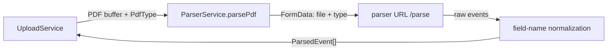
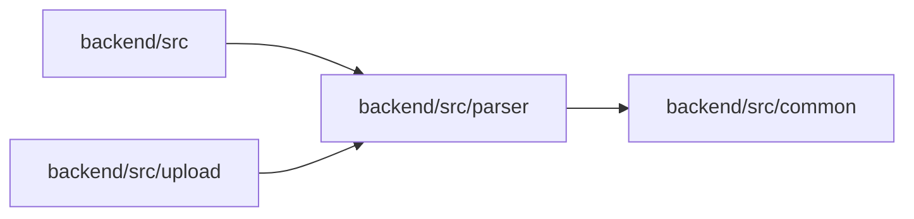

<!-- tyto-docs
tyto_docs: 1
kind: component
unit: backend/src/parser
title: Parser
status: current
written_at_commit: 87369fd19472142d7b940d0ee2eaf7b54ae99339
written_at: "2026-09-14T22:28:27.058Z"
research: backend/src/parser/DOCS/Research.md
sources: []
accepted:
  at: "2026-09-14T22:34:19.752Z"
  commit: 87369fd19472142d7b940d0ee2eaf7b54ae99339
  research_fingerprint: "sha256:9b6b34fae09834e7e4b6adfda4d8dfa3767af2520b3c4ecad7b7b8084ac59af6"
  research_findings:
    - research.backend-src-parser.1512ef80
    - research.backend-src-parser.3d5cb3fc
    - research.backend-src-parser.70006c63
    - research.backend-src-parser.7c1b30b5
    - research.backend-src-parser.87f7fa81
    - research.backend-src-parser.93ab1aed
    - research.backend-src-parser.96a8e4ef
    - research.backend-src-parser.ac8c4268
    - research.backend-src-parser.bb50db71
    - research.backend-src-parser.bcfc00c5
    - research.backend-src-parser.bf0fdbff
    - research.backend-src-parser.e56b44bf
  critic_pass: critic.backend-src-parser.1
  sources:
    - path: backend/src/parser/index.ts
      blob_sha: 7224a7b4f286038343b880f5f0b506d2b781276f
    - path: backend/src/parser/parser.module.ts
      blob_sha: e084d9a004b3336c44d790f9d6a756c8055b7090
    - path: backend/src/parser/parser.service.ts
      blob_sha: 7b5e30a20ce49603bc2cade6afaf32acef426549
evidence: Parser.evidence.md
critic:
  attempts: 1
  findings: []
  review_complete: true
  sections_reviewed: 8
  sections_total: 8
  last_reviewed_document: "sha256:cfef109cd0ccd487c4ee1c19309e60775a82221b2eacfa490533aaac2e601181"
  retired: []
-->

# Parser

<!-- tyto-docs:generated:status -->
> **Status: Current**
<!-- /tyto-docs:generated:status -->

## [Summary](Parser.evidence.md#summary)

The parser unit owns ParserModule and ParserService, the NestJS module and service that send PDF schedule files to the Python parser worker and translate the worker's response into the backend's ParsedEvent shape. <!-- ev:research.backend-src-parser.e56b44bf -->[1](Parser.evidence.md#research.backend-src-parser.e56b44bf) <!-- ev:research.backend-src-parser.87f7fa81 -->[2](Parser.evidence.md#research.backend-src-parser.87f7fa81) A dependant can rely on ParserService.parsePdf accepting a PDF buffer and a PdfType and returning a normalized array of parsed events. <!-- ev:research.backend-src-parser.1512ef80 -->[3](Parser.evidence.md#research.backend-src-parser.1512ef80)

## [Purpose and boundaries](Parser.evidence.md#purpose-and-boundaries)

| | |
|---|---|
| Owns | ParserModule and ParserService, the unit's two exported classes, plus the ParserResponse interface. <!-- ev:research.backend-src-parser.e56b44bf -->[1](Parser.evidence.md#research.backend-src-parser.e56b44bf) <!-- ev:research.backend-src-parser.3d5cb3fc -->[4](Parser.evidence.md#research.backend-src-parser.3d5cb3fc) The public entry point index.ts re-exports ParserModule, ParserService, and ParsedEventDto. <!-- ev:research.backend-src-parser.96a8e4ef -->[5](Parser.evidence.md#research.backend-src-parser.96a8e4ef) |
| Uses | HttpService and ConfigService, injected into ParserService, with the parser URL resolved from the 'parser.url' configuration value and defaulting to 'http://localhost:5000'. <!-- ev:research.backend-src-parser.7c1b30b5 -->[6](Parser.evidence.md#research.backend-src-parser.7c1b30b5) It also uses PdfType and ParsedEvent from backend/src/common/types.ts and FormData from the 'form-data' package. <!-- ev:research.backend-src-parser.ac8c4268 -->[7](Parser.evidence.md#research.backend-src-parser.ac8c4268) |
| Does not own | The Python worker that parses the PDF: ParserService only forwards the PDF to the worker's /parse endpoint and transforms the response. <!-- ev:research.backend-src-parser.1512ef80 -->[3](Parser.evidence.md#research.backend-src-parser.1512ef80) <!-- ev:research.backend-src-parser.87f7fa81 -->[2](Parser.evidence.md#research.backend-src-parser.87f7fa81) |

## [How it works](Parser.evidence.md#how-it-works)

ParserModule imports HttpModule registered with a 60000 millisecond timeout and maxRedirects 5, declares ParserService as a provider, and exports it. <!-- ev:research.backend-src-parser.93ab1aed -->[8](Parser.evidence.md#research.backend-src-parser.93ab1aed) ParserService injects HttpService and ConfigService through its constructor and resolves the parser service URL from the 'parser.url' configuration value, defaulting to 'http://localhost:5000'. <!-- ev:research.backend-src-parser.7c1b30b5 -->[6](Parser.evidence.md#research.backend-src-parser.7c1b30b5)

parsePdf accepts a PDF buffer and a PdfType, builds a FormData payload containing the file (named 'schedule.pdf' with content type 'application/pdf') and the type, and POSTs it to the parser URL's /parse endpoint with a 60-second timeout. <!-- ev:research.backend-src-parser.1512ef80 -->[3](Parser.evidence.md#research.backend-src-parser.1512ef80) Each event in the worker's response is mapped to the backend ParsedEvent interface, normalizing field names (Module/module, Offered/offered, Activity/activity, Group/group, Day/day, Date/date, start_time/startTime, end_time/endTime, Venue/venue/location) and defaulting isRecurring to true when it is undefined. <!-- ev:research.backend-src-parser.87f7fa81 -->[2](Parser.evidence.md#research.backend-src-parser.87f7fa81)

Events that arrive without an id are assigned one by the private generateEventId method (inferred from the response mapping), which uses crypto.randomUUID when available and falls back to generateUUIDv4, a template-based UUID v4 generator. <!-- ev:research.backend-src-parser.bf0fdbff -->[9](Parser.evidence.md#research.backend-src-parser.bf0fdbff) <!-- ev:research.backend-src-parser.bcfc00c5 -->[10](Parser.evidence.md#research.backend-src-parser.bcfc00c5) On failure, parsePdf logs the error via the NestJS logger and throws a new Error with the message 'Failed to parse PDF: <error message>'. <!-- ev:research.backend-src-parser.bb50db71 -->[11](Parser.evidence.md#research.backend-src-parser.bb50db71)

## [Interfaces](Parser.evidence.md#interfaces)

| Name | Input | Output | Guarantee |
|---|---|---|---|
| ParserService.parsePdf | A PDF buffer and a PdfType | ParsedEvent[] | POSTs the PDF to the parser URL's /parse endpoint with a 60-second timeout and returns events normalized to the backend ParsedEvent interface <!-- ev:research.backend-src-parser.1512ef80 -->[3](Parser.evidence.md#research.backend-src-parser.1512ef80) <!-- ev:research.backend-src-parser.87f7fa81 -->[2](Parser.evidence.md#research.backend-src-parser.87f7fa81) |
| ParserResponse | — | { events: ParsedEvent[] } | The unit's exported response shape: a single events property holding an array of ParsedEvent <!-- ev:research.backend-src-parser.3d5cb3fc -->[4](Parser.evidence.md#research.backend-src-parser.3d5cb3fc) |

<!-- tyto-docs:generated:endpoints -->
<!-- No framework adapter is active, so no endpoints were extracted for this unit. -->
<!-- /tyto-docs:generated:endpoints -->

## Source files

<!-- tyto-docs:generated:file-table -->
<!-- This unit owns no source files. -->
<!-- /tyto-docs:generated:file-table -->

## [Dependencies](Parser.evidence.md#dependencies)

| Dependency | Capability used | Why |
|---|---|---|
| @nestjs/axios | HttpModule and HttpService, registered with a 60000 ms timeout and maxRedirects 5 | Sends the PDF to the parser service's /parse endpoint <!-- ev:research.backend-src-parser.93ab1aed -->[8](Parser.evidence.md#research.backend-src-parser.93ab1aed) <!-- ev:research.backend-src-parser.1512ef80 -->[3](Parser.evidence.md#research.backend-src-parser.1512ef80) |
| @nestjs/config | ConfigService reading the 'parser.url' value | Resolves the parser service URL, defaulting to 'http://localhost:5000' <!-- ev:research.backend-src-parser.7c1b30b5 -->[6](Parser.evidence.md#research.backend-src-parser.7c1b30b5) |
| form-data | FormData payload construction | Builds the multipart body carrying the PDF file and the PdfType <!-- ev:research.backend-src-parser.ac8c4268 -->[7](Parser.evidence.md#research.backend-src-parser.ac8c4268) <!-- ev:research.backend-src-parser.1512ef80 -->[3](Parser.evidence.md#research.backend-src-parser.1512ef80) |
| backend/src/common/types.ts | PdfType and ParsedEvent types | Types the parse request and the normalized response <!-- ev:research.backend-src-parser.ac8c4268 -->[7](Parser.evidence.md#research.backend-src-parser.ac8c4268) |

<!-- tyto-docs:generated:module-graph -->

<!-- /tyto-docs:generated:module-graph -->

## [Data model](Parser.evidence.md#data-model)

The unit declares no entities of its own; it references ParsedEvent and PdfType from backend/src/common/types.ts and returns ParsedEvent instances from parsePdf. <!-- ev:research.backend-src-parser.ac8c4268 -->[7](Parser.evidence.md#research.backend-src-parser.ac8c4268)

<!-- tyto-docs:generated:erd -->
<!-- This leaf unit has no descendant scope for a focused ERD. -->
<!-- /tyto-docs:generated:erd -->

## [Decisions and limitations](Parser.evidence.md#decisions-and-limitations)

ParserService generates event ids with crypto.randomUUID when available, falling back to a template-based UUID v4 generator, so ids stay unique even where randomUUID is missing. <!-- ev:research.backend-src-parser.bf0fdbff -->[9](Parser.evidence.md#research.backend-src-parser.bf0fdbff) <!-- ev:research.backend-src-parser.bcfc00c5 -->[10](Parser.evidence.md#research.backend-src-parser.bcfc00c5) The parser URL defaults to 'http://localhost:5000' when 'parser.url' is not configured, so non-local deployments must set it explicitly. <!-- ev:research.backend-src-parser.7c1b30b5 -->[6](Parser.evidence.md#research.backend-src-parser.7c1b30b5)

<!-- tyto-docs:generated:navigation -->
- **Direct dependencies:** [Src common](../../common/DOCS/Common.md)
- **Used by:** [Src](../../DOCS/Src.md), [Src upload](../../upload/DOCS/Upload.md)
- **Schedule:** 20 of 43, wave 1
<!-- /tyto-docs:generated:navigation -->