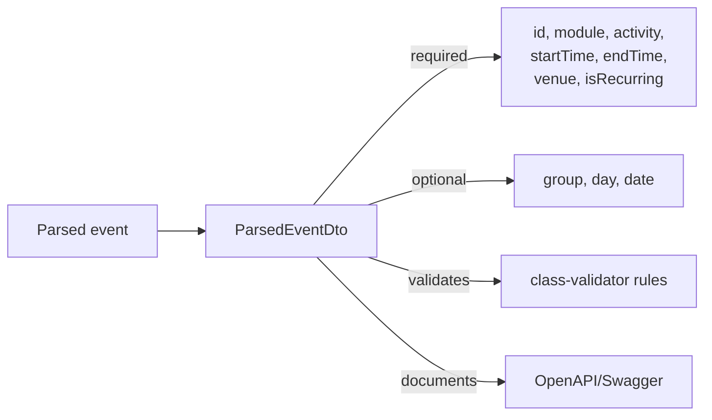

<!-- tyto-docs
tyto_docs: 1
kind: component
unit: backend/src/parser/dto
title: Dto
status: current
written_at_commit: 11085fe926ed4d64bae1ef5be06b93011e5d37ed
written_at: "2026-09-14T20:45:22.355Z"
research: backend/src/parser/dto/DOCS/Research.md
sources: []
accepted:
  at: "2026-09-14T20:48:14.185Z"
  commit: 11085fe926ed4d64bae1ef5be06b93011e5d37ed
  research_fingerprint: "sha256:df8d5b45b39e5119ebffee2ba145d796ea22df8fe56b4bc0beeefaa538a7474e"
  research_findings:
    - research.backend-src-parser-dto.6b15c218
    - research.backend-src-parser-dto.6d90d151
    - research.backend-src-parser-dto.a7c3ae29
    - research.backend-src-parser-dto.acf782fb
    - research.backend-src-parser-dto.e0cd8a63
  critic_pass: critic.backend-src-parser-dto.1
  sources:
    - path: backend/src/parser/dto/parsed-event.dto.ts
      blob_sha: 862c24f5c56ec190a931f6d16ac5a13b26ef516f
evidence: Dto.evidence.md
critic:
  attempts: 1
  findings: []
  review_complete: true
  sections_reviewed: 8
  sections_total: 8
  last_reviewed_document: "sha256:f6ded259a29512e7fe321e65ae441593d6e0d5ed836437327ac2ed9bf17b4603"
  retired: []
-->

# Dto

<!-- tyto-docs:generated:status -->
> **Status: Current**
<!-- /tyto-docs:generated:status -->

## [Summary](Dto.evidence.md#summary)

The parser DTO unit owns ParsedEventDto, the data transfer object that represents a parsed event. <!-- ev:research.backend-src-parser-dto.acf782fb -->[1](Dto.evidence.md#research.backend-src-parser-dto.acf782fb) It defines the event's shape — a unique identifier, module code, activity type, optional group, day and date, start and end times, venue, and a recurring flag — and validates each field with class-validator rules. <!-- ev:research.backend-src-parser-dto.e0cd8a63 -->[2](Dto.evidence.md#research.backend-src-parser-dto.e0cd8a63)

## [Purpose and boundaries](Dto.evidence.md#purpose-and-boundaries)

| | |
|---|---|
| Owns | ParsedEventDto, the single exported class in parsed-event.dto.ts, which represents a parsed event with fields for identifier, module, activity, optional group, day and date, start and end times, venue, and a recurring flag. <!-- ev:research.backend-src-parser-dto.a7c3ae29 -->[3](Dto.evidence.md#research.backend-src-parser-dto.a7c3ae29) <!-- ev:research.backend-src-parser-dto.acf782fb -->[1](Dto.evidence.md#research.backend-src-parser-dto.acf782fb) |
| Uses | class-validator decorators (IsUUID, IsString, IsOptional, IsBoolean, Matches) to validate fields, and @nestjs/swagger ApiProperty and ApiPropertyOptional to document them for OpenAPI. <!-- ev:research.backend-src-parser-dto.e0cd8a63 -->[2](Dto.evidence.md#research.backend-src-parser-dto.e0cd8a63) <!-- ev:research.backend-src-parser-dto.6b15c218 -->[4](Dto.evidence.md#research.backend-src-parser-dto.6b15c218) |
| Does not own | Any other parser code: the unit contains a single source file, parsed-event.dto.ts, and nothing else. <!-- ev:research.backend-src-parser-dto.a7c3ae29 -->[3](Dto.evidence.md#research.backend-src-parser-dto.a7c3ae29) |

## [How it works](Dto.evidence.md#how-it-works)

ParsedEventDto declares its fields as class properties: id, module, activity, startTime, endTime, venue and isRecurring are required, while group, day and date are optional. <!-- ev:research.backend-src-parser-dto.6d90d151 -->[5](Dto.evidence.md#research.backend-src-parser-dto.6d90d151) Each field carries class-validator decorators that enforce its type — id must be a UUID, startTime and endTime must match the HH:MM format, isRecurring must be a boolean, and the remaining fields must be strings. <!-- ev:research.backend-src-parser-dto.e0cd8a63 -->[2](Dto.evidence.md#research.backend-src-parser-dto.e0cd8a63) The same fields are annotated with ApiProperty and ApiPropertyOptional from @nestjs/swagger, so the DTO's shape is documented in the OpenAPI/Swagger output. <!-- ev:research.backend-src-parser-dto.6b15c218 -->[4](Dto.evidence.md#research.backend-src-parser-dto.6b15c218)

## [Interfaces](Dto.evidence.md#interfaces)

| Name | Input | Output | Guarantee |
|---|---|---|---|
| ParsedEventDto | Field values assigned to the class properties | A validated, typed ParsedEventDto instance | Represents a parsed event; required fields id, module, activity, startTime, endTime, venue and isRecurring, optional group, day and date, each validated by class-validator rules <!-- ev:research.backend-src-parser-dto.acf782fb -->[1](Dto.evidence.md#research.backend-src-parser-dto.acf782fb) <!-- ev:research.backend-src-parser-dto.6d90d151 -->[5](Dto.evidence.md#research.backend-src-parser-dto.6d90d151) <!-- ev:research.backend-src-parser-dto.e0cd8a63 -->[2](Dto.evidence.md#research.backend-src-parser-dto.e0cd8a63) |

<!-- tyto-docs:generated:endpoints -->
<!-- No framework adapter is active, so no endpoints were extracted for this unit. -->
<!-- /tyto-docs:generated:endpoints -->

## Source files

<!-- tyto-docs:generated:file-table -->
<!-- This unit owns no source files. -->
<!-- /tyto-docs:generated:file-table -->

## [Dependencies](Dto.evidence.md#dependencies)

| Dependency | Capability used | Why |
|---|---|---|
| class-validator | Validation decorators: IsUUID, IsString, IsOptional, IsBoolean, Matches | Enforces each field's type and format on the DTO <!-- ev:research.backend-src-parser-dto.e0cd8a63 -->[2](Dto.evidence.md#research.backend-src-parser-dto.e0cd8a63) |
| @nestjs/swagger | ApiProperty and ApiPropertyOptional decorators | Documents the DTO's fields in the OpenAPI/Swagger output <!-- ev:research.backend-src-parser-dto.6b15c218 -->[4](Dto.evidence.md#research.backend-src-parser-dto.6b15c218) |

<!-- tyto-docs:generated:module-graph -->
<!-- No module dependency graph is available for this unit. -->
<!-- /tyto-docs:generated:module-graph -->

## [Data model](Dto.evidence.md#data-model)

ParsedEventDto is the unit's single entity: a data transfer object whose fields describe a parsed event. <!-- ev:research.backend-src-parser-dto.acf782fb -->[1](Dto.evidence.md#research.backend-src-parser-dto.acf782fb)

<!-- tyto-docs:generated:erd -->
<!-- This leaf unit has no descendant scope for a focused ERD. -->
<!-- /tyto-docs:generated:erd -->

## [Decisions and limitations](Dto.evidence.md#decisions-and-limitations)

startTime and endTime are restricted to the HH:MM format, so times carrying seconds or timezone offsets are rejected by validation. <!-- ev:research.backend-src-parser-dto.e0cd8a63 -->[2](Dto.evidence.md#research.backend-src-parser-dto.e0cd8a63)

<!-- tyto-docs:generated:navigation -->
- **Schedule:** 17 of 30, wave 1
<!-- /tyto-docs:generated:navigation -->