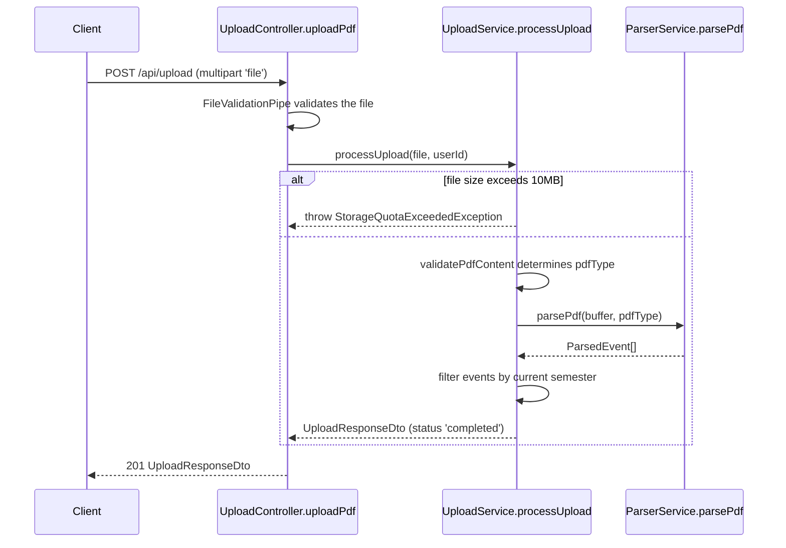

<!-- tyto-docs
tyto_docs: 1
kind: component
unit: backend/src/upload
title: Upload
status: draft
written_at_commit: 7a91408556d2a22dae2e32d717dd8d5d58cc6797
written_at: "2026-09-15T08:05:20.379Z"
research: backend/src/upload/DOCS/Research.md
sources: []
accepted: null
evidence: Upload.evidence.md
critic:
  attempts: 0
  findings: []
-->

# Upload

<!-- tyto-docs:generated:status -->
<!-- /tyto-docs:generated:status -->

## [Summary](Upload.evidence.md#summary)

The upload unit owns the backend's PDF intake: the UploadModule wiring, the POST /api/upload endpoint, and the UploadService that turns an uploaded Tuks schedule PDF into parsed events. Dependants can rely on it to accept a multipart PDF upload, enforce the 10MB per-file limit, detect the schedule type, and return a completed UploadResponseDto carrying the parsed events. <!-- ev:research.backend-src-upload.c520e981 -->[1](Upload.evidence.md#research.backend-src-upload.c520e981) <!-- ev:research.backend-src-upload.6c2dff47 -->[2](Upload.evidence.md#research.backend-src-upload.6c2dff47) <!-- ev:research.backend-src-upload.de6a3d56 -->[3](Upload.evidence.md#research.backend-src-upload.de6a3d56) <!-- ev:research.backend-src-upload.b64e5ae9 -->[4](Upload.evidence.md#research.backend-src-upload.b64e5ae9)

## [Purpose and boundaries](Upload.evidence.md#purpose-and-boundaries)

| | |
|---|---|
| Owns | The upload module's intake path: UploadModule, which imports ParserModule, declares UploadController, and provides and exports UploadService; the POST /api/upload endpoint, tagged 'Upload' and throttled to 5 uploads per minute per client; and UploadService, which enforces a 10MB per-file limit and processes uploads synchronously. <!-- ev:research.backend-src-upload.c520e981 -->[1](Upload.evidence.md#research.backend-src-upload.c520e981) <!-- ev:research.backend-src-upload.6c2dff47 -->[2](Upload.evidence.md#research.backend-src-upload.6c2dff47) <!-- ev:research.backend-src-upload.de6a3d56 -->[3](Upload.evidence.md#research.backend-src-upload.de6a3d56) |
| Uses | ParserService (via ParserModule) to parse PDFs into events; validatePdfContent from the common validators to detect the PDF type; FileValidationPipe from the common pipes to validate the uploaded file; ConfigService for the semester date environment variables; and the upload dto and exceptions units for the response shape and the quota error. <!-- ev:research.backend-src-upload.390b08a8 -->[5](Upload.evidence.md#research.backend-src-upload.390b08a8) <!-- ev:research.backend-src-upload.a287c912 -->[6](Upload.evidence.md#research.backend-src-upload.a287c912) <!-- ev:research.backend-src-upload.a78b71f0 -->[7](Upload.evidence.md#research.backend-src-upload.a78b71f0) <!-- ev:research.backend-src-upload.9fb6b98f -->[8](Upload.evidence.md#research.backend-src-upload.9fb6b98f) <!-- ev:research.backend-src-upload.b64e5ae9 -->[4](Upload.evidence.md#research.backend-src-upload.b64e5ae9) <!-- ev:research.backend-src-upload.ff4e8daa -->[9](Upload.evidence.md#research.backend-src-upload.ff4e8daa) |
| Does not own | The response and error DTOs (upload dto unit), StorageQuotaExceededException (upload exceptions unit), and the PDF parsing logic (parser unit); index.ts is only a barrel that re-exports the module, service, controller, and upload-response DTO. <!-- ev:research.backend-src-upload.2d7939f6 -->[10](Upload.evidence.md#research.backend-src-upload.2d7939f6) <!-- ev:research.backend-src-upload.b64e5ae9 -->[4](Upload.evidence.md#research.backend-src-upload.b64e5ae9) <!-- ev:research.backend-src-upload.ff4e8daa -->[9](Upload.evidence.md#research.backend-src-upload.ff4e8daa) <!-- ev:research.backend-src-upload.390b08a8 -->[5](Upload.evidence.md#research.backend-src-upload.390b08a8) |

## [How it works](Upload.evidence.md#how-it-works)

UploadController.uploadPdf receives the uploaded file through @UploadedFile(new FileValidationPipe()) and derives the user ID from the session's passport user, then hands both to UploadService.processUpload. <!-- ev:research.backend-src-upload.0ef9b720 -->[11](Upload.evidence.md#research.backend-src-upload.0ef9b720) <!-- ev:research.backend-src-upload.4a5435f0 -->[12](Upload.evidence.md#research.backend-src-upload.4a5435f0)

processUpload first checks the file's buffer size against the 10MB MAX_FILE_SIZE and throws StorageQuotaExceededException when the file is too large. <!-- ev:research.backend-src-upload.ff4e8daa -->[9](Upload.evidence.md#research.backend-src-upload.ff4e8daa) <!-- ev:research.backend-src-upload.de6a3d56 -->[3](Upload.evidence.md#research.backend-src-upload.de6a3d56) It then validates the PDF content with validatePdfContent to determine the type (lecture, test, or exam), rethrowing any validation error as a BadRequestException. <!-- ev:research.backend-src-upload.a287c912 -->[6](Upload.evidence.md#research.backend-src-upload.a287c912) A random UUID job ID is generated with uuidv4 for frontend compatibility; in stateless mode the ID is local to the request/response cycle. <!-- ev:research.backend-src-upload.1c2ae083 -->[13](Upload.evidence.md#research.backend-src-upload.1c2ae083)

Parsing is delegated to ParserService.parsePdf with the file buffer and the detected PDF type; any parse failure is rethrown as a BadRequestException prefixed 'Failed to parse PDF:'. <!-- ev:research.backend-src-upload.390b08a8 -->[5](Upload.evidence.md#research.backend-src-upload.390b08a8) The parsed events are then filtered by the current semester: events with no semester info and year modules ('Y') are kept, as are events matching the current semester, and when filtering removes every event the original events are restored. <!-- ev:research.backend-src-upload.1acb5b6d -->[14](Upload.evidence.md#research.backend-src-upload.1acb5b6d)

processUpload returns an UploadResponseDto with the job ID, PDF type, status 'completed', the filtered events, a success message, and semester dates when a semester was detected. <!-- ev:research.backend-src-upload.b64e5ae9 -->[4](Upload.evidence.md#research.backend-src-upload.b64e5ae9) Two deprecated methods remain: releaseStorageForJob is a no-op and getStorageUsage returns dummy values, both because stateless mode uses no storage. <!-- ev:research.backend-src-upload.f9aa8124 -->[15](Upload.evidence.md#research.backend-src-upload.f9aa8124) <!-- ev:research.backend-src-upload.32e10734 -->[16](Upload.evidence.md#research.backend-src-upload.32e10734)

Semester detection reads FIRST_SEMESTER_START, FIRST_SEMESTER_END, SECOND_SEMESTER_START, and SECOND_SEMESTER_END from ConfigService: getCurrentSemesterInfo returns the current or next semester, or null when any variable is unset, and getSemesterDates returns the configured range for a given semester. <!-- ev:research.backend-src-upload.9fb6b98f -->[8](Upload.evidence.md#research.backend-src-upload.9fb6b98f) <!-- ev:research.backend-src-upload.a5f9aecc -->[17](Upload.evidence.md#research.backend-src-upload.a5f9aecc)

## [Interfaces](Upload.evidence.md#interfaces)

| Name | Input | Output | Guarantee |
|---|---|---|---|
| POST /api/upload (UploadController.uploadPdf) | multipart/form-data with a single file field named 'file' | UploadResponseDto (201), StorageQuotaExceededDto (413), or ErrorResponseDto (400) | Validates the file with FileValidationPipe, throttles to 5 uploads per minute per client, and returns the processed result <!-- ev:research.backend-src-upload.6c2dff47 -->[2](Upload.evidence.md#research.backend-src-upload.6c2dff47) <!-- ev:research.backend-src-upload.a78b71f0 -->[7](Upload.evidence.md#research.backend-src-upload.a78b71f0) <!-- ev:research.backend-src-upload.29dd44f7 -->[18](Upload.evidence.md#research.backend-src-upload.29dd44f7) <!-- ev:research.backend-src-upload.0ef9b720 -->[11](Upload.evidence.md#research.backend-src-upload.0ef9b720) |
| UploadService.processUpload | MulterFile, optional user ID | Promise<UploadResponseDto> | Enforces the 10MB per-file limit, detects the PDF type, parses and filters events, and returns a completed response <!-- ev:research.backend-src-upload.de6a3d56 -->[3](Upload.evidence.md#research.backend-src-upload.de6a3d56) <!-- ev:research.backend-src-upload.b64e5ae9 -->[4](Upload.evidence.md#research.backend-src-upload.b64e5ae9) |
| UploadService.releaseStorageForJob | job ID | Promise<void> | Deprecated no-op; stateless mode uses no storage <!-- ev:research.backend-src-upload.f9aa8124 -->[15](Upload.evidence.md#research.backend-src-upload.f9aa8124) |
| UploadService.getStorageUsage | user ID | Storage usage with usedBytes, quotaBytes, usedPercentage, availableBytes | Deprecated; returns dummy values with MAX_FILE_SIZE as the quota <!-- ev:research.backend-src-upload.32e10734 -->[16](Upload.evidence.md#research.backend-src-upload.32e10734) |

<!-- tyto-docs:generated:endpoints -->
<!-- /tyto-docs:generated:endpoints -->

## Source files

<!-- tyto-docs:generated:file-table -->
<!-- /tyto-docs:generated:file-table -->

## [Dependencies](Upload.evidence.md#dependencies)

| Dependency | Capability used | Why |
|---|---|---|
| ParserModule / ParserService (parser unit) | PDF parsing into events | UploadModule imports ParserModule and processUpload delegates to ParserService.parsePdf <!-- ev:research.backend-src-upload.c520e981 -->[1](Upload.evidence.md#research.backend-src-upload.c520e981) <!-- ev:research.backend-src-upload.390b08a8 -->[5](Upload.evidence.md#research.backend-src-upload.390b08a8) |
| ConfigService (@nestjs/config) | Semester date configuration | getCurrentSemesterInfo and getSemesterDates read the semester environment variables <!-- ev:research.backend-src-upload.9fb6b98f -->[8](Upload.evidence.md#research.backend-src-upload.9fb6b98f) <!-- ev:research.backend-src-upload.a5f9aecc -->[17](Upload.evidence.md#research.backend-src-upload.a5f9aecc) |
| validatePdfContent (common validators) | PDF type detection | processUpload validates content to determine the lecture, test, or exam type <!-- ev:research.backend-src-upload.a287c912 -->[6](Upload.evidence.md#research.backend-src-upload.a287c912) |
| FileValidationPipe (common pipes) | Uploaded file validation | uploadPdf applies it via @UploadedFile before processing <!-- ev:research.backend-src-upload.a78b71f0 -->[7](Upload.evidence.md#research.backend-src-upload.a78b71f0) <!-- ev:research.backend-src-upload.0ef9b720 -->[11](Upload.evidence.md#research.backend-src-upload.0ef9b720) |
| UploadResponseDto (upload dto unit) | Response shape | processUpload returns it with job ID, type, status, events, message, and semester dates <!-- ev:research.backend-src-upload.b64e5ae9 -->[4](Upload.evidence.md#research.backend-src-upload.b64e5ae9) |
| StorageQuotaExceededException (upload exceptions unit) | 413 quota error | processUpload throws it when the file exceeds the 10MB limit <!-- ev:research.backend-src-upload.ff4e8daa -->[9](Upload.evidence.md#research.backend-src-upload.ff4e8daa) |
| @nestjs/throttler (Throttle) | Rate limiting | The endpoint allows 5 uploads per minute per client <!-- ev:research.backend-src-upload.6c2dff47 -->[2](Upload.evidence.md#research.backend-src-upload.6c2dff47) |
| uuid (uuidv4) | Job ID generation | processUpload generates a random UUID for frontend compatibility <!-- ev:research.backend-src-upload.1c2ae083 -->[13](Upload.evidence.md#research.backend-src-upload.1c2ae083) |

<!-- tyto-docs:generated:module-graph -->
<!-- /tyto-docs:generated:module-graph -->

## [Data model](Upload.evidence.md#data-model)

This unit declares no entities of its own: the response it returns is an UploadResponseDto owned by the upload dto unit, and the events it carries are ParsedEvent values produced by the parser unit. <!-- ev:research.backend-src-upload.b64e5ae9 -->[4](Upload.evidence.md#research.backend-src-upload.b64e5ae9)

<!-- tyto-docs:generated:erd -->
<!-- /tyto-docs:generated:erd -->

## [Decisions and limitations](Upload.evidence.md#decisions-and-limitations)

The upload path is stateless: job IDs are random UUIDs local to the request/response cycle, releaseStorageForJob is a no-op, and getStorageUsage returns dummy values, so nothing survives the response. <!-- ev:research.backend-src-upload.1c2ae083 -->[13](Upload.evidence.md#research.backend-src-upload.1c2ae083) <!-- ev:research.backend-src-upload.f9aa8124 -->[15](Upload.evidence.md#research.backend-src-upload.f9aa8124) <!-- ev:research.backend-src-upload.32e10734 -->[16](Upload.evidence.md#research.backend-src-upload.32e10734) Semester filtering reverts to the original events when it would remove all of them, which happens when a file for a different semester is uploaded; and when any semester environment variable is unset, getCurrentSemesterInfo returns null and no filtering occurs. <!-- ev:research.backend-src-upload.1acb5b6d -->[14](Upload.evidence.md#research.backend-src-upload.1acb5b6d) <!-- ev:research.backend-src-upload.9fb6b98f -->[8](Upload.evidence.md#research.backend-src-upload.9fb6b98f)

<!-- tyto-docs:generated:navigation -->
<!-- /tyto-docs:generated:navigation -->