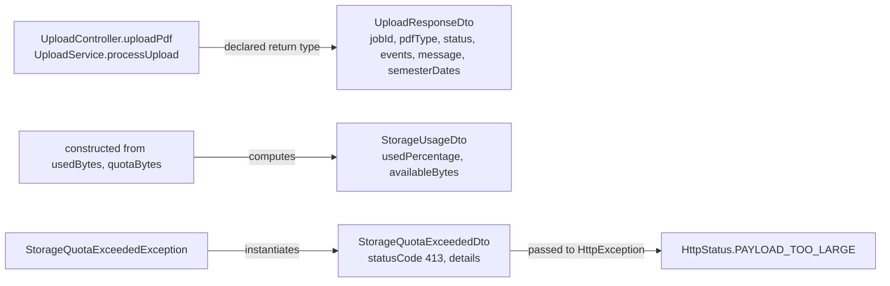
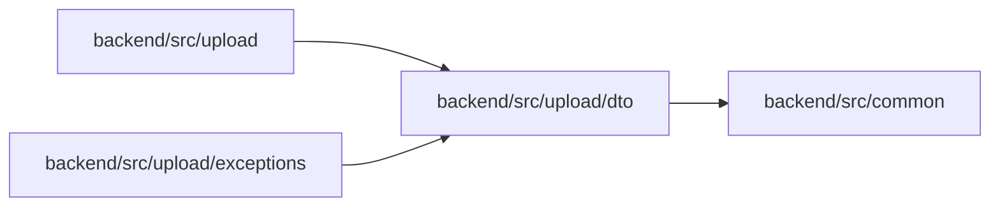

<!-- tyto-docs
tyto_docs: 1
kind: component
unit: backend/src/upload/dto
title: Dto
status: draft
written_at_commit: 410140243e8024e19688be0c0911b04ee4c66dd6
written_at: "2026-09-14T21:41:37.457Z"
research: backend/src/upload/dto/DOCS/Research.md
sources: []
accepted: null
evidence: Dto.evidence.md
critic:
  attempts: 1
  findings:
    - key: critic.backend-src-upload-dto.8bb85862
      owner: writer
      claim: "The document states 'The three DTOs are plain classes built by explicit constructors' (How it works) and 'each a plain class whose constructor fixes or computes its fields' (Data model), but UploadResponseDto declares no constructor: its fields are set via definite-assignment declarations and decorators (upload-response.dto.ts L6-L60). Only StorageUsageDto and StorageQuotaExceededDto have explicit constructors. The cited findings (research.backend-src-upload-dto.af8a9e0e, .0f841c82, .7ff4b838) do not support a constructor for UploadResponseDto, so the sentence misrepresents the evidence."
      locus:
        document_section: "How it works"
      severity: blocking
      raised_at: "2026-09-14T23:41:00+02:00"
      raised_in_pass: critic-036
  review_complete: true
  sections_reviewed: 8
  sections_total: 8
  last_reviewed_document: "sha256:48dc2e63620622b3bf602cf95972942631d4ab8a777e33f2ce17e58b4e8f2c0f"
-->

# Dto

<!-- tyto-docs:generated:status -->
> **Status: Draft**
<!-- /tyto-docs:generated:status -->

## [Summary](Dto.evidence.md#summary)

The dto unit owns the upload module's data-transfer types: the response shape for the upload endpoint, the storage-usage report, and the storage-quota error body. Dependants can rely on these classes to carry the upload result, usage figures, and quota-exceeded details consistently across the controller, service, and exception layers. <!-- ev:research.backend-src-upload-dto.af8a9e0e -->[1](Dto.evidence.md#research.backend-src-upload-dto.af8a9e0e) <!-- ev:research.backend-src-upload-dto.0f841c82 -->[2](Dto.evidence.md#research.backend-src-upload-dto.0f841c82) <!-- ev:research.backend-src-upload-dto.7ff4b838 -->[3](Dto.evidence.md#research.backend-src-upload-dto.7ff4b838)

## [Purpose and boundaries](Dto.evidence.md#purpose-and-boundaries)

| | |
|---|---|
| Owns | The upload module's data-transfer types: UploadResponseDto, the upload endpoint's response shape; StorageUsageDto, the storage-usage report; and StorageQuotaExceededDto, the HTTP 413 error body. <!-- ev:research.backend-src-upload-dto.af8a9e0e -->[1](Dto.evidence.md#research.backend-src-upload-dto.af8a9e0e) <!-- ev:research.backend-src-upload-dto.0f841c82 -->[2](Dto.evidence.md#research.backend-src-upload-dto.0f841c82) <!-- ev:research.backend-src-upload-dto.7ff4b838 -->[3](Dto.evidence.md#research.backend-src-upload-dto.7ff4b838) |
| Uses | PdfType and ParsedEvent from backend/src/common/types.ts to type UploadResponseDto's pdfType and events fields, and NestJS Swagger, class-validator, and class-transformer decorators to describe and validate them. <!-- ev:research.backend-src-upload-dto.884c10ce -->[4](Dto.evidence.md#research.backend-src-upload-dto.884c10ce) <!-- ev:research.backend-src-upload-dto.1c90203b -->[5](Dto.evidence.md#research.backend-src-upload-dto.1c90203b) |
| Does not own | StorageQuotaExceededException, which instantiates StorageQuotaExceededDto and passes it to HttpException with HttpStatus.PAYLOAD_TOO_LARGE; UploadController.uploadPdf and UploadService.processUpload, which declare UploadResponseDto as their return type. <!-- ev:research.backend-src-upload-dto.5fdc6946 -->[6](Dto.evidence.md#research.backend-src-upload-dto.5fdc6946) <!-- ev:research.backend-src-upload-dto.f2d958d5 -->[7](Dto.evidence.md#research.backend-src-upload-dto.f2d958d5) |

## [How it works](Dto.evidence.md#how-it-works)

The three DTOs are plain classes built by explicit constructors. UploadResponseDto is the upload endpoint's declared return type: UploadController.uploadPdf and UploadService.processUpload both return it, carrying the job id, the detected PDF type, the processing status, parsed events, a message, and detected semester dates. <!-- ev:research.backend-src-upload-dto.f2d958d5 -->[7](Dto.evidence.md#research.backend-src-upload-dto.f2d958d5) <!-- ev:research.backend-src-upload-dto.af8a9e0e -->[1](Dto.evidence.md#research.backend-src-upload-dto.af8a9e0e)

Its fields are typed: jobId is a UUID string, pdfType is a PdfType enum value, status is 'completed' or 'failed', events is an optional ParsedEvent array, and semesterDates is an optional object with semester, startDate, and endDate. <!-- ev:research.backend-src-upload-dto.0f7f178a -->[8](Dto.evidence.md#research.backend-src-upload-dto.0f7f178a) Swagger ApiProperty and class-validator decorators (IsUUID, IsEnum, IsString, IsArray, ValidateNested, IsOptional) plus a class-transformer Type decorator describe and validate those fields. <!-- ev:research.backend-src-upload-dto.1c90203b -->[5](Dto.evidence.md#research.backend-src-upload-dto.1c90203b)

StorageUsageDto models storage usage: its constructor takes usedBytes and quotaBytes, computes usedPercentage as Math.round((usedBytes / quotaBytes) * 100), and derives availableBytes as quotaBytes - usedBytes. <!-- ev:research.backend-src-upload-dto.0f841c82 -->[2](Dto.evidence.md#research.backend-src-upload-dto.0f841c82) <!-- ev:research.backend-src-upload-dto.1f924985 -->[9](Dto.evidence.md#research.backend-src-upload-dto.1f924985)

StorageQuotaExceededDto models the HTTP 413 response body for a storage-quota-exceeded error. Its constructor takes currentUsage, quota, and fileSize, fixes statusCode to 413, message to 'STORAGE_QUOTA_EXCEEDED', and error to 'Storage quota exceeded', and computes wouldExceedBy as currentUsage + fileSize - quota. <!-- ev:research.backend-src-upload-dto.7ff4b838 -->[3](Dto.evidence.md#research.backend-src-upload-dto.7ff4b838) <!-- ev:research.backend-src-upload-dto.f24995c3 -->[10](Dto.evidence.md#research.backend-src-upload-dto.f24995c3) StorageQuotaExceededException, in the upload exceptions unit, instantiates the DTO and passes it to HttpException with HttpStatus.PAYLOAD_TOO_LARGE. <!-- ev:research.backend-src-upload-dto.5fdc6946 -->[6](Dto.evidence.md#research.backend-src-upload-dto.5fdc6946)

## [Interfaces](Dto.evidence.md#interfaces)

| Name | Input | Output | Guarantee |
|---|---|---|---|
| UploadResponseDto | jobId (UUID), pdfType (PdfType), status ('completed' \| 'failed'), events (ParsedEvent[]), message, semesterDates | The upload endpoint's response object | Declared return type of UploadController.uploadPdf and UploadService.processUpload; fields described by Swagger and validated by class-validator <!-- ev:research.backend-src-upload-dto.af8a9e0e -->[1](Dto.evidence.md#research.backend-src-upload-dto.af8a9e0e) <!-- ev:research.backend-src-upload-dto.0f7f178a -->[8](Dto.evidence.md#research.backend-src-upload-dto.0f7f178a) <!-- ev:research.backend-src-upload-dto.f2d958d5 -->[7](Dto.evidence.md#research.backend-src-upload-dto.f2d958d5) <!-- ev:research.backend-src-upload-dto.1c90203b -->[5](Dto.evidence.md#research.backend-src-upload-dto.1c90203b) |
| StorageUsageDto | usedBytes, quotaBytes — numbers | Storage usage with usedPercentage and availableBytes | Constructor derives usedPercentage and availableBytes from the two byte counts <!-- ev:research.backend-src-upload-dto.0f841c82 -->[2](Dto.evidence.md#research.backend-src-upload-dto.0f841c82) <!-- ev:research.backend-src-upload-dto.1f924985 -->[9](Dto.evidence.md#research.backend-src-upload-dto.1f924985) |
| StorageQuotaExceededDto | currentUsage, quota, fileSize — numbers | HTTP 413 response body with statusCode, message, error, and details | Constructor fixes statusCode 413 and message 'STORAGE_QUOTA_EXCEEDED', and computes wouldExceedBy <!-- ev:research.backend-src-upload-dto.7ff4b838 -->[3](Dto.evidence.md#research.backend-src-upload-dto.7ff4b838) <!-- ev:research.backend-src-upload-dto.f24995c3 -->[10](Dto.evidence.md#research.backend-src-upload-dto.f24995c3) |

<!-- tyto-docs:generated:endpoints -->
<!-- No framework adapter is active, so no endpoints were extracted for this unit. -->
<!-- /tyto-docs:generated:endpoints -->

## Source files

<!-- tyto-docs:generated:file-table -->
<!-- This unit owns no source files. -->
<!-- /tyto-docs:generated:file-table -->

## [Dependencies](Dto.evidence.md#dependencies)

| Dependency | Capability used | Why |
|---|---|---|
| backend/src/common/types.ts (PdfType, ParsedEvent) | Types for the PDF type and parsed events | UploadResponseDto types its pdfType and events fields with them <!-- ev:research.backend-src-upload-dto.884c10ce -->[4](Dto.evidence.md#research.backend-src-upload-dto.884c10ce) |
| @nestjs/swagger (ApiProperty) | OpenAPI field descriptions | UploadResponseDto decorates its fields for Swagger documentation <!-- ev:research.backend-src-upload-dto.1c90203b -->[5](Dto.evidence.md#research.backend-src-upload-dto.1c90203b) |
| class-validator (IsUUID, IsEnum, IsString, IsArray, ValidateNested, IsOptional) | Runtime field validation | UploadResponseDto validates its fields with these decorators <!-- ev:research.backend-src-upload-dto.1c90203b -->[5](Dto.evidence.md#research.backend-src-upload-dto.1c90203b) |
| class-transformer (Type) | Nested type transformation | UploadResponseDto transforms the events array with the Type decorator <!-- ev:research.backend-src-upload-dto.1c90203b -->[5](Dto.evidence.md#research.backend-src-upload-dto.1c90203b) |

<!-- tyto-docs:generated:module-graph -->

<!-- /tyto-docs:generated:module-graph -->

## [Data model](Dto.evidence.md#data-model)

This unit declares three data-transfer entities — UploadResponseDto, StorageUsageDto, and StorageQuotaExceededDto — each a plain class whose constructor fixes or computes its fields. The types they reference, PdfType and ParsedEvent, are owned by backend/src/common/types.ts. <!-- ev:research.backend-src-upload-dto.884c10ce -->[4](Dto.evidence.md#research.backend-src-upload-dto.884c10ce)

<!-- tyto-docs:generated:erd -->
<!-- This leaf unit has no descendant scope for a focused ERD. -->
<!-- /tyto-docs:generated:erd -->

## [Decisions and limitations](Dto.evidence.md#decisions-and-limitations)

StorageQuotaExceededDto hard-codes its HTTP semantics: the constructor fixes statusCode to 413 and message to 'STORAGE_QUOTA_EXCEEDED', coupling the DTO to the quota error rather than a generic error body. <!-- ev:research.backend-src-upload-dto.f24995c3 -->[10](Dto.evidence.md#research.backend-src-upload-dto.f24995c3) StorageUsageDto rounds usedPercentage to a whole number, so the reported percentage is an approximation. <!-- ev:research.backend-src-upload-dto.1f924985 -->[9](Dto.evidence.md#research.backend-src-upload-dto.1f924985)

<!-- tyto-docs:generated:navigation -->
- **Used by:** [Exceptions](../../exceptions/DOCS/Exceptions.md)
- **Schedule:** 18 of 30, wave 1
<!-- /tyto-docs:generated:navigation -->