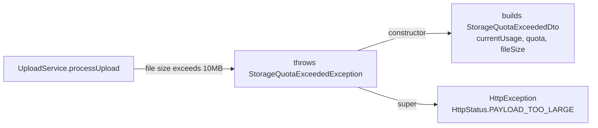

<!-- tyto-docs
tyto_docs: 1
kind: component
unit: backend/src/upload/exceptions
title: Exceptions
status: current
written_at_commit: d3bd41dd2382f5789a727f7926a746d605ca012d
written_at: "2026-09-14T18:42:06.191Z"
research: backend/src/upload/exceptions/DOCS/Research.md
sources: []
accepted:
  at: "2026-09-14T18:46:32.214Z"
  commit: d3bd41dd2382f5789a727f7926a746d605ca012d
  research_fingerprint: "sha256:e4afd5d27ac61db9404161c9414c01fb26b2afe4f772010594976bc8bab2a720"
  research_findings:
    - research.backend-src-upload-exceptions.4ca6495a
    - research.backend-src-upload-exceptions.6e62d2af
    - research.backend-src-upload-exceptions.eacb61cc
  critic_pass: critic.backend-src-upload-exceptions.1
  sources:
    - path: backend/src/upload/exceptions/storage-quota-exceeded.exception.ts
      blob_sha: 195d3a3fff9ab955fa38fc99e4277b96fbe2a9ba
evidence: Exceptions.evidence.md
critic:
  attempts: 1
  findings: []
  review_complete: true
  sections_reviewed: 6
  sections_total: 6
  last_reviewed_document: "sha256:2cb2b5f89c5ae84ff89e40ed0756a2a25b15e518e1cf3b79d82cdf7a9f9740db"
  retired: []
-->

# Exceptions

<!-- tyto-docs:generated:status -->
<!-- /tyto-docs:generated:status -->

## [Summary](Exceptions.evidence.md#summary)

The exceptions unit owns the upload module's storage-quota error type. It defines a single exception, StorageQuotaExceededException, that upload code throws when a file exceeds the per-file size limit, and that surfaces to callers as an HTTP 413 Payload Too Large response carrying the usage, quota, and file size that caused the rejection. <!-- ev:research.backend-src-upload-exceptions.4ca6495a -->[1](Exceptions.evidence.md#research.backend-src-upload-exceptions.4ca6495a) <!-- ev:research.backend-src-upload-exceptions.eacb61cc -->[2](Exceptions.evidence.md#research.backend-src-upload-exceptions.eacb61cc) <!-- ev:research.backend-src-upload-exceptions.6e62d2af -->[3](Exceptions.evidence.md#research.backend-src-upload-exceptions.6e62d2af)

## [Purpose and boundaries](Exceptions.evidence.md#purpose-and-boundaries)

| | |
|---|---|
| Owns | The upload module's storage-quota exception: StorageQuotaExceededException, a NestJS HttpException subclass that reports a 413 Payload Too Large response. <!-- ev:research.backend-src-upload-exceptions.4ca6495a -->[1](Exceptions.evidence.md#research.backend-src-upload-exceptions.4ca6495a) |
| Uses | StorageQuotaExceededDto, from the upload dto unit, to build the response body, and NestJS's HttpException and HttpStatus for the HTTP semantics. <!-- ev:research.backend-src-upload-exceptions.eacb61cc -->[2](Exceptions.evidence.md#research.backend-src-upload-exceptions.eacb61cc) |
| Does not own | UploadService.processUpload, which throws the exception when a file exceeds the service's 10MB per-file limit. <!-- ev:research.backend-src-upload-exceptions.6e62d2af -->[3](Exceptions.evidence.md#research.backend-src-upload-exceptions.6e62d2af) |

## [How it works](Exceptions.evidence.md#how-it-works)

UploadService.processUpload checks each uploaded file against the service's 10MB per-file limit (MAX_FILE_SIZE) and throws StorageQuotaExceededException when the file's size exceeds it. <!-- ev:research.backend-src-upload-exceptions.6e62d2af -->[3](Exceptions.evidence.md#research.backend-src-upload-exceptions.6e62d2af) The exception's constructor takes the current usage, the quota, and the offending file's size as numbers, wraps them in a StorageQuotaExceededDto, and passes that response to the HttpException superclass together with HttpStatus.PAYLOAD_TOO_LARGE, so NestJS serializes it as a 413 response. <!-- ev:research.backend-src-upload-exceptions.eacb61cc -->[2](Exceptions.evidence.md#research.backend-src-upload-exceptions.eacb61cc) StorageQuotaExceededException is the unit's only export: a single class extending NestJS's HttpException. <!-- ev:research.backend-src-upload-exceptions.4ca6495a -->[1](Exceptions.evidence.md#research.backend-src-upload-exceptions.4ca6495a)

## [Interfaces](Exceptions.evidence.md#interfaces)

| Name | Input | Output | Guarantee |
|---|---|---|---|
| StorageQuotaExceededException | currentUsage, quota, fileSize — numbers | A NestJS HttpException with a StorageQuotaExceededDto body and status 413 Payload Too Large | Thrown when an upload exceeds the per-file quota; serializes the usage, quota, and file size in the response <!-- ev:research.backend-src-upload-exceptions.eacb61cc -->[2](Exceptions.evidence.md#research.backend-src-upload-exceptions.eacb61cc) <!-- ev:research.backend-src-upload-exceptions.4ca6495a -->[1](Exceptions.evidence.md#research.backend-src-upload-exceptions.4ca6495a) |

<!-- tyto-docs:generated:endpoints -->
<!-- /tyto-docs:generated:endpoints -->

## Source files

<!-- tyto-docs:generated:file-table -->
<!-- /tyto-docs:generated:file-table -->

## [Dependencies](Exceptions.evidence.md#dependencies)

| Dependency | Capability used | Why |
|---|---|---|
| @nestjs/common (HttpException, HttpStatus) | HTTP exception base class and status codes | StorageQuotaExceededException extends HttpException and reports PAYLOAD_TOO_LARGE <!-- ev:research.backend-src-upload-exceptions.4ca6495a -->[1](Exceptions.evidence.md#research.backend-src-upload-exceptions.4ca6495a) <!-- ev:research.backend-src-upload-exceptions.eacb61cc -->[2](Exceptions.evidence.md#research.backend-src-upload-exceptions.eacb61cc) |
| StorageQuotaExceededDto (upload dto unit) | Response body for the quota error | The constructor builds the DTO from currentUsage, quota, and fileSize to carry in the exception response <!-- ev:research.backend-src-upload-exceptions.eacb61cc -->[2](Exceptions.evidence.md#research.backend-src-upload-exceptions.eacb61cc) |

<!-- tyto-docs:generated:module-graph -->
<!-- /tyto-docs:generated:module-graph -->

## [Data model](Exceptions.evidence.md#data-model)

This unit declares no entities of its own; the exception's response body is a StorageQuotaExceededDto owned by the upload dto unit (inference: the research records no entities for this unit). <!-- ev:research.backend-src-upload-exceptions.eacb61cc -->[2](Exceptions.evidence.md#research.backend-src-upload-exceptions.eacb61cc)

<!-- tyto-docs:generated:erd -->
<!-- /tyto-docs:generated:erd -->

<!-- tyto-docs:generated:navigation -->
<!-- /tyto-docs:generated:navigation -->