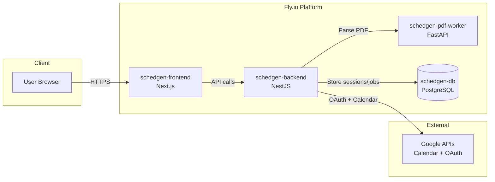
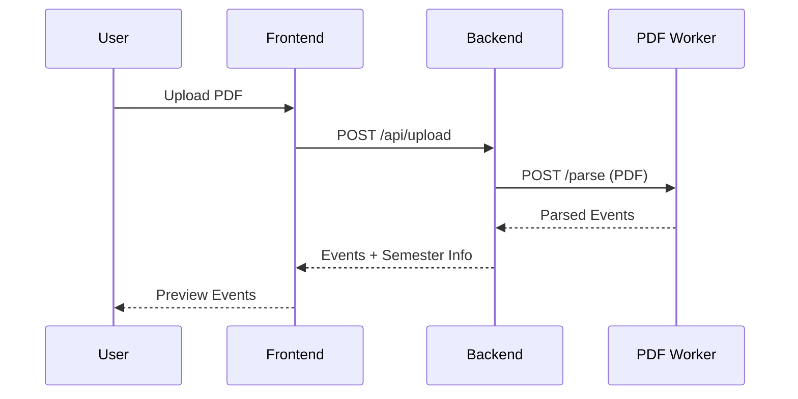
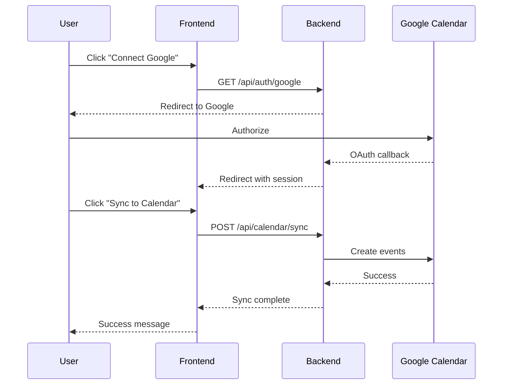

# Architecture

This document describes the system architecture of the Tuks Schedule Generator.

## System Overview

The application consists of three microservices deployed on Fly.io:

## Services

### Frontend (`schedgen-frontend`)
- **Technology**: Next.js 16, React 19, TailwindCSS, DaisyUI
- **Port**: 3000
- **Domain**: tuks-pdf-calendar.co.za
- **Responsibilities**:
  - PDF upload UI
  - Event preview and selection
  - Module color customization
  - Date range selection
  - Google OAuth login flow

### Backend (`schedgen-backend`)
- **Technology**: NestJS 11, TypeORM, PostgreSQL
- **Port**: 3001
- **Domain**: api.tuks-pdf-calendar.co.za
- **Responsibilities**:
  - API endpoints
  - Google OAuth authentication
  - Session management
  - PDF upload coordination
  - Google Calendar sync
  - Semester date handling

### PDF Worker (`schedgen-pdf-worker`)
- **Technology**: Python FastAPI, pdfplumber
- **Port**: 5001
- **Internal only** (no public domain)
- **Responsibilities**:
  - PDF text extraction
  - Timetable parsing
  - Event data structuring

### Database (`schedgen-db`)
- **Technology**: Fly Postgres
- **Responsibilities**:
  - User sessions
  - Job tracking
  - OAuth tokens

## Data Flow

### PDF Upload Flow

### Calendar Sync Flow

## Key Modules

### Backend Modules

| Module | Purpose |
|--------|---------|
| `UploadModule` | PDF upload handling, coordinates with PDF Worker |
| `ParserModule` | HTTP client for PDF Worker communication |
| `AuthModule` | Google OAuth, session management |
| `CalendarModule` | Google Calendar API integration |
| `JobsModule` | Job tracking and cleanup |
| `HealthModule` | Health check endpoints |
| `MetricsModule` | Prometheus metrics |

### Frontend Stores (Zustand)

| Store | Purpose |
|-------|---------|
| `authStore` | User authentication state |
| `eventStore` | Parsed events and selection |
| `configStore` | Date range and semester settings |

## Authentication

The app uses Google OAuth 2.0 with the following scopes:
- `userinfo.email` - User identification
- `userinfo.profile` - User display name
- `calendar.events` - Calendar event creation

Sessions are stored server-side with `express-session` and PostgreSQL.

## Semester Handling

The application intelligently handles UP semesters:

1. **Environment Variables**: Define semester start/end dates
2. **Auto-Detection**: Backend determines current semester from dates
3. **PDF Filtering**: Events filtered by semester (S1/S2/Year)
4. **User Override**: Users can adjust date ranges

## Scaling

Fly.io provides auto-scaling:
- `auto_stop_machines = true` - Scale to zero when idle
- `auto_start_machines = true` - Scale up on demand
- `min_machines_running = 0` - Cost optimization

For higher traffic, adjust `min_machines_running` in `fly.toml`.
