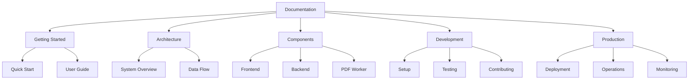
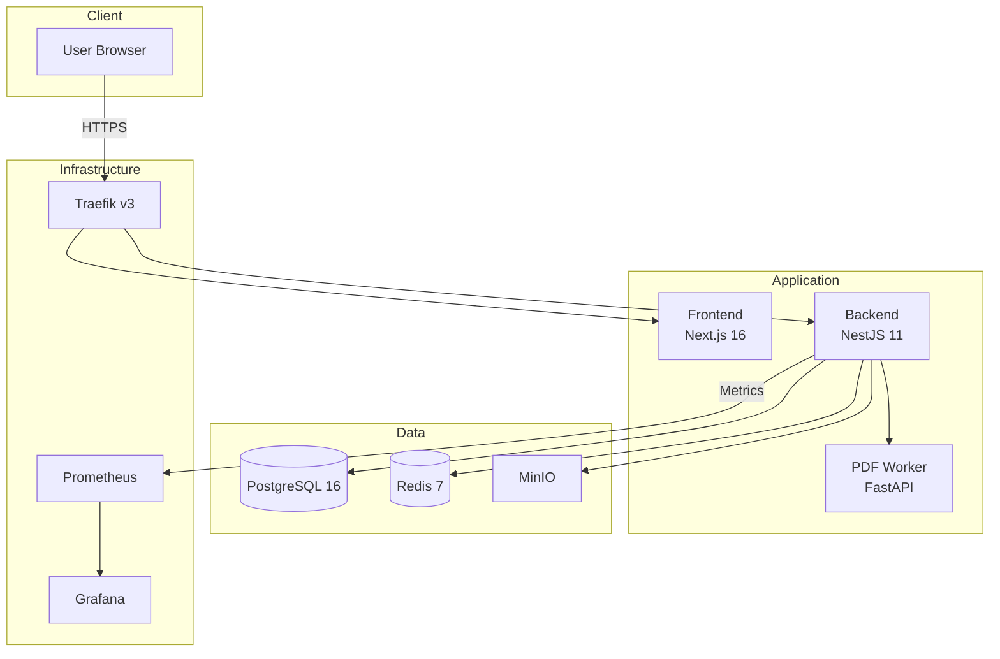

# Documentation Index

Complete documentation for UP Schedule Generator.



## Quick Start

**New to the project?** Start here:
1. [Getting Started Guide](./guides/getting-started.md) - Set up and run locally
2. [Architecture Overview](./architecture/overview.md) - Understand the system
3. [Quick Reference](./QUICK_REFERENCE.md) - Common commands

## Documentation Structure

### User Guides
- [Getting Started](./guides/getting-started.md) - First-time setup and usage
- [Troubleshooting](./guides/troubleshooting.md) - Common issues and solutions
- [FAQ](./guides/faq.md) - Frequently asked questions

### Architecture
- [System Overview](./architecture/overview.md) - High-level architecture
- [Data Flow](./architecture/data-flow.md) - Request flow and data processing
- [Technology Stack](./architecture/tech-stack.md) - Technologies used

### Components
- [Frontend](./components/frontend.md) - Next.js application
- [Backend](./components/backend.md) - NestJS API server
- [PDF Worker](./components/pdf-worker.md) - Python PDF parsing service
- [Infrastructure](./components/infrastructure.md) - Docker, Traefik, databases

### Development
- [Development Guide](./development/README.md) - Development documentation index
  - [Setup](./development/setup.md) - Local development setup
  - [Testing](./development/testing.md) - Testing strategy
  - [Contributing](./development/contributing.md) - Contribution guidelines
  - [Code Standards](./development/code-standards.md) - Coding conventions

### Production
- [Production Guide](./production/INDEX.md) - Production documentation index
  - [Deployment Decision Guide](./production/DEPLOYMENT_DECISION_GUIDE.md) - Choose deployment strategy ⭐
  - [AWS EC2 Deployment](./production/AWS_EC2_DEPLOYMENT_GUIDE.md) - Complete AWS EC2 setup
  - [AWS EC2 Quick Reference](./production/AWS_EC2_QUICK_REFERENCE.md) - Essential commands
  - [Deployment Procedures](./production/deployment/README.md) - General deployment guide
  - [Operations](./production/backup/README.md) - Operational procedures
  - [Monitoring](./production/monitoring/README.md) - Monitoring and alerting
  - [Incident Response](./production/INCIDENT_RESPONSE_RUNBOOK.md) - Handle incidents

## System Overview



## Key Features

- **PDF Parsing** - Extract schedule data from UP PDFs
- **Event Management** - Edit, filter, and organize events
- **Google Calendar Sync** - Direct integration with Google Calendar
- **Session Persistence** - Resume work across browser sessions
- **Real-time Processing** - Async job queue with status updates
- **Production Ready** - Monitoring, backups, scaling support

## Technology Stack

| Layer | Technology | Purpose |
|-------|-----------|---------|
| Frontend | Next.js 16, React 19 | Server-side rendering, UI |
| Backend | NestJS 11, TypeORM | API server, business logic |
| PDF Processing | Python, FastAPI, pdfplumber | PDF parsing service |
| Database | PostgreSQL 16 | Relational data storage |
| Cache/Queue | Redis 7, BullMQ | Job queue, caching |
| Storage | MinIO | S3-compatible object storage |
| Proxy | Traefik v3 | Reverse proxy, TLS |
| Monitoring | Prometheus, Grafana | Metrics and dashboards |

## Documentation by Role

### For Users
- [Getting Started](./guides/getting-started.md)
- [User Guide](./guides/user-guide.md)
- [FAQ](./guides/faq.md)

### For Developers
- [Development Setup](./development/setup.md)
- [Architecture Overview](./architecture/overview.md)
- [Component Docs](./components/frontend.md)
- [Testing Guide](./development/testing.md)

### For DevOps
- [Deployment Guide](./production/deployment/README.md)
- [Monitoring Setup](./production/monitoring/README.md)
- [Backup Procedures](./production/backup/README.md)
- [Incident Response](./production/INCIDENT_RESPONSE_RUNBOOK.md)

### For Contributors
- [Contributing Guide](./development/contributing.md)
- [Code Standards](./development/code-standards.md)
- [Git Workflow](./development/git-workflow.md)

## Quick Reference

### Common Commands
```bash
# Development
docker compose -f docker-compose.yml -f docker-compose.dev.yml up

# Production
docker compose -f docker-compose.yml -f docker-compose.prod.yml up -d

# Run tests
npm test

# Deploy updates
./scripts/deploy.sh

# Backup database
./scripts/backup-all.sh

# Rollback deployment
./scripts/rollback.sh
```

See [Quick Reference Guide](./QUICK_REFERENCE.md) for more commands.

## Project Structure

```
├── frontend/          # Next.js frontend
├── backend/           # NestJS backend
├── pdf-worker/        # Python PDF parser
├── docs/              # Documentation (you are here)
├── e2e/               # End-to-end tests
├── monitoring/        # Prometheus & Grafana
├── load-tests/        # K6 load tests
├── scripts/           # Deployment scripts
└── .kiro/             # Kiro specs and steering
```

## External Resources

- [GitHub Repository](https://github.com/yourusername/ScheduleGenerator)
- [Issue Tracker](https://github.com/yourusername/ScheduleGenerator/issues)
- [API Documentation](../backend/API_DOCUMENTATION.md)

## Contributing

We welcome contributions! See:
- [Contributing Guide](./development/contributing.md)
- [Code of Conduct](./CODE_OF_CONDUCT.md)
- [Development Setup](./development/setup.md)

## Support

- **Documentation Issues**: Create GitHub issue
- **Bug Reports**: Use issue tracker
- **Feature Requests**: Create GitHub issue
- **Questions**: Check FAQ or create discussion

## License

Private project - University of Pretoria schedule format specific.
