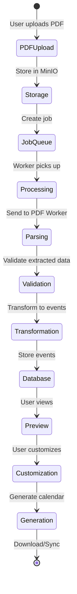

# Data Flow Documentation

Detailed documentation of data transformations and flow through the UP Schedule Generator system.

## Overview

Data flows through multiple transformations as it moves from PDF input to calendar output. Understanding these transformations is critical for debugging and extending the system.

## Data Lifecycle



## 1. PDF Upload Flow

### Input: User File Upload
```typescript
// Frontend: File selection
const file: File = {
  name: "UP_MOD_XLS.pdf",
  type: "application/pdf",
  size: 245678, // bytes
  lastModified: 1732800000000
}
```

### Step 1.1: Frontend Validation
```typescript
// frontend/src/components/upload/FileUpload.tsx
const validation = {
  fileType: file.type === 'application/pdf',
  fileSize: file.size <= 10 * 1024 * 1024, // 10MB
  fileName: file.name.length > 0
}
```

### Step 1.2: Backend Upload
```typescript
// POST /api/upload
// Content-Type: multipart/form-data

Request Body:
{
  file: <binary PDF data>,
  pdfType: "weekly" | "test" | "exam"
}
```

### Step 1.3: MinIO Storage
```typescript
// backend/src/storage/storage.service.ts
const storageResult = {
  bucket: "pdf-uploads",
  key: "uploads/2024-11-28/uuid-v4.pdf",
  etag: "md5-hash",
  size: 245678,
  contentType: "application/pdf"
}
```

### Step 1.4: Job Creation
```typescript
// backend/src/jobs/entities/job.entity.ts
const job = {
  id: "uuid-v4",
  userId: "user-uuid",
  status: "pending",
  pdfType: "weekly",
  fileName: "UP_MOD_XLS.pdf",
  fileSize: 245678,
  storageKey: "uploads/2024-11-28/uuid-v4.pdf",
  createdAt: new Date(),
  updatedAt: new Date()
}
```

### Response to Frontend
```typescript
{
  jobId: "uuid-v4",
  status: "pending",
  message: "PDF uploaded successfully"
}
```

## 2. PDF Processing Flow

### Step 2.1: Job Queue
```typescript
// BullMQ job data
const queueJob = {
  id: "job-uuid",
  name: "process-pdf",
  data: {
    jobId: "uuid-v4",
    storageKey: "uploads/2024-11-28/uuid-v4.pdf",
    pdfType: "weekly"
  },
  opts: {
    attempts: 3,
    backoff: {
      type: "exponential",
      delay: 2000
    }
  }
}
```

### Step 2.2: Download from MinIO
```typescript
// backend/src/jobs/jobs.processor.ts
const pdfBuffer: Buffer = await storageService.downloadFile(
  job.data.storageKey
)
```

### Step 2.3: Send to PDF Worker
```http
POST http://pdf-worker:5000/parse
Content-Type: multipart/form-data

file: <PDF buffer>
pdf_type: "weekly"
```

### Step 2.4: PDF Worker Response
```json
{
  "success": true,
  "pdf_type": "weekly",
  "events": [
    {
      "Module": "COS 214",
      "Activity": "L1",
      "Group": "G01",
      "Day": "Monday",
      "start_time": "08:30",
      "end_time": "09:20",
      "Venue": "Centenary 6"
    },
    {
      "Module": "COS 214",
      "Activity": "P1",
      "Group": "G01",
      "Day": "Tuesday",
      "start_time": "14:30",
      "end_time": "16:20",
      "Venue": "IT 3-2"
    }
  ],
  "total_events": 44
}
```

## 3. Data Transformation Flow

### Step 3.1: Python Worker Format → Backend Format
```typescript
// backend/src/parser/parser.service.ts

// Input (from Python worker)
const pythonEvent = {
  Module: "COS 214",
  Activity: "L1",
  Group: "G01",
  Day: "Monday",
  start_time: "08:30",
  end_time: "09:20",
  Venue: "Centenary 6"
}

// Output (backend format)
const backendEvent = {
  id: "COS-214-L1-Monday-08:30-G01-Centenary-6-0",
  module: "COS 214",
  activity: "L1",
  group: "G01",
  day: "Monday",
  startTime: "08:30",
  endTime: "09:20",
  venue: "Centenary 6",
  isRecurring: true
}
```

### Step 3.2: Backend Format → Database Format
```typescript
// backend/src/jobs/entities/job.entity.ts

// Stored in job.result as JSON
const databaseFormat = {
  events: [
    {
      id: "COS-214-L1-Monday-08:30-G01-Centenary-6-0",
      module: "COS 214",
      activity: "L1",
      group: "G01",
      day: "Monday",
      startTime: "08:30",
      endTime: "09:20",
      venue: "Centenary 6",
      isRecurring: true
    }
  ],
  metadata: {
    totalEvents: 44,
    pdfType: "weekly",
    processedAt: "2024-11-28T10:30:00Z"
  }
}
```

### Step 3.3: Backend Format → Frontend Format
```typescript
// frontend/src/services/jobService.ts

// API Response
const apiResponse = {
  id: "job-uuid",
  events: [
    {
      id: "COS-214-L1-Monday-08:30-G01-Centenary-6-0",
      module: "COS 214",
      activity: "L1",
      group: "G01",
      day: "Monday",
      startTime: "08:30",
      endTime: "09:20",
      venue: "Centenary 6",
      isRecurring: true
    }
  ]
}

// Frontend ParsedEvent type
const frontendEvent: ParsedEvent = {
  id: "COS-214-L1-Monday-08:30-G01-Centenary-6-0",
  moduleCode: "COS 214",
  eventType: "l1", // lowercase
  dayOfWeek: "Monday",
  startTime: "08:30",
  endTime: "09:20",
  location: "Centenary 6",
  group: "G01"
}
```

## 4. Event Customization Flow

### Step 4.1: User Customization
```typescript
// frontend/src/stores/eventStore.ts

// User actions
const customizations = {
  selectedEvents: ["event-id-1", "event-id-2"],
  moduleColors: {
    "COS 214": "#FF6B6B",
    "COS 226": "#4ECDC4"
  },
  semesterDates: {
    startDate: "2025-01-20",
    endDate: "2025-05-30"
  }
}
```

### Step 4.2: Event Configuration
```typescript
// frontend/src/types/calendar.ts

const eventConfig: EventConfig = {
  eventId: "COS-214-L1-Monday-08:30-G01-Centenary-6-0",
  title: "COS 214 - Lecture",
  color: "#FF6B6B",
  includeInCalendar: true,
  customNotes: "Bring laptop"
}
```

## 5. Calendar Generation Flow

### Step 5.1: Generate Request
```typescript
// POST /api/calendar/generate

Request Body:
{
  events: [
    {
      id: "event-id",
      moduleCode: "COS 214",
      eventType: "l1",
      dayOfWeek: "Monday",
      startTime: "08:30",
      endTime: "09:20",
      location: "Centenary 6"
    }
  ],
  config: {
    semesterStart: "2025-01-20",
    semesterEnd: "2025-05-30",
    moduleColors: {
      "COS 214": "#FF6B6B"
    }
  }
}
```

### Step 5.2: ICS Generation
```typescript
// backend/src/calendar/ics.service.ts

const icsEvent = {
  uid: "event-id@schedgen.com",
  summary: "COS 214 - Lecture",
  description: "Group: G01",
  location: "Centenary 6",
  dtstart: "20250120T083000",
  dtend: "20250120T092000",
  rrule: "FREQ=WEEKLY;UNTIL=20250530T235959Z;BYDAY=MO",
  color: "#FF6B6B"
}
```

### Step 5.3: ICS File Format
```ics
BEGIN:VCALENDAR
VERSION:2.0
PRODID:-//UP Schedule Generator//EN
CALSCALE:GREGORIAN
METHOD:PUBLISH
X-WR-CALNAME:UP Schedule
X-WR-TIMEZONE:Africa/Johannesburg

BEGIN:VEVENT
UID:COS-214-L1-Monday-08:30-G01-Centenary-6-0@schedgen.com
DTSTAMP:20241128T103000Z
DTSTART;TZID=Africa/Johannesburg:20250120T083000
DTEND;TZID=Africa/Johannesburg:20250120T092000
SUMMARY:COS 214 - Lecture
DESCRIPTION:Group: G01
LOCATION:Centenary 6
RRULE:FREQ=WEEKLY;UNTIL=20250530T235959Z;BYDAY=MO
COLOR:#FF6B6B
END:VEVENT

END:VCALENDAR
```

## 6. Google Calendar Sync Flow

### Step 6.1: OAuth Authentication
```typescript
// GET /api/auth/google

Response: Redirect to Google OAuth
https://accounts.google.com/o/oauth2/v2/auth?
  client_id=...&
  redirect_uri=...&
  scope=calendar.events&
  response_type=code
```

### Step 6.2: Token Exchange
```typescript
// Callback: GET /api/auth/google/callback?code=...

const tokenResponse = {
  access_token: "ya29.a0...",
  refresh_token: "1//0g...",
  scope: "https://www.googleapis.com/auth/calendar.events",
  token_type: "Bearer",
  expiry_date: 1732803600000
}
```

### Step 6.3: Create Calendar Events
```typescript
// POST https://www.googleapis.com/calendar/v3/calendars/primary/events

Request Body:
{
  summary: "COS 214 - Lecture",
  description: "Group: G01",
  location: "Centenary 6",
  start: {
    dateTime: "2025-01-20T08:30:00+02:00",
    timeZone: "Africa/Johannesburg"
  },
  end: {
    dateTime: "2025-01-20T09:20:00+02:00",
    timeZone: "Africa/Johannesburg"
  },
  recurrence: [
    "RRULE:FREQ=WEEKLY;UNTIL=20250530T235959Z;BYDAY=MO"
  ],
  colorId: "11"
}
```

## Data Validation Rules

### PDF Upload Validation
- File type: Must be `application/pdf`
- File size: Maximum 10MB
- File name: Must not be empty
- PDF type: Must be one of: `weekly`, `test`, `exam`

### Event Data Validation
- Module code: Required, alphanumeric with space
- Activity: Required, valid activity type
- Day: Required, valid day name
- Start time: Required, HH:MM format
- End time: Required, HH:MM format, after start time
- Venue: Required, non-empty string

### Calendar Configuration Validation
- Semester start: Required, valid date
- Semester end: Required, valid date, after start
- Module colors: Optional, valid hex colors
- Event selection: At least one event selected

## Error Handling

### PDF Processing Errors
```typescript
{
  error: "PDF_PARSE_ERROR",
  message: "Failed to extract tables from PDF",
  details: {
    page: 1,
    reason: "No tables found"
  }
}
```

### Validation Errors
```typescript
{
  error: "VALIDATION_ERROR",
  message: "Invalid event data",
  details: {
    field: "startTime",
    value: "25:00",
    constraint: "Must be valid time in HH:MM format"
  }
}
```

### Calendar Generation Errors
```typescript
{
  error: "CALENDAR_GENERATION_ERROR",
  message: "Failed to generate ICS file",
  details: {
    eventId: "event-id",
    reason: "Invalid recurrence rule"
  }
}
```

## Performance Considerations

### Data Size Limits
- PDF file: 10MB maximum
- Events per job: 1000 maximum
- Job retention: 7 days
- Session data: 1MB maximum

### Caching Strategy
- Job status: Cached for 5 seconds
- Event data: Cached until job completion
- User session: Cached for 24 hours
- Static assets: Cached indefinitely

### Database Optimization
- Indexes on: `jobs.id`, `jobs.userId`, `jobs.status`
- JSON columns for flexible event data
- Connection pooling (max 20 connections)
- Query timeout: 30 seconds

## References

- [Architecture Overview](./overview.md)
- [Backend API Documentation](../../backend/API_DOCUMENTATION.md)
- [PDF Worker Documentation](../components/pdf-worker.md)
- [Frontend State Management](../components/frontend.md#state-management)
