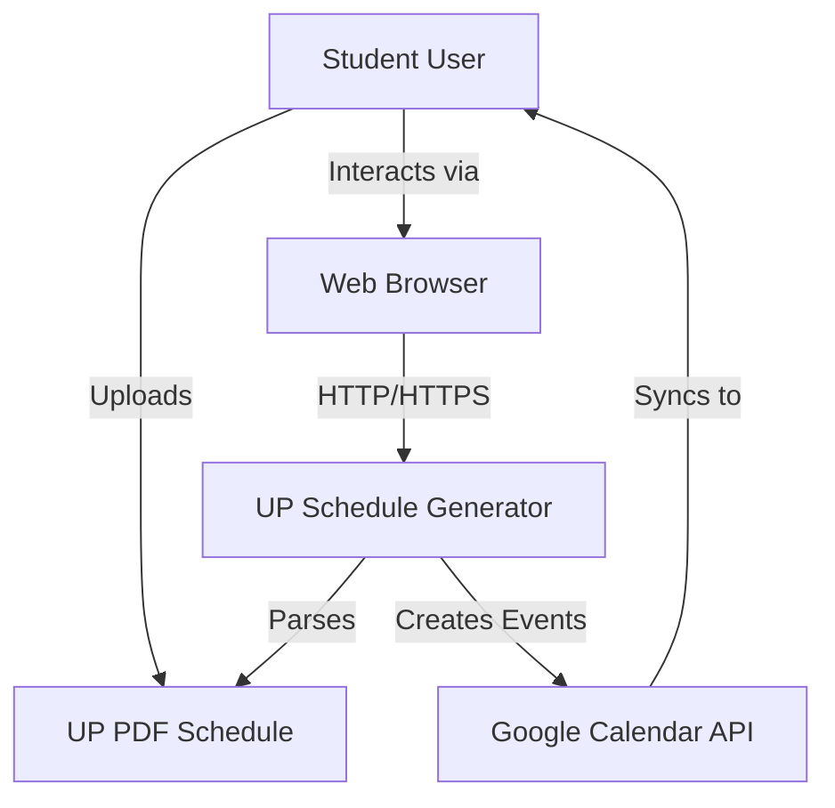
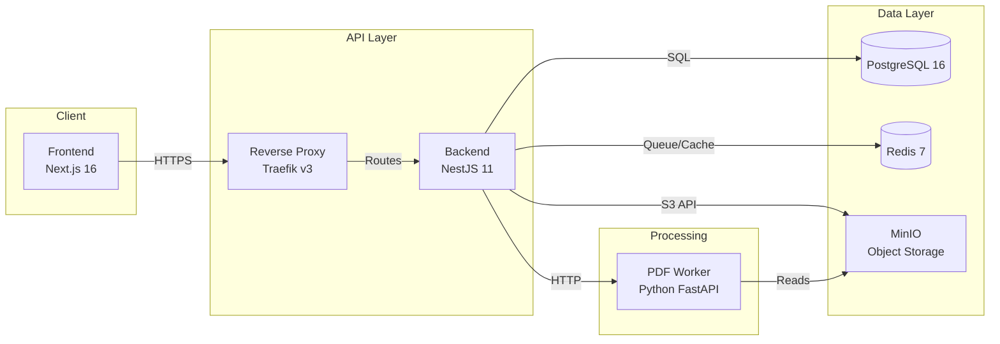
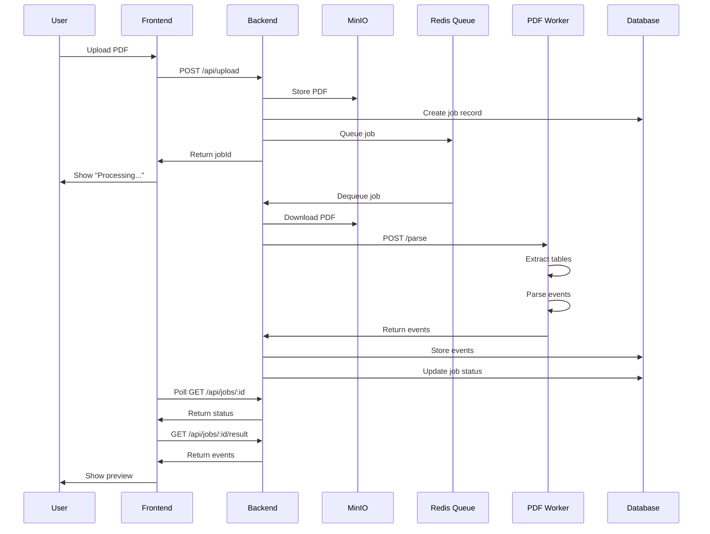
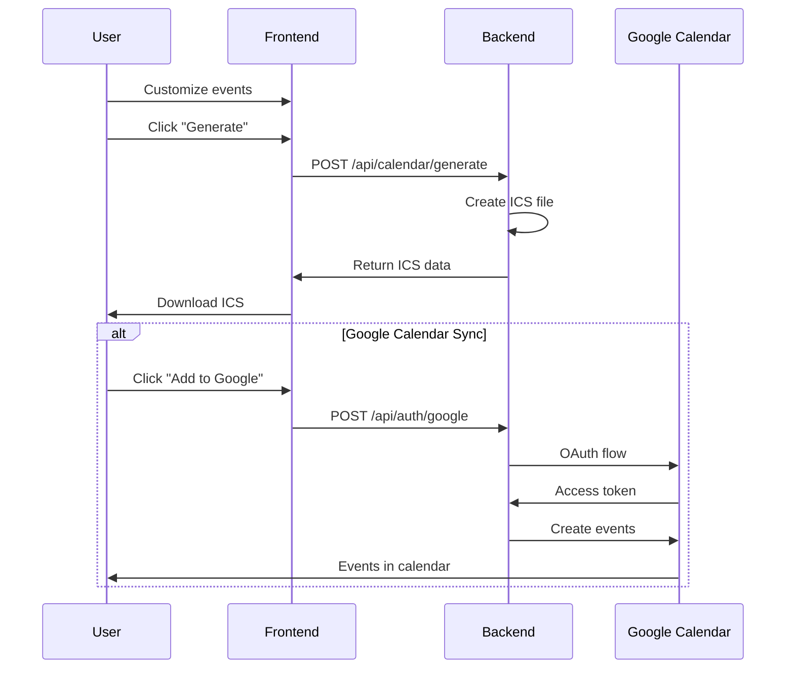

# System Architecture Overview

UP Schedule Generator V3 - A microservices-based web application for converting University of Pretoria PDF schedules into Google Calendar events.

## System Context

The UP Schedule Generator solves the problem of manually entering class schedules into digital calendars. Students receive their schedules as PDF files from the university, and this system automates the extraction, processing, and calendar integration.



## High-Level Architecture

The system follows a microservices architecture with clear separation of concerns:



## Core Components

### 1. Frontend (Next.js)
**Technology**: Next.js 16, React 19, TypeScript, TailwindCSS, DaisyUI

**Responsibilities**:
- User interface for PDF upload
- Job status monitoring
- Event preview and customization
- Calendar generation and download
- Google OAuth integration

**Key Features**:
- Server-side rendering for SEO
- Real-time job status updates
- Responsive design (mobile-first)
- State management with Zustand
- Form validation with Zod

### 2. Backend (NestJS)
**Technology**: NestJS 11, TypeORM, BullMQ, TypeScript

**Responsibilities**:
- REST API endpoints
- Authentication and session management
- File upload handling
- Job queue management
- Database operations
- Google Calendar API integration

**Key Modules**:
- `auth`: Google OAuth authentication
- `upload`: PDF file upload and validation
- `jobs`: Asynchronous job processing
- `parser`: PDF parsing orchestration
- `calendar`: Calendar event generation
- `storage`: MinIO file storage
- `health`: Health checks and monitoring

### 3. PDF Worker (Python)
**Technology**: Python 3.11, FastAPI, pdfplumber

**Responsibilities**:
- PDF table extraction
- Data parsing and validation
- Event data structuring
- Multi-format PDF support

**Supported Formats**:
- Weekly lecture schedules
- Test schedules
- Exam schedules

### 4. Database (PostgreSQL)
**Technology**: PostgreSQL 16

**Schema**:
- `jobs`: Processing job records
- `sessions`: User session data
- `users`: User accounts (OAuth)

**Features**:
- ACID compliance
- JSON column support for flexible data
- Full-text search capabilities
- Connection pooling

### 5. Cache/Queue (Redis)
**Technology**: Redis 7

**Usage**:
- BullMQ job queue
- Session storage
- API response caching
- Rate limiting

### 6. Object Storage (MinIO)
**Technology**: MinIO (S3-compatible)

**Purpose**:
- PDF file storage
- Generated calendar file storage
- Temporary file management

**Configuration**:
- Bucket: `pdf-uploads`
- Retention: 7 days
- Access: Pre-signed URLs

### 7. Reverse Proxy (Traefik)
**Technology**: Traefik v3

**Features**:
- TLS termination (Let's Encrypt)
- Request routing
- Load balancing
- Security headers
- Rate limiting

## Data Flow

### PDF Upload and Processing Flow



### Calendar Generation Flow



## Technology Choices

### Why Next.js?
- Server-side rendering for better SEO
- Built-in API routes (not used, but available)
- Excellent developer experience
- Strong TypeScript support
- Large ecosystem

### Why NestJS?
- Enterprise-grade architecture
- Dependency injection
- Built-in validation and serialization
- Excellent TypeScript support
- Modular structure
- Strong testing support

### Why Python for PDF Worker?
- Best PDF parsing libraries (pdfplumber)
- Mature data processing ecosystem (pandas)
- Fast development for data tasks
- Easy to maintain and extend

### Why PostgreSQL?
- ACID compliance for data integrity
- JSON support for flexible schemas
- Excellent performance
- Strong ecosystem
- TypeORM integration

### Why Redis?
- Fast in-memory operations
- BullMQ integration
- Session storage
- Pub/sub capabilities

### Why MinIO?
- S3-compatible API
- Self-hosted (no cloud costs)
- Easy Docker deployment
- Excellent performance

### Why Traefik?
- Automatic TLS with Let's Encrypt
- Dynamic configuration
- Docker integration
- Modern architecture
- Built-in middleware

## Deployment Architecture

### Development Environment
```
localhost:3000  → Frontend (hot reload)
localhost:3001  → Backend (hot reload)
localhost:5001  → PDF Worker
localhost:5433  → PostgreSQL
localhost:6379  → Redis
localhost:9000  → MinIO API
localhost:9001  → MinIO Console
localhost:8081  → Traefik Dashboard
```

### Production Environment
```
https://domain.com        → Frontend (via Traefik)
https://api.domain.com    → Backend (via Traefik)
Internal: pdf-worker:5000 → PDF Worker
Internal: postgres:5432   → PostgreSQL
Internal: redis:6379      → Redis
Internal: minio:9000      → MinIO
```

## Security Considerations

### Authentication
- Google OAuth 2.0 for user authentication
- Session-based authentication with secure cookies
- CSRF protection enabled
- Rate limiting on auth endpoints

### Data Protection
- TLS encryption in production
- Secure session storage in Redis
- Environment variable secrets
- No sensitive data in logs

### File Upload Security
- File type validation (PDF only)
- File size limits (10MB)
- Virus scanning (future enhancement)
- Temporary storage with auto-cleanup

### API Security
- CORS configuration
- Rate limiting
- Input validation
- SQL injection prevention (TypeORM)
- XSS protection

## Scalability Considerations

### Horizontal Scaling
- Frontend: Stateless, can scale horizontally
- Backend: Stateless API, can scale horizontally
- PDF Worker: Stateless, can scale horizontally
- Database: Primary-replica setup possible
- Redis: Cluster mode available

### Performance Optimization
- Database connection pooling
- Redis caching for frequent queries
- CDN for static assets (future)
- Lazy loading in frontend
- Pagination for large datasets

### Resource Limits
- Job queue concurrency: 5 concurrent jobs
- PDF file size: 10MB maximum
- Job retention: 7 days
- Session timeout: 24 hours

## Monitoring and Observability

### Health Checks
- Backend: `/api/health`
- PDF Worker: `/health`
- Database: Connection pool monitoring
- Redis: Connection monitoring

### Logging
- Structured logging (JSON format)
- Log levels: ERROR, WARN, INFO, DEBUG
- Request/response logging
- Job processing logs

### Metrics (Future)
- Request latency
- Job processing time
- Error rates
- Resource utilization

## Future Enhancements

### Planned Features
- Email notifications for job completion
- Webhook support for integrations
- Batch PDF processing
- Calendar sync (update existing events)
- Mobile app (React Native)

### Technical Improvements
- GraphQL API option
- WebSocket for real-time updates
- Kubernetes deployment
- Prometheus metrics
- Distributed tracing

## References

- [Data Flow Documentation](./data-flow.md)
- [Deployment Guide](./deployment.md)
- [Backend Component Documentation](../components/backend.md)
- [Frontend Component Documentation](../components/frontend.md)
- [PDF Worker Documentation](../components/pdf-worker.md)
