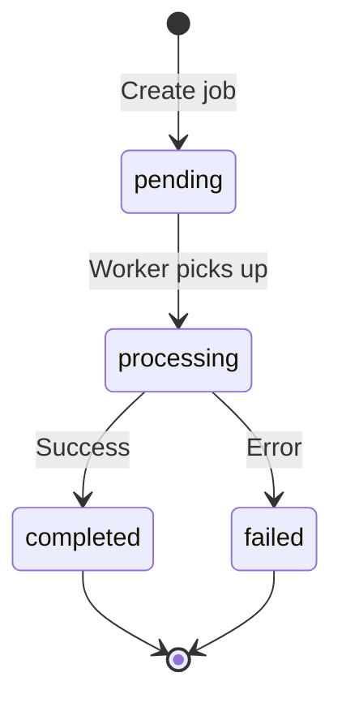

# Backend Component Documentation

NestJS 11 API server for the UP Schedule Generator.

## Overview

The backend is a RESTful API built with NestJS, handling authentication, file uploads, job processing, and calendar generation. It orchestrates communication between the frontend, PDF worker, and data storage systems.

## Technology Stack

| Technology | Version | Purpose |
|------------|---------|---------|
| NestJS | 11.x | Node.js framework |
| TypeScript | 5.x | Type safety |
| TypeORM | 0.3.x | Database ORM |
| BullMQ | 5.x | Job queue |
| Passport | 0.7.x | Authentication |
| PostgreSQL | 16.x | Database |
| Redis | 7.x | Cache/Queue |
| MinIO | Latest | Object storage |

## Project Structure

```
backend/
├── src/
│   ├── app.module.ts          # Root module
│   ├── main.ts                # Application entry point
│   ├── auth/                  # Authentication module
│   ├── upload/                # File upload module
│   ├── jobs/                  # Job processing module
│   ├── parser/                # PDF parsing module
│   ├── calendar/              # Calendar generation module
│   ├── storage/               # MinIO storage module
│   ├── health/                # Health check module
│   ├── config/                # Configuration module
│   ├── common/                # Shared utilities
│   └── migrations/            # Database migrations
├── test/                      # E2E tests
└── package.json
```

## Core Modules

### 1. Authentication Module
**Location**: `src/auth/`

Handles Google OAuth authentication and session management.

#### Components
- `AuthController`: OAuth endpoints
- `AuthService`: Authentication logic
- `GoogleStrategy`: Passport Google OAuth strategy
- `SessionSerializer`: Session serialization
- `JwtAuthGuard`: JWT authentication guard

#### Endpoints
```typescript
GET  /api/auth/google          # Initiate OAuth flow
GET  /api/auth/google/callback # OAuth callback
GET  /api/auth/profile         # Get user profile
POST /api/auth/logout          # Logout user
```

#### Configuration
```typescript
// .env
GOOGLE_CLIENT_ID=your-client-id
GOOGLE_CLIENT_SECRET=your-client-secret
GOOGLE_CALLBACK_URL=http://localhost:3001/api/auth/google/callback
SESSION_SECRET=your-session-secret
```

### 2. Upload Module
**Location**: `src/upload/`

Handles PDF file uploads with validation and storage.

#### Components
- `UploadController`: Upload endpoints
- `UploadService`: Upload logic
- `FileInterceptor`: Multer file handling
- `PdfContentValidator`: PDF validation

#### Endpoints
```typescript
POST /api/upload  # Upload PDF file
```

#### Request Format
```typescript
// multipart/form-data
{
  file: File,           // PDF file (max 10MB)
  pdfType: 'weekly' | 'test' | 'exam'
}
```

#### Response Format
```typescript
{
  jobId: string,
  status: 'pending',
  message: 'PDF uploaded successfully'
}
```

#### Validation Rules
- File type: `application/pdf`
- File size: Maximum 10MB
- PDF content: Must contain valid tables
- PDF type: Must be specified

### 3. Jobs Module
**Location**: `src/jobs/`

Manages asynchronous PDF processing jobs using BullMQ.

#### Components
- `JobsController`: Job status endpoints
- `JobsService`: Job management
- `JobsProcessor`: Job processing logic
- `Job` entity: Database model

#### Endpoints
```typescript
GET    /api/jobs/:id         # Get job status
GET    /api/jobs/:id/result  # Get job results
DELETE /api/jobs/:id         # Cancel job
```

#### Job Lifecycle


#### Job Entity
```typescript
@Entity('jobs')
export class Job {
  @PrimaryGeneratedColumn('uuid')
  id: string;

  @Column()
  userId: string;

  @Column({
    type: 'enum',
    enum: ['pending', 'processing', 'completed', 'failed']
  })
  status: JobStatus;

  @Column({
    type: 'enum',
    enum: ['weekly', 'test', 'exam']
  })
  pdfType: PdfType;

  @Column()
  fileName: string;

  @Column()
  fileSize: number;

  @Column()
  storageKey: string;

  @Column({ type: 'jsonb', nullable: true })
  result: any;

  @Column({ nullable: true })
  error: string;

  @CreateDateColumn()
  createdAt: Date;

  @UpdateDateColumn()
  updatedAt: Date;

  @Column({ nullable: true })
  completedAt: Date;
}
```

### 4. Parser Module
**Location**: `src/parser/`

Orchestrates PDF parsing by communicating with the Python PDF worker.

#### Components
- `ParserService`: PDF parsing orchestration
- `ParsedEvent` DTO: Event data structure

#### Process Flow
```typescript
1. Download PDF from MinIO
2. Send to PDF Worker (POST /parse)
3. Receive parsed events
4. Transform data format
5. Generate unique event IDs
6. Return structured events
```

#### Data Transformation
```typescript
// Python worker output → Backend format
const transformEvent = (pythonEvent: any): ParsedEvent => ({
  id: generateEventId(pythonEvent),
  module: pythonEvent.Module || pythonEvent.module,
  activity: pythonEvent.Activity || pythonEvent.activity,
  group: pythonEvent.Group || pythonEvent.group,
  day: pythonEvent.Day || pythonEvent.day,
  startTime: pythonEvent.start_time || pythonEvent.startTime,
  endTime: pythonEvent.end_time || pythonEvent.endTime,
  venue: pythonEvent.Venue || pythonEvent.venue,
  isRecurring: pythonEvent.isRecurring ?? true
});
```

### 5. Calendar Module
**Location**: `src/calendar/`

Generates ICS calendar files and syncs to Google Calendar.

#### Components
- `CalendarController`: Calendar endpoints
- `CalendarService`: Calendar logic
- `IcsService`: ICS file generation

#### Endpoints
```typescript
POST /api/calendar/generate     # Generate ICS file
POST /api/calendar/google-sync  # Sync to Google Calendar
```

#### ICS Generation
```typescript
// Generate ICS file
const icsContent = await icsService.generateICS(events, config);

// ICS format
BEGIN:VCALENDAR
VERSION:2.0
PRODID:-//UP Schedule Generator//EN
...
END:VCALENDAR
```

#### Google Calendar Sync
```typescript
// Create events in Google Calendar
for (const event of events) {
  await googleCalendar.events.insert({
    calendarId: 'primary',
    requestBody: {
      summary: event.title,
      location: event.location,
      start: { dateTime: event.startDateTime },
      end: { dateTime: event.endDateTime },
      recurrence: event.recurrence
    }
  });
}
```

### 6. Storage Module
**Location**: `src/storage/`

Manages file storage in MinIO (S3-compatible).

#### Components
- `StorageService`: MinIO operations

#### Operations
```typescript
// Upload file
await storageService.uploadFile(
  'pdf-uploads',
  'uploads/2024-11-28/file.pdf',
  buffer,
  'application/pdf'
);

// Download file
const buffer = await storageService.downloadFile(
  'uploads/2024-11-28/file.pdf'
);

// Delete file
await storageService.deleteFile(
  'uploads/2024-11-28/file.pdf'
);

// Generate presigned URL
const url = await storageService.getPresignedUrl(
  'uploads/2024-11-28/file.pdf',
  3600 // 1 hour expiry
);
```

### 7. Health Module
**Location**: `src/health/`

Provides health check endpoints for monitoring.

#### Endpoints
```typescript
GET /api/health        # Overall health
GET /api/health/db     # Database health
GET /api/health/redis  # Redis health
GET /api/health/minio  # MinIO health
```

#### Response Format
```typescript
{
  status: 'ok' | 'error',
  info: {
    database: { status: 'up' },
    redis: { status: 'up' },
    minio: { status: 'up' }
  },
  error: {},
  details: {
    database: { status: 'up' },
    redis: { status: 'up' },
    minio: { status: 'up' }
  }
}
```

## Database Schema

### Jobs Table
```sql
CREATE TABLE jobs (
  id UUID PRIMARY KEY DEFAULT uuid_generate_v4(),
  user_id VARCHAR NOT NULL,
  status VARCHAR NOT NULL CHECK (status IN ('pending', 'processing', 'completed', 'failed')),
  pdf_type VARCHAR NOT NULL CHECK (pdf_type IN ('weekly', 'test', 'exam')),
  file_name VARCHAR NOT NULL,
  file_size INTEGER NOT NULL,
  storage_key VARCHAR NOT NULL,
  result JSONB,
  error TEXT,
  created_at TIMESTAMP DEFAULT NOW(),
  updated_at TIMESTAMP DEFAULT NOW(),
  completed_at TIMESTAMP
);

CREATE INDEX idx_jobs_user_id ON jobs(user_id);
CREATE INDEX idx_jobs_status ON jobs(status);
CREATE INDEX idx_jobs_created_at ON jobs(created_at);
```

### Sessions Table
```sql
CREATE TABLE sessions (
  sid VARCHAR PRIMARY KEY,
  sess JSONB NOT NULL,
  expire TIMESTAMP NOT NULL
);

CREATE INDEX idx_sessions_expire ON sessions(expire);
```

## Job Processing

### BullMQ Configuration
```typescript
// Queue configuration
const queueConfig = {
  connection: {
    host: process.env.REDIS_HOST,
    port: parseInt(process.env.REDIS_PORT),
  },
  defaultJobOptions: {
    attempts: 3,
    backoff: {
      type: 'exponential',
      delay: 2000
    },
    removeOnComplete: {
      age: 7 * 24 * 3600 // 7 days
    },
    removeOnFail: {
      age: 7 * 24 * 3600 // 7 days
    }
  }
};
```

### Job Processor
```typescript
@Processor('pdf-processing')
export class JobsProcessor {
  @Process()
  async processJob(job: Job<JobData>) {
    const { jobId, storageKey, pdfType } = job.data;
    
    try {
      // Update status to processing
      await this.jobsService.updateStatus(jobId, 'processing');
      
      // Download PDF from MinIO
      const pdfBuffer = await this.storageService.downloadFile(storageKey);
      
      // Parse PDF
      const events = await this.parserService.parsePDF(pdfBuffer, pdfType);
      
      // Store results
      await this.jobsService.updateResult(jobId, events);
      
      // Update status to completed
      await this.jobsService.updateStatus(jobId, 'completed');
      
    } catch (error) {
      // Update status to failed
      await this.jobsService.updateStatus(jobId, 'failed', error.message);
      throw error;
    }
  }
}
```

## Error Handling

### Global Exception Filter
```typescript
@Catch()
export class AllExceptionsFilter implements ExceptionFilter {
  catch(exception: unknown, host: ArgumentsHost) {
    const ctx = host.switchToHttp();
    const response = ctx.getResponse();
    const request = ctx.getRequest();

    const status = exception instanceof HttpException
      ? exception.getStatus()
      : HttpStatus.INTERNAL_SERVER_ERROR;

    const message = exception instanceof HttpException
      ? exception.message
      : 'Internal server error';

    response.status(status).json({
      statusCode: status,
      timestamp: new Date().toISOString(),
      path: request.url,
      message
    });
  }
}
```

### Validation Pipe
```typescript
app.useGlobalPipes(
  new ValidationPipe({
    whitelist: true,
    forbidNonWhitelisted: true,
    transform: true,
    transformOptions: {
      enableImplicitConversion: true
    }
  })
);
```

## Security

### CORS Configuration
```typescript
app.enableCors({
  origin: process.env.FRONTEND_URL,
  credentials: true,
  methods: ['GET', 'POST', 'PUT', 'DELETE', 'PATCH', 'OPTIONS'],
  allowedHeaders: ['Content-Type', 'Authorization']
});
```

### Session Configuration
```typescript
app.use(
  session({
    store: new RedisStore({ client: redisClient }),
    secret: process.env.SESSION_SECRET,
    resave: false,
    saveUninitialized: false,
    cookie: {
      secure: process.env.NODE_ENV === 'production',
      httpOnly: true,
      maxAge: 24 * 60 * 60 * 1000 // 24 hours
    }
  })
);
```

### Rate Limiting
```typescript
app.use(
  rateLimit({
    windowMs: 15 * 60 * 1000, // 15 minutes
    max: 100, // limit each IP to 100 requests per windowMs
    message: 'Too many requests from this IP'
  })
);
```

## Testing

### Unit Tests
```typescript
describe('JobsService', () => {
  it('should create a job', async () => {
    const job = await jobsService.create({
      userId: 'user-id',
      fileName: 'test.pdf',
      fileSize: 1000,
      storageKey: 'uploads/test.pdf',
      pdfType: 'weekly'
    });
    
    expect(job.status).toBe('pending');
  });
});
```

### E2E Tests
```typescript
describe('Upload (e2e)', () => {
  it('/api/upload (POST)', () => {
    return request(app.getHttpServer())
      .post('/api/upload')
      .attach('file', 'test/fixtures/test.pdf')
      .field('pdfType', 'weekly')
      .expect(201)
      .expect(res => {
        expect(res.body.jobId).toBeDefined();
      });
  });
});
```

## Logging

### Winston Configuration
```typescript
const logger = WinstonModule.createLogger({
  transports: [
    new winston.transports.Console({
      format: winston.format.combine(
        winston.format.timestamp(),
        winston.format.colorize(),
        winston.format.printf(({ timestamp, level, message, context }) => {
          return `${timestamp} [${context}] ${level}: ${message}`;
        })
      )
    }),
    new winston.transports.File({
      filename: 'logs/error.log',
      level: 'error'
    }),
    new winston.transports.File({
      filename: 'logs/combined.log'
    })
  ]
});
```

## Environment Variables

```bash
# Server
NODE_ENV=development
PORT=3001

# Database
POSTGRES_HOST=localhost
POSTGRES_PORT=5432
POSTGRES_USER=postgres
POSTGRES_PASSWORD=password
POSTGRES_DB=schedgen

# Redis
REDIS_HOST=localhost
REDIS_PORT=6379

# MinIO
MINIO_ENDPOINT=localhost
MINIO_PORT=9000
MINIO_ACCESS_KEY=minioadmin
MINIO_SECRET_KEY=minioadmin
MINIO_USE_SSL=false

# Google OAuth
GOOGLE_CLIENT_ID=your-client-id
GOOGLE_CLIENT_SECRET=your-client-secret
GOOGLE_CALLBACK_URL=http://localhost:3001/api/auth/google/callback

# Session
SESSION_SECRET=your-session-secret

# Frontend
FRONTEND_URL=http://localhost:3000

# PDF Worker
PDF_WORKER_URL=http://localhost:5001
```

## Database Migrations

### Create Migration
```bash
npm run migration:generate src/migrations/MigrationName
```

### Run Migrations
```bash
npm run migration:run
```

### Revert Migration
```bash
npm run migration:revert
```

## Build and Deployment

### Development
```bash
npm run start:dev
# Runs on http://localhost:3001
```

### Production Build
```bash
npm run build
npm run start:prod
```

### Docker Build
```bash
docker build -t backend:latest .
docker run -p 3001:3001 backend:latest
```

## Performance Optimization

### Database Connection Pooling
```typescript
{
  type: 'postgres',
  host: process.env.POSTGRES_HOST,
  port: parseInt(process.env.POSTGRES_PORT),
  username: process.env.POSTGRES_USER,
  password: process.env.POSTGRES_PASSWORD,
  database: process.env.POSTGRES_DB,
  extra: {
    max: 20,
    min: 5,
    idleTimeoutMillis: 30000
  }
}
```

### Redis Caching
```typescript
@Injectable()
export class CacheService {
  async get<T>(key: string): Promise<T | null> {
    const cached = await this.redis.get(key);
    return cached ? JSON.parse(cached) : null;
  }

  async set(key: string, value: any, ttl: number = 3600): Promise<void> {
    await this.redis.setex(key, ttl, JSON.stringify(value));
  }
}
```

## References

- [NestJS Documentation](https://docs.nestjs.com)
- [TypeORM Documentation](https://typeorm.io)
- [BullMQ Documentation](https://docs.bullmq.io)
- [API Documentation](../../backend/API_DOCUMENTATION.md)
