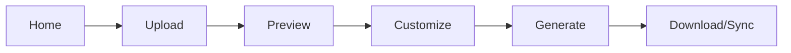

# Frontend Component Documentation

Next.js 16 web application for the UP Schedule Generator.

## Overview

The frontend is a modern React application built with Next.js 16, providing a user-friendly interface for uploading PDF schedules, previewing extracted events, and generating calendar files.

## Technology Stack

| Technology | Version | Purpose |
|------------|---------|---------|
| Next.js | 16.x | React framework with SSR |
| React | 19.x | UI library |
| TypeScript | 5.x | Type safety |
| TailwindCSS | 3.x | Utility-first CSS |
| DaisyUI | 4.x | Component library |
| Zustand | 4.x | State management |
| Zod | 3.x | Schema validation |
| Axios | 1.x | HTTP client |

## Project Structure

```
frontend/
├── src/
│   ├── app/                    # Next.js app router
│   │   ├── page.tsx           # Homepage
│   │   ├── upload/            # Upload page
│   │   ├── preview/           # Preview page
│   │   ├── customize/         # Customize page
│   │   ├── generate/          # Generate page
│   │   └── layout.tsx         # Root layout
│   ├── components/            # React components
│   │   ├── layout/           # Layout components
│   │   ├── upload/           # Upload components
│   │   ├── preview/          # Preview components
│   │   ├── customize/        # Customize components
│   │   └── common/           # Shared components
│   ├── hooks/                # Custom React hooks
│   ├── services/             # API services
│   ├── stores/               # Zustand stores
│   ├── types/                # TypeScript types
│   └── utils/                # Utility functions
├── public/                   # Static assets
└── package.json
```

## Key Features

### 1. PDF Upload
**Location**: `src/app/upload/page.tsx`

Allows users to upload PDF schedule files with validation and progress tracking.

```typescript
// Upload flow
User selects PDF → Validate file → Upload to backend → Get jobId → Poll status
```

**Components**:
- `FileUpload`: Drag-and-drop file upload
- `FileValidator`: Client-side validation
- `UploadProgress`: Upload progress indicator

### 2. Job Status Monitoring
**Location**: `src/hooks/useJobStatus.ts`

Real-time polling of job processing status.

```typescript
const { status, error, isPolling } = useJobStatus(jobId, {
  onComplete: (events) => {
    // Handle completion
  },
  onError: (error) => {
    // Handle error
  }
});
```

**Features**:
- Automatic polling every 1 second
- Stops when job completes or fails
- Fetches results on completion
- Error handling and retry logic

### 3. Event Preview
**Location**: `src/app/preview/page.tsx`

Displays extracted events grouped by day with filtering and selection.

```typescript
// Preview features
- Group events by day
- Filter by module
- Select/deselect events
- View event details
- Navigate to customization
```

**Components**:
- `EventCard`: Individual event display
- `EventList`: List of events
- `EventFilter`: Filter controls
- `DayGroup`: Events grouped by day

### 4. Event Customization
**Location**: `src/app/customize/page.tsx`

Allows users to customize event colors, titles, and semester dates.

```typescript
// Customization options
- Module colors
- Event titles
- Semester start/end dates
- Event inclusion/exclusion
- Custom notes
```

**Components**:
- `ModuleColorPicker`: Color selection
- `SemesterDatePicker`: Date range selection
- `EventEditor`: Edit event details
- `CustomizationPreview`: Live preview

### 5. Calendar Generation
**Location**: `src/app/generate/page.tsx`

Generates ICS calendar files or syncs to Google Calendar.

```typescript
// Generation options
- Download ICS file
- Add to Google Calendar
- Preview calendar
- Share calendar link
```

**Components**:
- `CalendarPreview`: Preview generated calendar
- `DownloadButton`: Download ICS file
- `GoogleSyncButton`: Sync to Google Calendar

## State Management

### Zustand Stores

#### Event Store
**Location**: `src/stores/eventStore.ts`

Manages parsed events and user selections.

```typescript
interface EventStore {
  events: ParsedEvent[];
  selectedEventIds: string[];
  setEvents: (events: ParsedEvent[]) => void;
  toggleEventSelection: (id: string) => void;
  clearEvents: () => void;
}
```

#### Customization Store
**Location**: `src/stores/customizationStore.ts`

Manages user customizations.

```typescript
interface CustomizationStore {
  moduleColors: Record<string, string>;
  semesterDates: { start: string; end: string };
  eventConfigs: Record<string, EventConfig>;
  setModuleColor: (module: string, color: string) => void;
  setSemesterDates: (dates: { start: string; end: string }) => void;
}
```

#### Job Store
**Location**: `src/stores/jobStore.ts`

Manages current job state.

```typescript
interface JobStore {
  currentJobId: string | null;
  jobStatus: JobStatus | null;
  setCurrentJob: (jobId: string) => void;
  clearCurrentJob: () => void;
}
```

## API Integration

### Job Service
**Location**: `src/services/jobService.ts`

Handles job-related API calls.

```typescript
export const jobService = {
  // Get job status
  getStatus: (jobId: string) => 
    api.get<JobStatus>(`/api/jobs/${jobId}`),
  
  // Get job results
  getResult: (jobId: string) => 
    api.get<JobResult>(`/api/jobs/${jobId}/result`),
  
  // Cancel job
  cancel: (jobId: string) => 
    api.delete(`/api/jobs/${jobId}`)
};
```

### Upload Service
**Location**: `src/services/uploadService.ts`

Handles PDF file uploads.

```typescript
export const uploadService = {
  uploadPDF: (file: File, pdfType: PdfType) => {
    const formData = new FormData();
    formData.append('file', file);
    formData.append('pdfType', pdfType);
    
    return api.post<UploadResponse>('/api/upload', formData, {
      headers: { 'Content-Type': 'multipart/form-data' }
    });
  }
};
```

### Calendar Service
**Location**: `src/services/calendarService.ts`

Handles calendar generation and Google Calendar sync.

```typescript
export const calendarService = {
  // Generate ICS file
  generateICS: (events: ParsedEvent[], config: CalendarConfig) =>
    api.post<ICSResponse>('/api/calendar/generate', { events, config }),
  
  // Sync to Google Calendar
  syncToGoogle: (events: ParsedEvent[], config: CalendarConfig) =>
    api.post('/api/calendar/google-sync', { events, config })
};
```

## Custom Hooks

### useJobStatus
**Location**: `src/hooks/useJobStatus.ts`

Polls job status and fetches results on completion.

```typescript
const { status, error, isPolling } = useJobStatus(jobId, {
  pollInterval: 1000,
  onComplete: (events) => console.log('Job complete', events),
  onError: (error) => console.error('Job failed', error)
});
```

### useEventSelection
**Location**: `src/hooks/useEventSelection.ts`

Manages event selection state.

```typescript
const {
  selectedEvents,
  toggleSelection,
  selectAll,
  deselectAll,
  isSelected
} = useEventSelection(events);
```

### useModuleColors
**Location**: `src/hooks/useModuleColors.ts`

Manages module color assignments.

```typescript
const {
  colors,
  setColor,
  getColor,
  resetColors
} = useModuleColors(modules);
```

## Routing

### App Router Structure

```
/                    # Homepage
/upload              # Upload PDF page
/preview             # Preview events page
/customize           # Customize events page
/generate            # Generate calendar page
/auth/callback       # OAuth callback
```

### Navigation Flow



## Styling

### TailwindCSS Configuration
**Location**: `tailwind.config.ts`

```typescript
export default {
  content: ['./src/**/*.{js,ts,jsx,tsx}'],
  theme: {
    extend: {
      colors: {
        primary: '#3B82F6',
        secondary: '#10B981',
        accent: '#F59E0B'
      }
    }
  },
  plugins: [require('daisyui')]
};
```

### DaisyUI Themes
```typescript
// Available themes
- light (default)
- dark
- cupcake
- corporate
```

### Component Styling Patterns

```typescript
// Button example
<button className="btn btn-primary btn-lg">
  Upload PDF
</button>

// Card example
<div className="card bg-base-100 shadow-xl">
  <div className="card-body">
    <h2 className="card-title">Event Details</h2>
    <p>Event information...</p>
  </div>
</div>
```

## Form Validation

### Zod Schemas
**Location**: `src/utils/validation.ts`

```typescript
// Upload form validation
export const uploadSchema = z.object({
  file: z.instanceof(File)
    .refine(file => file.type === 'application/pdf', 'Must be PDF')
    .refine(file => file.size <= 10 * 1024 * 1024, 'Max 10MB'),
  pdfType: z.enum(['weekly', 'test', 'exam'])
});

// Semester dates validation
export const semesterDatesSchema = z.object({
  startDate: z.string().datetime(),
  endDate: z.string().datetime()
}).refine(data => new Date(data.endDate) > new Date(data.startDate), {
  message: 'End date must be after start date'
});
```

## Error Handling

### Error Boundary
**Location**: `src/app/error.tsx`

```typescript
'use client';

export default function Error({
  error,
  reset
}: {
  error: Error;
  reset: () => void;
}) {
  return (
    <div className="error-container">
      <h2>Something went wrong!</h2>
      <p>{error.message}</p>
      <button onClick={reset}>Try again</button>
    </div>
  );
}
```

### API Error Handling

```typescript
// Axios interceptor
api.interceptors.response.use(
  response => response,
  error => {
    if (error.response?.status === 401) {
      // Redirect to login
      window.location.href = '/auth/login';
    }
    return Promise.reject(error);
  }
);
```

## Testing

### Unit Tests
**Location**: `src/**/*.test.ts`

```typescript
// Example: Event store test
describe('EventStore', () => {
  it('should add events', () => {
    const store = useEventStore.getState();
    store.setEvents([mockEvent]);
    expect(store.events).toHaveLength(1);
  });
});
```

### Component Tests
```typescript
// Example: FileUpload component test
describe('FileUpload', () => {
  it('should validate PDF files', () => {
    render(<FileUpload />);
    const file = new File([''], 'test.pdf', { type: 'application/pdf' });
    // Test file upload
  });
});
```

## Performance Optimization

### Code Splitting
```typescript
// Dynamic imports for large components
const CalendarPreview = dynamic(() => import('./CalendarPreview'), {
  loading: () => <Spinner />,
  ssr: false
});
```

### Memoization
```typescript
// Memoize expensive computations
const groupedEvents = useMemo(() => {
  return groupEventsByDay(events);
}, [events]);
```

### Lazy Loading
```typescript
// Lazy load images
<Image
  src="/event-icon.png"
  alt="Event"
  loading="lazy"
  width={24}
  height={24}
/>
```

## Environment Variables

```bash
# .env.local
NEXT_PUBLIC_API_URL=http://localhost:3001
NEXT_PUBLIC_GOOGLE_CLIENT_ID=your-client-id
```

## Build and Deployment

### Development
```bash
npm run dev
# Runs on http://localhost:3000
```

### Production Build
```bash
npm run build
npm run start
```

### Docker Build
```bash
docker build -t frontend:latest .
docker run -p 3000:3000 frontend:latest
```

## Accessibility

### ARIA Labels
```typescript
<button aria-label="Upload PDF file">
  <UploadIcon />
</button>
```

### Keyboard Navigation
- Tab navigation supported
- Enter/Space for button activation
- Escape to close modals

### Screen Reader Support
- Semantic HTML elements
- ARIA landmarks
- Alt text for images

## Browser Support

- Chrome 90+
- Firefox 88+
- Safari 14+
- Edge 90+

## References

- [Next.js Documentation](https://nextjs.org/docs)
- [React Documentation](https://react.dev)
- [TailwindCSS Documentation](https://tailwindcss.com/docs)
- [DaisyUI Documentation](https://daisyui.com)
- [Zustand Documentation](https://zustand-demo.pmnd.rs)
