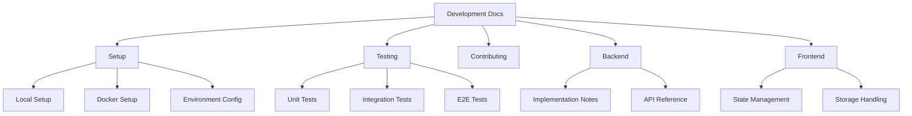
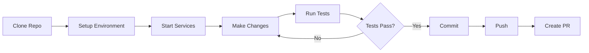

# Development Documentation

Quick access to development guides and resources.



## Quick Links

### Getting Started
- [Local Development Setup](./setup.md) - Set up your development environment
- [Environment Configuration](./environment.md) - Configure environment variables
- [Docker Development](./docker-dev.md) - Using Docker for development

### Testing
- [Testing Guide](./testing.md) - Overview of testing strategy
- [Unit Testing](./testing-unit.md) - Writing and running unit tests
- [Integration Testing](./testing-integration.md) - Integration test patterns
- [E2E Testing](./testing-e2e.md) - End-to-end testing with Playwright

### Contributing
- [Contributing Guide](./contributing.md) - How to contribute
- [Code Standards](./code-standards.md) - Coding conventions
- [Git Workflow](./git-workflow.md) - Branch and commit guidelines

### Component Documentation
- [Backend Documentation](../../backend/docs/README.md) - Backend implementation details
- [Frontend Documentation](../../frontend/docs/README.md) - Frontend implementation details

## Development Workflow



## Common Commands

```bash
# Start development environment
docker compose -f docker-compose.yml -f docker-compose.dev.yml up

# Run backend tests
cd backend && npm test

# Run frontend tests
cd frontend && npm test

# Run E2E tests
cd e2e && npm test

# Run linting
npm run lint

# Format code
npm run format
```

## Need Help?

- Check [Troubleshooting Guide](./troubleshooting.md)
- Review [FAQ](./faq.md)
- See [Architecture Overview](../architecture/overview.md)
