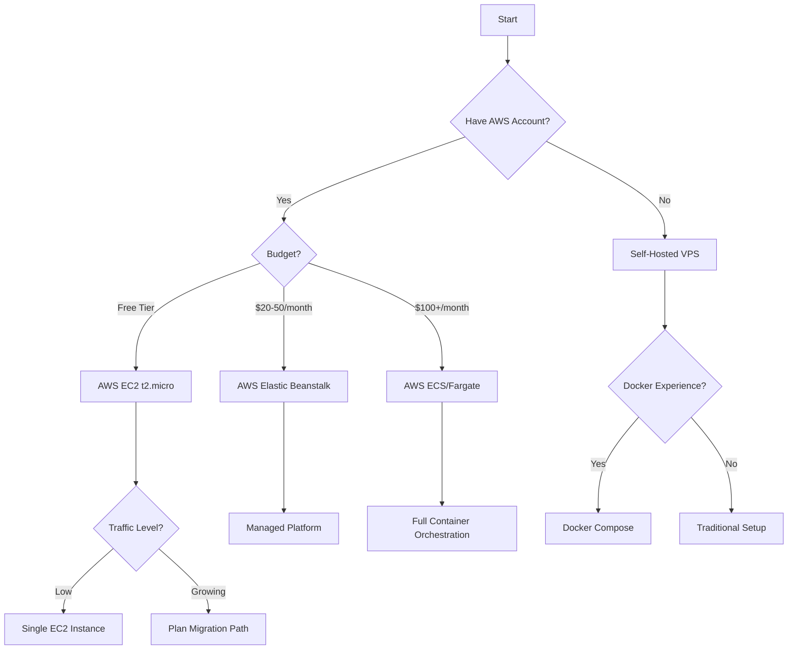
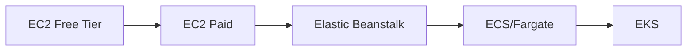

# Deployment Decision Guide

Choose the right deployment strategy for your needs.

## Decision Tree



## Deployment Options Comparison

| Option | Cost | Complexity | Scalability | Best For |
|--------|------|------------|-------------|----------|
| **AWS EC2 Free Tier** | Free (12mo) | Medium | Manual | Testing, MVP, Low traffic |
| **AWS EC2 Paid** | $10-30/mo | Medium | Manual | Small production |
| **Elastic Beanstalk** | $30-100/mo | Low | Automatic | Growing apps |
| **ECS/Fargate** | $50-200/mo | High | Automatic | High traffic |
| **Self-Hosted VPS** | $5-20/mo | Medium | Manual | Budget-conscious |
| **Kubernetes (EKS)** | $100+/mo | Very High | Automatic | Enterprise |

## Recommendation by Use Case

### 1. Student Project / MVP
**Recommended:** AWS EC2 Free Tier

**Why:**
- Free for 12 months
- Learn cloud deployment
- Easy to upgrade later
- Good performance for low traffic

**Follow:** [AWS EC2 Deployment Guide](./AWS_EC2_DEPLOYMENT_GUIDE.md)

### 2. Small Production (<100 users)
**Recommended:** AWS EC2 t3.micro or Self-Hosted VPS

**Why:**
- Low cost ($7-15/month)
- Sufficient resources
- Simple management
- Predictable costs

**Follow:** [AWS EC2 Deployment Guide](./AWS_EC2_DEPLOYMENT_GUIDE.md)

### 3. Growing Application (100-1000 users)
**Recommended:** AWS Elastic Beanstalk

**Why:**
- Automatic scaling
- Managed platform
- Easy deployments
- Built-in monitoring

**Follow:** [Elastic Beanstalk Migration](#elastic-beanstalk-migration) in AWS EC2 guide

### 4. High Traffic (1000+ users)
**Recommended:** AWS ECS with Fargate

**Why:**
- Container orchestration
- Auto-scaling
- High availability
- Pay per use

**Follow:** [ECS Migration](#ecs-migration) in AWS EC2 guide

### 5. Enterprise / Multi-Region
**Recommended:** AWS EKS (Kubernetes)

**Why:**
- Full control
- Multi-region support
- Advanced orchestration
- Industry standard

**Requires:** Kubernetes expertise

## Feature Comparison

### AWS EC2 Free Tier
✅ Free for 12 months  
✅ Full control  
✅ Docker Compose  
✅ Easy to understand  
❌ Manual scaling  
❌ Single point of failure  
❌ Manual updates  

**Setup Time:** 2-3 hours  
**Monthly Cost:** $0 (first year), then $10-15  
**Maintenance:** 2-4 hours/month

### AWS Elastic Beanstalk
✅ Automatic scaling  
✅ Managed platform  
✅ Easy deployments  
✅ Built-in monitoring  
✅ Load balancing  
❌ Less control  
❌ Higher cost  

**Setup Time:** 1-2 hours  
**Monthly Cost:** $30-100  
**Maintenance:** 1-2 hours/month

### AWS ECS/Fargate
✅ Container orchestration  
✅ Auto-scaling  
✅ High availability  
✅ Pay per use  
✅ No server management  
❌ Complex setup  
❌ Higher cost  

**Setup Time:** 4-8 hours  
**Monthly Cost:** $50-200  
**Maintenance:** 2-3 hours/month

### Self-Hosted VPS
✅ Low cost  
✅ Full control  
✅ Simple billing  
❌ Manual everything  
❌ No auto-scaling  
❌ Single point of failure  

**Setup Time:** 2-3 hours  
**Monthly Cost:** $5-20  
**Maintenance:** 3-5 hours/month

## Migration Paths

### Start Small, Scale Up



### Recommended Path
1. **Start:** EC2 Free Tier (learn, test, MVP)
2. **Grow:** EC2 t3.small (small production)
3. **Scale:** Elastic Beanstalk (auto-scaling)
4. **Enterprise:** ECS/Fargate (high availability)

## Cost Breakdown

### EC2 Free Tier (First 12 Months)
```
Instance: t2.micro (750 hrs/mo)     $0
Storage: 30 GB EBS                  $0
Data Transfer: 15 GB out            $0
Route 53: Hosted zone (optional)    $0.50/mo
Domain: Registration                $10-15/year
-------------------------------------------
Total:                              $0.50/mo
```

### EC2 After Free Tier
```
Instance: t3.micro                  $7.50/mo
Storage: 30 GB EBS                  $3/mo
Data Transfer: ~10 GB               $1/mo
Route 53: Hosted zone               $0.50/mo
Backups: S3 storage                 $1/mo
-------------------------------------------
Total:                              ~$13/mo
```

### Elastic Beanstalk
```
Load Balancer                       $18/mo
2x t3.small instances               $30/mo
RDS db.t3.micro                     $15/mo
ElastiCache t3.micro                $12/mo
S3 storage                          $2/mo
Data Transfer                       $5/mo
-------------------------------------------
Total:                              ~$82/mo
```

### ECS/Fargate
```
Fargate vCPU (0.5 vCPU * 730 hrs)  $30/mo
Fargate Memory (1 GB * 730 hrs)     $7/mo
Application Load Balancer           $18/mo
RDS db.t3.small                     $30/mo
ElastiCache t3.small                $24/mo
S3 storage                          $3/mo
Data Transfer                       $10/mo
-------------------------------------------
Total:                              ~$122/mo
```

## Decision Factors

### Choose EC2 Free Tier if:
- [ ] You're a student or learning
- [ ] Building an MVP
- [ ] Budget is $0-10/month
- [ ] Traffic is <50 users/day
- [ ] Comfortable with Linux/Docker
- [ ] Can handle manual scaling

### Choose Elastic Beanstalk if:
- [ ] Budget is $50-150/month
- [ ] Need auto-scaling
- [ ] Want managed platform
- [ ] Traffic is 100-1000 users/day
- [ ] Want easy deployments
- [ ] Need high availability

### Choose ECS/Fargate if:
- [ ] Budget is $100+/month
- [ ] Need container orchestration
- [ ] Traffic is 1000+ users/day
- [ ] Want serverless containers
- [ ] Need multi-service architecture
- [ ] Have DevOps expertise

### Choose Self-Hosted VPS if:
- [ ] Budget is $5-20/month
- [ ] Want full control
- [ ] Comfortable with server management
- [ ] Traffic is <100 users/day
- [ ] Don't need auto-scaling
- [ ] Have existing VPS provider

## Quick Start Guides

### For AWS EC2 Free Tier
1. Read [AWS EC2 Deployment Guide](./AWS_EC2_DEPLOYMENT_GUIDE.md)
2. Follow [AWS EC2 Quick Reference](./AWS_EC2_QUICK_REFERENCE.md)
3. Complete deployment in 2-3 hours

### For Elastic Beanstalk
1. Start with EC2 deployment
2. Follow migration guide in [AWS EC2 Deployment Guide](./AWS_EC2_DEPLOYMENT_GUIDE.md#phase-6-migration-to-elastic-scaling)
3. Use EB CLI for deployment

### For ECS/Fargate
1. Start with EC2 deployment
2. Create ECS cluster
3. Migrate services one by one
4. Use RDS, ElastiCache, S3

### For Self-Hosted VPS
1. Choose provider (DigitalOcean, Linode, Vultr)
2. Follow EC2 guide (skip AWS-specific steps)
3. Use Docker Compose for deployment

## Performance Expectations

### EC2 t2.micro (Free Tier)
- **CPU:** 1 vCPU (burstable)
- **RAM:** 1 GB
- **Concurrent Users:** 10-20
- **PDF Processing:** 1-2 per minute
- **Response Time:** 200-500ms

### EC2 t3.small
- **CPU:** 2 vCPU (burstable)
- **RAM:** 2 GB
- **Concurrent Users:** 50-100
- **PDF Processing:** 5-10 per minute
- **Response Time:** 100-300ms

### Elastic Beanstalk (2x t3.small)
- **CPU:** 4 vCPU total
- **RAM:** 4 GB total
- **Concurrent Users:** 200-500
- **PDF Processing:** 20-30 per minute
- **Response Time:** 50-200ms

### ECS/Fargate (Auto-scaled)
- **CPU:** Variable (auto-scales)
- **RAM:** Variable (auto-scales)
- **Concurrent Users:** 1000+
- **PDF Processing:** 100+ per minute
- **Response Time:** 50-150ms

## Support & Resources

### Documentation
- [AWS EC2 Deployment Guide](./AWS_EC2_DEPLOYMENT_GUIDE.md)
- [AWS EC2 Quick Reference](./AWS_EC2_QUICK_REFERENCE.md)
- [Production Documentation Index](./INDEX.md)

### External Resources
- [AWS Free Tier](https://aws.amazon.com/free/)
- [AWS Pricing Calculator](https://calculator.aws/)
- [Docker Documentation](https://docs.docker.com/)

### Community
- GitHub Issues
- Stack Overflow
- AWS Forums

---

**Decision Guide Version:** 1.0  
**Last Updated:** 2024-11-30  
**Next Review:** 2025-02-28
