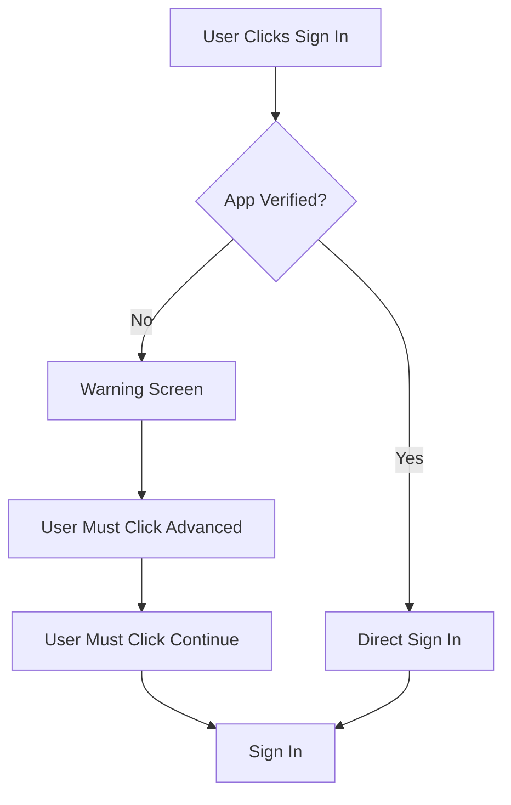
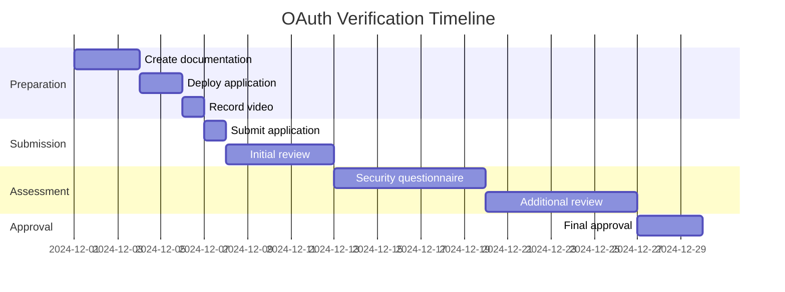

# Google OAuth Verification Guide

Complete guide to getting your Google OAuth application verified for public use.

## Table of Contents

1. [Overview](#overview)
2. [Development vs Production](#development-vs-production)
3. [Pre-Verification Checklist](#pre-verification-checklist)
4. [OAuth Consent Screen Configuration](#oauth-consent-screen-configuration)
5. [Verification Process](#verification-process)
6. [Required Documentation](#required-documentation)
7. [Common Rejection Reasons](#common-rejection-reasons)
8. [Timeline & Costs](#timeline--costs)
9. [Alternatives to Verification](#alternatives-to-verification)

## Overview

Google OAuth apps have two states:

### Testing Mode (Unverified)
- Limited to 100 test users
- Shows "unverified app" warning
- No verification required
- Good for: Development, private use, small teams

### Production Mode (Verified)
- Unlimited users
- No warning screen
- Requires Google verification
- Good for: Public applications

## Development vs Production

### Testing Mode Limitations



**Testing Mode:**
- ⚠️ Shows scary warning: "This app isn't verified"
- ⚠️ Limited to 100 test users
- ⚠️ Users must manually add themselves
- ✅ No verification needed
- ✅ Free
- ✅ Immediate setup

**Production Mode:**
- ✅ No warning screen
- ✅ Unlimited users
- ✅ Professional appearance
- ❌ Requires verification (2-6 weeks)
- ❌ May require security assessment ($15,000-$75,000)
- ❌ Ongoing compliance requirements

## Pre-Verification Checklist

Before starting verification, ensure you have:

### 1. Domain Requirements
- [ ] Own a domain (not localhost)
- [ ] Domain is publicly accessible
- [ ] HTTPS enabled (SSL certificate)
- [ ] Domain matches OAuth redirect URIs

### 2. Application Requirements
- [ ] Application is deployed and functional
- [ ] Privacy Policy published on your domain
- [ ] Terms of Service published on your domain
- [ ] Support email configured
- [ ] Application homepage exists

### 3. OAuth Configuration
- [ ] OAuth consent screen completed
- [ ] Scopes properly configured
- [ ] Redirect URIs use HTTPS
- [ ] Branding (logo, app name) configured

### 4. Legal Requirements
- [ ] Privacy Policy compliant with GDPR/CCPA
- [ ] Terms of Service written
- [ ] Data handling procedures documented
- [ ] Company/organization information ready

## OAuth Consent Screen Configuration

### Step 1: Access Google Cloud Console

1. Go to [Google Cloud Console](https://console.cloud.google.com/)
2. Select your project
3. Navigate to: **APIs & Services** → **OAuth consent screen**

### Step 2: Choose User Type

**Internal** (Google Workspace only)
- Only for Google Workspace organizations
- No verification needed
- Limited to your organization's users

**External** (Public)
- For public applications
- Requires verification for production
- Available to all Google users

Choose: **External**

### Step 3: Configure App Information

#### App Information
```
App name: UP Schedule Generator
User support email: support@yourdomain.com
App logo: [Upload 120x120 PNG]
```

#### App Domain
```
Application home page: https://yourdomain.com
Application privacy policy: https://yourdomain.com/privacy
Application terms of service: https://yourdomain.com/terms
```

#### Authorized Domains
```
yourdomain.com
```

#### Developer Contact Information
```
Email addresses: developer@yourdomain.com
```

### Step 4: Configure Scopes

For UP Schedule Generator, you need:

**Required Scopes:**
```
https://www.googleapis.com/auth/userinfo.email
https://www.googleapis.com/auth/userinfo.profile
https://www.googleapis.com/auth/calendar.events
```

**Scope Justification (for verification):**
- `userinfo.email`: Required for user identification and account management
- `userinfo.profile`: Required to display user name in the application
- `calendar.events`: Required to create calendar events from uploaded PDF schedules

### Step 5: Add Test Users (Testing Mode)

While in testing mode, add up to 100 test users:

1. Click **Add Users**
2. Enter email addresses (one per line)
3. Save

**Note:** Test users can use the app without seeing the warning screen.

## Verification Process

### When to Apply for Verification

Apply when:
- You have 100+ users
- You want to remove the warning screen
- You're ready for public launch
- You have all required documentation

### Step-by-Step Verification

#### Step 1: Prepare Required Documents

Create these pages on your domain:

**1. Privacy Policy** (`https://yourdomain.com/privacy`)

Must include:
- What data you collect
- How you use the data
- How you store the data
- How users can delete their data
- Third-party services used (Google Calendar API)
- Contact information

**2. Terms of Service** (`https://yourdomain.com/terms`)

Must include:
- Service description
- User responsibilities
- Liability limitations
- Termination conditions
- Governing law

**3. Homepage** (`https://yourdomain.com`)

Must include:
- Clear description of your app
- How to use it
- Link to privacy policy
- Link to terms of service
- Support contact

#### Step 2: Submit for Verification

1. Go to **OAuth consent screen**
2. Click **Publish App**
3. Click **Prepare for Verification**
4. Complete the verification form:

**Application Details:**
```
Application name: UP Schedule Generator
Application type: Web Application
Application description: 
  "UP Schedule Generator converts University of Pretoria 
   class schedule PDFs into Google Calendar events. Users 
   upload their PDF schedule, preview extracted events, 
   and sync them to their Google Calendar."

Why do you need access to user data?
  "We need access to Google Calendar to create calendar 
   events from the user's uploaded class schedule. We need 
   user email and profile to identify users and provide 
   personalized service."
```

**Scope Justification:**

For each scope, explain:

```
calendar.events:
  "Required to create calendar events in the user's Google 
   Calendar based on their uploaded class schedule PDF. 
   Users explicitly authorize this to sync their schedule."

userinfo.email:
  "Required to identify users and associate uploaded 
   schedules with their account. Used for authentication 
   and account management."

userinfo.profile:
  "Required to display the user's name in the application 
   interface for personalization."
```

**Video Demonstration:**
- Record a video showing:
  - User signing in with Google
  - Uploading a PDF
  - Events being created in Google Calendar
  - User data being used
- Upload to YouTube (unlisted)
- Provide link in verification form

#### Step 3: Domain Verification

1. Go to [Google Search Console](https://search.google.com/search-console)
2. Add your domain
3. Verify ownership via:
   - DNS record (recommended)
   - HTML file upload
   - HTML meta tag
   - Google Analytics
   - Google Tag Manager

**DNS Verification (Recommended):**
```
Type: TXT
Name: @
Value: google-site-verification=XXXXXXXXXXXXX
```

#### Step 4: Security Assessment (If Required)

Google may require a security assessment if you request sensitive or restricted scopes.

**Sensitive Scopes** (may require assessment):
- `calendar.events` (what we use)
- `gmail.readonly`
- `drive.file`

**Assessment Options:**

1. **Self-Assessment** (Free)
   - Complete Google's security questionnaire
   - Provide evidence of security measures
   - May be sufficient for low-risk apps

2. **Third-Party Assessment** ($15,000-$75,000)
   - Required for high-risk scopes
   - Annual CASA (Cloud Application Security Assessment)
   - Performed by Google-approved assessor

**For UP Schedule Generator:**
- `calendar.events` is sensitive but not restricted
- Self-assessment likely sufficient
- Focus on demonstrating security practices

#### Step 5: Wait for Review

**Timeline:**
- Initial review: 3-5 business days
- Security assessment: 2-6 weeks
- Total: 2-8 weeks typically

**During Review:**
- Check email regularly
- Respond to Google's questions promptly
- Be prepared to provide additional documentation

## Required Documentation

### 1. Privacy Policy Template

```markdown
# Privacy Policy

Last updated: [DATE]

## Introduction
UP Schedule Generator ("we", "our", "us") operates https://yourdomain.com.
This page informs you of our policies regarding the collection, use, and 
disclosure of personal data.

## Information We Collect
- Google Account email address
- Google Account profile information (name, profile picture)
- Uploaded PDF files (temporarily stored)
- Calendar events created by you

## How We Use Your Information
- To authenticate your identity
- To create calendar events in your Google Calendar
- To process uploaded PDF schedules
- To provide customer support

## Data Storage and Security
- PDF files are stored temporarily and deleted after processing
- User data is stored securely in encrypted databases
- We use industry-standard security measures
- Data is stored on AWS servers in [REGION]

## Third-Party Services
We use Google Calendar API to create events in your calendar. 
Google's privacy policy: https://policies.google.com/privacy

## Your Rights
You can:
- Delete your account and all associated data
- Revoke Google Calendar access at any time
- Request a copy of your data
- Request deletion of your data

## Data Retention
- Account data: Until you delete your account
- PDF files: Deleted immediately after processing
- Calendar events: Remain in your Google Calendar until you delete them

## Contact Us
Email: privacy@yourdomain.com
Address: [YOUR ADDRESS]

## Changes to This Policy
We may update this policy. Changes will be posted on this page.
```

### 2. Terms of Service Template

```markdown
# Terms of Service

Last updated: [DATE]

## Acceptance of Terms
By using UP Schedule Generator, you agree to these terms.

## Description of Service
UP Schedule Generator converts PDF class schedules into Google Calendar events.

## User Responsibilities
You agree to:
- Provide accurate information
- Use the service lawfully
- Not abuse or overload the service
- Keep your account secure

## Google Calendar Access
By authorizing Google Calendar access, you permit us to create calendar 
events on your behalf. You can revoke this access at any time through 
your Google Account settings.

## Data and Privacy
Your use of the service is also governed by our Privacy Policy.

## Limitation of Liability
The service is provided "as is" without warranties. We are not liable 
for any damages arising from use of the service.

## Termination
We may terminate or suspend access to our service immediately, without 
prior notice, for any reason.

## Changes to Terms
We reserve the right to modify these terms at any time.

## Contact
Email: legal@yourdomain.com
```

### 3. Video Demonstration Script

**Duration:** 2-3 minutes

**Script:**
1. **Introduction (15 seconds)**
   - "This is UP Schedule Generator"
   - Show homepage
   - Explain purpose

2. **Sign In (30 seconds)**
   - Click "Sign in with Google"
   - Show OAuth consent screen
   - Explain permissions requested
   - Complete sign in

3. **Upload PDF (30 seconds)**
   - Upload sample PDF schedule
   - Show processing
   - Show extracted events

4. **Calendar Sync (45 seconds)**
   - Click "Sync to Calendar"
   - Show events being created
   - Open Google Calendar
   - Show created events

5. **Data Usage (30 seconds)**
   - Show where email is displayed
   - Show where profile is used
   - Explain data handling

6. **Revoke Access (15 seconds)**
   - Show how to revoke access
   - Google Account → Security → Third-party apps

## Common Rejection Reasons

### 1. Incomplete Privacy Policy
**Issue:** Privacy policy doesn't cover all required topics

**Solution:**
- Include all data collection practices
- Explain data retention
- Describe user rights
- Add contact information

### 2. Domain Mismatch
**Issue:** OAuth redirect URIs don't match verified domain

**Solution:**
- Ensure all URIs use your verified domain
- Use HTTPS for all URIs
- Remove localhost URIs before verification

### 3. Unclear Scope Justification
**Issue:** Google doesn't understand why you need certain scopes

**Solution:**
- Provide detailed, specific explanations
- Show exactly where each scope is used
- Include screenshots or video

### 4. Insufficient Video Demonstration
**Issue:** Video doesn't clearly show data usage

**Solution:**
- Show complete user flow
- Demonstrate each scope being used
- Explain what's happening
- Show actual data in the app

### 5. Unverified Domain
**Issue:** Domain ownership not verified

**Solution:**
- Complete domain verification in Search Console
- Wait for verification to propagate
- Resubmit application

### 6. Security Concerns
**Issue:** Google has security concerns about your app

**Solution:**
- Implement HTTPS everywhere
- Add security headers
- Document security practices
- Consider security assessment

## Timeline & Costs

### Verification Timeline



**Total Time:** 4-8 weeks typically

### Costs

**Free Tier:**
- OAuth setup: Free
- Testing mode: Free
- Self-assessment: Free
- Domain: $10-15/year

**Paid Options:**
- Third-party security assessment: $15,000-$75,000
- Legal review of policies: $500-$2,000
- Professional video production: $500-$2,000

**For UP Schedule Generator:**
- Estimated cost: $10-50 (domain + time)
- Self-assessment likely sufficient
- No paid assessment needed for calendar.events

## Alternatives to Verification

### Option 1: Stay in Testing Mode

**Pros:**
- No verification needed
- Free
- Immediate

**Cons:**
- Limited to 100 users
- Warning screen
- Manual user management

**Best for:**
- University projects
- Internal tools
- Small user base

### Option 2: Use Service Account

**Pros:**
- No OAuth consent screen
- No user limits
- No verification

**Cons:**
- Can't access user's personal calendar
- Requires domain-wide delegation
- Only for Google Workspace

**Not suitable for UP Schedule Generator**

### Option 3: Alternative Authentication

**Pros:**
- No Google verification
- Full control

**Cons:**
- Users can't use Google Calendar
- Must implement own calendar
- More development work

**Not suitable for UP Schedule Generator**

### Recommendation

**For UP Schedule Generator:**

1. **Start:** Testing mode with 100 test users
2. **Grow:** Apply for verification when approaching 100 users
3. **Scale:** Complete verification for public launch

**Timeline:**
- Months 1-3: Testing mode, gather feedback
- Month 4: Prepare verification documents
- Months 5-6: Verification process
- Month 7+: Public launch

## Step-by-Step Checklist

### Phase 1: Preparation (1-2 weeks)

- [ ] Deploy application to production domain
- [ ] Enable HTTPS with valid SSL certificate
- [ ] Create privacy policy page
- [ ] Create terms of service page
- [ ] Create support email address
- [ ] Add branding (logo, app name)
- [ ] Verify domain in Search Console
- [ ] Test application thoroughly

### Phase 2: OAuth Configuration (1 day)

- [ ] Configure OAuth consent screen
- [ ] Set user type to "External"
- [ ] Add app information
- [ ] Add authorized domains
- [ ] Configure scopes
- [ ] Add developer contact
- [ ] Add test users (if staying in testing mode)

### Phase 3: Documentation (3-5 days)

- [ ] Write detailed scope justifications
- [ ] Create video demonstration
- [ ] Upload video to YouTube (unlisted)
- [ ] Prepare security questionnaire answers
- [ ] Document data handling procedures
- [ ] Prepare company/organization information

### Phase 4: Submission (1 day)

- [ ] Click "Publish App"
- [ ] Click "Prepare for Verification"
- [ ] Complete verification form
- [ ] Submit scope justifications
- [ ] Provide video link
- [ ] Submit application

### Phase 5: Review Process (2-6 weeks)

- [ ] Monitor email for Google responses
- [ ] Respond to questions within 24 hours
- [ ] Provide additional documentation if requested
- [ ] Complete security assessment if required
- [ ] Address any concerns raised

### Phase 6: Post-Approval (Ongoing)

- [ ] Update privacy policy as needed
- [ ] Maintain security practices
- [ ] Respond to user concerns
- [ ] Keep documentation current
- [ ] Monitor for policy changes

## Support Resources

### Google Documentation
- [OAuth Consent Screen](https://support.google.com/cloud/answer/10311615)
- [Verification Requirements](https://support.google.com/cloud/answer/9110914)
- [API Services User Data Policy](https://developers.google.com/terms/api-services-user-data-policy)
- [OAuth 2.0 Policies](https://developers.google.com/identity/protocols/oauth2/policies)

### Tools
- [Google Cloud Console](https://console.cloud.google.com/)
- [Google Search Console](https://search.google.com/search-console)
- [OAuth 2.0 Playground](https://developers.google.com/oauthplayground/)

### Community
- [Stack Overflow - google-oauth](https://stackoverflow.com/questions/tagged/google-oauth)
- [Google Cloud Community](https://www.googlecloudcommunity.com/)

## Frequently Asked Questions

### How long does verification take?
Typically 2-6 weeks, but can take longer if additional documentation is required.

### Do I need a security assessment?
Maybe. Google may require it for sensitive scopes like calendar.events. Start with self-assessment.

### Can I use the app while waiting for verification?
Yes, in testing mode with up to 100 test users.

### What if my verification is rejected?
Address the issues raised, update your application, and resubmit. Common issues are fixable.

### Do I need a company to get verified?
No, individuals can get verified, but you need proper documentation and a professional domain.

### Can I change scopes after verification?
Yes, but changes may require re-verification.

### How much does verification cost?
Free for self-assessment. Paid security assessment ($15k-$75k) only if Google requires it.

### What happens if I don't get verified?
You can continue in testing mode with 100 users, but users will see a warning screen.

---

**Guide Version:** 1.0  
**Last Updated:** 2024-11-30  
**Next Review:** 2025-02-28  
**Maintained By:** DevOps Team
