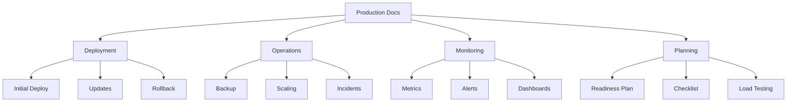
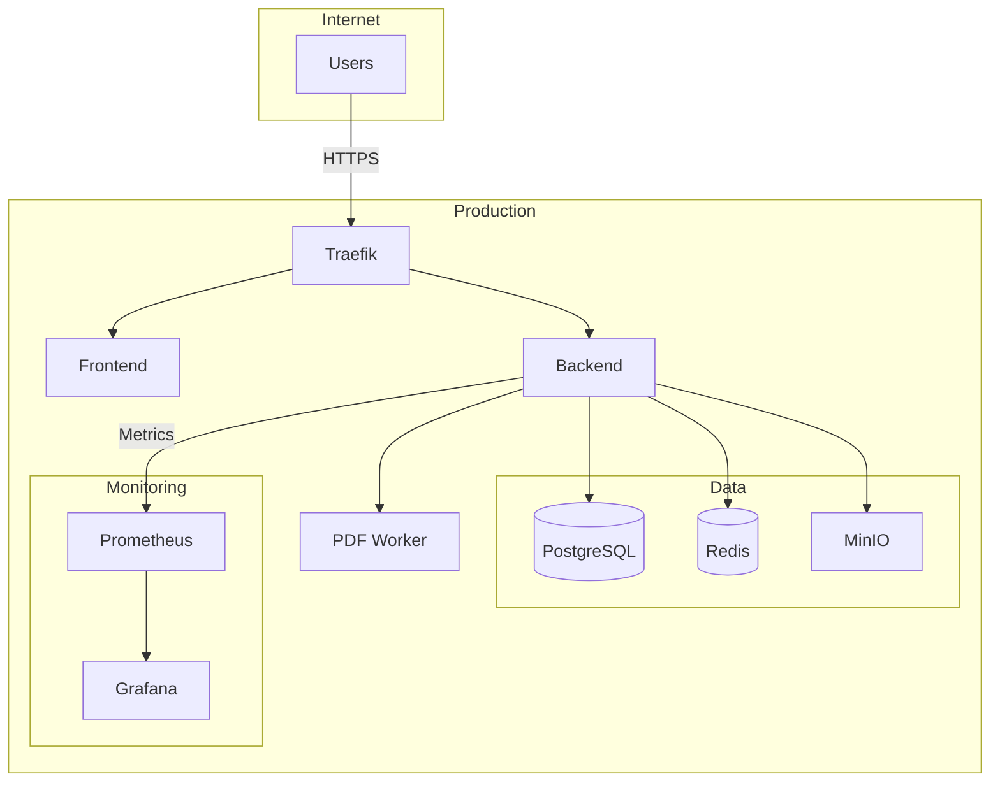

# Production Documentation Index

Complete guide to deploying and operating UP Schedule Generator in production.

## Quick Start

**New to production deployment?** Start here:
1. [Production Readiness Plan](./PRODUCTION_READINESS_PLAN.md) - 6-week implementation plan
2. [Production Checklist](./PRODUCTION_CHECKLIST.md) - Track your progress
3. [Quick Start Guide](./QUICK_START.md) - Visual overview

## Deployment

### Cloud Platforms
- [AWS EC2 Deployment Guide](./AWS_EC2_DEPLOYMENT_GUIDE.md) - Complete AWS EC2 setup with domain configuration
  - [AWS EC2 Quick Reference](./AWS_EC2_QUICK_REFERENCE.md) - Essential commands and checklists
  - Domain configuration (Route 53 or registrar DNS)
  - Docker registry setup (Docker Hub, ECR, or self-hosted)
  - Migration path to elastic infrastructure

### OAuth & Authentication
- [Google OAuth Verification Guide](./GOOGLE_OAUTH_VERIFICATION_GUIDE.md) - Complete guide to OAuth verification
  - [Google OAuth Quick Checklist](./GOOGLE_OAUTH_QUICK_CHECKLIST.md) - Fast-track verification checklist
  - Testing vs Production mode
  - Required documentation and policies
  - Verification process and timeline

### Initial Deployment
- [Deployment Runbook](./deployment/README.md) - Complete deployment guide
  - [Prerequisites](./deployment/prerequisites.md)
  - [Initial Setup](./deployment/initial-setup.md)
  - [Configuration](./deployment/configuration.md)
  - [Verification](./deployment/verification.md)

### Updates & Rollback
- [Rolling Updates](./deployment/rolling-updates.md) - Zero-downtime updates
- [Rollback Procedures](./rollback/README.md) - Rollback guide
  - [Quick Rollback](./rollback/quick-rollback.md)
  - [Database Rollback](./rollback/database-rollback.md)
  - [Full Rollback](./rollback/full-rollback.md)

## Operations

### Backup & Recovery
- [Backup Guide](./backup/README.md) - Backup strategy
  - [Automated Backups](./backup/automation.md)
  - [Manual Backups](./backup/manual.md)
  - [Restore Procedures](./backup/restore.md)
  - [Quick Reference](./BACKUP_QUICK_REFERENCE.md)

### Scaling
- [Scaling Runbook](./SCALING_RUNBOOK.md) - Horizontal and vertical scaling
- [Scalability Assessment](./SCALABILITY_ASSESSMENT.md) - Current capacity analysis

### Incident Response
- [Incident Response Runbook](./INCIDENT_RESPONSE_RUNBOOK.md) - Handle production incidents
- [Common Issues](./troubleshooting/common-issues.md)
- [Emergency Contacts](./troubleshooting/contacts.md)

## Monitoring & Observability

### Setup
- [Monitoring Guide](./monitoring/README.md) - Complete monitoring setup
  - [Prometheus Setup](./monitoring/prometheus.md)
  - [Grafana Dashboards](./monitoring/grafana.md)
  - [Alert Configuration](./monitoring/alerts.md)

### Reference
- [Monitoring & Alerting Guide](./MONITORING_ALERTING_GUIDE.md) - Alert rules and thresholds
- [Metrics Reference](./monitoring/metrics-reference.md) - Available metrics

## Planning & Assessment

### Readiness
- [Production Readiness Plan](./PRODUCTION_READINESS_PLAN.md) - 6-week implementation plan
- [Production Checklist](./PRODUCTION_CHECKLIST.md) - Track implementation progress
- [Implementation Guide](./IMPLEMENTATION_GUIDE.md) - Step-by-step technical guide

### Testing
- [Load Testing Guide](./LOAD_TESTING.md) - Performance testing procedures
- [Performance Baselines](./testing/baselines.md) - Expected performance metrics

### Architecture
- [Scalability Assessment](./SCALABILITY_ASSESSMENT.md) - Capacity planning
- [Architecture Decisions](./architecture/decisions.md) - Key design choices

## Runbooks

Quick access to operational procedures:
- [Deployment Runbook](./deployment/README.md)
- [Rollback Runbook](./rollback/README.md)
- [Backup Runbook](./backup/README.md)
- [Scaling Runbook](./SCALING_RUNBOOK.md)
- [Incident Response Runbook](./INCIDENT_RESPONSE_RUNBOOK.md)

## Quick Reference Cards

- [Backup Quick Reference](./BACKUP_QUICK_REFERENCE.md)
- [Rollback Quick Reference](./ROLLBACK_QUICK_REFERENCE.md)
- [Verification Quick Reference](./VERIFICATION_QUICK_REFERENCE.md)

## System Overview

## Support

- **Documentation Issues**: Create issue in GitHub
- **Production Incidents**: Follow [Incident Response Runbook](./INCIDENT_RESPONSE_RUNBOOK.md)
- **Questions**: Check [FAQ](./faq.md)
