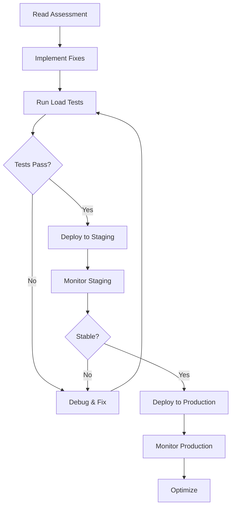

# Production Documentation

This directory contains comprehensive documentation for deploying and scaling the UP Schedule Generator in production environments.

## Documents Overview

### 1. [Production Readiness Plan](./PRODUCTION_READINESS_PLAN.md) ⭐ **START HERE**
**Purpose**: Complete 6-week plan to make the system production-ready

**Key Topics**:
- Week-by-week implementation schedule
- Resource requirements and costs
- Risk assessment and mitigation
- Success criteria and validation
- Post-launch monitoring plan

**Read this first** for the complete roadmap to production.

### 2. [Production Checklist](./PRODUCTION_CHECKLIST.md)
**Purpose**: Quick reference checklist for tracking progress

**Key Topics**:
- Phase-by-phase task lists
- Infrastructure requirements
- Testing requirements
- Monitoring requirements
- Sign-off checklist

**Use this** to track your progress through the plan.

### 3. [Scalability Assessment](./SCALABILITY_ASSESSMENT.md)
**Purpose**: Comprehensive analysis of production readiness for high user loads

**Key Topics**:
- Current system capabilities and limitations
- Critical gaps for high-scale deployment
- Resource requirements by scale tier
- Cost estimates
- Risk assessment

**Read this** to understand current state and gaps.

### 4. [Implementation Guide](./IMPLEMENTATION_GUIDE.md)
**Purpose**: Step-by-step instructions for implementing scalability improvements

**Key Topics**:
- PDF worker horizontal scaling
- Job queue configuration
- Database connection pooling
- Redis optimization
- Rate limiting implementation
- Monitoring setup

**Use this** to implement the fixes identified in the assessment.

### 5. [Load Testing Guide](./LOAD_TESTING.md)
**Purpose**: Validate system performance under various load conditions

**Key Topics**:
- K6 load testing setup
- Test scenarios (baseline, stress, spike, soak)
- Performance benchmarks
- Monitoring during tests
- Results analysis

**Use this** to verify your improvements work under load.

### 6. [Backup Automation](./BACKUP_AUTOMATION.md)
**Purpose**: Configure automated backups for production data protection

**Key Topics**:
- Daily automated backups (database + MinIO)
- Multiple deployment options (Docker, systemd, cron)
- Alert configuration (webhook + email)
- Backup verification and restore procedures
- 7-day retention policy

**Use this** to set up reliable backup and recovery.

### 7. [Backup Quick Reference](./BACKUP_QUICK_REFERENCE.md)
**Purpose**: Quick commands for backup operations

**Key Topics**:
- Common backup commands
- Restore procedures
- Monitoring and troubleshooting
- Configuration examples

**Use this** for day-to-day backup management.

## 🚀 Quick Start

**New to production readiness?** Start here:

1. **[Quick Start Guide](./QUICK_START.md)** ⭐ - Visual overview (5 min read)
2. **[Roadmap](./ROADMAP.md)** - Visual timeline and milestones
3. **[Production Readiness Plan](./PRODUCTION_READINESS_PLAN.md)** - Complete 6-week plan
4. **[Production Checklist](./PRODUCTION_CHECKLIST.md)** - Track your progress

---

### For Small Scale Deployment (100-500 users)

1. Read the [Quick Start Guide](./QUICK_START.md)
2. Implement Week 1 critical fixes from [Implementation Guide](./IMPLEMENTATION_GUIDE.md)
3. Run baseline tests from [Load Testing Guide](./LOAD_TESTING.md)
4. Deploy using main [Deployment Guide](../../DEPLOYMENT.md)

**Timeline**: 1-2 weeks

### For Medium Scale Deployment (500-2000 users)

1. Read full [Scalability Assessment](./SCALABILITY_ASSESSMENT.md)
2. Implement all Phase 1 fixes from [Implementation Guide](./IMPLEMENTATION_GUIDE.md)
3. Set up monitoring (Phase 2)
4. Run comprehensive load tests from [Load Testing Guide](./LOAD_TESTING.md)
5. Deploy with scaling configuration

**Timeline**: 4-6 weeks

### For Large Scale Deployment (2000+ users)

1. Complete all documentation review
2. Implement all phases from [Implementation Guide](./IMPLEMENTATION_GUIDE.md)
3. Set up auto-scaling infrastructure
4. Run extended soak tests
5. Implement CDN and caching layers
6. Set up 24/7 monitoring and alerting

**Timeline**: 8-12 weeks

## Critical Priorities by Scale

### Immediate (All Scales)
- ✅ PDF worker resource limits
- ✅ Job queue timeout configuration
- ✅ Database connection pool sizing
- ✅ Basic health checks

### High Priority (Medium Scale+)
- ⚠️ Horizontal scaling for PDF workers
- ⚠️ Redis configuration and caching
- ⚠️ Rate limiting per user
- ⚠️ Monitoring and alerting

### Medium Priority (Large Scale)
- 🔵 Auto-scaling policies
- 🔵 Database replication
- 🔵 CDN integration
- 🔵 Advanced caching strategies

## Performance Targets

### Small Scale (100-500 users)
```
Concurrent Users: 100-500
Uploads/minute: 10-20
Response Time (p95): <5s
Error Rate: <2%
Uptime: 99%
```

### Medium Scale (500-2000 users)
```
Concurrent Users: 500-2000
Uploads/minute: 50-100
Response Time (p95): <3s
Error Rate: <1%
Uptime: 99.5%
```

### Large Scale (2000-10000 users)
```
Concurrent Users: 2000-10000
Uploads/minute: 200-500
Response Time (p95): <2s
Error Rate: <0.5%
Uptime: 99.9%
```

## Resource Requirements

### Small Scale
```yaml
Server: 2 CPU, 4GB RAM, 50GB SSD
Cost: ~$75-130/month
Services:
  - Frontend: 1 instance
  - Backend: 1 instance
  - PDF Worker: 2 instances
  - PostgreSQL: 1GB
  - Redis: 512MB
```

### Medium Scale
```yaml
Server: 4 CPU, 16GB RAM, 200GB SSD
Cost: ~$320-600/month
Services:
  - Frontend: 2 instances
  - Backend: 3 instances
  - PDF Worker: 5 instances
  - PostgreSQL: 4GB
  - Redis: 2GB
```

### Large Scale
```yaml
Cluster: Multi-server with auto-scaling
Cost: ~$1600-4100/month
Services:
  - Frontend: 3-10 instances (auto-scale)
  - Backend: 5-20 instances (auto-scale)
  - PDF Worker: 10-50 instances (auto-scale)
  - PostgreSQL: Primary + 2 replicas
  - Redis: Cluster mode (3 nodes)
```

## Monitoring Checklist

Essential metrics to monitor in production:

### Application Metrics
- [ ] Request rate (req/s)
- [ ] Response time (p50, p95, p99)
- [ ] Error rate (%)
- [ ] Job queue length
- [ ] Job processing time
- [ ] Active users

### Infrastructure Metrics
- [ ] CPU usage (%)
- [ ] Memory usage (%)
- [ ] Disk usage (%)
- [ ] Network I/O
- [ ] Container health

### Business Metrics
- [ ] Uploads per hour
- [ ] Processing success rate
- [ ] User retention
- [ ] Storage usage
- [ ] Cost per user

## Common Issues and Solutions

### Issue: PDF Processing Slow
**Symptoms**: Long job completion times, queue backlog
**Solution**: Scale PDF workers, add resource limits
**Reference**: [Implementation Guide §1.1](./IMPLEMENTATION_GUIDE.md#11-pdf-worker-horizontal-scaling)

### Issue: Database Connection Exhaustion
**Symptoms**: Connection timeout errors, slow queries
**Solution**: Increase connection pool size, add timeouts
**Reference**: [Implementation Guide §1.3](./IMPLEMENTATION_GUIDE.md#13-database-connection-pool)

### Issue: High Memory Usage
**Symptoms**: OOM kills, degrading performance
**Solution**: Add memory limits, implement cleanup
**Reference**: [Scalability Assessment §7](./SCALABILITY_ASSESSMENT.md#7-medium-file-upload-limits-)

### Issue: Rate Limit Exceeded
**Symptoms**: 429 errors, blocked users
**Solution**: Implement per-user limits, add headers
**Reference**: [Implementation Guide §1.5](./IMPLEMENTATION_GUIDE.md#15-rate-limiting)

## Testing Strategy

### Pre-Deployment Testing
1. **Unit Tests**: Verify individual components
2. **Integration Tests**: Test service interactions
3. **Load Tests**: Validate performance under load
4. **Stress Tests**: Find breaking points
5. **Soak Tests**: Verify stability over time

### Post-Deployment Monitoring
1. **Health Checks**: Continuous service monitoring
2. **Performance Metrics**: Track response times
3. **Error Tracking**: Monitor error rates
4. **User Metrics**: Track user behavior
5. **Cost Monitoring**: Track infrastructure costs

## Deployment Workflow



## Support and Maintenance

### Daily Tasks
- Monitor service health
- Check error logs
- **Verify backups completed** (see [Backup Quick Reference](./BACKUP_QUICK_REFERENCE.md))
- Review performance metrics

### Weekly Tasks
- Review resource usage
- Check disk space
- Update Docker images
- Analyze slow queries

### Monthly Tasks
- Rotate secrets
- Review security logs
- Test disaster recovery
- Update system packages
- Review cost optimization

## Related Documentation

### Core Documentation
- [Main README](../../README.md) - Project overview
- [Deployment Guide](../../DEPLOYMENT.md) - Deployment instructions
- [Architecture Overview](../architecture/overview.md) - System design

### Component Documentation
- [Frontend](../components/frontend.md) - Next.js application
- [Backend](../components/backend.md) - NestJS API
- [PDF Worker](../components/pdf-worker.md) - Python parser

### Development Documentation
- [Getting Started](../guides/getting-started.md) - Development setup
- [API Documentation](../api/rest-api.md) - API reference

## Contributing

When updating production documentation:

1. Follow [Documentation Standards](../../.kiro/steering/documentation-standards.md)
2. Test all code examples
3. Verify links are not broken
4. Update version numbers and dates
5. Add to this index if creating new documents

## Questions?

- **Technical Issues**: Check [Troubleshooting](../../DEPLOYMENT.md#troubleshooting)
- **Performance Issues**: See [Scalability Assessment](./SCALABILITY_ASSESSMENT.md)
- **Implementation Help**: Follow [Implementation Guide](./IMPLEMENTATION_GUIDE.md)
- **Testing Help**: Use [Load Testing Guide](./LOAD_TESTING.md)

---

**Last Updated**: 2024-11-30  
**Maintained By**: DevOps Team  
**Review Schedule**: Monthly during active development
