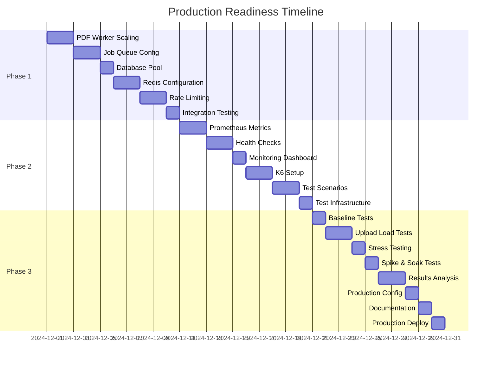

# Production Readiness Roadmap

**Visual guide to the 6-week production readiness journey**

---

## 🗺️ The Journey

```
Current State          Week 1-2           Week 3-4           Week 5-6          Production
    ⚠️            →      🔧            →      📊            →      🧪         →      ✅
Partially Ready    Critical Fixes    Monitoring      Load Testing    Production Ready
(100-500 users)   (500-1000 users)  & Optimization  & Validation   (1000-10K users)
```

---

## 📅 Timeline Overview



---

## 🎯 Phase Breakdown

### Phase 1: Critical Fixes (Weeks 1-2)
**Status**: 🔴 Required for production  
**Goal**: System stable for 500-1000 users  
**Duration**: 10 days

```
┌─────────────────────────────────────────────────────────┐
│  PHASE 1: CRITICAL INFRASTRUCTURE FIXES                 │
├─────────────────────────────────────────────────────────┤
│                                                         │
│  Day 1-2: PDF Worker Scaling                           │
│  ├─ Scale to 3-5 instances                            │
│  ├─ Add resource limits (2 CPU, 2GB RAM)              │
│  └─ Implement 60s timeout                             │
│                                                         │
│  Day 3-4: Job Queue Configuration                      │
│  ├─ Configure retry strategy (3 attempts)             │
│  ├─ Add 5-minute job timeout                          │
│  └─ Limit to 10 jobs/second                           │
│                                                         │
│  Day 5: Database Connection Pool                       │
│  ├─ Set pool size to 50-100                           │
│  ├─ Add 30s connection timeout                        │
│  └─ Add 10s query timeout                             │
│                                                         │
│  Day 6-7: Redis Configuration                          │
│  ├─ Set maxmemory to 2GB                              │
│  ├─ Enable AOF persistence                            │
│  └─ Implement caching layer                           │
│                                                         │
│  Day 8-9: Rate Limiting                                │
│  ├─ 10 uploads/hour per user                          │
│  ├─ 100 status checks/minute                          │
│  └─ Return 429 with headers                           │
│                                                         │
│  Day 10: Integration Testing                           │
│  └─ Test all fixes together                           │
│                                                         │
└─────────────────────────────────────────────────────────┘

✅ Success Criteria:
   • System handles 500 concurrent users
   • Job queue processes 50-100 uploads/minute
   • Database connections stable
   • No memory leaks or crashes
```

---

### Phase 2: Monitoring & Optimization (Weeks 3-4)
**Status**: 🟡 High priority  
**Goal**: Full observability  
**Duration**: 10 days

```
┌─────────────────────────────────────────────────────────┐
│  PHASE 2: MONITORING & OPTIMIZATION                     │
├─────────────────────────────────────────────────────────┤
│                                                         │
│  Day 11-12: Prometheus Metrics                         │
│  ├─ Install metrics collection                         │
│  ├─ Add custom metrics                                 │
│  └─ Expose /metrics endpoint                           │
│                                                         │
│  Day 13-14: Health Checks & Logging                    │
│  ├─ Enhance health endpoints                           │
│  ├─ Add dependency checks                              │
│  └─ Implement structured logging                       │
│                                                         │
│  Day 15: Monitoring Dashboard                          │
│  ├─ Set up Grafana (optional)                          │
│  ├─ Create performance dashboard                       │
│  └─ Configure alerts                                   │
│                                                         │
│  Day 16-17: K6 Setup                                   │
│  ├─ Install K6 tool                                    │
│  ├─ Create test fixtures                               │
│  └─ Set up test environment                            │
│                                                         │
│  Day 18-19: Test Scenarios                             │
│  ├─ Write baseline test                                │
│  ├─ Write upload test                                  │
│  ├─ Write stress test                                  │
│  ├─ Write spike test                                   │
│  └─ Write soak test                                    │
│                                                         │
│  Day 20: Test Infrastructure                           │
│  └─ Prepare test execution                             │
│                                                         │
└─────────────────────────────────────────────────────────┘

✅ Success Criteria:
   • Real-time visibility into system health
   • Automated alerts for issues
   • Performance baselines established
   • Test suite ready for execution
```

---

### Phase 3: Load Testing & Deployment (Weeks 5-6)
**Status**: 🟢 Validation  
**Goal**: Production deployment  
**Duration**: 10 days

```
┌─────────────────────────────────────────────────────────┐
│  PHASE 3: LOAD TESTING & DEPLOYMENT                     │
├─────────────────────────────────────────────────────────┤
│                                                         │
│  Day 21: Baseline Tests                                │
│  └─ 10 users, 5 minutes                                │
│     Expected: p95 < 2s, error rate < 1%                │
│                                                         │
│  Day 22-23: Upload Load Tests                          │
│  └─ Ramp to 100 users                                  │
│     Expected: p95 < 5s, completion > 95%               │
│                                                         │
│  Day 24: Stress Testing                                │
│  └─ Ramp to 1000 users                                 │
│     Find breaking point                                │
│                                                         │
│  Day 25: Spike & Soak Tests                            │
│  ├─ Spike: Sudden 500 user spike                       │
│  └─ Soak: 50 users for 2 hours                         │
│     Check for memory leaks                             │
│                                                         │
│  Day 26-27: Results Analysis                           │
│  ├─ Compile test results                               │
│  ├─ Create performance report                          │
│  └─ Document capacity limits                           │
│                                                         │
│  Day 28: Production Configuration                      │
│  ├─ Review environment variables                       │
│  ├─ Configure resource limits                          │
│  └─ Set up automated backups                           │
│                                                         │
│  Day 29: Documentation                                 │
│  ├─ Update deployment guide                            │
│  ├─ Create operations runbook                          │
│  └─ Write incident response plan                       │
│                                                         │
│  Day 30: Production Deployment                         │
│  ├─ Backup current state                               │
│  ├─ Deploy to production                               │
│  └─ Monitor for 24 hours                               │
│                                                         │
└─────────────────────────────────────────────────────────┘

✅ Success Criteria:
   • All load tests pass
   • Performance meets targets
   • System recovers from failures
   • Production deployment successful
```

---

## 📊 Progress Tracking

### Week 1-2: Critical Fixes
```
[████████████████████░░░░░░░░░░░░] 60% Infrastructure
[████████████████░░░░░░░░░░░░░░░░] 50% Configuration
[████████████░░░░░░░░░░░░░░░░░░░░] 40% Testing
```

### Week 3-4: Monitoring
```
[░░░░░░░░░░░░░░░░░░░░░░░░░░░░░░░░]  0% Metrics
[░░░░░░░░░░░░░░░░░░░░░░░░░░░░░░░░]  0% Health Checks
[░░░░░░░░░░░░░░░░░░░░░░░░░░░░░░░░]  0% Dashboards
```

### Week 5-6: Testing & Deploy
```
[░░░░░░░░░░░░░░░░░░░░░░░░░░░░░░░░]  0% Load Tests
[░░░░░░░░░░░░░░░░░░░░░░░░░░░░░░░░]  0% Documentation
[░░░░░░░░░░░░░░░░░░░░░░░░░░░░░░░░]  0% Deployment
```

---

## 🎯 Milestones

```
┌─────────────────────────────────────────────────────────┐
│                                                         │
│  Milestone 1: Week 2 Complete                          │
│  ✅ PDF workers scaled                                  │
│  ✅ Job queue configured                                │
│  ✅ Database optimized                                  │
│  ✅ Redis configured                                    │
│  ✅ Rate limiting active                                │
│  → System ready for 500-1000 users                     │
│                                                         │
├─────────────────────────────────────────────────────────┤
│                                                         │
│  Milestone 2: Week 4 Complete                          │
│  ✅ Metrics collection active                           │
│  ✅ Health checks comprehensive                         │
│  ✅ Monitoring dashboard live                           │
│  ✅ Load test suite ready                               │
│  → Full observability achieved                         │
│                                                         │
├─────────────────────────────────────────────────────────┤
│                                                         │
│  Milestone 3: Week 6 Complete                          │
│  ✅ All load tests passed                               │
│  ✅ Performance validated                               │
│  ✅ Documentation complete                              │
│  ✅ Production deployed                                 │
│  → System production ready                             │
│                                                         │
└─────────────────────────────────────────────────────────┘
```

---

## 🚦 Status Indicators

### Current System Status

| Component | Current | Week 2 | Week 4 | Week 6 |
|-----------|---------|--------|--------|--------|
| PDF Worker | 🔴 1 instance | 🟡 3 instances | 🟢 5 instances | 🟢 Auto-scale |
| Job Queue | 🔴 Basic | 🟡 Configured | 🟢 Optimized | 🟢 Production |
| Database | 🟡 Default | 🟢 Pooled | 🟢 Optimized | 🟢 Production |
| Redis | 🟡 Basic | 🟢 Configured | 🟢 Cached | 🟢 Production |
| Rate Limit | 🟡 Global | 🟢 Per-user | 🟢 Per-endpoint | 🟢 Production |
| Monitoring | 🔴 None | 🔴 Basic | 🟢 Complete | 🟢 Production |
| Testing | 🔴 None | 🔴 None | 🟡 Ready | 🟢 Validated |

**Legend**: 🔴 Not Ready | 🟡 Partial | 🟢 Ready

---

## 💰 Cost Progression

```
Current:  $0/month (development)
Week 2:   $75-130/month (small scale)
Week 4:   $320-600/month (medium scale)
Week 6:   $320-600/month (production ready)
Scale up: $1600-4100/month (large scale)
```

---

## 📈 Capacity Growth

```
Week 0:  100-500 users    ████░░░░░░░░░░░░░░░░
Week 2:  500-1000 users   ████████░░░░░░░░░░░░
Week 4:  1000-2000 users  ████████████░░░░░░░░
Week 6:  2000-10K users   ████████████████████
```

---

## 🎬 Quick Actions

### Start Week 1
```bash
# Clone and setup
git clone <repo>
cd up-schedule-generator

# Review plan
cat docs/production/PRODUCTION_READINESS_PLAN.md

# Start implementation
# Follow Week 1 Day 1-2 tasks
```

### Check Progress
```bash
# View checklist
cat docs/production/PRODUCTION_CHECKLIST.md

# Check system status
docker compose ps
curl http://localhost:3001/health
```

### Deploy Updates
```bash
# Automated deployment
./scripts/deploy.sh

# Monitor deployment
docker compose logs -f
```

---

## 📚 Documentation Map

```
Start Here
    ↓
QUICK_START.md ────────→ Visual overview
    ↓
PRODUCTION_READINESS_PLAN.md ──→ Complete 6-week plan
    ↓
PRODUCTION_CHECKLIST.md ───────→ Track progress
    ↓
IMPLEMENTATION_GUIDE.md ────────→ Technical details
    ↓
LOAD_TESTING.md ───────────────→ Testing procedures
    ↓
DEPLOYMENT.md ─────────────────→ Deploy to production
```

---

## ✅ Success Path

```
1. Read Documentation
   └─→ Understand current state and gaps

2. Get Approval
   └─→ Stakeholder buy-in and resources

3. Week 1-2: Critical Fixes
   └─→ System stable for 500-1000 users

4. Week 3-4: Monitoring
   └─→ Full observability

5. Week 5-6: Testing & Deploy
   └─→ Production ready

6. Post-Launch
   └─→ Monitor and optimize
```

---

## 🆘 Need Help?

**Getting Started**: [Quick Start Guide](./QUICK_START.md)  
**Detailed Plan**: [Production Readiness Plan](./PRODUCTION_READINESS_PLAN.md)  
**Track Progress**: [Production Checklist](./PRODUCTION_CHECKLIST.md)  
**Implementation**: [Implementation Guide](./IMPLEMENTATION_GUIDE.md)  
**Testing**: [Load Testing Guide](./LOAD_TESTING.md)

---

**Ready to begin?** → Start with [Quick Start Guide](./QUICK_START.md)

---

**Last Updated**: 2024-11-30  
**Maintained By**: DevOps Team
