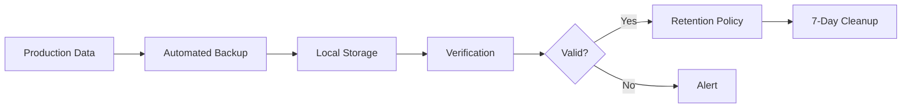
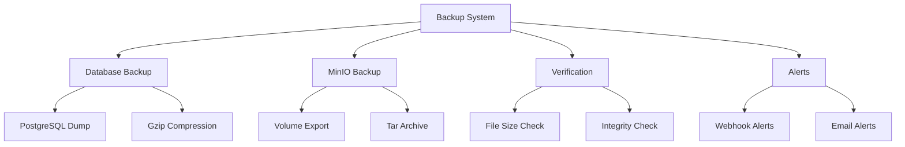
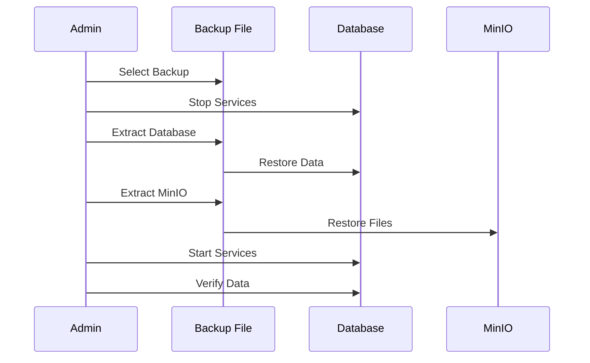

# Backup & Recovery Guide

Comprehensive backup strategy for production data protection.



## Overview

The backup system protects:
- PostgreSQL database (user data, jobs, events)
- MinIO volumes (uploaded PDF files)
- Configuration files

**Backup Schedule**: Daily at 2:00 AM  
**Retention**: 7 days  
**Storage**: `./backups/` directory

## Quick Links

- [Automated Backups](./automation.md) - Set up automated daily backups
- [Manual Backups](./manual.md) - Run backups on-demand
- [Restore Procedures](./restore.md) - Recover from backups
- [Quick Reference](../BACKUP_QUICK_REFERENCE.md) - Common commands

## Backup Components



## Setup Options

### Option 1: Docker Compose (Recommended)
```bash
docker compose -f docker-compose.yml -f docker-compose.backup.yml up -d backup
```
[View Docker Setup Guide](./automation.md#docker-compose-setup)

### Option 2: Systemd Timer
```bash
sudo systemctl enable backup.timer
sudo systemctl start backup.timer
```
[View Systemd Setup Guide](./automation.md#systemd-setup)

### Option 3: Cron
```bash
sudo cp scripts/backup-cron /etc/cron.d/schedgen-backup
```
[View Cron Setup Guide](./automation.md#cron-setup)

## Backup Files

```
backups/
├── db_schedgen_20241130_020000.sql.gz      # Database backup
└── minio_schedgen-pdfs_20241130_020000.tar.gz  # MinIO backup
```

## Restore Process



[View Detailed Restore Guide](./restore.md)

## Monitoring

### Check Backup Status
```bash
# View recent backups
ls -lh backups/

# Check backup logs
docker logs schedgen-backup

# Verify backup integrity
gunzip -t backups/db_schedgen_*.sql.gz
```

### Alerts

Alerts are sent on:
- Backup failure
- Verification failure
- Missing credentials
- Disk space issues

Configure alerts in `.env`:
```bash
BACKUP_ALERT_WEBHOOK_URL=https://hooks.slack.com/...
BACKUP_ALERT_EMAIL=admin@example.com
```

## Best Practices

1. **Test Restores Regularly** - Verify backups work
2. **Monitor Disk Space** - Ensure adequate storage
3. **Off-site Backups** - Copy to remote storage
4. **Document Procedures** - Keep runbooks updated
5. **Automate Everything** - Reduce human error

## Retention Policy

- **Daily backups**: Keep 7 days
- **Weekly backups**: Keep 4 weeks (future)
- **Monthly backups**: Keep 12 months (future)

Current implementation: 7-day rolling retention

## Disaster Recovery

For complete disaster recovery procedures, see:
- [Database Recovery](./restore.md#database-recovery)
- [MinIO Recovery](./restore.md#minio-recovery)
- [Full System Recovery](./restore.md#full-system-recovery)

## Related Documentation

- [Pre-Deployment Backup](./pre-deployment.md) - Backup before updates
- [Backup Automation](./automation.md) - Setup automated backups
- [Backup Runbook](../BACKUP_RUNBOOK.md) - Operational procedures
- [Incident Response](../INCIDENT_RESPONSE_RUNBOOK.md) - Handle data loss

## Configuration

Key environment variables:
```bash
BACKUP_SCHEDULE="0 2 * * *"           # Daily at 2 AM
BACKUP_RETENTION_DAYS=7                # Keep 7 days
BACKUP_ALERT_WEBHOOK_URL=<url>        # Slack/Discord webhook
BACKUP_ALERT_EMAIL=<email>            # Email notifications
```

See [Configuration Guide](./automation.md#configuration)
