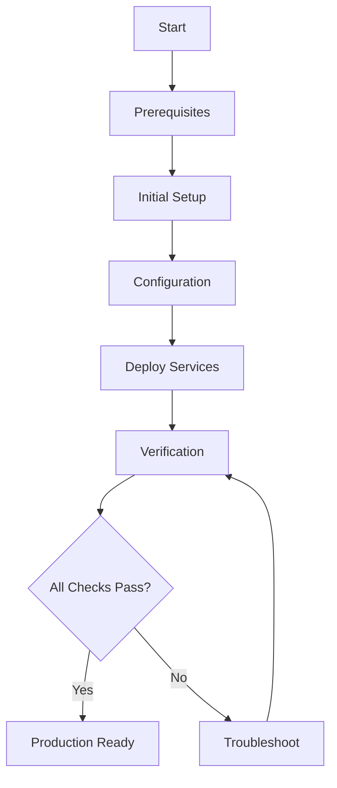
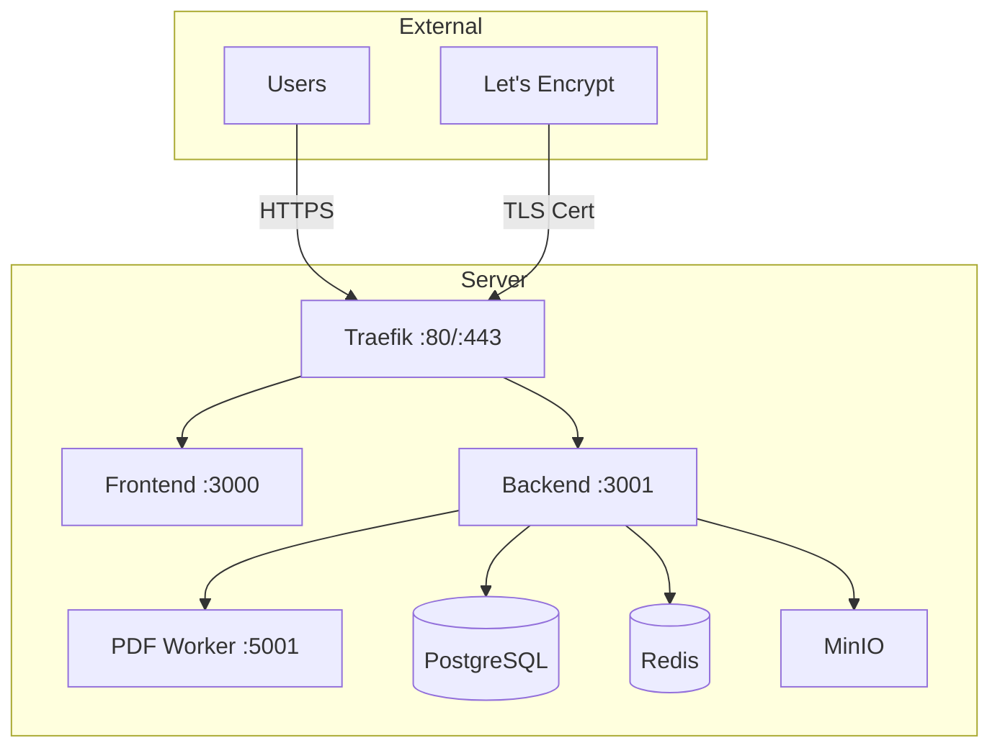

# Deployment Guide

Complete guide for deploying UP Schedule Generator to production.



## Overview

This guide covers deploying the application from scratch. For updates, see [Rolling Updates](./rolling-updates.md).

## Deployment Steps

### 1. Prerequisites
[View Prerequisites Guide](./prerequisites.md)

- Server requirements (4 CPU, 16GB RAM recommended)
- Docker & Docker Compose installed
- Domain with DNS configured
- Google OAuth credentials

### 2. Initial Setup
[View Initial Setup Guide](./initial-setup.md)

- Clone repository
- Configure firewall
- Set up SSL certificates
- Initialize storage

### 3. Configuration
[View Configuration Guide](./configuration.md)

- Environment variables
- Service configuration
- Security settings
- Database setup

### 4. Deploy Services
[View Deployment Steps](./deploy-services.md)

- Build Docker images
- Start infrastructure services
- Run database migrations
- Start application services

### 5. Verification
[View Verification Guide](./verification.md)

- Health checks
- Service connectivity
- SSL certificate validation
- Application testing

## Quick Deploy

For experienced users:

```bash
# 1. Clone and configure
git clone <repo-url>
cd ScheduleGenerator
cp .env.example .env
nano .env  # Configure all variables

# 2. Deploy
./scripts/deploy.sh

# 3. Verify
./scripts/verify-deployment.sh
```

## Architecture



## Deployment Options

### Standard Deployment
- Single server
- Docker Compose
- Suitable for 500-2000 users
- Cost: $320-600/month

### High Availability
- Multi-server cluster
- Load balancing
- Database replication
- Suitable for 2000+ users
- Cost: $1600+/month

See [Scalability Assessment](../SCALABILITY_ASSESSMENT.md)

## Related Guides

- [Rolling Updates](./rolling-updates.md) - Update existing deployment
- [Rollback Procedures](../rollback/README.md) - Rollback failed deployment
- [Backup Before Deploy](../backup/pre-deployment.md) - Pre-deployment backup
- [Troubleshooting](../troubleshooting/deployment-issues.md) - Common issues

## Support

- Check [Verification Guide](./verification.md) for health checks
- See [Troubleshooting](../troubleshooting/deployment-issues.md) for common issues
- Review [Production Checklist](../PRODUCTION_CHECKLIST.md) for completeness
