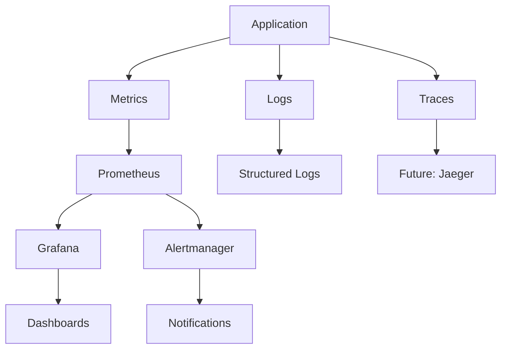
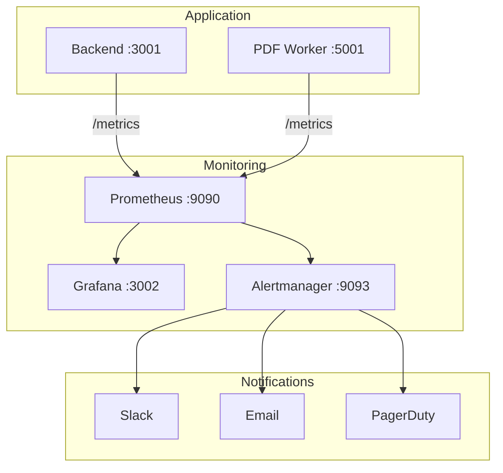
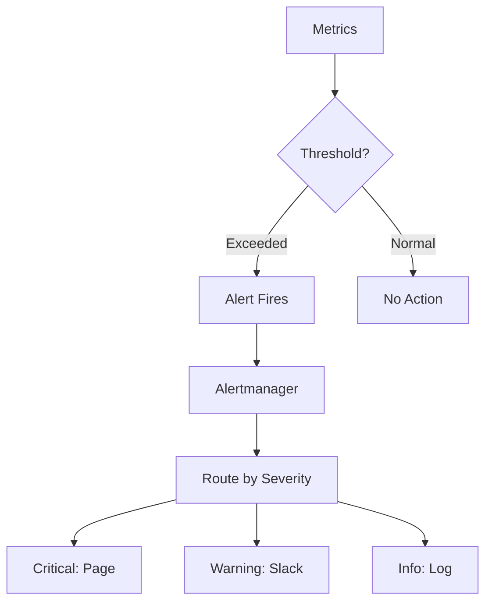

# Monitoring & Observability Guide

Complete monitoring setup for production observability.



## Overview

The monitoring stack provides:
- **Metrics Collection** - Prometheus scrapes application metrics
- **Visualization** - Grafana dashboards for real-time insights
- **Alerting** - Automated alerts for critical conditions
- **Logging** - Structured JSON logs for debugging

## Quick Links

- [Prometheus Setup](./prometheus.md) - Configure metrics collection
- [Grafana Dashboards](./grafana.md) - Set up visualization
- [Alert Configuration](./alerts.md) - Configure alerting rules
- [Metrics Reference](./metrics-reference.md) - Available metrics

## Architecture



## Quick Start

### 1. Start Monitoring Stack
```bash
# Development
docker compose up -d prometheus grafana

# Production
docker compose -f docker-compose.yml -f docker-compose.prod.yml up -d prometheus grafana
```

### 2. Access Dashboards
- **Grafana**: http://localhost:3002 (admin/admin)
- **Prometheus**: http://localhost:9090

### 3. Verify Metrics
```bash
# Check backend metrics
curl http://localhost:3001/metrics

# Check Prometheus targets
curl http://localhost:9090/api/v1/targets
```

## Dashboards

### System Overview
[View Dashboard Guide](./grafana.md#system-overview)

Monitors:
- Request rate and latency
- Error rates
- HTTP status codes
- Active connections

### Job Processing
[View Dashboard Guide](./grafana.md#job-processing)

Monitors:
- Job creation rate
- Queue depth
- Processing duration
- Success/failure rates

### Resource Utilization
[View Dashboard Guide](./grafana.md#resource-utilization)

Monitors:
- Database connections
- Memory usage
- CPU utilization
- Event loop lag

## Alert Rules



### Critical Alerts
- **HighErrorRate**: Error rate > 5% for 2 minutes
- **BackendDown**: Service unreachable for 1 minute
- **HighQueueDepth**: Queue > 500 jobs for 5 minutes

### Warning Alerts
- **HighResponseTime**: P95 > 10s for 3 minutes
- **HighMemoryUsage**: Heap > 80% for 5 minutes
- **SlowPDFProcessing**: P95 > 120s for 5 minutes

[View All Alert Rules](./alerts.md)

## Metrics Reference

### HTTP Metrics
```
http_request_duration_seconds{method,route,status}
http_requests_total{method,route,status}
```

### Job Metrics
```
pdf_jobs_total{type,status}
pdf_processing_duration_seconds{type,status}
queue_jobs_waiting{queue}
```

### Resource Metrics
```
database_connections{state}
nodejs_heap_size_used_bytes
nodejs_eventloop_lag_seconds
```

[View Complete Metrics Reference](./metrics-reference.md)

## Logging

### Structured Logs
All logs are JSON formatted:
```json
{
  "timestamp": "2024-11-30T12:00:00Z",
  "level": "info",
  "message": "PDF processing completed",
  "context": "JobsService",
  "jobId": "123",
  "duration": 45.2
}
```

### Log Levels
- **error**: Critical errors requiring attention
- **warn**: Warning conditions
- **info**: Informational messages
- **debug**: Detailed debugging (dev only)

### Viewing Logs
```bash
# All services
docker compose logs -f

# Specific service
docker compose logs -f backend

# Filter by level
docker compose logs backend | grep '"level":"error"'
```

## Health Checks

### Endpoint
```bash
GET /health
```

### Response
```json
{
  "status": "ok",
  "info": {
    "database": { "status": "up" },
    "redis": { "status": "up" },
    "minio": { "status": "up" }
  }
}
```

### Monitoring Health
```bash
# Check health
curl http://localhost:3001/health

# Monitor continuously
watch -n 5 'curl -s http://localhost:3001/health | jq'
```

## Troubleshooting

### Metrics Not Appearing
1. Check backend exposes metrics: `curl http://localhost:3001/metrics`
2. Verify Prometheus scrape config
3. Check Prometheus targets: http://localhost:9090/targets

### Dashboards Not Loading
1. Verify Grafana datasource configured
2. Check dashboard provisioning
3. Review Grafana logs: `docker logs schedgen-grafana`

### Alerts Not Firing
1. Check alert rules: http://localhost:9090/alerts
2. Verify Alertmanager config
3. Test alert manually in Prometheus

[View Troubleshooting Guide](../troubleshooting/monitoring-issues.md)

## Best Practices

1. **Set Meaningful Thresholds** - Based on load testing
2. **Reduce Alert Fatigue** - Only alert on actionable items
3. **Document Runbooks** - Link alerts to resolution steps
4. **Regular Review** - Adjust thresholds as system evolves
5. **Test Alerts** - Verify notifications work

## Related Documentation

- [Monitoring & Alerting Guide](../MONITORING_ALERTING_GUIDE.md) - Detailed alert rules
- [Load Testing](../LOAD_TESTING.md) - Establish baselines
- [Incident Response](../INCIDENT_RESPONSE_RUNBOOK.md) - Handle alerts
- [Scaling Runbook](../SCALING_RUNBOOK.md) - Scale based on metrics
