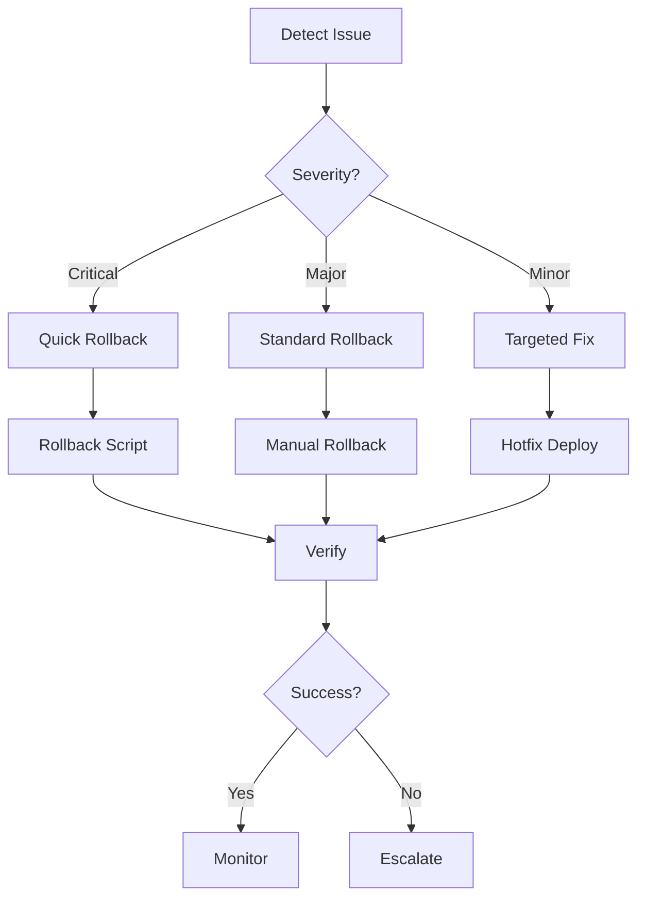
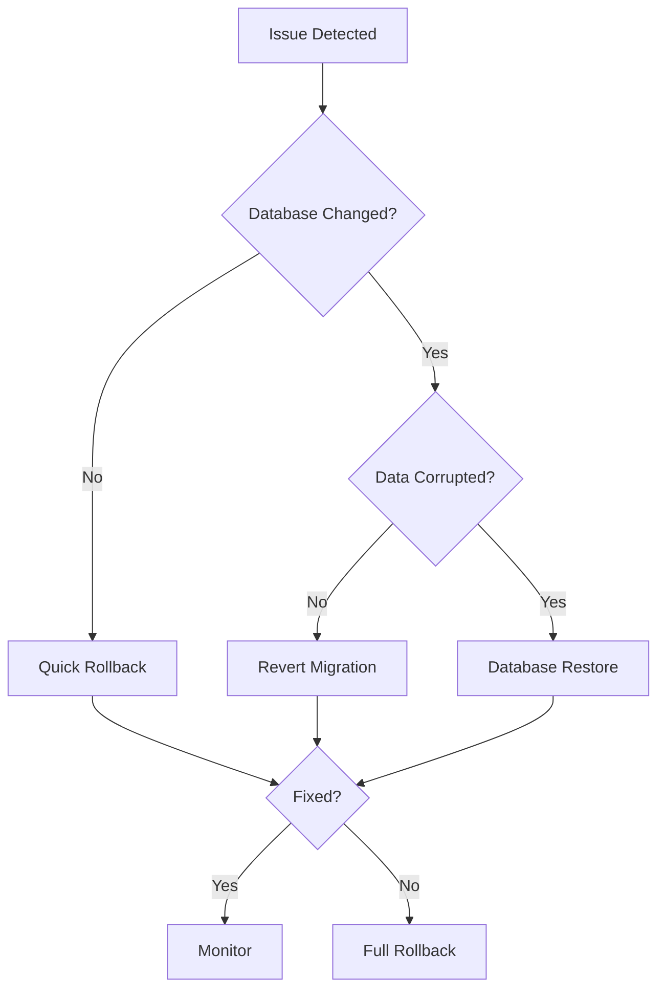
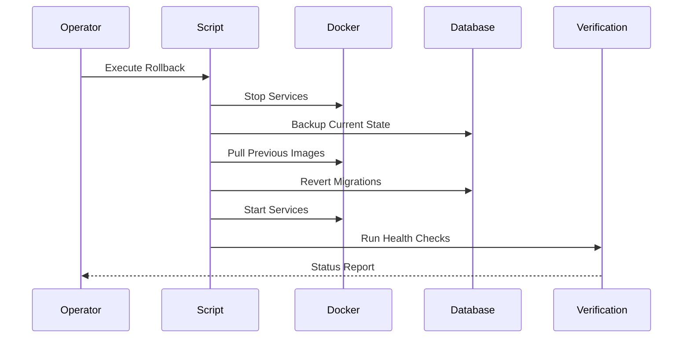

# Rollback Guide

Procedures for rolling back failed deployments or problematic updates.



## Overview

Rollback procedures restore the system to a previous working state when deployments fail or introduce critical issues.

## Rollback Types

### Quick Rollback
[View Quick Rollback Guide](./quick-rollback.md)

**When to use**: Critical production issues, immediate action needed

**Time**: 2-5 minutes

**Scope**: Application code only (no database changes)

```bash
./scripts/rollback.sh
```

### Database Rollback
[View Database Rollback Guide](./database-rollback.md)

**When to use**: Database migration issues, data corruption

**Time**: 5-15 minutes

**Scope**: Database schema and data

### Full Rollback
[View Full Rollback Guide](./full-rollback.md)

**When to use**: Complete system failure, multiple component issues

**Time**: 15-30 minutes

**Scope**: All services, database, and configuration

## Decision Tree



## Quick Reference

### Application Rollback
```bash
# Automated rollback
./scripts/rollback.sh

# Manual rollback to specific version
docker compose pull
git checkout <previous-tag>
docker compose up -d
```

### Database Rollback
```bash
# Revert last migration
docker compose exec backend npm run migration:revert

# Restore from backup
gunzip -c backups/db_schedgen_*.sql.gz | \
  docker exec -i schedgen-postgres psql -U schedgen -d schedgen
```

### Verification
```bash
# Run verification script
./scripts/verify-deployment.sh

# Check service health
docker compose ps
curl https://yourdomain.com/health
```

## Rollback Process



## Pre-Rollback Checklist

Before rolling back:
- [ ] Identify the issue and root cause
- [ ] Determine rollback scope (app, database, full)
- [ ] Take backup of current state
- [ ] Notify team of rollback action
- [ ] Document the issue
- [ ] Prepare verification steps

## Post-Rollback Actions

After successful rollback:
1. **Verify System Health** - Run all health checks
2. **Monitor Metrics** - Watch for anomalies
3. **Notify Stakeholders** - Inform team and users
4. **Document Incident** - Record what happened
5. **Plan Fix** - Schedule proper fix deployment
6. **Review Process** - Improve rollback procedures

## Common Scenarios

### Scenario 1: Bad Code Deploy
**Symptoms**: Application errors, crashes, 500 errors  
**Solution**: [Quick Rollback](./quick-rollback.md)  
**Time**: 2-5 minutes

### Scenario 2: Failed Migration
**Symptoms**: Database errors, schema mismatch  
**Solution**: [Database Rollback](./database-rollback.md)  
**Time**: 5-15 minutes

### Scenario 3: Configuration Error
**Symptoms**: Service won't start, connection errors  
**Solution**: Revert configuration, restart services  
**Time**: 5-10 minutes

### Scenario 4: Data Corruption
**Symptoms**: Invalid data, missing records  
**Solution**: [Full Rollback](./full-rollback.md) with database restore  
**Time**: 15-30 minutes

## Rollback Limitations

**Cannot rollback**:
- Destructive data migrations (dropped columns/tables)
- External API changes
- Third-party service updates

**Requires manual intervention**:
- User-generated data conflicts
- Schema changes with data transformation
- Multi-service coordination

## Prevention

Reduce rollback need:
1. **Staging Environment** - Test before production
2. **Feature Flags** - Toggle features without deploy
3. **Canary Deployments** - Gradual rollout
4. **Automated Testing** - Catch issues early
5. **Backup Before Deploy** - Always have restore point

See [Deployment Best Practices](../deployment/best-practices.md)

## Related Documentation

- [Deployment Runbook](../deployment/README.md) - Deployment procedures
- [Backup Guide](../backup/README.md) - Backup and restore
- [Incident Response](../INCIDENT_RESPONSE_RUNBOOK.md) - Handle incidents
- [Rollback Quick Reference](../ROLLBACK_QUICK_REFERENCE.md) - Command cheat sheet

## Emergency Contacts

For critical rollback situations:
- Technical Lead: [Contact Info]
- DevOps Team: [Contact Info]
- On-Call Engineer: [Contact Info]

See [Incident Response Runbook](../INCIDENT_RESPONSE_RUNBOOK.md)
