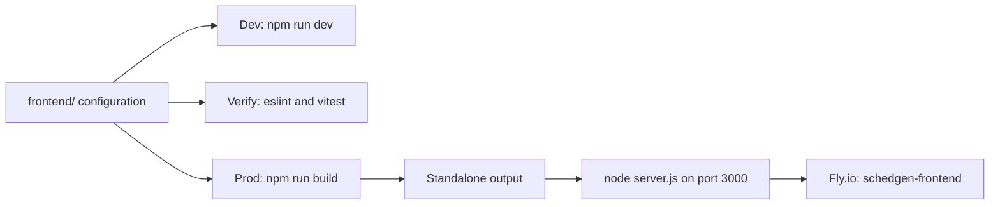

<!-- tyto-docs
tyto_docs: 1
kind: component
unit: frontend
title: Frontend
status: stale
written_at_commit: 7c06166782b5e9a27e267eee38f69cd517fa1bfc
written_at: "2026-09-14T20:21:56.071Z"
research: frontend/DOCS/Research.md
sources: []
accepted:
  at: "2026-09-14T20:26:03.208Z"
  commit: 7c06166782b5e9a27e267eee38f69cd517fa1bfc
  research_fingerprint: "sha256:7c77520f03e1a2a364f37ddafab038990798c4183fee6368c31671258a4adcbc"
  research_findings:
    - research.frontend.030b94bb
    - research.frontend.10e6abc2
    - research.frontend.203241bb
    - research.frontend.4a63769d
    - research.frontend.5ac18761
    - research.frontend.6249cf22
    - research.frontend.67a7c90f
    - research.frontend.7363fcd8
    - research.frontend.bf3179e8
    - research.frontend.bf43bc45
    - research.frontend.c108b046
    - research.frontend.c15fdf17
    - research.frontend.c3d93d65
    - research.frontend.d63ba81e
    - research.frontend.e676a84c
    - research.frontend.fde1b1b5
  critic_pass: critic.frontend.1
  sources:
    - path: frontend/eslint.config.mjs
      blob_sha: 05e726d1b4201bc8c7716d2b058279676582e8c0
    - path: frontend/next.config.ts
      blob_sha: 225e49520462b8b4b15841fc6752d5c72ff4ed4a
    - path: frontend/postcss.config.mjs
      blob_sha: 61e36849cf7cfa9f1f71b4a3964a4953e3e243d3
evidence: Frontend.evidence.md
critic:
  attempts: 1
  findings: []
  review_complete: true
  sections_reviewed: 8
  sections_total: 8
  last_reviewed_document: "sha256:69c88d9d01211890d12832680956d07db7c6a05269d59e953717902387564575"
  retired: []
-->

# Frontend

<!-- tyto-docs:generated:status -->
> **Status: Stale**
<!-- /tyto-docs:generated:status -->

## [Summary](Frontend.evidence.md#summary)

The frontend unit is the application shell of the Schedule Generator web app: a private Next.js application named 'frontend' (version 0.1.0) that owns the build, test, lint, container, and deployment configuration for the user interface. It declares the React runtime, Tailwind CSS tooling, and Vitest test setup that the application's pages and components are built, tested, and shipped with. <!-- ev:research.frontend.203241bb -->[1](Frontend.evidence.md#research.frontend.203241bb) <!-- ev:research.frontend.4a63769d -->[2](Frontend.evidence.md#research.frontend.4a63769d) <!-- ev:research.frontend.7363fcd8 -->[3](Frontend.evidence.md#research.frontend.7363fcd8)

## [Purpose and boundaries](Frontend.evidence.md#purpose-and-boundaries)

| | |
|---|---|
| Owns | The application shell of the Schedule Generator web app: a private Next.js application named 'frontend' (version 0.1.0) with its build, test, lint, container, and deployment configuration. <!-- ev:research.frontend.203241bb -->[1](Frontend.evidence.md#research.frontend.203241bb) <!-- ev:research.frontend.bf43bc45 -->[4](Frontend.evidence.md#research.frontend.bf43bc45) |
| Uses | The Next.js framework (16.0.5) and React (19.2.0) runtime, with axios, date-fns, and zustand as supporting libraries. <!-- ev:research.frontend.4a63769d -->[2](Frontend.evidence.md#research.frontend.4a63769d) |
| Does not own | The application's source code under src/ — pages, components, hooks, services, stores, and utilities — which are documented by their own units (inference: this unit's research records only configuration files). |

## [How it works](Frontend.evidence.md#how-it-works)

The frontend is a Next.js application driven by npm scripts: `next dev` for development, `next build` for production builds, `next start` to run a built app, `eslint` for linting, and `vitest` for tests (`vitest --run` for one-shot runs, `vitest` for watch mode). <!-- ev:research.frontend.bf43bc45 -->[4](Frontend.evidence.md#research.frontend.bf43bc45)

The TypeScript toolchain compiles with strict checks, an ES2017 target, bundler module resolution, the react-jsx JSX transform, and a '@/*' path alias mapping to './src/*'. <!-- ev:research.frontend.030b94bb -->[5](Frontend.evidence.md#research.frontend.030b94bb)

Next.js is configured for standalone output, PostCSS applies the @tailwindcss/postcss plugin, and ESLint uses the flat config format with the eslint-config-next core-web-vitals and TypeScript rule sets. <!-- ev:research.frontend.c15fdf17 -->[6](Frontend.evidence.md#research.frontend.c15fdf17) <!-- ev:research.frontend.e676a84c -->[7](Frontend.evidence.md#research.frontend.e676a84c) <!-- ev:research.frontend.c108b046 -->[8](Frontend.evidence.md#research.frontend.c108b046)

Tests run under Vitest with the React plugin, the jsdom environment, global test APIs, a setup file at ./src/test/setup.ts, and a '@' alias resolving to './src'. <!-- ev:research.frontend.6249cf22 -->[9](Frontend.evidence.md#research.frontend.6249cf22)

Production runs in a three-stage Docker build on node:20-alpine: `npm ci` installs dependencies, `npm run build` compiles the application, and the standalone server starts with `node server.js` as a non-root 'nextjs' user on port 3000. <!-- ev:research.frontend.67a7c90f -->[10](Frontend.evidence.md#research.frontend.67a7c90f)

Development uses a separate image that installs all dependencies including devDependencies and runs `npm run dev` on port 3000. <!-- ev:research.frontend.c3d93d65 -->[11](Frontend.evidence.md#research.frontend.c3d93d65)

Deployment targets Fly.io as app 'schedgen-frontend' in primary region 'jnb', building from the Dockerfile with NEXT_PUBLIC_API_URL and 2026 semester date build arguments, serving an http_service on internal port 3000 with force_https on a shared-cpu-1x 512mb VM. <!-- ev:research.frontend.10e6abc2 -->[12](Frontend.evidence.md#research.frontend.10e6abc2)

The Docker build context and version control exclude generated and local files: .dockerignore excludes node_modules, .next, coverage, IDE files, environment files, logs, and git metadata, and .gitignore excludes node_modules, .next, out, build, coverage, environment files, and TypeScript build info. <!-- ev:research.frontend.5ac18761 -->[13](Frontend.evidence.md#research.frontend.5ac18761) <!-- ev:research.frontend.bf3179e8 -->[14](Frontend.evidence.md#research.frontend.bf3179e8)

## [Interfaces](Frontend.evidence.md#interfaces)

| Name | Input | Output | Guarantee |
|---|---|---|---|
| npm run dev | none | Development server on port 3000 | Starts the Next.js development server <!-- ev:research.frontend.bf43bc45 -->[4](Frontend.evidence.md#research.frontend.bf43bc45) |
| npm run build | none | Production build with standalone output | Compiles the application for production <!-- ev:research.frontend.bf43bc45 -->[4](Frontend.evidence.md#research.frontend.bf43bc45) <!-- ev:research.frontend.c15fdf17 -->[6](Frontend.evidence.md#research.frontend.c15fdf17) |
| npm run start | none | Running production server | Starts the built application <!-- ev:research.frontend.bf43bc45 -->[4](Frontend.evidence.md#research.frontend.bf43bc45) |
| npm run lint | none | Lint report | Runs ESLint with the Next.js core-web-vitals and TypeScript rule sets <!-- ev:research.frontend.bf43bc45 -->[4](Frontend.evidence.md#research.frontend.bf43bc45) <!-- ev:research.frontend.c108b046 -->[8](Frontend.evidence.md#research.frontend.c108b046) |
| npm test | none | Test report | Runs the Vitest suite in the jsdom environment <!-- ev:research.frontend.bf43bc45 -->[4](Frontend.evidence.md#research.frontend.bf43bc45) <!-- ev:research.frontend.6249cf22 -->[9](Frontend.evidence.md#research.frontend.6249cf22) |
| HTTP service | HTTP requests | Web application on port 3000 | Served by the standalone server; force_https in production <!-- ev:research.frontend.67a7c90f -->[10](Frontend.evidence.md#research.frontend.67a7c90f) <!-- ev:research.frontend.10e6abc2 -->[12](Frontend.evidence.md#research.frontend.10e6abc2) |

<!-- tyto-docs:generated:endpoints -->
<!-- No framework adapter is active, so no endpoints were extracted for this unit. -->
<!-- /tyto-docs:generated:endpoints -->

## Source files

<!-- tyto-docs:generated:file-table -->
<!-- This unit owns no source files. -->
<!-- /tyto-docs:generated:file-table -->

## [Dependencies](Frontend.evidence.md#dependencies)

| Dependency | Capability used | Why |
|---|---|---|
| Next.js 16.0.5 | Application framework with standalone build output | The application shell is a Next.js app; standalone output is what the production image runs with node server.js <!-- ev:research.frontend.4a63769d -->[2](Frontend.evidence.md#research.frontend.4a63769d) <!-- ev:research.frontend.c15fdf17 -->[6](Frontend.evidence.md#research.frontend.c15fdf17) |
| React 19.2.0 and react-dom | UI runtime | The react-jsx JSX transform in tsconfig compiles the application's components <!-- ev:research.frontend.4a63769d -->[2](Frontend.evidence.md#research.frontend.4a63769d) <!-- ev:research.frontend.030b94bb -->[5](Frontend.evidence.md#research.frontend.030b94bb) |
| axios, date-fns, zustand | HTTP, date, and state-management support | Supporting runtime libraries declared alongside the framework <!-- ev:research.frontend.4a63769d -->[2](Frontend.evidence.md#research.frontend.4a63769d) |
| Tailwind CSS tooling and daisyui | Utility-first styling and UI components | PostCSS is configured with the @tailwindcss/postcss plugin <!-- ev:research.frontend.7363fcd8 -->[3](Frontend.evidence.md#research.frontend.7363fcd8) <!-- ev:research.frontend.e676a84c -->[7](Frontend.evidence.md#research.frontend.e676a84c) |
| Vitest and testing libraries | Unit and component testing | Vitest is configured with the React plugin, jsdom, and a setup file <!-- ev:research.frontend.7363fcd8 -->[3](Frontend.evidence.md#research.frontend.7363fcd8) <!-- ev:research.frontend.6249cf22 -->[9](Frontend.evidence.md#research.frontend.6249cf22) |
| ESLint and TypeScript | Linting and type checking | ESLint applies the Next.js core-web-vitals and TypeScript rule sets; tsconfig enables strict checks <!-- ev:research.frontend.7363fcd8 -->[3](Frontend.evidence.md#research.frontend.7363fcd8) <!-- ev:research.frontend.c108b046 -->[8](Frontend.evidence.md#research.frontend.c108b046) <!-- ev:research.frontend.030b94bb -->[5](Frontend.evidence.md#research.frontend.030b94bb) |

Dependencies are pinned through frontend/package-lock.json, the npm lockfile (lockfileVersion 3) recording the resolved dependency tree. <!-- ev:research.frontend.fde1b1b5 -->[15](Frontend.evidence.md#research.frontend.fde1b1b5)

<!-- tyto-docs:generated:module-graph -->
<!-- No module dependency graph is available for this unit. -->
<!-- /tyto-docs:generated:module-graph -->

## Data model

This unit declares and references no entities (inference: the research records only configuration files for this unit).

<!-- tyto-docs:generated:erd -->
<!-- This leaf unit has no descendant scope for a focused ERD. -->
<!-- /tyto-docs:generated:erd -->

## [Decisions and limitations](Frontend.evidence.md#decisions-and-limitations)

The production image runs the standalone server as a non-root 'nextjs' user, so the application must be built with standalone output for the image to start with node server.js. <!-- ev:research.frontend.67a7c90f -->[10](Frontend.evidence.md#research.frontend.67a7c90f) <!-- ev:research.frontend.c15fdf17 -->[6](Frontend.evidence.md#research.frontend.c15fdf17)

The 2026 semester dates are passed as build arguments in fly.toml, so they are baked in at build time and change only with a rebuild. <!-- ev:research.frontend.10e6abc2 -->[12](Frontend.evidence.md#research.frontend.10e6abc2)

The README is the stock create-next-app README and describes Vercel deployment, while the unit actually deploys to Fly.io via fly.toml. <!-- ev:research.frontend.d63ba81e -->[16](Frontend.evidence.md#research.frontend.d63ba81e) <!-- ev:research.frontend.10e6abc2 -->[12](Frontend.evidence.md#research.frontend.10e6abc2)

<!-- tyto-docs:generated:navigation -->
- **Schedule:** 20 of 30, wave 1
<!-- /tyto-docs:generated:navigation -->