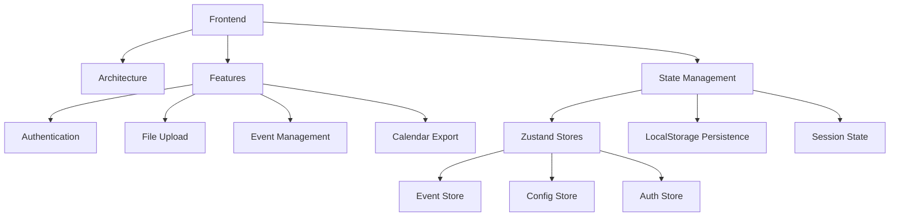
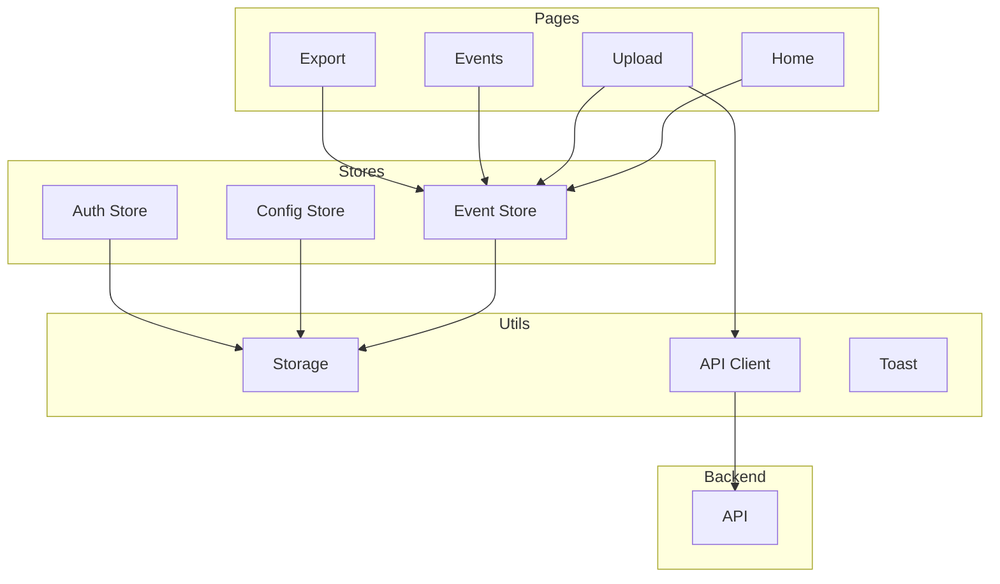
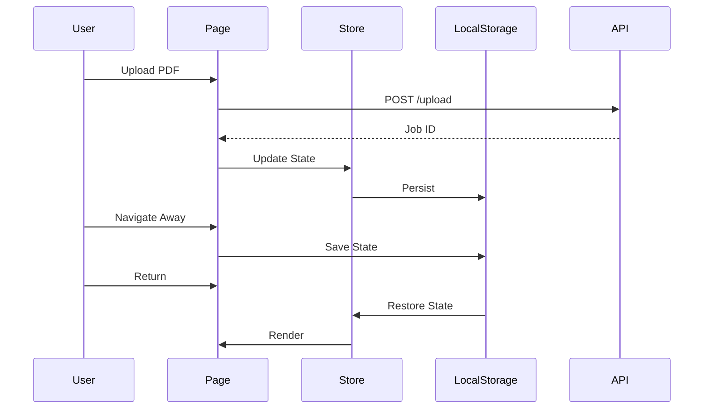

# Frontend Documentation

Next.js frontend implementation details and guides.



## Implementation Guides

### Core Features
- [State Management](./state-management.md) - Zustand store architecture
- [Storage Handling](./storage-handling.md) - LocalStorage persistence
- [Session Persistence](./session-persistence.md) - Cross-session state

### Components
- [Upload Flow](./upload-flow.md) - PDF upload workflow
- [Event Management](./event-management.md) - Event editing and filtering
- [Calendar Export](./calendar-export.md) - ICS and Google Calendar

### Testing
- [Component Testing](./testing-components.md) - React component tests
- [Store Testing](./testing-stores.md) - State management tests
- [Storage Testing](./testing-storage.md) - LocalStorage tests

## Architecture



## State Flow



## Quick Reference

### Development
```bash
# Start dev server
npm run dev

# Run tests
npm test

# Run linting
npm run lint

# Build production
npm run build
```

### Key Files
- `src/stores/` - Zustand stores
- `src/utils/storage.ts` - Storage utilities
- `src/app/` - Next.js pages
- `src/components/` - React components

## Configuration

Environment variables:
- `NEXT_PUBLIC_API_URL` - Backend API URL
- `NEXT_PUBLIC_GOOGLE_CLIENT_ID` - OAuth client ID

See [Environment Configuration](../../docs/development/environment.md)
