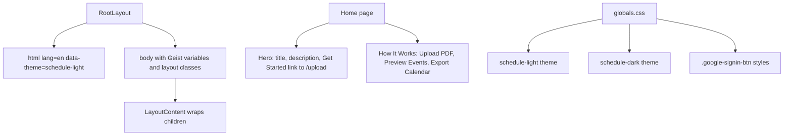

<!-- tyto-docs
tyto_docs: 1
kind: component
unit: frontend/src/app
title: App
status: draft
written_at_commit: 19a9e0043e2a79783d62618aef1fccbd51438dc4
written_at: "2026-09-14T22:58:33.796Z"
research: frontend/src/app/DOCS/Research.md
sources: []
accepted: null
evidence: App.evidence.md
critic:
  attempts: 0
  findings: []
-->

# App

<!-- tyto-docs:generated:status -->
> **Status: Draft**
<!-- /tyto-docs:generated:status -->

## [Summary](App.evidence.md#summary)

The app root unit owns the frontend entry point of the Tuks Schedule Generator: the root layout that wraps every page, the landing page that introduces the service, and the global stylesheet that defines the visual theme. A dependant can rely on a consistent page shell, document metadata, and light and dark theming across the application. <!-- ev:research.frontend-src-app.415ff023 -->[1](App.evidence.md#research.frontend-src-app.415ff023)

## [Purpose and boundaries](App.evidence.md#purpose-and-boundaries)

| | |
|---|---|
| Owns | The frontend entry point of the Tuks Schedule Generator: the root layout that renders the document shell and wraps every page in LayoutContent, the landing page that introduces the service, and the global stylesheet that defines the daisyUI themes and shared button styling. <!-- ev:research.frontend-src-app.415ff023 -->[1](App.evidence.md#research.frontend-src-app.415ff023) <!-- ev:research.frontend-src-app.300cc84c -->[2](App.evidence.md#research.frontend-src-app.300cc84c) <!-- ev:research.frontend-src-app.04e4ad6e -->[3](App.evidence.md#research.frontend-src-app.04e4ad6e) |
| Uses | The Geist and Geist_Mono fonts from next/font/google, the LayoutContent component from '@/components/layout/LayoutContent', and Link from 'next/link' and the Button component from '@/components/common'. <!-- ev:research.frontend-src-app.3f5ad31d -->[4](App.evidence.md#research.frontend-src-app.3f5ad31d) <!-- ev:research.frontend-src-app.3fed86c7 -->[5](App.evidence.md#research.frontend-src-app.3fed86c7) |
| Does not own | The feature pages of the application — upload, preview, generate, and the rest — which live in sibling units under frontend/src/app and are not implemented here (inference: the unit holds only layout.tsx, page.tsx, and globals.css). <!-- ev:research.frontend-src-app.415ff023 -->[1](App.evidence.md#research.frontend-src-app.415ff023) |

## [How it works](App.evidence.md#how-it-works)

RootLayout, the default export of frontend/src/app/layout.tsx, renders an <html> element with lang 'en' and data-theme 'schedule-light', and a <body> that applies the geistSans and geistMono CSS variables with the classes 'antialiased min-h-screen bg-base-100 flex flex-col', wrapping the children in the LayoutContent component. <!-- ev:research.frontend-src-app.300cc84c -->[2](App.evidence.md#research.frontend-src-app.300cc84c)

The layout exports a metadata object declaring the page title 'Tuks Schedule Generator', the description 'Convert your Tuks PDF schedule to calendar events', and the icon '/favicon.png'. <!-- ev:research.frontend-src-app.0e104ca6 -->[6](App.evidence.md#research.frontend-src-app.0e104ca6) The Geist and Geist_Mono fonts are instantiated as geistSans and geistMono with the CSS variables '--font-geist-sans' and '--font-geist-mono' and the latin subset. <!-- ev:research.frontend-src-app.ff2ac21d -->[7](App.evidence.md#research.frontend-src-app.ff2ac21d) <!-- ev:research.frontend-src-app.856b96aa -->[8](App.evidence.md#research.frontend-src-app.856b96aa)

The landing page, frontend/src/app/page.tsx, is a client component ('use client' directive) that exports a default Home component. <!-- ev:research.frontend-src-app.4cbacf2a -->[9](App.evidence.md#research.frontend-src-app.4cbacf2a) <!-- ev:research.frontend-src-app.04e4ad6e -->[3](App.evidence.md#research.frontend-src-app.04e4ad6e) It renders a hero section headed by the title 'Tuks Schedule Generator', a description of transforming a Tuks PDF schedule into calendar events, and a 'Get Started' Link to '/upload' containing a primary Button. <!-- ev:research.frontend-src-app.04e4ad6e -->[3](App.evidence.md#research.frontend-src-app.04e4ad6e) Below the hero, a 'How It Works' section presents three feature cards titled 'Upload PDF', 'Preview Events', and 'Export Calendar', describing the upload, preview, and export steps of the service. <!-- ev:research.frontend-src-app.c3887a51 -->[10](App.evidence.md#research.frontend-src-app.c3887a51)

The global stylesheet, frontend/src/app/globals.css, imports Tailwind CSS and registers the daisyUI plugin. <!-- ev:research.frontend-src-app.fc596589 -->[11](App.evidence.md#research.frontend-src-app.fc596589) It defines two daisyUI themes: 'schedule-light', the default with a light color scheme and an electric blue accent, and 'schedule-dark', set to prefer dark mode with deep black backgrounds and an electric blue accent. <!-- ev:research.frontend-src-app.d210f15b -->[12](App.evidence.md#research.frontend-src-app.d210f15b) <!-- ev:research.frontend-src-app.9ceebbfe -->[13](App.evidence.md#research.frontend-src-app.9ceebbfe)

The body font-family is Arial, Helvetica, sans-serif. <!-- ev:research.frontend-src-app.1c965720 -->[14](App.evidence.md#research.frontend-src-app.1c965720) A .google-signin-btn class is styled for light mode with a white background and pill shape, with hover, active, focus, and disabled states, and dark-mode overrides under the [data-theme='schedule-dark'] selector. <!-- ev:research.frontend-src-app.c1fc1b65 -->[15](App.evidence.md#research.frontend-src-app.c1fc1b65) <!-- ev:research.frontend-src-app.665ac2f9 -->[16](App.evidence.md#research.frontend-src-app.665ac2f9)

## [Interfaces](App.evidence.md#interfaces)

| Name | Input | Output | Guarantee |
|---|---|---|---|
| RootLayout (default export) | children: React.ReactNode | A full HTML document shell | Renders the <html>/<body> shell with the Geist font variables and layout classes, wrapping children in LayoutContent <!-- ev:research.frontend-src-app.300cc84c -->[2](App.evidence.md#research.frontend-src-app.300cc84c) |
| metadata (export) | none | A Next.js Metadata object | Declares the page title 'Tuks Schedule Generator', the description, and the favicon '/favicon.png' <!-- ev:research.frontend-src-app.0e104ca6 -->[6](App.evidence.md#research.frontend-src-app.0e104ca6) |
| Home (default export) | none — the component takes no props (inference) | The landing page | Renders the hero section and the 'How It Works' feature cards <!-- ev:research.frontend-src-app.04e4ad6e -->[3](App.evidence.md#research.frontend-src-app.04e4ad6e) <!-- ev:research.frontend-src-app.c3887a51 -->[10](App.evidence.md#research.frontend-src-app.c3887a51) |

<!-- tyto-docs:generated:endpoints -->
<!-- No framework adapter is active, so no endpoints were extracted for this unit. -->
<!-- /tyto-docs:generated:endpoints -->

## Source files

<!-- tyto-docs:generated:file-table -->
<!-- This unit owns no source files. -->
<!-- /tyto-docs:generated:file-table -->

## [Dependencies](App.evidence.md#dependencies)

The unit's imports are declared in frontend/src/app/layout.tsx and frontend/src/app/page.tsx, and its styling is built on Tailwind CSS with the daisyUI plugin. <!-- ev:research.frontend-src-app.3f5ad31d -->[4](App.evidence.md#research.frontend-src-app.3f5ad31d) <!-- ev:research.frontend-src-app.3fed86c7 -->[5](App.evidence.md#research.frontend-src-app.3fed86c7) <!-- ev:research.frontend-src-app.fc596589 -->[11](App.evidence.md#research.frontend-src-app.fc596589)

| Dependency | Capability used | Why |
|---|---|---|
| next | Metadata type and next/link navigation | The layout declares document metadata; the landing page links to '/upload' <!-- ev:research.frontend-src-app.3f5ad31d -->[4](App.evidence.md#research.frontend-src-app.3f5ad31d) <!-- ev:research.frontend-src-app.3fed86c7 -->[5](App.evidence.md#research.frontend-src-app.3fed86c7) |
| next/font/google | Geist and Geist_Mono font loading | Provides the document's sans and mono typefaces through CSS variables <!-- ev:research.frontend-src-app.ff2ac21d -->[7](App.evidence.md#research.frontend-src-app.ff2ac21d) <!-- ev:research.frontend-src-app.856b96aa -->[8](App.evidence.md#research.frontend-src-app.856b96aa) |
| @/components/layout/LayoutContent | Shared page shell | Wraps every page's children in the application chrome <!-- ev:research.frontend-src-app.300cc84c -->[2](App.evidence.md#research.frontend-src-app.300cc84c) |
| @/components/common | Button component | Powers the landing page's 'Get Started' call to action <!-- ev:research.frontend-src-app.3fed86c7 -->[5](App.evidence.md#research.frontend-src-app.3fed86c7) |
| tailwindcss / daisyUI | Utility styling and theming | Provides the utility classes and the schedule-light and schedule-dark themes used across the application <!-- ev:research.frontend-src-app.fc596589 -->[11](App.evidence.md#research.frontend-src-app.fc596589) <!-- ev:research.frontend-src-app.d210f15b -->[12](App.evidence.md#research.frontend-src-app.d210f15b) <!-- ev:research.frontend-src-app.9ceebbfe -->[13](App.evidence.md#research.frontend-src-app.9ceebbfe) |

<!-- tyto-docs:generated:module-graph -->
<!-- No module dependency graph is available for this unit. -->
<!-- /tyto-docs:generated:module-graph -->

## [Data model](App.evidence.md#data-model)

This unit declares and references no entities (inference: the research records none for this unit). The layout and landing page render static content only. <!-- ev:research.frontend-src-app.300cc84c -->[2](App.evidence.md#research.frontend-src-app.300cc84c) <!-- ev:research.frontend-src-app.04e4ad6e -->[3](App.evidence.md#research.frontend-src-app.04e4ad6e)

<!-- tyto-docs:generated:erd -->
<!-- This leaf unit has no descendant scope for a focused ERD. -->
<!-- /tyto-docs:generated:erd -->

## [Decisions and limitations](App.evidence.md#decisions-and-limitations)

The root layout hard-codes data-theme='schedule-light' on the <html> element, so the light theme is applied by default; the 'schedule-dark' theme is available to components that opt in through the [data-theme='schedule-dark'] selector. <!-- ev:research.frontend-src-app.300cc84c -->[2](App.evidence.md#research.frontend-src-app.300cc84c) <!-- ev:research.frontend-src-app.9ceebbfe -->[13](App.evidence.md#research.frontend-src-app.9ceebbfe) <!-- ev:research.frontend-src-app.665ac2f9 -->[16](App.evidence.md#research.frontend-src-app.665ac2f9)

The landing page is a client component whose content is static: the hero copy and the 'How It Works' feature cards are hard-coded in frontend/src/app/page.tsx. <!-- ev:research.frontend-src-app.4cbacf2a -->[9](App.evidence.md#research.frontend-src-app.4cbacf2a) <!-- ev:research.frontend-src-app.04e4ad6e -->[3](App.evidence.md#research.frontend-src-app.04e4ad6e) <!-- ev:research.frontend-src-app.c3887a51 -->[10](App.evidence.md#research.frontend-src-app.c3887a51)

<!-- tyto-docs:generated:navigation -->
- **Schedule:** 21 of 30, wave 1
<!-- /tyto-docs:generated:navigation -->